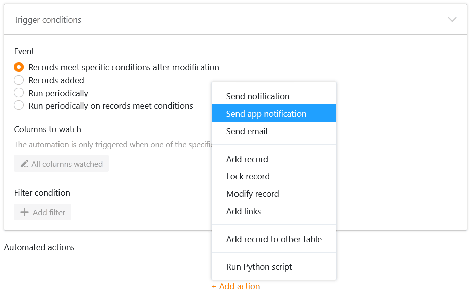
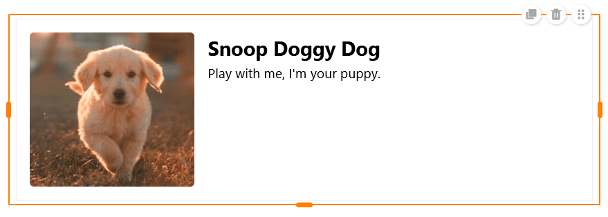
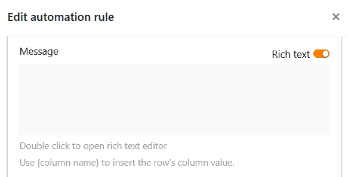

Die Karnevalszeit in Deutschland nähert sich ihrem Höhepunkt – und auch bei SeaTable knallen die Konfetti-Kanonen! Version 4.3 bringt einige lang ersehnte Funktionen und Verbesserungen mit sich.

Freuen Sie sich auf einen neuen Dialog zur Erstellung von **Formularlinks**, in dem Sie die URLs an Ihre persönlichen Wünsche anpassen können. Nutzen Sie zwei neue **Automationen**, um Dokumente zu erstellen und Benachrichtigungen an App-Nutzer zu senden. Oder probieren Sie die Neuerungen in der **Universellen App** aus: Auf Sie warten unter anderem Kommentare, zwei weitere Elemente für die individuelle Seite und ein verbessertes Customizing der Farbgestaltung.

Heute Morgen haben wir SeaTable Cloud auf Version 4.3 aktualisiert. Alle Selbsthoster können das ebenfalls tun: Das Image von SeaTable 4.3 ist im bekannten [Docker Repository](https://hub.docker.com/r/seatable/seatable-enterprise) zum Download verfügbar. Im [Changelog](https://seatable.io/docs/changelog/version-4/) finden Sie wie immer die vollständige Liste der Änderungen.

Darüber hinaus haben wir ein Upgrade der Plugins auf Webpack 5 durchgeführt sowie ein Upgrade des Frameworks auf React 17.0.2, das künftig mehr Sicherheit und Stabilität gewährleistet und weitere Funktionen ermöglicht.

## Neuer Dialog und benutzerdefinierte Links für Webformulare

Um Ihre [Webformulare](https://seatable.io/docs/webformulare/webformulare/) an andere Nutzer freizugeben, gab es bislang zwei verschiedene Dialogfenster: eines, in dem Sie einen **automatisch generierten Link** kopieren konnten; und eines, in dem Sie diesen Link mit [vorbefüllten Werten](https://seatable.io/docs/webformulare/formularfelder-per-url-vorbefuellen/) erweitern konnten. Diese Möglichkeiten haben wir nun in einem einzigen Dialog zusammengeführt, um die Usability zu erhöhen.

Zudem haben wir die brandneue Option ergänzt, **benutzerdefinierte URLs** für Webformulare zu erstellen. Anschließend können Sie diese bearbeiten, als QR-Code speichern, kopieren oder löschen.



## Automatisierte Aktionen: PDF speichern und App-Benachrichtigung senden

Automations-Fans aufgepasst! In SeaTable 4.3 kommen zwei neue Optionen zu den [automatisierten Aktionen](https://seatable.io/docs/automationen/automations-aktionen/) hinzu:

1. Erstens haben Sie die Möglichkeit, periodisch PDFs für Einträge zu speichern, die bestimmte Bedingungen erfüllen.
2. Zweitens können Sie neuerdings Benachrichtigungen versenden, die bestimmte Nutzer einer Universellen App erhalten sollen.

Zuvor konnten Sie in SeaTable nur manuell [PDF-Dokumente per Schaltfläche erzeugen](https://seatable.io/docs/andere-spalten/ein-pdf-dokument-per-schaltflaeche-in-einer-spalte-speichern/). Die neue Option, zu einem festgelegten Zeitpunkt **automatisch** Dokumente aus bestimmten Datensätzen zu erstellen, erspart Ihnen Klicks und macht Ihre Abläufe noch reibungsloser.

Durch die **App-Benachrichtigungen** können Sie die Nutzer einer App beispielsweise über Änderungen an relevanten Datensätzen informieren. Diese Aktion kann von allen vier [Trigger-Ereignissen](https://seatable.io/docs/automationen/automations-trigger/) ausgelöst werden.

Die Nutzer der jeweiligen App können ihre Benachrichtigungen über das  Glocken-Symbol neben ihrem Avatar in der rechten oberen Ecke abrufen.

## Teamübergreifende Mitarbeiter-Spalte

In der [Mitarbeiter-Spalte](https://seatable.io/docs/datum-dauer-und-personen/die-spalte-mitarbeiter/) war es bisher nur möglich Personen auszuwählen, die bereits Zugriff auf die jeweilige Base hatten. Ab SeaTable 4.3 können Sie in Mitarbeiter-Spalten **alle Mitglieder Ihres Teams** eintragen, selbst wenn diese keinen Zugriff auf bestimmte Bases haben. Dadurch wird es wesentlich komfortabler, Ihren Mitarbeitern unabhängig von ihrer Zugriffsberechtigung Datensätze zuzuordnen.

Diese Funktionalität ist vor allem in der Universellen App von Vorteil. Sie können die Option, dass die Teammitglieder in der Drop-down-Liste für alle Nutzer zu sehen sind, in den [Einstellungen](https://seatable.io/docs/universelle-apps/einstellungen-einer-universellen-app-aendern/) der Universellen App aktivieren. Wenn Sie nicht möchten, dass die Nutzer die Datensätze der anderen sehen können, legen Sie **voreingestellte Filter** fest: Wird eine Seite per Mitarbeiter-Spalte mit der Bedingung „inkludiert aktuellen Benutzer“ gefiltert, sieht jeder Nutzer der Universellen App nur die Einträge, die ihm in der Tabelle zugeordnet sind.

## Weitere Verbesserungen der Universellen App

Ganz neu in der Universellen App ist die [Kommentarfunktion](https://seatable.io/docs/arbeiten-mit-zeilen/zeilen-kommentieren/), die Sie bereits in gleicher Form aus der Base kennen. Halten Sie Ihr Feedback oder zusätzliche Informationen zu den Datensätzen für die anderen App-Nutzer fest und führen Sie Diskussionen an Ort und Stelle.



Auf der [individuellen Seite](https://seatable.io/docs/seitentypen-in-universellen-apps/individuelle-seiten-in-universellen-apps/) können Sie sich auf zwei neue Elemente freuen: den **Container** und die **Karte**. Der Container gibt ein Raster vor, mit dem Sie andere Elemente (Texte, Bilder, Statistiken) leichter anordnen und in Gruppen zusammenfassen können.

Für ein schönes Seitenlayout sorgt auch die Karte, die ein Bild, eine Überschrift und einen Text zu einer Design-Vorlage vereint.

Außerdem lässt sich die **Hintergrundfarbe** von individuellen Seiten ab SeaTable 4.3 beliebig einstellen und die unerwünschte Überlappung von Elementen wurde behoben. Auch das übergreifende Design der Universellen App präsentiert sich nun über alle Seiten hinweg in einer einheitlichen Farbe, die Sie in den [globalen Einstellungen](https://seatable.io/docs/universelle-apps/einstellungen-einer-universellen-app-aendern/) auswählen können.

### Berechtigungen auf Tabellenseiten

Die Vererbung von [Spaltenberechtigungen](https://seatable.io/docs/arbeiten-mit-spalten/spaltenberechtigungen-festlegen/) aus der Base wird mit SeaTable 4.3 abgeschafft. Wenn Sie eine Spalte in der Universellen App für die Bearbeitung sperren möchten, können Sie sie stattdessen in den Einstellungen der [Tabellenseite](https://seatable.io/docs/seitentypen-in-universellen-apps/tabellenseiten-in-universellen-apps/) auf **„nur lesbar“** setzen.

Ebenso werden alle Einschränkungen für [Schaltflächen-Aktionen](https://seatable.io/docs/andere-spalten/die-schaltflaeche/) aufgehoben. Jeder App-Nutzer kann nun vordefinierte Änderungen an den Datensätzen ausführen, auch wenn die betroffenen Spalten ansonsten für ihn gesperrt sind und der Nutzer nicht zur Bearbeitung der Seite berechtigt ist.

## Wichtige Ankündigung: Entfernung der Galerie- und Datenabfrage-App

In Version 4.4 werden die [Galerie-App](https://seatable.io/docs/apps/galerie-app/) und die [Datenabfrage-App](https://seatable.io/docs/apps/datenabfrage-app/) verschwinden, da man ihre Funktionalität mittlerweile vollständig mit den entsprechenden **Seitentypen** in der Universellen App abbilden kann. Der Universal App Builder wird zukünftig also die einzige Option sein, um Apps in SeaTable zu erstellen.

Wenn Sie die beiden ablaufenden Apps nutzen, empfehlen wir Ihnen, Ihre Anwendungsfälle vor dem nächsten Release mit [Galerieseiten](https://seatable.io/docs/seitentypen-in-universellen-apps/galerieseiten-in-universellen-apps/) und [Abfrageseiten](https://seatable.io/docs/seitentypen-in-universellen-apps/abfrageseiten-in-universellen-apps/) im App Builder nachzubauen. Auf Abfrageseiten können Sie mittlerweile übrigens Felder hinzufügen, mit denen die Nutzer auch **Link-Spalten** nach bestimmten Werten durchsuchen können.



## Und vieles mehr

Wenn Sie [E-Mails per Automation versenden](https://seatable.io/docs/beispiel-automationen/e-mail-versand-per-automation/), konnten Sie Ihre Nachricht bisher nur als **Klartext** in das Textfeld eingeben. Ab SeaTable 4.3 ist es wie beim E-Mail-Versand über Schaltflächen möglich, die Nachrichten im **Rich-Text- bzw. HTML-Format** zu verfassen. Aktivieren Sie dazu einfach den Regler rechts über dem Textfeld.

Wenn Sie gerne **Spaltenberechtigungen** nutzen, um Werte vor unerwünschten Änderungen zu schützen, können Sie dies künftig noch genauer definieren. Neben _bestimmten Benutzern_, _Administratoren_ und _Niemandem_ stehen nun auch **bestimmte Gruppen** als Option zur Auswahl.

Es wird künftig die Option geben, Bases ohne die hochgeladenen Anhänge in der Dateiverwaltung zu [exportieren](https://seatable.io/docs/import-von-daten/speichern-einer-base-als-dtable-datei/), sofern diese das Exportlimit von 100 MB pro Base überschreiten.

In Sachen API unterstützt SeaTable 4.3 erstmals [JOIN Queries](https://developer.seatable.io/scripts/sql/reference/), mit denen Sie aus unterschiedlichen Tabellen diejenigen Datensätze abfragen können, die eine gemeinsame Schnittmenge an Attributen teilen. Mehr dazu erfahren Sie im Developer Manual.

## Vereinfachte Installation von SeaTable und zusätzlichen Komponenten

Für **On-Premises-Kunden** haben wir zum Schluss noch ein besonderes Schmankerl: Zeitgleich mit der Veröffentlichung von Version 4.3 der SeaTable Cloud haben wir auch die **Installationsanleitung** in unserem [Admin-Handbuch](https://admin.seatable.io) überarbeitet.

Unser zentrales Ziel ist es, die **Installation und zukünftige Updates Ihres eigenen SeaTable Servers** noch einfacher zu gestalten. Zum Beispiel startet der Dienst zukünftig automatisch, wenn Sie den zugehörigen Container starten, und auch Datenbank-Updates müssen Sie nicht mehr händisch anstoßen. Dies sind nur einige der vielen kleinen Verbesserungen, die Ihnen als Administrator das Leben leichter machen und ab sofort im Admin-Handbuch zu finden sind.

Zusätzlich vereinfachen wir die Installation von ergänzenden Komponenten wie der **Python-Pipeline** zum Ausführen von Python-Code in SeaTable und der **Automationsplattform n8n**. Jede dieser Erweiterungen wird fertig von uns zur Verfügung gestellt und lässt sich mit wenigen Befehlen installieren. So können Sie noch mehr aus Ihrem Server herausholen.
