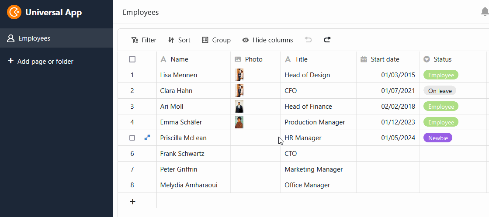
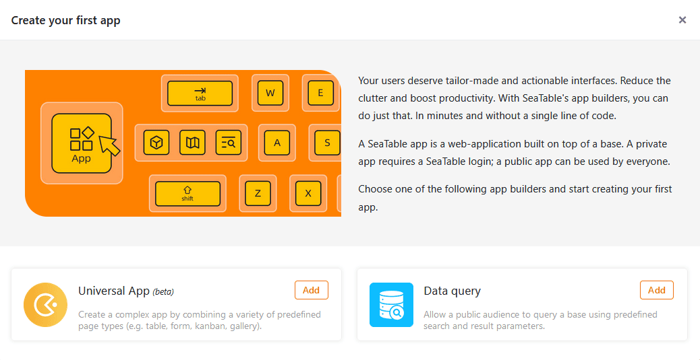
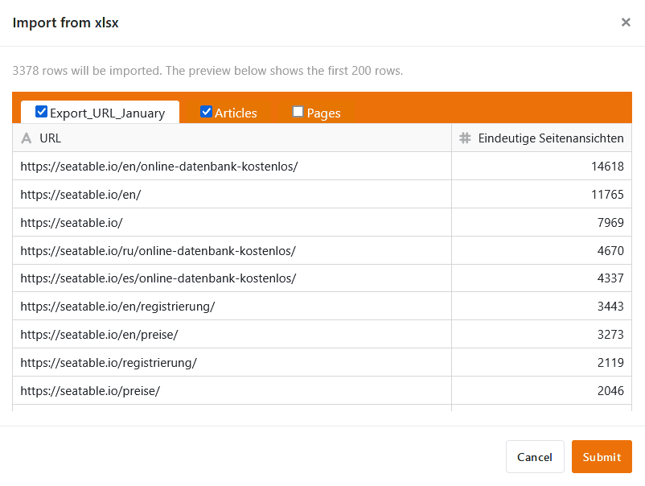
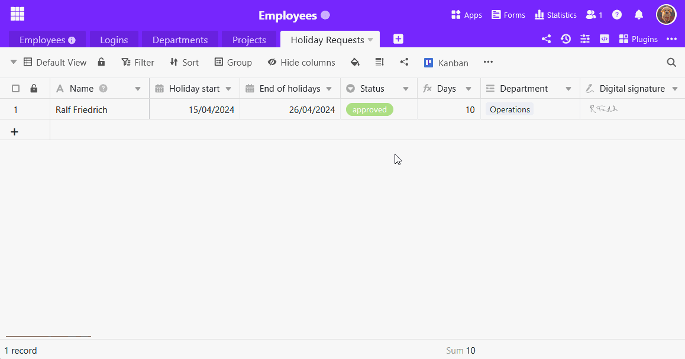

Dans SeaTable 4.4, nous poursuivons avec verve le développement de l'Universal App Builder. De nombreuses nouvelles fonctions permettent de créer des applications web encore plus puissantes et confortables. En outre, nous avons peaufiné la fonction d'importation et les jeux de données communs. Les valeurs par défaut pratiques s'appliquent désormais de manière universelle.

Ce matin, nous avons mis à jour SeaTable Cloud à la version 4.4. Tous les auto-hébergeurs peuvent faire de même : L'image de SeaTable 4.4 est disponible en téléchargement dans le célèbre [dépôtDocker](https://hub.docker.com/r/seatable/seatable-enterprise) . Comme toujours, vous trouverez dans le [changelog](https://seatable.io/fr/docs/changelog/version-4/) la liste complète des modifications.

## Un App Builder plus flexible et plus puissant

Dans SeaTable 4.4, nous avons à nouveau apporté un grand nombre d'améliorations et de corrections de bugs à l'[application universelle](https://seatable.io/fr/docs/apps/universelle-app/), dont bénéficient presque tous les [types de pages](https://seatable.io/fr/docs/universelle-apps/seitentypen-in-der-universellen-app/). La fin de la phase bêta approche donc à grands pas.

### Boutons sur les pages d'interrogation

[Les pages de requête](https://seatable.io/fr/docs/seitentypen-in-universellen-apps/abfrageseiten-in-universellen-apps/) prennent désormais en charge l'exécution d'actions à l'aide de boutons : Après une requête de données réussie, il est possible d'actionner [des boutons](https://seatable.io/fr/docs/andere-spalten/die-schaltflaeche/) dans la liste de résultats affichée afin d'effectuer des actions. Il s'agit d'une nouveauté particulière, car jusqu'à présent, SeaTable ne permettait nulle part d'interagir avec les lignes interrogées.

Un exemple d'application est une bourse d'emploi interne : la page de requête permet de rechercher rapidement les postes pertinents. Si un poste intéressant y figure, il suffit alors de cliquer sur le bouton dans les résultats de recherche pour postuler directement à l'emploi.

### Glisser-déposer dans le calendrier

Jusqu'à présent, il n'était pas possible de modifier les rendez-vous sur la [page du calendrier](https://seatable.io/fr/docs/seitentypen-in-universellen-apps/kalenderseiten-in-universellen-apps/). Avec SeaTable 4.4, vous bénéficiez d'une plus grande flexibilité. Désormais, vous pouvez déplacer facilement vos rendez-vous dans le calendrier par glisser-déposer. De plus, vous pouvez modifier les valeurs dans les [colonnes de dates](https://seatable.io/fr/docs/datum-dauer-und-personen/die-datum-spalte/) correspondantes via les détails de la ligne, à condition de disposer des [autorisations](https://seatable.io/fr/docs/universelle-apps/seitenberechtigungen-in-einer-universellen-app/) nécessaires.

### Manipulation simplifiée des données côté tableau

Comme dans la base, vous pouvez désormais [sélectionner toutes les entrées d'une colonne](https://seatable.io/fr/docs/arbeiten-in-tabellen/hinzufuegen-von-daten-per-copy-and-paste/) sur les [pages de tableau](https://seatable.io/fr/docs/seitentypen-in-universellen-apps/tabellenseiten-in-universellen-apps/) de vos apps en un seul clic sur l'en-tête de la colonne. La [poignée de remplissage](https://seatable.io/fr/docs/arbeiten-mit-zeilen/duplizieren-einer-zeile/) pratique est également désormais possible : faites glisser le petit carré dans le coin inférieur droit d'une cellule vers le bas pour transférer la valeur dans toutes les lignes situées en dessous.

### Colonne des employés disponible sur les pages de formulaires

Si vous utilisez une [colonne d'employés](https://seatable.io/fr/docs/datum-dauer-und-personen/die-spalte-mitarbeiter/) dans votre tableau, elle n'est **pas** disponible dans [les formulaires web](https://seatable.io/fr/docs/webformulare/webformulare/). Cependant, à partir de SeaTable 4.4, vous pouvez ajouter des colonnes d'employés sur les [pages de formulaires](https://seatable.io/fr/docs/seitentypen-in-universellen-apps/formularseiten-in-universellen-apps/) de l'application universelle. Ainsi, les membres de votre équipe peuvent par exemple se sélectionner eux-mêmes lors d'une demande de congé et ne doivent plus saisir leur nom manuellement. Auparavant, vous devez activer dans les [paramètres de l'application](https://seatable.io/fr/docs/universelle-apps/einstellungen-einer-universellen-app-aendern/) l'option permettant d'afficher la liste des collaborateurs.

### Plus d'options de customisation pour des pages personnalisées

Dans la version 4.4, il est possible de masquer la **barre de titre** sur la [page individuelle](https://seatable.io/fr/docs/seitentypen-in-universellen-apps/individuelle-seiten-in-universellen-apps/). Cela permet de créer des pages de renvoi visuellement attrayantes. Pour les éléments image et carte, des menus déroulants permettent de **créer** rapidement **des liens** à partir d'autres pages de l'application. Pour les **statistiques**, nous avons ajouté d'autres types de graphiques et ajouté des possibilités de configuration supplémentaires qui rendent la création de tableaux de bord encore plus confortable. Afin de présenter clairement les nombreuses options de style, nous avons divisé le style du graphique et le style général en deux onglets différents.

## Applications de galerie et de consultation de données

Comme nous l'avons annoncé dans les dernières notes de version, nous avons **supprimé** le **Générateur d'applications de galerie** dans SeaTable 4.4. Si vous souhaitez créer une nouvelle application avec une [galerie](https://seatable.io/fr/docs/seitentypen-in-universellen-apps/galerieseiten-in-universellen-apps/), vous disposez d'une alternative plus fonctionnelle avec l'Universal App Builder.



L'[application de consultation des données](https://seatable.io/fr/docs/apps/datenabfrage-app/) a également connu quelques changements. L'ancien App Builder pour la consultation des données a été supprimé et remplacé par un nouveau basé sur l'Universal App Builder. Cela signifie que vous pouvez bien sûr continuer à créer des applications publiques pour la consultation de vos bases, mais l'interface ressemble désormais à celle de l'Universal App Builder. Pour les apps de requête existantes, la situation est la même que pour les apps de galerie : vous ne devez rien faire et vous pouvez continuer à les utiliser.



## Une expérience utilisateur plus agréable lors de l'importation d'Excel

Avec SeaTable 4.4, l'[importation de tableaux Excel](https://seatable.io/fr/docs/import-von-daten/import-von-excel-dateien-in-seatable/) est plus rapide, plus flexible et plus stable : Des tableaux de plusieurs milliers de lignes sont désormais disponibles dans SeaTable en quelques instants. Dans la fenêtre d'aperçu nettement élargie, vous pouvez désormais choisir quels tableaux d'un classeur - tous ou seulement certains - vous souhaitez importer depuis le fichier XLSX. Alors que les caractères spéciaux dans les noms de colonnes et autres cas spéciaux donnaient des résultats indésirables dans le passé, ils sont désormais pris en compte de manière fiable. Des messages d'erreur améliorés donnent des indications claires sur les conflits, notamment lors de l'[importation dans le stockage de données volumineuses](https://seatable.io/fr/docs/big-data/eine-excel-tabelle-ins-big-data-backend-importieren/).



## Plus de fonctions pour les ensembles de données partagés

[Les ensembles de données partagés](https://seatable.io/fr/docs/gemeinsame-datensaetze/funktionsweise-von-gemeinsamen-datensaetzen/) sont très utiles lorsque vous et les membres de votre équipe avez besoin de certains tableaux (par exemple une liste d'employés) à travers différents [groupes](https://seatable.io/fr/docs/arbeiten-mit-gruppen/einfuehrung-in-die-arbeit-mit-gruppen/) dans vos bases. Avec SeaTable 4.4, trois nouvelles fonctions viennent s'ajouter à celles déjà existantes :

1. Si vous avez une [Copier la base](https://seatable.io/fr/docs/arbeiten-mit-bases/eine-base-in-eine-gruppe-kopieren/)Si vous utilisez des bases de données qui contiennent des enregistrements partagés, vous pouvez décider de conserver ou non le lien avec ces enregistrements. Le groupe dans lequel vous copiez la base doit bien sûr avoir accès aux enregistrements communs.

    

2. Après la [Restauration de bases à partir de snapshots](https://seatable.io/fr/docs/historie-und-versionen/wiederherstellung-eines-snapshots/) ou le [Création d'une base à partir d'un modèle](https://seatable.io/fr/docs/arbeiten-mit-bases/anlegen-einer-base-mithilfe-einer-vorlage/) permet de lier des tables existantes à un enregistrement commun et de permettre ainsi la synchronisation avec les données qui s'y trouvent. Jusqu'à présent, il n'était pas possible de réimporter des enregistrements communs, mais seulement de les intégrer dans de nouvelles tables.

    

3. Depuis peu, le créateur d'un ensemble de données communes peut [Synchronisation](https://seatable.io/fr/docs/gemeinsame-datensaetze/synchronisation-eines-gemeinsamen-datensatzes/) de toutes les tables dépendantes avec l'ensemble de données, garantissant ainsi que les autres utilisateurs utilisent l'état actuel des données dans leurs bases. Par le passé, vous deviez compter sur les utilisateurs pour configurer la synchronisation automatique ou pour la déclencher manuellement.

    

## Les valeurs par défaut s'appliquent partout

Avec la version 4.4, SeaTable généralise l'application des [valeurs par défaut](https://seatable.io/fr/docs/arbeiten-mit-spalten/standardwert-fuer-eine-spalte-festlegen/). Lorsque vous créez une nouvelle ligne, que ce soit dans le tableau d'une base ou d'une app, via une [colonne de liens](https://seatable.io/fr/docs/verknuepfungen/wie-man-tabellen-in-seatable-miteinander-verknuepft/), un [formulaire web](https://seatable.io/fr/docs/webformulare/webformulare/), un [bouton](https://seatable.io/fr/docs/andere-spalten/zeilen-per-schaltflaeche-in-eine-andere-tabelle-kopieren/) ou [une automatisation](https://seatable.io/fr/docs/automationen/automations-aktionen/), les valeurs par défaut s'appliquent partout lors de la création de la ligne. Jusqu'à présent, les valeurs par défaut ne s'appliquaient que lorsqu'une nouvelle ligne était créée manuellement dans un tableau.

Comme le champ d'action des valeurs par défaut s'est considérablement élargi, nous avons également créé un point de menu bien en vue dans les options de colonne, qui vous permet de régler facilement les valeurs par défaut.



D'ailleurs, même lorsque vous créez de nouvelles lignes via l'API, vous pouvez activer les valeurs par défaut avec le paramètre correspondant.

## Et bien plus encore

Vous connaissez déjà l'**éditeur de texte formaté** de plusieurs endroits dans SeaTable, comme la [description de la base](https://seatable.io/fr/docs/arbeiten-mit-bases/wie-man-einer-base-eine-beschreibung-hinzufuegt/), le [type de colonne pour les textes longs](https://seatable.io/fr/docs/text-und-zahlen/die-spalten-text-und-formatierter-text/) ou [les messages électroniques](https://seatable.io/fr/docs/beispiel-automationen/e-mail-versand-per-automation/). Avec SeaTable 4.4, nous avons amélioré la convivialité et corrigé quelques bugs. En voici deux : jusqu'à présent, les retours à la ligne multiples étaient supprimés lors de la fermeture de l'éditeur et le texte existant était écrasé lorsque l'utilisateur tapait dans la cellule. Dans le nouvel éditeur, les retours à la ligne multiples sont conservés et peuvent servir à structurer le texte de manière plus claire. Nous avons également éliminé le risque de suppressions involontaires : Lors de la saisie, le nouveau texte précède le texte existant.

Dans la nouvelle version, nous avons également amélioré le **centre de notifications**  sur la page d'accueil. Désormais, vous pouvez voir toutes les [notifications](https://seatable.io/fr/docs/benachrichtigungen/sinn-und-zweck-von-benachrichtigungen-in-seatable/) du système au même endroit, suivre la source de la notification et accéder à la page correspondante en un seul clic.

Enfin, nous avons optimisé la boîte de dialogue pour la **réinitialisation du mot de passe SeaTable**. Pour cela, nous avons uniformisé le design et ajouté plus de fonctions. Lorsque vous [modifiez votre mot de passe](https://seatable.io/fr/docs/persoenliche-einstellungen/eigenes-passwort-aendern/) dans vos paramètres personnels, vous pouvez désormais le faire apparaître en texte clair en cliquant sur l'icône en forme d'œil. De plus, la force de votre nouveau mot de passe s'affiche automatiquement.
