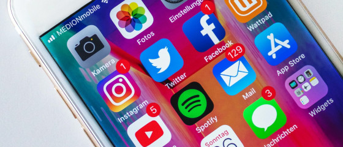

To achieve measurable success on social media platforms, you need to continuously publish new content. And often several times a week for different channels, such as LinkedIn, Instagram, Facebook, X or YouTube. You need to **post interesting and entertaining content on time**. A **social media editorial plan** will help you with this. Read this article to find out how to develop a successful social media strategy with a social media plan.

## Why you need a social media editorial plan

### 1\. maintain an overview

A social media plan allows you to keep **track of your social media channels**. More specifically, you can use a social media editorial plan to record **who, what, when and where you should post**. If you use a central tool for social media posts, you can work more efficiently with your colleagues, as everyone in the team can always see the current status. This **makes it easier for you to distribute tasks** and still adhere to your corporate design guidelines to create social media posts that look consistent.

An editorial plan for social media ensures structured processes and a uniform appearance. Image rights: © Urupong / Adobe Stock

### 2\. record ideas

The next advantage of a content plan for social media is that you can **collect unlimited ideas**. If an idea for a social media post comes to fruition, you can simply roll it out to your individual channels and **create customized content**. This means you always have posts in the pipeline in case you run out of creativity when creating new content. After all, there's nothing worse than having to produce creative content under time pressure and then not having any good ideas.



### 3\. plan appointments

It should be possible to display the editorial plan in a calendar. This allows you to plan well in advance **on which dates and at what intervals you want to post**. For example, make a note of important public holidays or events for which you want to publish content in line with the topic. Anyone who regularly produces content for social media channels knows how **important a well-structured editorial plan** is **for smooth workflows**.

Plan the dates for your posts in a calendar. Image rights: © mizar_21984 / Adobe Stock

### 4\. systematically organize content

A social media plan also allows you to create connections between posts. For example, you can come up with **your own categories and formats** for which you regularly publish content. When developing your social media strategy, define the extent to which the posts should be similar or independent of each other. Think about **which messages you want your followers to internalize**, how you can best convey them and whether they match the goals you have set in your marketing plan.

### 5\. analysis and strategy

An editorial plan for social media also helps you to **analyze past posts**. Whether impressions, clicks, likes or comments: Which content performed particularly well on which of your channels? How can you tailor your content even better to your target groups in future? No matter which social media strategy you pursue: A self-created social media editorial plan will help you with planning, implementation and evaluation.

## How to create your content plan for social media

Before you start with the concept for your social media editorial plan, you should develop your social media strategy and define the framework:

1. How often do you plan to post?
2. Do you operate one or more social media channels?
3. Should it be possible to manage images and videos?
4. Is it about organic posts or more extensive social media campaigns?
5. How many team members should work together in the social media editorial plan?

Which social media channels do you use?

Then it's time to choose the tool that best supports your project. Below you can read more about possible [**tools and templates for your social media plan**](https://seatable.io/en/social-media-plan-vorlage/#Tools_und_Vorlagen_fuer_Ihren_Social-Media-Plan).

## What a social media editorial plan should cover

When you create your social media editorial plan, it's all about **mapping and simplifying** the **workflow of your content creation team**. Tasks within the editorial process can include:

1. Research and brainstorming
2. Photo shoot or video shoot
3. Post-production and editing
4. Text creation
5. Layout design
6. Editing and approval
7. Publication

Depending on the size of your content creation team, you can take on the tasks yourself or delegate them to specialists (copywriters, concept developers, graphic designers, editors). To ensure that all employees know what needs to be done by when, you should **clearly assign and schedule** the **tasks.** A good social media content plan should contain at least the following points:

- Topics and ideas
- Tasks and responsible team members
- Uploaded files (text/image/video)
- Your social media channels and content formats
- Processing status
- Deadlines for drafts and publication dates

### Planning Instagram content - the key to success

To be successful on Instagram, thorough planning is essential. Planning Instagram content means determining in advance what content should be posted and when. This includes selecting topics, creating a visual concept and setting a publishing calendar. A well-thought-out content plan helps to build a consistent brand identity, engage the target group and increase reach. Instagram content planning is more than just posting pretty pictures. It's about telling a story and interacting with the community.

**Why is planning so important?**

- **Consistency:** A well thought-out plan ensures a uniform look and feel.
- **Relevance:** Content can be better tailored to the target group.
- **Efficiency:** Time savings thanks to prepared content.
- **Analysis:** Successes can be better measured and optimized.

SeaTable makes it easy to plan your Instagram content. Use our template to collect your ideas, assign tasks and track progress. This way, you always have an overview and can successfully implement your Instagram strategy.

## Tools and templates for your social media plan

Various tools are suitable for creating your social media editorial plan. Choose between spreadsheets, social media management tools or an intelligent database solution.

### Social media plan with Excel or Google Sheets

If you already use Google Docs or Microsoft 365, an easy option would be to create the **social media plan in Excel or Google Sheets**. Create a new sheet containing a table for each month or year. Here you can link to other documents such as briefings, images and videos and enter texts directly into the list.

You can find**numerous social media plan templates for the two best-known tools** on the Internet.  
**The advantage:** you can work with a familiar program and get started straight away.  
**The disadvantage** of Excel and other spreadsheets is that the **interface is not very user-friendly** and the tables are **inflexible and cumbersome** to edit.

### Editorial plan with social media management tool

Another option are **social media tools such as Hootsuite, CoSchedule or ContentPepper**. These come directly from [social media management](https://seatable.io/en/social-media-management/) and are therefore specialized in content planning. The big advantage of social media management tools is that you can use them to plan and create posts as well as post them directly on social media. This saves you the effort of publishing on the individual platforms.

### Social media plan in SeaTable

There are also **intelligent database solutions** such as SeaTable. All kinds of information can be entered in the tables, as well as images, documents and to-do lists. This allows you to bundle all content in one place and map your processes in an editorial plan that all **team members** can **work** with **together in real time**.

You can **structure and display** the data in your SeaTable social media plan **in different ways and analyze it with statistics** so that you always have the most important information at a glance. [Register online](https://seatable.io/en/registrierung/) and get started right away. Here you can get the free [editorial plan template](https://seatable.io/en/vorlage/lmmjwghgtye322iwdxvj7a/), which you can customize exactly to your needs.

## Conclusion

With a social media editorial plan, you can exploit the full potential of your channels. You will be able to plan ahead and address your audience with targeted content. As a result, the initial creation of a content plan helps you to implement your social media strategy. **Automate your processes**, inspire your followers and work better together as a team with SeaTable's [no-code solution](https://seatable.io/en/).
