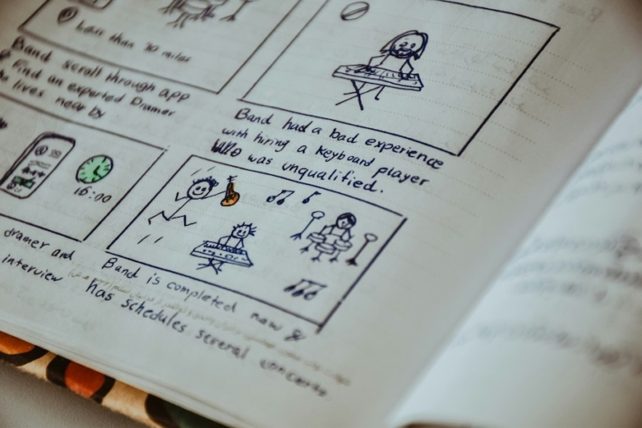

Quer esteja a criar um vídeo de imagem para a sua empresa, uma curta-metragem para um festival de cinema ou o próximo êxito de bilheteira de Hollywood, a criação de um **storyboard** pode fazer toda a diferença. Um storyboard não é apenas uma ferramenta para estruturar as suas **ideias criativas**, mas também para garantir um **processo de produção sem problemas**. Este artigo explica a importância e as vantagens dos storyboards para projectos cinematográficos de todos os tipos e apresenta um modelo de storyboard gratuito para o ajudar a dar vida à sua visão.

Antes de um filme ser rodado, tem de ser bem planeado.

## O que é um storyboard?

Um storyboard é a **representação gráfica** ou o **esboço** de uma história. Pode ser utilizado em **filmes**, **animações**, **vídeos publicitários** ou outros **meios visuais**. Com a ajuda de uma série de imagens ou desenhos que mostram cenas-chave ou elementos do enredo, pode planear uma narrativa a nível visual antes de iniciar a produção propriamente dita.

Os estilos de desenho podem variar consideravelmente. Alguns desenhadores de storyboards criam ilustrações extremamente elaboradas, enquanto outros preferem limitar-se a simples desenhos de bonecos.

Um exemplo de representação visual de um storyboard

## Para que serve um storyboard

O storyboard dá à sua equipa de produção uma ideia clara do aspeto final do vídeo. Serve de guia ao longo de todo o processo e abrange várias tarefas:

- **Visualização:** O storyboard fornece uma representação visual do enredo, das personagens e dos locais para ilustrar a imagem global do filme.
- **Colaboração:** Com um storyboard, o realizador pode tornar claro para todos no cenário como é que ele prevê a cena. Desta forma, todos sabem o que tem de ser feito e quando.
- **Definições da câmara:** O storyboard define os planos de câmara planeados, incluindo ângulos, movimentos e cortes, para permitir uma realização visual eficaz.
- **Planeamento de recursos:** Com base no storyboard, pode planear e utilizar eficazmente recursos como actores, locais, adereços e efeitos para otimizar a produção.

## As vantagens de um storyboard

Um storyboard tem a grande vantagem de visualizar **sequências de ação complexas**, facilitando assim a sua compreensão. Isto permite que a sua equipa de produção compreenda as suas ideias e as concretize com maior precisão. Deixe a sua criatividade fluir e acrescente elementos aos seus esboços que talvez não tenha considerado antes. Pode sempre **alterar** e **adaptar** o seu modelo de storyboard durante o processo criativo, caso se lembre espontaneamente de algo.

À medida que aperfeiçoa a sua história e acrescenta mais detalhes durante o processo de planeamento, pode utilizar o storyboard para **reconhecer os erros numa fase inicial**. Isto poupa-lhe muito esforço durante a **filmagem** e **a edição do vídeo**. Determine o maior número possível de pormenores com antecedência, como o ritmo da história, para ter a cabeça limpa para o essencial durante os dias extenuantes de filmagem.

## O processo de realização do filme

Para produzir um filme ou um vídeo, é necessário, em primeiro lugar, ter uma **ideia**. Pense, em primeiro lugar, no conteúdo, mas também no objetivo e no efeito que pretende ter nos seus espectadores.

Se a sua ideia já estiver completamente desenvolvida, deve escrevê-la num **guião**. Desta forma, não se esquecerá de nada e poderá verificar mais facilmente o significado da sua história.

Segue-se o **storyboard**, no qual transfere o enredo do seu argumento sob a forma de esboços visuais. Preste atenção a pormenores como os ângulos da câmara, a atmosfera, o som e a música para dar profundidade à sua história.



Só se deve começar a **filmar** quando o guião e o storyboard estiverem concluídos. Porque num filme que não está completamente planeado e organizado, a rodagem é muitas vezes caótica e envolve muito mais esforço do que o realmente necessário.

Quando as filmagens estiverem concluídas, o passo seguinte é a transição para a **edição de vídeo**. Depois de o material ter sido visto, selecionado e editado, pode obter um primeiro **feedback** do seu ambiente. Verifique se o seu filme é compreensível e tangível para quem está de fora. Pode então utilizar o feedback para **finalizar** o seu **filme**.

O storyboard faz parte da fase de planeamento - a filmagem só tem lugar depois.

## O que deve incluir o seu storyboard

Como já foi referido, um storyboard contém **imagens** ou **desenhos** para visualizar as várias cenas. Pode desenhá-los à mão ou - se tiver apenas um talento artístico moderado - criar um storyboard digital. Deve descrever as respectivas cenas, mas não com demasiado pormenor. Resume brevemente os elementos importantes, como o **conteúdo**, o **cenário** e o **diálogo**.

Ao criar o seu storyboard, certifique-se também de que **numera** as **secções** para que você ou a sua equipa não se confundam com a ordem. A divisão em **sequências** e **cenas** é uma boa forma de o fazer. Pense antecipadamente nas [configurações de câmara](https://filmpuls.info/einstellungen-einstellungsgroesse-bildausschnitt/) que gostaria de utilizar nas respectivas cenas e escreva-as também.

Isto abrange os pontos mais importantes. No entanto, também pode acrescentar outras informações, se necessário, como **papéis** envolvidos, **adereços** ou **instruções** de edição.

Não é necessário ser um grande artista para criar um bom storyboard.

## Dicas para um storyboard perfeito

Para garantir que o seu storyboard faz realmente com que o seu projeto corra melhor e que pode realizar o seu projeto da melhor forma, deve aplicar as seguintes dicas, para além das básicas:

- **Esboços:** Mantenha as suas imagens e desenhos simples e directos. Não são necessárias obras de arte pormenorizadas para visualizar a sua visão. No entanto, preste atenção à profundidade espacial e faça a distinção entre fundo e primeiro plano.
- **Concentração:** Não se perca nas pequenas coisas, mas tenha sempre em mente o panorama geral. Esta é a única maneira de traçar um fio vermelho claro através do seu filme e garantir a continuidade da sua história.
- **Texto:** Evitar textos demasiado pormenorizados e longos. Um storyboard deve servir, em primeiro lugar, para dar uma primeira visão geral de todo o projeto de filme. Os diálogos longos, por outro lado, pertencem ao guião.
- **Tamanho da imagem:** Idealmente, crie os seus esboços diretamente no formato em que irá mais tarde rodar o filme. Isto garante que tudo se encaixa no enquadramento durante a filmagem e que não tem de alterar nada a curto prazo.
- **Câmara:** Um storyboard pode ter vários aspectos. Pode resumir uma sequência ou criar um esboço separado para cada movimento de câmara. Se optar por esta última opção, faz sentido desenhar os movimentos nas suas representações visuais.

## Utilize o modelo gratuito da SeaTable

Com o [modelo gratuito](https://seatable.io/pt/vorlage/k6o24najsho8oipbkwmo8g/) da SeaTable, pode não só criar facilmente o seu storyboard, como também **partilhá-lo** com outras pessoas e **trabalhar em conjunto** de forma eficiente.

O modelo de storyboard permite-lhe planear claramente o **enredo**, o **cenário**, o **diálogo** e **os ângulos de câmara**. Também pode adicionar facilmente **personagens**, **adereços** e **direcções de palco** para pensar e registar a sua história até ao mais ínfimo pormenor.

Se quiser utilizar [este modelo](https://seatable.io/pt/vorlage/k6o24najsho8oipbkwmo8g/) do SeaTable para o seu projeto de filme, basta [registar-se](https://seatable.io/pt/registrierung/) gratuitamente com o seu endereço de e-mail. Pode então começar a criar o seu storyboard individual num instante e fazer avançar eficazmente os seus projectos cinematográficos.
