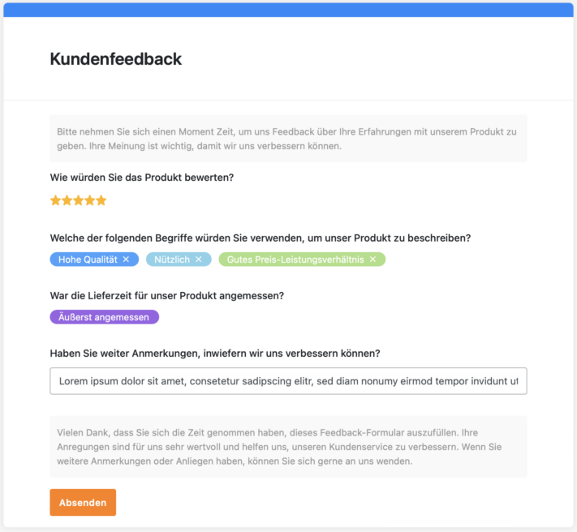

Хотите узнать, каковы потребности вашей целевой группы или как можно еще больше оптимизировать ваш продукт? Или хотите провести опрос, чтобы выяснить, насколько довольны ваши сотрудники? **Онлайн-опросы** оказываются чрезвычайно эффективным инструментом для сбора данных. Благодаря многочисленным преимуществам они являются предпочтительным методом для компаний, организаций и исследователей по всему миру.

В следующей статье мы рассмотрим преимущества и важные критерии создания онлайн-опросов, а также сравним семь перспективных инструментов.

Онлайн-опрос оказывается чрезвычайно эффективным инструментом для сбора данных.

## Преимущества онлайн-опроса

Проведение опросов в **Интернете** дает вам ряд преимуществ. Одно из самых больших преимуществ онлайн-опросов - это экономия **времени**. Вместо того чтобы совершать утомительные телефонные звонки или ходить по пешеходным зонам, чтобы лично опросить потенциальных респондентов, вы можете просто создать опрос в цифровом формате и опубликовать ссылку на него в Интернете. Это позволит вам быстро собрать большое количество ответов, не теряя драгоценного времени.

Кроме того, **стоимость** онлайн-опросов зачастую значительно ниже по сравнению с традиционными методами. Некоторые инструменты предлагают свои услуги частично или даже полностью бесплатно. Это позволяет небольшим компаниям или исследовательским проектам с ограниченным бюджетом проводить качественные опросы.

Еще один плюс - **глобальный охват**, который обеспечивает онлайн-опрос. Поскольку Интернет доступен во всем мире, вы можете легко поделиться своим опросом с пользователями по всему миру. Это дает вам возможность собрать разнообразные и репрезентативные данные из разных регионов и культур.

Ключевое преимущество создания опросов в Интернете - возможность отслеживать и анализировать результаты в режиме **реального времени**. Современные платформы для проведения опросов предлагают **инструменты анализа**, которые мгновенно преобразуют собранные данные в содержательную статистику и графики. Это позволяет быстро получать выводы и принимать обоснованные решения без необходимости вручную анализировать анкеты.

## 10 заповедей формулирования вопросов по Порсту

Для достижения хороших результатов особенно важно тщательно формулировать вопросы при создании опроса. Плохо сформулированные вопросы могут привести к неточным или необъективным ответам, что может повлиять на **достоверность** ваших данных. Это было бы неприятно, особенно если вы потратили много времени и усилий на проведение опроса. Чтобы избежать подобных проблем, Рольф Порст сформулировал [десять принципов](https://www.gesis.org/fileadmin/upload/forschung/publikationen/gesis_reihen/howto/how-to2rp.pdf), которые всегда следует иметь в виду при составлении опросов.

10 заповедей формулирования вопросов по Рольфу Порсту.

## Что важно в опросах

Кроме того, важно учитывать некоторые аспекты, чтобы обеспечить мотивацию участников для успешного завершения опроса. Высокий процент отсева может свидетельствовать о том, что участники недовольны, и вы должны избежать этого любой ценой.

**Четкая структура** опроса имеет решающее значение. Никто не захочет заполнять хаотичный опрос. Организуйте вопросы так, чтобы они логически выстраивались друг за другом и были понятны. Избегайте слишком длинных описаний вопросов и ответов, так как большинство участников предпочитают **быстрый** и **несложный** опрос.

Чтобы заинтересовать участников, внесите **разнообразие** в опрос. Длинный список вопросов с несколькими вариантами ответов может быстро надоесть. Поэтому включайте в опрос различные типы вопросов, чтобы мотивировать респондентов и удерживать их внимание.

Даже после завершения опроса важно выразить **признательность**. Участники потратили свое драгоценное время, чтобы помочь вам, и поэтому заслуживают признания. Короткое благодарственное сообщение в конце опроса может помочь участникам почувствовать свою значимость и желание снова участвовать в опросах в будущем.

Хорошо продуманный опрос позволит вам предотвратить высокий процент отказов.

## Создание опросов: Инструменты в сравнении

В следующем тесте инструменты для проведения опросов проверялись по нескольким критериям, включая удобство использования, настраиваемость, защиту данных, функции анализа и стоимость. Эта оценка позволит вам выбрать оптимальную платформу для проведения опросов.

### Каракули

Если вы ищете простой способ планирования встреч с несколькими участниками, **Doodle** - отличный выбор. Приложение впечатляет своим удобным и минималистичным дизайном. Doodle фокусируется на предложениях по планированию опросов и позволяет пользователям создавать их простым и интуитивно понятным способом.

Однако есть опасения по поводу защиты данных, поскольку Doodle отправляет личные данные на зарубежные серверы и использует инструменты слежения. Кроме того, скрыть список участников опроса можно только в платной версии Pro. Для частных лиц она бесплатна, но профессионалам придется платить 6,95 евро в месяц.

**Область применения:** Планирование  
**Простота использования:** очень хорошо  
**Возможности настройки:** низкая  
**Защита данных:** GDPR и SSL-шифрование  
**Функция анализа:** хороший  
**расходы:** частично бесплатно

### Формы Google

Этот универсальный инструмент подходит не только для опросов, но и для викторин и впечатляет своим понятным интерфейсом. Четкая структура и ограниченные функции делают создание опросов особенно удобным. Помимо различных типов вопросов, таких как одиночный выбор, свободное текстовое поле и рейтинг, это приложение также предлагает возможность интегрировать в вопросы изображения и видео. Кроме того, вы можете организовать вопросы в четкие разделы и легко реализовать как случайные последовательности, так и разветвленные вопросы.

Еще один плюс - возможность прямого импорта вопросов, что делает процесс создания еще более эффективным. Кроме того, **Google Forms** отвечает всем требованиям GDPR и другим глобальным нормативным документам, что гарантирует безопасность ваших данных. Для оценки доступны несколько функций, в том числе сводка всех результатов и возможность более детально рассмотреть отдельные вопросы или результаты конкретных участников.

**Область применения:** Опросы и викторины  
**Простота использования:** очень хорошо  
**Возможности настройки:** высокая  
**Защита данных:** GDPR и другие рекомендации по соблюдению требований  
**Функция анализа:** в порядке  
**Стоимость: бесплатно** Бесплатно

### Surveymonkey

Этот инструмент также подходит для проведения опросов и викторин. По сравнению с другими программами он может показаться немного сложнее, поскольку предлагает множество вариантов настройки. Тем не менее, он шаг за шагом проводит пользователя через весь процесс, облегчая создание опроса. Особой изюминкой этого приложения является обширная база вопросов, которая служит источником вдохновения и шаблоном.

Будь то дизайн, типы вопросов или разветвленные вопросы, этот инструмент предлагает широкий спектр возможностей настройки, не перегружая пользователя. Что касается защиты данных, **Surveymonkey** соблюдает требования GDPR и Калифорнийского закона о конфиденциальности потребителей (CCPA).

Для анализа доступны различные функции, включая обзор вопросов, а также анализ самого опроса и возможных тенденций. Базовые функции можно использовать бесплатно, а стоимость расширений составляет 39 евро на человека в месяц.

**Область применения:** Опросы и викторины  
**Простота использования:** OK  
**Возможности настройки:** высокая  
**Защита данных:** GDPR и CCPA  
**Функция анализа:** по порядку  
**Затраты:** дорого, частично бесплатно

### Survio

**Survio** предлагает удобную платформу для создания и проведения опросов в различных областях применения. Благодаря шаблонам и возможности организовать опрос по страницам, создание опросов очень просто и понятно. Возможности настройки разнообразны, доступны различные типы вопросов и их описания. Однако логика скрытия или отображения определенных вопросов на основе предыдущих ответов требует платного расширения.

С точки зрения защиты данных инструмент соответствует требованиям GDPR и обеспечивает дополнительную безопасность за счет шифрования с помощью SSL-сертификата. Survio предлагает обширные функции анализа, включая возможность анализировать результаты, просматривать индивидуальные ответы и отображать статистику опроса. Базовые функции доступны бесплатно, а расширение для дополнительных функций стоит 25 евро в месяц.

**Область применения:** Опросы  
**Удобство использования:** очень хорошо  
**Настраиваемость:** высокая  
**Защита данных:** GDPR и SSL-сертификат  
**Функция анализа:** очень хорошо  
**Затраты: умеренные** умеренные, частично бесплатно

### LamaPoll

Это приложение подходит для всех типов исследований, особенно в научной сфере. На первый взгляд оно может показаться слишком сложным из-за разнообразия функций, поэтому требуется некоторое время для ознакомления с различными опциями. Однако оно предлагает множество вариантов различных типов вопросов, настраиваемые пути ответов и даже возможность кодирования ответов.

**LamaPoll** соответствует требованиям GDPR и располагает своими серверами в Германии. Кроме того, компания предоставляет прозрачные документы по защите данных. Помимо анализа событий и выборочных проверок, он предлагает доступ к различным статистическим данным.

Базовые функции этого приложения бесплатны, но в опросе могут принять участие только 50 человек. Хотя базовое обновление стоит 58,31 евро в месяц, оно предлагает расширенные функции и больше возможностей для проведения опросов.

**Область применения:** Опросы  
**Простота использования:** OK  
**Настраиваемость:** высокая  
**Защита данных:** DSGVO и немецкие серверы  
**Функция анализа:** хороший  
**Затраты:** дорого, частично бесплатно

### Hotjar

**Hotjar** особенно хорошо подходит для опросов о пользовании веб-сайтами. Поначалу создание опросов может показаться немного запутанным, поскольку они начинаются не с первого пункта, а прокручиваются прямо вниз к вопросам. Тем не менее, программа облегчает процесс создания, пошагово проводя пользователя через него.

Особенностью этого инструмента является возможность отображения вопросов непосредственно на веб-сайте в соответствующем месте, например, в виде так называемого "всплывающего окна". Программа предоставляет образцы, результаты и данные об эффективности опроса для анализа. Базовая версия бесплатна, но обновление стоит сравнительно дорого - 82,50 евро.

**Область применения:** Опросы по использованию веб-сайтов  
**Удобство для пользователя:** Хороший  
**Настраиваемость:** высокая  
**Защита данных:** GDPR и CCPA  
**Функция анализа**: хорошая  
**Затраты:** Очень дорого, частично бесплатно

### SeaTable

[Веб-формы](https://seatable.io/ru/docs/webformulare/webformulare/) **SeaTable** позволяют проводить опросы, в которых собранные данные автоматически сохраняются в таблице с бэкэндом базы данных. Это позволяет легко сопоставлять данные. Для анализа и обработки результатов опроса доступны различные [статистические](https://seatable.io/ru/docs/plugins/anleitung-zum-statistik-plugin/) данные. Все данные можно четко фильтровать, сортировать, группировать и отображать с помощью графических [плагинов](https://seatable.io/ru/docs/plugins/alle-plugins-in-der-uebersicht/). SeaTable также позволяет экспортировать данные для дальнейшего анализа или составления отчетов.

Несмотря на то, что программа не обладает таким же набором функций для создания опросов, как, например, Surveymonkey, она предлагает множество практических применений благодаря возможностям настройки и интуитивно понятному управлению. Возможность сбора различных типов данных и [совместного](https://seatable.io/ru/docs/seatable-nutzen/zusammenarbeit/) анализа результатов в [команде](https://seatable.io/ru/docs/seatable-nutzen/zusammenarbeit/) делает SeaTable гибким инструментом для проведения исследований и других проектов.

С точки зрения защиты данных SeaTable отвечает всем требованиям GDPR и обеспечивает дополнительную безопасность, поскольку данные хранятся исключительно в немецких дата-центрах. Помимо облачной версии, есть возможность установить SeaTable [на собственном сервере](https://seatable.io/ru/on-premises/), чтобы сохранить полную независимость данных.

**Область применения:** Опросы  
**Удобство использования:** очень хорошо  
**Настраиваемость:** высокая  
**Защита данных:** GDPR и немецкие центры обработки данных  
**Функция анализа:** Очень хорошо  
**Расходы** бесплатно

Вы можете использовать все возможности веб-формы SeaTable бесплатно. Только для настройки дизайна требуется подписка Enterprise за 14 евро в месяц.

Пример опроса клиентов в SeaTable

## Заключение

При выборе инструмента для проведения опросов важно знать ваши индивидуальные требования. Google Forms, Surveymonkey, LamaPoll и SeaTable - вот лишь несколько примеров, которые вы можете использовать. Не существует универсального идеального инструмента; у каждого из них разное соотношение цены и качества, а также свои преимущества и недостатки.

В целом онлайн-опросы представляют собой гибкий и мощный метод сбора и анализа данных. Выбрав правильный инструмент и применив статистические методы, вы сможете эффективно получать информацию, принимать решения и достигать поставленных целей.
