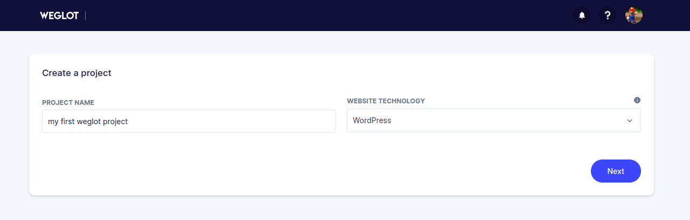
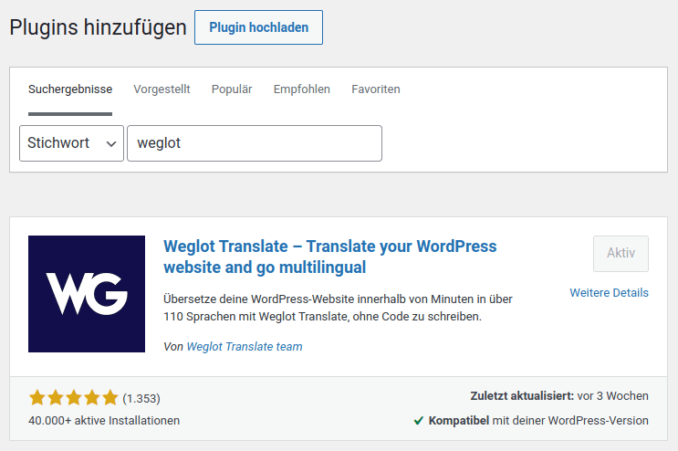
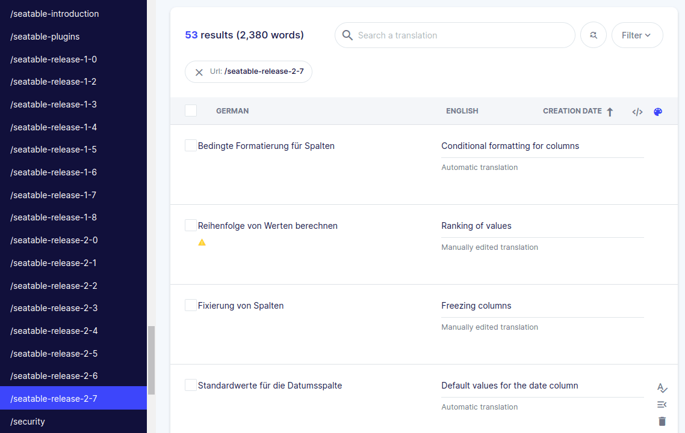
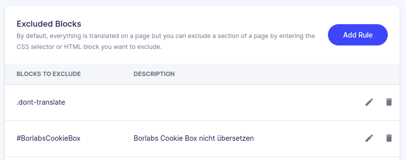
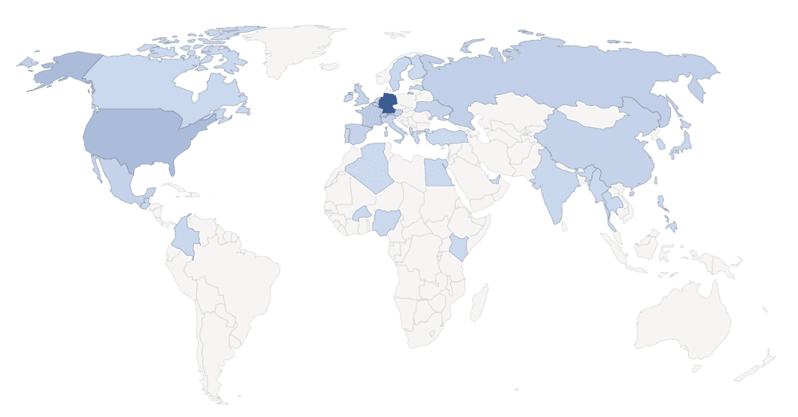
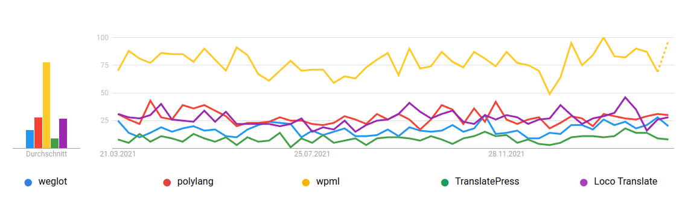
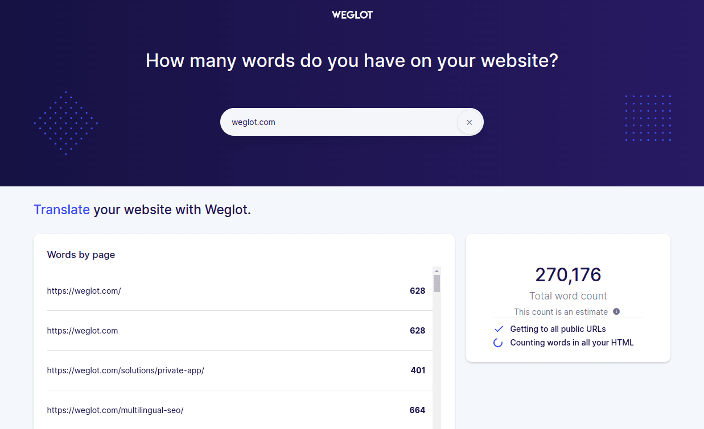
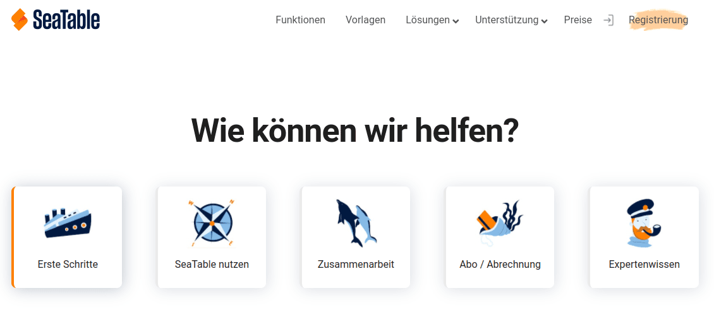

Weglot is a WordPress plugin for automatically translating your own website. The idea is simple and quickly explained. You write all the texts on your own website in your native language as usual and let Weglot translate all the content into one or more other languages. The website visitor is automatically redirected to the language version that suits him and [Weglot](https://weglot.com/?fp_ref=loved_by_seatable) takes care of all the necessary work for international SEO. 

Automatic translation of the website with Weglot

With Weglot, the desire for a multilingual website becomes reality. You can achieve a higher customer price with minimal effort and the additional texts make the website more relevant in Google's eyes and the ranking improves automatically. 

This article is my personal experience report after 1.5 years of active use of [Weglot](https://weglot.com/?fp_ref=loved_by_seatable). If you don't know Weglot yet, you will have an idea after this text why we at SeaTable decided to use Weglot. Of course, there were also problems, which could all be solved, but which should still be mentioned here.

On Medium I have published another article describing our individual scripts, problem solutions and customisations. This article is aimed at those who have already decided to use Weglot and who now [want to learn](https://christophdb.medium.com/common-pitfalls-and-challenges-with-the-translation-plugin-weglot-on-the-way-to-more-traffic-and-1f51e8c607f4) more about the [technology behind Weglot](https://christophdb.medium.com/common-pitfalls-and-challenges-with-the-translation-plugin-weglot-on-the-way-to-more-traffic-and-1f51e8c607f4). 

## With Weglot, international SEO becomes child's play

The SeaTable software is used worldwide and is available in many different languages. Consequently, our website must also be multilingual. As you can see, you can currently read the website in German, English, French, Spanish and Russian. At first I thought that I would have to translate all the texts on the website into the other languages myself, but then I came across Weglot by chance.  
The prospect of Weglot doing all the translation work for me sounded tempting at first, but at the same time I was sceptical about whether an automatic translation would be good enough. In the meantime, we have been using Weglot since the end of 2020 and have become absolute fans. Nevertheless, I want to tell you about all the positive and negative experiences.

But, enough of words. If you don't know Weglot yet, you should take a quick look at the following video from Weglot, which briefly and succinctly describes how it works.

Weglot explained in 64 seconds.

## With Weglot you get a multilingual website in seconds

Let me briefly describe how to get started with Weglot. First, you register on the website weglot.com for the free _Free_\-version. Don't worry: Weglot writes something about a 10-day trial, but Weglot is permanently free for another language and a maximum of 2,000 words.

Create the first project in Weglot.

After confirming your email address, you create your first project and choose your web technology. Besides WordPress, Weglot supports many other web technologies such as Wix, Shopify, Magento, Webflow or Squarespace. However, you will probably choose WordPress and then receive your first API key from Weglot. Treat this key like a password and do not reveal this value to anyone.

So copy the displayed API key to your clipboard and go to the admin area of your WordPress website. Search for the WordPress plugin "Weglot" and install it. In the plugin's settings, you need to enter the previously saved API key and now you can start translating your website.

Install the WordPress plugin Weglot.

Select your currently used language on your website and choose the language you now want to add by Weglot. 

### Your website is now available in several languages.

What follows now seems almost like magic. From now on, all pages on your website are available to visitors in two languages. In addition to the original web page, there is now a new URL for each new language in which the language abbreviation has been inserted.

> **https://seatable.io/blog/** - our original language German  
> **https://seatable.io/en/blog/** - English website translated by Weglot  
> **https://seatable.io/fr/blog/** - French website translated by Weglot

Every time a page is called up by a user, Weglot checks whether this page has already been translated or whether something has changed and then carries out the corresponding translation. Weglot combines various translation techniques such as [Google Transl](https://translate.google.com/) ate and [Deepl](https://www.deepl.com/translator) and generates an extremely suitable translation from the various translations in most cases. If a page has to be translated first, it may take a short moment before the page actually loads. However, this delay only occurs the first time the page is called up. Every subsequent visitor will see the page immediately.

In addition to the automatic translation, Weglot now also displays a drop-down menu on all pages to change the language. However, most users will not need this at all, as Weglot tries to direct the user automatically to the correct page based on the language set in the browser.

### Over 100 possible languages for your international business

Weglot currently allows translation into [over 100 different languages](https://weglot.com/documentation/available-languages). You probably won't need that many, because it's worth starting by concentrating on the languages that are most widely spoken around the world. A good overview can be found in the [list of the most spoken languages on Wikipedia](https://de.wikipedia.org/wiki/Liste_der_meistgesprochenen_Sprachen).

But Weglot not only translates your website, it also ensures that Google and other search engines find this new content and that all the content is indexed correctly. For this purpose, the respective _hreflang_\-tags in the source text, so that search engines can easily find the corresponding texts.

### Manual correction or professional translation for your perfect Multilanguage WordPress

Of course, it can also happen that a translation is not quite perfect. In this case, Weglot allows you to easily correct the incorrect translation via your Weglot account. To do this, you select the relevant language and URL and all translations are then displayed in a translation table.

Weglot allows easy correction of any translation.

As soon as you adjust a translation, this change is immediately applied to your website and will always be displayed in this way in the future.

If you do not want to correct the translations yourself, you can also book professional translators via Weglot. These are paid per translated word, which we have not used at SeaTable so far. 

Another important function of Weglot is that you can define terms that should not be translated and certain elements can be excluded from the translation. SeaTable, for example, is a word that Weglot should never translate. Furthermore, we have defined that all elements with the HTML class _dont-translate_ not be translated. 

With css classes or ids you can tell Weglot not to translate something.

## How we built our international SEO strategy on seatable.io with Weglot

At SeaTable, we firmly believe that only organic traffic really works in the long run. This means that from the beginning we set ourselves the goal of generating a lot of good content for our website, which should then be offered in different languages. Weglot promised to make exactly that possible. At the same time, it was important to me that I could technically map all that I had in mind and that the direct costs as well as the indirect costs such as maintenance were in good proportion to the actual benefit.

Producing the good content was less of a problem. But we don't have a native speaker in the team for each of our chosen languages. Therefore, we decided early on that we would only check the English translation of our German texts and correct them if necessary. All Spanish, French and Russian texts are completely unedited. Of course, this bears the risk of scaring off some users with incorrect translations, but we consider the translations to be sufficiently good and take this calculated risk.

Through the languages German, English, French, Spanish and Russian, we cover a large part of the world's population. A look at our website monitoring shows that 50 % of our website traffic comes from Germany, although we have only received press articles and media attention there so far. So I would say that we owe about 50 % of our current website traffic to Weglot. 

More traffic from international visitors thanks to Weglot

Furthermore, we do not make any further efforts for our international SEO. Weglot ensures that the search engines find the translated content and that it appears in the search engines in the respective countries.

## Weglot compared to other translation plugins such as WTFD, TranslatePress, Polylang, Loco Translate and ConveyThis.

Before we decided to use Weglot with SeaTable, we also looked at other WordPress plugins for translating the website.  
The best-known plugin for a multilingual WordPress is, with paragraph, the plugin [WPML](https://wpml.org/). Unlike Weglot, however, WPML does not automatically translate the content, but _only_ provides the platform for its own translations. The other plugins [TranslatePress](https://translatepress.com/?ref=174), [Polylang](https://polylang.pro/) and [Loco Transl](https://de.wordpress.org/plugins/loco-translate/)ate work in the same way. 

WPML is by far the most popular translation plugin for WordPress.

For sure, these are all good plugins, but we really wanted an automatic translation of our website content to save this tedious task.  
Just to give you a feeling: on the website seatable.io you can currently find over [90 blog articles](https://seatable.io/en/blog/) and more than 50 pages. In total, the website has just under one million words. It is certainly not an exaggeration to assume that the translation of a page or an article into four other languages takes at least 1 hour each. That would be at least 140 hours or almost 18 working days. Weglot saved us all this time. 

### There is another WordPress plugin that offers automatic translations

In the course of our evaluation of Weglot, we also came across the plugin [ConveyThis](https://www.conveythis.com/). At first glance, this plugin appears to be a fairly similar copy and functionally almost equivalent to Weglot. During our tests, however, we had to conclude that you should definitely keep your hands off ConveyThis. The translations are not nearly as good and there is a lack of similarly good documentation and support as found in Weglot. In our opinion, the supposedly cheaper plugin is not worth the money, as the translations are of a much poorer quality and you either have to improve them more or the quality of your own website is not as high.

## Price from Weglot

By now you should have understood the importance of Weglot for the success of our website. With Weglot, we can create a multilingual website with minimal effort and thus distribute our software almost everywhere in the world. This also justifies the [price of Weglot](https://weglot.com/pricing?fp_ref=loved_by_seatable), which is unusually high for a WordPress plugin. At the same time, however, I want to emphasise that from our point of view Weglot is worth every euro. 

The prices of the WordPress plugin Weglot.

Currently we use the _Advanced_\-Weglot subscription, which allows up to 10 languages and up to 1 million words. We pay €1,990 for this, but, as mentioned before, it has saved us at least 18 working days over the two years. The time saved is probably many times more. The subscriptions can be upgraded at any time during the term and the residual value of the current subscription is credited in full to the price of the higher-value subscription. 

In the near future we will be looking at the _Extended Plan wechseln, um weitere Blogartikel übersetzen lassen zu können und zu diesem Zeitpunkt werden wir dann auch voraussichtlich noch eine weitere Sprache auf seatable.io aktivieren. Dieser Schritt wird mich nur zwei Mausklicks kosten._ 

### With the Word Count Tool you can determine your own needs

If you are unsure which subscription you need, the [Word Count tool from Weglot](https://wordcount.weglot.com/) will help you. With it, you know immediately which plan you need and what costs you should expect each year. 

The Weglot word counter gives you a feel for which subscription you need.

## Problems we had to overcome with Weglot

A field report on Weglot would not be complete without talking about the challenges and pitfalls we had to overcome over the course of two years. However, we were able to solve all of the following problems with the good documentation and excellent support. 

**1) Automatic redirection and cache**  
Weglot tries to redirect each visitor to the appropriate translation based on their browser language. Unfortunately, this mechanism is not compatible with caching the WordPress website. As soon as you activate caching, all users are redirected to the language of the first visitor. We have therefore deactivated the automatic redirection and written our own Javascript.

**2) special links of our theme are not supported**

On SeaTable.io we use the Enfold theme and in addition to links in the body text we also use link boxes - for example on our [Help page](https://seatable.io/en/docs/)where the entire box serves as a link. Unfortunately, this link box is not recognised as a link by Weglot and users are always redirected back to the original language. We were able to change this behaviour by adding an additional _Action in der functions.php beheben._

Weglot had problems with link boxes from our help section.

**3) SEO optimisation when the original language is not the fallback language.**

The original language of seatable.io is German and Weglot translates the German texts into all the other languages. Nevertheless, since English is the world language, we would like Google to present it to every user in case we cannot offer them a suitable language. We were also able to do this with a few rows of code in the _functions.php_ reach.

**4) Anchor links are not translated**

Another problem arose on seatable.io when linking to anchor texts of headlines. Unfortunately, clicking on such a link always led to Weglot returning the visitor to the original language, although this was not at all desired in this case, because the anchor text was also translated. After we had understood the mechanism, we were able to create a link without any coding simply by adding _id-tags_ simply fix the problem.

If you want to know more about these problems, I recommend you take a look at my [article on Medium](https://christophdb.medium.com/common-pitfalls-and-challenges-with-the-translation-plugin-weglot-on-the-way-to-more-traffic-and-1f51e8c607f4). In it, I describe our adaptations and codings in detail. 

## The advantages of the translation plugin Weglot summarised

I openly admit that I am a big fan of Weglot. For some things, it's simply worth paying money for if you get a lot of work done for it. Weglot is definitely such a case. We generate new content in our native language, German, and Weglot generates the other translations for us.  
For me, the most important arguments for using Weglot are the following:

- Weglot leads to more content, additional and better Google rankings and in the end more traffic and a wider reach.
- Weglot is easy to install. In less than a minute you have a multilingual website.
- Weglot promises compatibility with virtually every WordPress theme and many plugins, including WooCommerce, Yoast and Elementor. We have also never had any conflicts with plugins or our theme.
- Weglot is optimised for multilingual SEO. It automatically adds _hreflang-Tag-Attribute hinzu, erstellt vollständig dedizierte URLs für jede Sprache und indexiert Ihre übersetzten Seiten._
- The quality of the translation is really good. Manual reworking is rarely necessary and can then be done easily via the Weglot website.
- Weglot has a dedicated support team of more than ten people with strong technical expertise in web application translation.

## My conclusion after using Weglot for over a year

[Weglot](https://weglot.com/?fp_ref=loved_by_seatable) not only promises a lot, but also delivers extremely. With Weglot, you can turn any WordPress site into a multilingual website in no time. Even though we had some technical hurdles, we were able to overcome all of them and implement exactly what we wanted to implement.  
The price for Weglot seems high at first glance when you compare it to other popular WordPress plugins. At the same time, the price for translating your own website is more than justified. I would choose Weglot again anytime and hope that this testimonial has helped you. If you want to learn more about our customisations, I recommend my [Medium article](https://christophdb.medium.com/common-pitfalls-and-challenges-with-the-translation-plugin-weglot-on-the-way-to-more-traffic-and-1f51e8c607f4).
