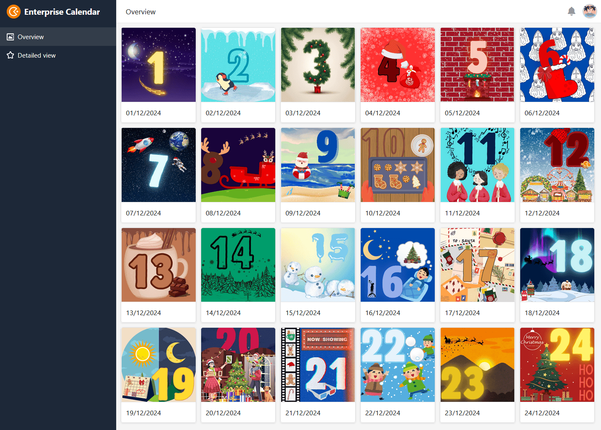
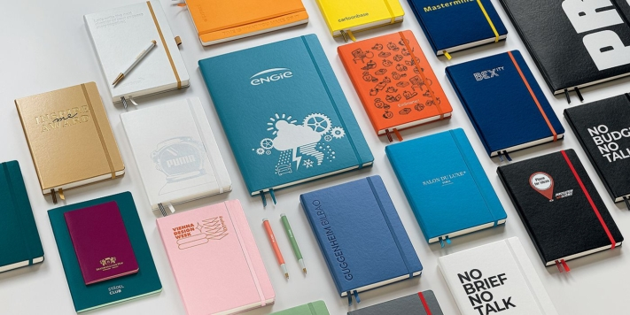

Рождество уже не за горами, и вы хотели бы преподнести своим сотрудникам, деловым партнерам или клиентам небольшой подарок в знак **признательности**. Но что может быть подходящим подарком на Рождество для сотрудников и клиентов? Для этого необходимо иметь множество идей и чутье! В этой статье вы узнаете, какие **рождественские подарки** порадуют ваших сотрудников и клиентов и на какой **бюджет** вы можете рассчитывать.

## 5 идей подарков с первого взгляда

Будь то грандиозный жест или небольшой знак признательности - каждому приятно получить подарок. Но это не всегда должен быть подарок в виде материального предмета или ваучера. Подарок выходит за рамки материального и может принимать различные формы.

Какую идею вы воплотите в жизнь в это Рождество?

## 1\. социальная ответственность

Взять на себя социальную ответственность вместе, как компания: В этом и заключается **социальная ответственность**. Особенно в Рождество необходимо помогать людям в духе **благотворительности** - будь то пожертвования в натуральной или денежной форме или ваши собственные усилия на месте. Вы как компания также можете помочь, сделав **пожертвование** сами или призвав своих клиентов поддержать доброе дело.

Многие благотворительные организации и социальные учреждения ценят ваш вклад и в качестве небольшой благодарности предоставляют вам различные средства коммуникации. Это позволит вам представить свою приверженность общественности и вдохновить других на пожертвования.

## 2-й адвент-календарь

24 двери, 24 сюрприза! Не всегда нужно делать большие подарки сотрудникам и клиентам, ведь рождественский сезон характеризуется прежде всего предвкушением. **Адвент-календарь** приносит немного радости на рабочее место каждый день, будь то в виде угощений или в цифровом виде с фотографиями, видео и сообщениями.

### Адвент-календарь с логотипом компании

Шоколад, но с бодростью? Нет проблем! Оформите адвент-календарь для своих сотрудников и клиентов с логотипом вашей компании или добавьте персональные послания.

В каком бы виде он ни был, шоколад всегда вкусен!

В [некоторых интернет-магазинах](https://www.weihnachtsplaner.de/adventskalender?p=1) вы можете легко выбрать календарь и настроить его в соответствии с вашими требованиями.

### Самодельный адвент-календарь

Если вы хотите составить адвент-календарь только для определенных людей, вы можете сделать его самостоятельно. Преимущество этого способа в том, что вы можете персонализировать календарь в соответствии с пожеланиями человека. [О том, как сделать свой собственный адвент-календарь и чем его можно наполнить, вы можете узнать из этой статьи](https://seatable.io/ru/adventskalender-selber-machen/).

### Онлайновый адвент-календарь

Отличной альтернативой классическому аналоговому адвент-календарю является его цифровая версия. Вы можете наполнить собственный онлайновый адвент-календарь своей компании фотографиями, видеороликами или рождественскими цитатами, а затем просто отправить его сотрудникам и клиентам по ссылке в качестве рождественского подарка.

Команда SeaTable создала для вас [шаблон](https://seatable.io/ru/vorlage/si5fsu0nrny8wtabksc6iq/), который вы можете изменить в соответствии с вашими потребностями. Придайте календарю индивидуальность и с нетерпением ждите удивленных лиц ваших сотрудников, которые каждый день будут обнаруживать новый сюрприз за одной из маленьких дверей.

Если вы хотите использовать SeaTable для создания онлайнового адвент-календаря, просто [зарегистрируйтесь](https://seatable.io/ru/registrierung/) бесплатно и настройте шаблон по своему усмотрению. Шаблон также содержит 24 идеи рождественских подарков для сотрудников и клиентов.

## 3\. подарок с упоминанием компании

Балансировать между рождественским настроением и работой - непростая задача. В конце концов, посетить рождественский рынок или покататься на коньках гораздо заманчивее, чем провести весь день в офисе. Теперь вам предстоит привнести **дух Рождества** в свою компанию!

Блокноты на заказ с тиснением логотипа от LEUCHTTURM1917.

- **Логотип? Именно так!** Украсьте подарки для клиентов или сотрудников своим брендом, чтобы выделиться из толпы. Для этого особенно подходят полезные ежедневные помощники с фирменным дизайном или с тисненым логотипом. Красиво оформленные блокноты или календари не только порадуют ваших клиентов, но и станут послами бренда. Вы можете легко выбрать и изготовить на заказ подходящие блокноты у [выбранных поставщиков](https://www.leuchtturm1917.de/fuer-unternehmen/corporate-gift/).
- **Приманка для глаз на столе**: подарок, который пригодится на рабочем месте? Да, с удовольствием! Будь то растение, подушка для шеи или держатель для ручки - все, что скрашивает рабочий день, является хорошим подарком.
- **Фоновая музыка**: подарок для всех! Музыка на работе улучшает настроение и побуждает людей подпевать.
- **Вызов принят**: Подарок можно получить только после выполнения всех рождественских заданий. Это позволяет поддерживать высокий уровень веселья.

## 4\. домашние вещи, сделанные от души

**Самодельный подарок** приносит огромную радость, ведь он показывает, что вы вложили в него труд, время и любовь. В крупных компаниях вряд ли возможно вручить каждому сотруднику и клиенту индивидуальный подарок. Тем не менее, вы можете показать, как вы цените своих сотрудников и клиентов, с помощью небольших, продуманных рождественских подарков.

- **Поздравительная открытка**: классическая рождественская открытка. Создайте рождественскую открытку своей компании с интересным мотивом и личным посланием. А как насчет стихотворения собственного сочинения или личного посвящения? Сделайте свою поздравительную открытку самой красивой на столах ваших клиентов и сотрудников!

Для вашей фантазии нет границ.

- **Корпоративный фильм**: снимайте с юмором! Хотя профессиональное [корпоративное видео](https://seatable.io/ru/storyboard/) дает четкое представление о том, чем вы занимаетесь как компания, оно вряд ли подойдет в качестве рождественского подарка для сотрудников или клиентов. Креативный фильм о вас и ваших сотрудниках позволяет вашим клиентам и другим сотрудникам лучше узнать вас на личном уровне.
- **Персонализированный выбор**: Еще один классический рождественский подарок для сотрудников - хорошо наполненная подарочная корзина. Чтобы придать ей более индивидуальный характер, подумайте о том, что нравится вам и вашим сотрудникам. Можно также включить ссылку на ваш головной офис, например, региональные продукты от близлежащих предприятий. Добавьте к подарочной корзине послание и напишите, почему вы выбрали именно это содержимое. Это покажет, что вы думали о подарке и его воздействии.

## 5\. совместный опыт

**Время, проведенное вместе**, - лучший подарок для многих, особенно в повседневной напряженной жизни. Организуйте совместные мероприятия вне работы в качестве рождественского подарка для своих сотрудников и создайте незабываемые воспоминания.

Совместное посещение рождественского базара или вечернее выпекание печенья помогает лучше узнать друг друга и укрепить командный дух в долгосрочной перспективе. И, конечно, рождественская вечеринка просто необходима! О том, как ее успешно спланировать, вы можете узнать [здесь](https://seatable.io/ru/weihnachtsfeier/).

Лучшую рождественскую атмосферу можно найти здесь.

Но вы можете распространить рождественское настроение и за пределы своей компании с помощью совместных кампаний. Используйте социальные сети, чтобы приглашать людей к участию в веселых рождественских конкурсах и общаться с клиентами.

## Бюджет в соответствии с налоговыми льготами

Сколько времени, денег и труда вы хотите вложить в планирование рождественских подарков для сотрудников и клиентов, в конечном итоге зависит от вас. Однако существуют **установленные правительством верхние пределы** необлагаемых налогом расходов на рождественские подарки. Они являются полезным руководством для планирования бюджета на подарки или даже на рождественскую вечеринку в компании.

### Рождественские подарки для сотрудников

Хотите порадовать своих сотрудников на Рождество, но при этом максимально сократить расходы? Тогда воспользуйтесь **льготой, не облагаемой налогом**! Каждый месяц вы можете дарить своим сотрудникам небольшие подарки на сумму не более 50 евро на человека. Однако следует помнить о некоторых моментах, касающихся типа подарка и повода:

- **Подарочные ваучеры: Подарочные** ваучеры - популярный рождественский подарок для сотрудников и клиентов. Однако на них распространяется лимит налоговых льгот только в том случае, если они отвечают трем критериям, помимо максимальной стоимости в 50 евро. Подарочные карты могут разрешать покупку товаров и услуг и использоваться только в небольшом количестве магазинов. Следует также отметить, что ваучеры должны выдаваться _в дополнение к заработной плате, которая причитается в любом случае_.
- **Личные мероприятия:** Если у одного из ваших сотрудников день рождения или знаменательный юбилей компании, пособие составит до 60 евро. Однако это не относится к Рождеству, поскольку оно **не** считается личным событием.

На рождественских вечеринках нужно учесть несколько моментов...

- **Рождественская вечеринка:** Вы планируете устроить [рождественскую вечеринку](https://seatable.io/ru/weihnachtsfeier/) для всех своих сотрудников? Тогда обратите внимание на бюджет в 150 евро на одного участника. Если эта сумма не будет превышена, ваши расходы не будут облагаться налогом. Однако рождественские подарки для сотрудников или клиентов, которые вручаются на рождественской вечеринке, включаются в вышеупомянутый бюджет. Это означает, что вы не можете добавить 50 евро на подарки к 150 евро на празднование.
- **Рождественский бонус:** Выплата рождественского бонуса, напротив, всегда облагается налогом и должна быть заявлена в платежной ведомости как _разный платеж_.

### Рождественские подарки для клиентов

Если вы хотите порадовать своих клиентов или деловых партнеров на Рождество, то здесь также существует необлагаемый налогом лимит. Вы можете потратить не более 50 евро на подарок одному деловому клиенту, чтобы воспользоваться налоговым вычетом. Подарки, не превышающие этот лимит, вы можете отнести к **расходам на ведение бизнеса**.



Обратите внимание, что для каждого подарка, стоимость которого превышает 10 евро, необходимо указать в отчетности получателя или компанию и повод.

## Планируйте Рождество онлайн

Рождественский сезон - это стресс, поэтому продуманная подготовка к нему тем более важна. С помощью SeaTable вы можете спланировать [рождественскую вечеринку](https://seatable.io/ru/weihnachtsfeier/) или создать [бесплатный цифровой адвент-календарь](https://seatable.io/ru/adventskalender-selber-machen/) в качестве рождественского подарка для своих сотрудников и клиентов и легко персонализировать его.

Вы ищете больше идей для подходящих рождественских подарков сотрудникам и клиентам? Вы найдете множество интересных идей в нашем шаблоне адвент-календаря для компаний!

Если вы хотите использовать SeaTable для планирования рождественской вечеринки или новогодних подарков сотрудникам и клиентам, просто [зарегистрируйтесь](https://seatable.io/ru/registrierung/) бесплатно и настройте шаблоны, приведенные выше, в соответствии с вашими индивидуальными требованиями.
