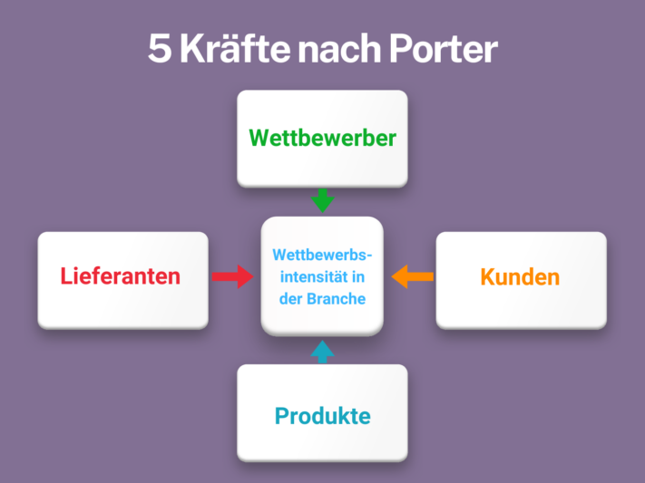
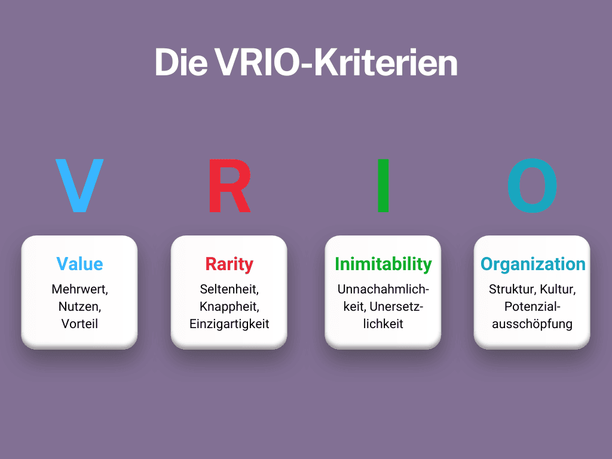
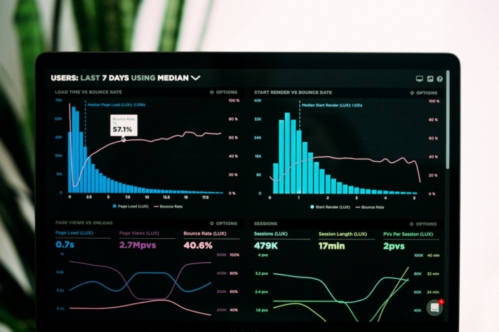

Vous prévoyez d'élargir votre ligne de produits et vous voulez savoir quelles **caractéristiques de produits** sont particulièrement demandées dans votre secteur ? Ou vous avez constaté une baisse des **ventes** et souhaitez découvrir ce que vos concurrents font de mieux ? Une analyse ciblée de la concurrence peut vous fournir des informations précieuses pour optimiser votre **stratégie** et répondre de manière ciblée aux **besoins** de vos clients.

Dans cet article, nous vous présentons un guide complet contenant toutes les informations importantes et les méthodes d'analyse de la concurrence. Afin de réaliser votre analyse de manière structurée et efficace, nous vous présenterons ensuite un outil performant qui vous aidera à organiser vos données de manière claire et précise.

L'objectif principal de l'analyse de la concurrence est d'identifier et d'exploiter les avantages concurrentiels.

## Qu'est-ce qu'une analyse de la concurrence ?

L'analyse de la concurrence est un élément essentiel de l'analyse de marché, qui sert à comparer les concurrents au sein d'un secteur. Elle permet non seulement d'examiner les **forces** et **les faiblesses** de la concurrence, mais aussi d'étudier en détail des facteurs pertinents tels que **les opportunités** et **les risques** **du marché**.

Cette analyse complète permet d'acquérir des connaissances sur les raisons du succès de certains concurrents et sur leurs approches stratégiques. En outre, l'analyse de la concurrence vous permet de **faire des prévisions** fondées sur l'évolution future du secteur et sur le **positionnement** de vos propres produits ou services sur le marché.

## Les avantages d'une analyse approfondie de la concurrence

Une analyse stratégique de la concurrence vous fournit des informations sur le degré de réussite de vos concurrents et sur l'apparition de nouveaux acteurs sur le marché. Elle vous permet d'évaluer la situation de votre entreprise par rapport aux autres acteurs du secteur et d'identifier les éventuels déficits de performance.

En outre, l'analyse permet de savoir comment vos produits ou services sont positionnés sur le marché et quel avantage unique**(Unique Selling Point**) ils offrent par rapport à la concurrence. Ces informations sont utiles pour adapter votre stratégie de marché de manière ciblée et renforcer votre position à long terme.

La compréhension des besoins des clients est centrale pour l'analyse de la concurrence.

## Le bon moment pour une analyse de la concurrence

Une analyse approfondie de la concurrence peut faire la différence entre le succès et l'échec, en vous fournissant les informations dont vous avez besoin pour prendre des décisions stratégiques judicieuses.  
Mais quel est le bon moment pour effectuer une telle analyse ? Vous trouverez ci-dessous les situations dans lesquelles une analyse de la concurrence est particulièrement utile :

- **Nouvelle entreprise :** Si vous créez une nouvelle entreprise, il est indispensable de réaliser une analyse du marché et de la concurrence et de planifier votre positionnement.
- **Expansion sur de nouveaux marchés :** Lors de l'ouverture de nouveaux marchés, une analyse de la concurrence permet d'évaluer les conditions du marché et les concurrents potentiels.
- **Relance d'un site web :** Si vous refaites votre site web, une analyse de la concurrence vous donnera un aperçu précieux de la présence en ligne et des stratégies numériques de vos concurrents.
- **Activités de médias payants :** Si les activités de publicité payante ne donnent pas les résultats escomptés, une analyse concurrentielle peut révéler les approches adoptées par vos concurrents et la manière dont vous pouvez optimiser vos propres campagnes.
- **Les tendances du secteur :** Pour rester à jour et identifier les tendances actuelles du secteur, une analyse régulière de la concurrence est indispensable.

Une analyse de la concurrence est particulièrement importante avant le relancement d'un site web ou l'entrée sur un nouveau marché.

## Bonnes pratiques pour une analyse de la concurrence

Parmi les méthodes d'analyse de la concurrence, il existe deux approches importantes qui offrent des outils précieux pour évaluer la concurrence. Vous pouvez les utiliser séparément ou les combiner pour obtenir une vision encore plus approfondie.

### Les cinq pouvoirs de Porter

[Le modèle des cinq forces de](https://de.wikipedia.org/wiki/Branchenstrukturanalyse) Michael E. Porter offre une méthode structurée pour **analyser l'intensité de la concurrence** au sein d'un secteur. Il considère cinq forces centrales : la concurrence entre les entreprises existantes, la menace de nouveaux entrants, la menace de produits de substitution, le pouvoir de négociation des fournisseurs et le pouvoir de négociation des clients.

L'analyse de la concurrence selon Porter permet aux entreprises de mieux comprendre la dynamique de leur secteur et de développer des stratégies afin d'obtenir un avantage concurrentiel. Cette méthode d'analyse de la concurrence permet d'évaluer l'**attractivité** et **la rentabilité** d'un secteur et de prendre des décisions commerciales en connaissance de cause.

Modèle de Michael E. Porter qui analyse cinq forces qui déterminent la concurrence dans un secteur.

### L'approche de Grant basée sur les ressources et l'analyse VRIO

La [vision basée sur les ressources](https://www.researchgate.net/publication/292714014_The_Resource-Based_Theory_of_Competitive_Advantage_Implications_for_Strategy_Formulation) (RBV) de Robert Grant fait également partie des méthodes d'analyse de la concurrence. Toutefois, contrairement à l'approche basée sur le marché, il souligne l'importance **des ressources** et **des compétences** **internes** comme source principale d'avantages concurrentiels durables. Cela constitue le cadre théorique de l'**analyse VRIO**.

En conséquence, cette méthode commence par l'identification des compétences clés d'une entreprise. Ensuite, il est possible de les examiner en termes de **valeur**, de **rareté**, d'**imitabilité** et d **'organisation** (critères VRIO) :

- Ce **qui est précieux**, ce sont les compétences qui permettent à votre entreprise de saisir des opportunités, de réaliser des bénéfices ou de réduire les coûts.
- **Rares** sont les compétences que seule votre entreprise possède ou que peu d'autres entreprises possèdent.
- Les compétences qui ne **peuvent pas être imitées** sont celles qui sont coûteuses ou difficiles à reproduire, par exemple les inventions brevetées.
- Une compétence est considérée comme **organisée** lorsque votre entreprise peut exploiter pleinement le potentiel de la capacité ou de la ressource.

Les ressources doivent être précieuses, rares, non imitables et organisées pour offrir un avantage concurrentiel.

Sur cette base, vous pouvez prendre des décisions stratégiques basées sur vos forces internes afin de vous différencier sur le marché et de vous assurer un avantage concurrentiel. L'accent est mis sur ce qui rend votre entreprise unique et sur la manière dont vous pouvez exploiter cette unicité. Analysez également vos concurrents afin d'identifier les compétences qui pourraient vous faire défaut.

## Tout ce qui fait partie d'une analyse de la concurrence

En fonction de l'orientation choisie, vous devez adapter les critères de l'analyse de la concurrence de manière ciblée. Une planification et une réalisation minutieuses de l'analyse vous permettront non seulement de mieux comprendre votre propre position sur le marché, mais aussi de développer des stratégies ciblées pour vous différencier avec succès et vous développer à long terme.

Néanmoins, il y a quelques aspects essentiels à prendre en compte lorsque vous réalisez une analyse concurrentielle et que vous souhaitez vous comparer à vos concurrents. Il s'agit notamment

- Facteurs d'implantation
- Taille de l'entreprise
- Chiffres d'affaires
- Compétences (points forts et points faibles)
- Proposition de valeur et image
- Offre de produits et tarification
- Activités promotionnelles et canaux de distribution

## Instructions pour la réalisation d'une analyse de la concurrence

Réaliser une analyse stratégique de la concurrence peut sembler compliqué au premier abord - et vous ne savez peut-être même pas exactement par où commencer. Ne vous inquiétez pas, nous avons élaboré pour vous une feuille de route précise qui vous permettra d'analyser votre concurrence en détail, étape par étape.

### 1\. définir des objectifs

Outre le positionnement stratégique sur le marché, la minimisation des risques, par exemple, peut également être un objectif pertinent.

Déterminez les connaissances que vous souhaitez tirer de l'analyse et la manière dont elles peuvent vous aider. Vous souhaitez en savoir plus sur **le positionnement** de vos concurrents **sur le marché**? Ou cherchez-vous **de l'inspiration** pour votre propre développement de produits et vos stratégies de marketing ? Des objectifs clairs vous aident à vous concentrer et à être efficace.

### 2\. identifier les concurrents

Veillez à identifier le concurrent également du point de vue des clients, et pas seulement du point de vue de l'entreprise.

Dressez la liste de vos principaux concurrents. Cela inclut les **concurrents directs** qui proposent des produits ou des services similaires, ainsi que **les concurrents indirects** qui proposent des solutions alternatives répondant aux besoins de votre groupe cible. Prenez également en compte les **nouveaux entrants sur le marché** qui pourraient potentiellement représenter une menace.

### 3\. collecter des données

Utilisez l'analyse des sources de données existantes, telles que les rapports de marché, les études sectorielles et les rapports d'entreprise.

Rassemblez des informations complètes sur vos concurrents. Pour ce faire, utilisez aussi bien des sources publiques telles que **les sites web**, **les rapports annuels**, les **communiqués de presse** ou **les canaux de médias sociaux** de vos concurrents que **des outils** et **des services** d'analyse de marché et de la concurrence.



### 4\. effectuer une analyse

Prenez le temps d'établir des profils détaillés de vos principaux concurrents.

Comparez et évaluez les données collectées. Pour ce faire, recourez aux **méthodes d'analyse de la concurrence** mentionnées ci-dessus ou choisissez d'autres méthodes d'analyse éprouvées comme l'[analyse SWOT](https://seatable.io/fr/swot-analyse-template/). Celle-ci vous permet d'identifier les forces et les faiblesses de vos concurrents ainsi que les opportunités et les risques sur le marché. Outre l'**analyse VRIO**, l'**analyse comparative** peut également vous aider à évaluer les performances de votre entreprise par rapport à vos concurrents.

### 5\. déduire des stratégies

Débarrassez-vous des modèles commerciaux rigides et misez sur la création continue de nouveaux avantages concurrentiels.

Utilisez les connaissances acquises pour améliorer vos propres stratégies. Cela pourrait signifier **adapter** le **développement de vos produits**, **repenser** votre **politique de prix**, développer **de nouvelles stratégies de marketing** ou **optimiser** vos **canaux de distribution**. L'objectif est de mieux vous positionner sur le marché et d'obtenir des avantages concurrentiels.

### 6\. répéter régulièrement

Sur les marchés particulièrement dynamiques, il peut même être utile de procéder à des vérifications mensuelles.

Réaliser une analyse de la concurrence n'est pas un projet ponctuel. Révisez et actualisez régulièrement votre analyse afin de rester à jour et de pouvoir réagir rapidement aux changements du marché. Cela vous aidera à rester durablement compétitif et à réussir à long terme.

## Comment utiliser efficacement les résultats de votre analyse concurrentielle

Les résultats d'une analyse stratégique de la concurrence ne vous fournissent pas seulement des informations précieuses - ils peuvent mettre votre entreprise sur la voie de dépassement. En identifiant les points faibles dans les stratégies de vos concurrents, vous pouvez **éviter des pièges** similaires et **optimiser** vos propres **processus**. Parallèlement, une analyse approfondie permet de formuler **des objectifs commerciaux clairs**. Avec un plan précis sous les yeux, vous savez exactement où vous allez et quelles sont les étapes nécessaires pour atteindre votre objectif.

L'analyse de la concurrence vous permet également de définir plus clairement les objectifs à long terme de votre entreprise.

Mais ce n'est pas tout : les enseignements tirés de l'analyse de la concurrence sont également la clé de l'amélioration et du renforcement de votre **plan stratégique**. Elles vous donnent les outils nécessaires pour adapter et affiner vos tactiques. Le résultat ? Un plan robuste, à la hauteur des défis du marché.

En outre, une analyse concurrentielle bien conçue vous aide à atteindre votre **groupe cible** plus rapidement et plus efficacement. Vous comprenez mieux ce que veulent vos clients et pouvez cibler vos offres en conséquence. Enfin, la connaissance des tendances actuelles ne vous échappe pas non plus. En gardant un œil attentif sur les **évolutions de votre secteur**, vous ne manquerez aucune opportunité et pourrez réagir avec souplesse aux changements.

## Le bon outil pour votre analyse concurrentielle

L'outil gratuit de SeaTable vous permet de réaliser efficacement votre analyse stratégique de la concurrence et de documenter clairement vos résultats. Dans ce modèle d'analyse de la concurrence, vous pouvez comparer les entreprises, les marques, les produits, les caractéristiques et d'autres informations pertinentes sous forme de tableau.

Déposez des documents PDF (par ex. rapports annuels, communiqués de presse) ainsi que des captures d'écran de publicités ou de sites web de vos concurrents afin de pouvoir comparer directement les sources intéressantes. Décrivez les points forts et les points faibles de la concurrence ou notez des informations sur les prix, les points de vente uniques et les groupes cibles. Grâce au modèle gratuit d'analyse de la concurrence que vous trouverez [ici](https://seatable.io/fr/modele/rv0aemhnqjufipzfycgc8w/), vous pourrez visualiser vos données d'analyse en un coup d'œil et élaborer des stratégies aussi facilement que possible.

Si vous êtes prêt à passer vos concurrents au crible, [inscrivez-vous](https://seatable.io/fr/enregistrement/) gratuitement sur SeaTable dès aujourd'hui. Vous pourrez ensuite démarrer directement, utiliser le modèle et le remplir avec vos propres données.
