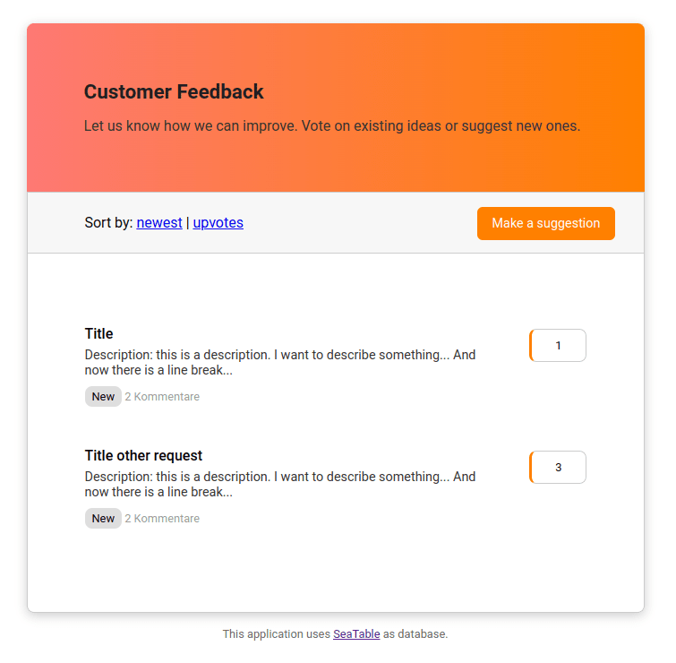

SeaTable ist eine unglaublich mächtige Low-Code-Plattform, mit der man in kürzester Zeit eigene Business Prozesse entwickeln kann. In einem meiner ersten YouTube-Anleitungen habe ich bereits gezeigt, wie man in weniger als einer Stunde ein eigenes **Customer Feeback Tool** nur mit den Funktionen und Bordmitteln von Seatable entwickeln kann. Falls Sie nicht wissen, wovon ich rede, empfehle ich Ihnen dieses [YouTube-Video](https://www.youtube.com/watch?v=HqtyeRL2qiY) zuerst anzusehen.

In diesem Artikel werden wir nun gemeinsam diese SeaTable-App weiterentwickeln und mit einem eigenen PHP-Frontend erweitern.

## Wenn man an die Grenzen von SeaTable stößt

Sie werden bestimmt schon gemerkt haben, dass die App-Entwicklung mithilfe von SeaTable schnell und einfach von der Hand geht. Doch auch für SeaTable gilt die typische 80–20 Regel. Diese besagt, dass sich 80 % der Anforderungen meist mit sehr überschaubarem Aufwand realisieren lassen, während für die letzten 20 % deutlich mehr Aufwand nötig ist. Genau dies kann man auch im YouTube-Video nachvollziehen: Die Entwicklung der App erfolgt in Lichtgeschwindigkeit und es waren keinerlei Programmierkenntnisse erforderlich. Gerade mal eine Stunde dauerte es, um eine erste lauffähige Version eines neuen Tools zu entwickeln, welche die zentralen Funktionen eines Feedback Tools bereitstellen kann. So lässt sich ein neuer Prozess einfach ausprobieren und man kann unmittelbar die ersten Erfahrungen damit sammeln. Ein weiterer Bonus von SeaTable ist, dass SeaTable sich auch um die Authentifizierung der Anwender und die statische Auswertung der Daten kümmert.

Eine solche App kann man sicherlich mit dem eigenen Team ausprobieren, den eigenen Kunden möchte man eine solche Lösung aber wahrscheinlich lieber nicht vorsetzen. Damit man die eigene App guten Gewissens veröffentlichen kann, sollte die Benutzeroberfläche einfacher und zielgerichteter sein. Der Anwender soll nur die Informationen zu Gesicht bekommen, die wirklich relevant sind. Konfigurationsoptionen aus SeaTable und Brüche wie der Absprung in ein Webformular will man lieber vermeiden. Auch möchte man vielleicht nicht jedem Anwender einen Log-in für das eigene Team in SeaTable anlegen.

Aber keine Sorge. Sie werden sehen, dass sich all diese Herausforderung mit einem eigenen Frontend für Ihre SeaTable-App lösen lassen.

## Die Entwicklungsschritte für ein eigenes Frontend im Überblick

Diese Anleitung startet mit der Base, die wir bereits im YouTube-Video angelegt haben. Darauf aufbauend werde ich Ihnen zeigen, welche Schritte notwendig sind, um ein Tool zu bauen, wie Sie es unter [https://ideas.seatable.io](https://ideas.seatable.io) finden können. Dieses Tutorial vereinfacht manche Schritte, zeigt aber das grundsätzlich Vorgehen.

- Starten werden wir mit Entwicklung einfacher Webseiten Design mithilfe von HTML und CSS.
- Als Nächstes werden wir die [SeaTable-PHP-API](https://seatable.github.io/seatable-api-php/) verwenden, um diese statischen Webseiten mit den Inhalten aus SeaTable zu füllen. Hierfür werde ich das [PHP-Framework Slim](https://www.slimframework.com/) und das [Template-System Twig](https://twig.symfony.com/) verwenden.
- Zum Abschluss werden wir noch diverses Finetuning betreiben.

Klingt doch gar nicht so kompliziert, oder? Also lassen Sie uns loslegen.

## Schritt 1: Webseiten Design mit HTML und CSS erstellen

Bestimmt haben Sie schon ein Bild im Kopf, wie Ihre Anwendung später aussehen soll. Versuchen Sie genau dieses Bild in eine HTML-Webseite umzusetzen und füllen Sie dabei die HTML-Seite mit ein paar Beispieldaten. Für unser Feedback-Tool benötigt man auf jeden Fall drei Seiten:

- Auf der **Übersichtsseite** werden alle bisherigen Ideen und Feedbacks angezeigt. Idealerweise lassen sich die Einträge sortieren oder filtern.
- Die **Detailseite** zeigt hingegen alle Informationen und Kommentare zu einer konkreten Idee.
- Zusätzlich benötigen wir noch ein **Formular** damit die Nutzer neue Ideen einreichen können.

Da dies kein Design-Tutorial sein soll, beschränke ich mich auf vergleichsweise einfache HTML Strukturen, die Sie gerne weiterverwenden können.

**Beispiel für die index.html**

```
<!DOCTYPE html>
<html>
<head>
    <meta charset="utf-8">
    <meta name="viewport" content="width=device-width, initial-scale=1">
    <title>Feedback Tool</title>
    <link href="https://fonts.googleapis.com/css?family=Roboto:300,400,500,700&display=swap" rel="stylesheet" type="text/css" />
    <link rel="stylesheet" href="style.css">

    <style>
        body { font-size: 16px; font-family: Roboto; }
        #frame { padding: 8rem 0px; min-height: 100vh; }
        #container { margin: 0px auto; width: 100%; max-width: 690px; }
        .box { position: relative; background: #fff; border-radius: 8px; box-shadow: 0 3px 12px 0 #ccc; }
        .header { padding: 3rem 4rem; background: linear-gradient(to right,#fd7974, #ff8000); border-top-left-radius: 8px; border-top-right-radius: 8px; }
        .header h1 { font-size: 1.4rem; color: #1f1f1f; }
        .header p { font-size: 1rem; color: #333; }
        .navigation { display: flex; justify-content: space-between;background-color: #f7f7f7; border: 1px solid #ccc; padding: 1.5rem 2rem 1.5rem 4rem; }
        .suggestion-button a { border-radius: 6px; background-color: #ff8000; color: #fff; padding: 10px 16px; text-decoration: none; font-size: 0.9rem; }
        .featured { text-align: center; padding-top: 0.2rem; }
        .featured p { color: #666; font-size: 0.8rem; }
        .request-list { border: 1px solid #ccc; min-height: 200px; bottom-margin: 30px; border-top: none; border-bottom-left-radius: 8px; border-bottom-right-radius: 8px; padding: 4rem; }
        .request-box { display: flex; margin-bottom: 16px; }
        .left { flex: 1 1 0%; padding: 1rem 2rem 1rem 0; }
        .left a { text-decoration: none; font-size:0.8em; }
        .right { margin-top: 20px; display: flex; flex-direction: column; }
        .button { border: 1px solid #ccc; border-radius: 8px; padding: 10px 26px; font-size: 0.8rem; border-left: 3px solid #ff8000; }
        .request-box h2 { display: block; color: #000; font-weight: 500; font-size: 1rem; margin: 0; }
        .request-box p { display: block; color: #333; font-size: 0.9rem; margin: 6px 0px 10px 0px; }
        .status { font-size: 0.8rem; color: #000; background-color: #dedede; padding: 4px 8px; border-radius: 8px; }
        .comments, .meta { font-size:0.8rem; color: #999; }
    </style>

</head>

<body>
    <div id="frame">
        <div id="container">
            <div class="box">
                <div class="header">
                    <h1>Customer Feedback</h1>
                    <p>Let us know how we can improve. Vote on existing ideas or suggest new ones.</p>
                </div>
                <div class="navigation">
                    <div>
                        Sort by:
                        <a href="/sort/newest">newest</a> |
                        <a href="/sort/upvotes">upvotes</a>
                    </div>
                    <div class="suggestion-button">
                        <a href="#">Make a suggestion</a>
                    </div>
                </div>
                <div class="request-list">

                     <!-- first feedback -->
                    <div class="request-box">
                        <div class="left">
                            <a href="/r/abc">
                                <h2>Title</h2>
                                <p>Description: this is a description. I want to describe something... And now there is a line break...</p>
                                <span class="status">New</span>
                                <span class="comments"> 2 Kommentare</span>
                            </a>
                        </div>
                        <div class="right">
                            <span class="button">1</span>
                        </div>
                    </div>

                    <!-- second feedback -->
                    <div class="request-box">
                        <div class="left">
                            <a href="/r/zzz">
                                <h2>Title other request</h2>
                                <p>Description: this is a description. I want to describe something... And now there is a line break...</p>
                                <span class="status">New</span>
                                <span class="comments"> 2 Kommentare</span>
                            </a>
                        </div>
                        <div class="right">
                            <span class="button">3</span>
                        </div>
                    </div>

                </div>
            </div>
            <div class="featured">
                <p>This application uses <a href="https://seatable.io/">SeaTable</a> as database.</p>
            </div>
        </div>
    </div>
</body>
</html>

```

**Beispiel für die details.html**

```
<!DOCTYPE html>
<html>
<head>
    <meta charset="utf-8">
    <meta name="viewport" content="width=device-width, initial-scale=1">
    <title>Feedback Tool</title>
    <link href="https://fonts.googleapis.com/css?family=Roboto:300,400,500,700&display=swap" rel="stylesheet" type="text/css" />
    <link rel="stylesheet" href="style.css">

    <style>
        body { font-size: 16px; font-family: Roboto; }
        #frame { padding: 8rem 0px; min-height: 100vh; }
        #container { margin: 0px auto; width: 100%; max-width: 690px; }
        .box { position: relative; background: #fff; border-radius: 8px; box-shadow: 0 3px 12px 0 #ccc; }
        .header { padding: 3rem 4rem; background: linear-gradient(to right,#fd7974, #ff8000); border-top-left-radius: 8px; border-top-right-radius: 8px; }
        .header h1 { font-size: 1.4rem; color: #1f1f1f; }
        .header p { font-size: 1rem; color: #333; }
        .navigation { display: flex; justify-content: space-between;background-color: #f7f7f7; border: 1px solid #ccc; padding: 1.5rem 2rem 1.5rem 4rem; }
        .suggestion-button a { border-radius: 6px; background-color: #ff8000; color: #fff; padding: 10px 16px; text-decoration: none; font-size: 0.9rem; }
        .featured { text-align: center; padding-top: 0.2rem; }
        .featured p { color: #666; font-size: 0.8rem; }
        .request-list { border: 1px solid #ccc; min-height: 200px; bottom-margin: 30px; border-top: none; border-bottom-left-radius: 8px; border-bottom-right-radius: 8px; padding: 4rem; }
        .request-box { display: flex; margin-bottom: 16px; }
        .left { flex: 1 1 0%; padding: 1rem 2rem 1rem 0; }
        .left a { text-decoration: none; font-size:0.8em; }
        .right { margin-top: 20px; display: flex; flex-direction: column; }
        .button { border: 1px solid #ccc; border-radius: 8px; padding: 10px 26px; font-size: 0.8rem; border-left: 3px solid #ff8000; }
        .request-box h2 { display: block; color: #000; font-weight: 500; font-size: 1rem; margin: 0; }
        .request-box p { display: block; color: #333; font-size: 0.9rem; margin: 6px 0px 10px 0px; }
        .status { font-size: 0.8rem; color: #000; background-color: #dedede; padding: 4px 8px; border-radius: 8px; }
        .comments, .meta { font-size:0.8rem; color: #999; }
    </style>

</head>

<body>
    <div id="frame">
        <div id="container">
            <div class="box">
                <div class="header">
                    <h1>Title of the idea</h1>
                    <p>Description</p>
                    <span class="status">New</span>
                </div>
                <div class="navigation">
                    <div><a href="/">< Back</a></div>
                    <div class="suggestion-button">
                        <a href="#">Upvote</a>
                    </div>
                </div>
                <div class="request-list">

                    <!-- first comment -->
                    <div class="request-box">
                        <div class="left">
                            <p>Description: this is a description. I want to describe something... And now there is a line break...</p>
                            <span class="meta">Martin - September 18th, 2022</span>
                        </div>
                    </div>

                    <!-- second comment -->
                    <div class="request-box">
                        <div class="left">
                            <p>Description: this is a description. I want to describe something... And now there is a line break...</p>
                            <span class="meta">Steve - September 18th, 2022</span>
                        </div>
                    </div>

                </div>
            </div>
            <div class="featured">
                <p>This application uses <a href="https://seatable.io/">SeaTable</a> as database.</p>
            </div>
        </div>
    </div>
</body>
</html>

```

**Beispiel für eine create.html**

```
<!DOCTYPE html>
<html>
<head>
    <meta charset="utf-8">
    <meta name="viewport" content="width=device-width, initial-scale=1">
    <title>Feedback Tool</title>
    <link href="https://fonts.googleapis.com/css?family=Roboto:300,400,500,700&display=swap" rel="stylesheet" type="text/css" />
    <link rel="stylesheet" href="style.css">

    <style>
        body { font-size: 16px; font-family: Roboto; }
        #frame { padding: 8rem 0px; min-height: 100vh; }
        #container { margin: 0px auto; width: 100%; max-width: 690px; }
        .box { position: relative; background: #fff; border-radius: 8px; box-shadow: 0 3px 12px 0 #ccc; }
        .header { padding: 3rem 4rem; background: linear-gradient(to right,#fd7974, #ff8000); border-top-left-radius: 8px; border-top-right-radius: 8px; }
        .header h1 { font-size: 1.4rem; color: #1f1f1f; }
        .header p { font-size: 1rem; color: #333; }
        .navigation { display: flex; justify-content: space-between;background-color: #f7f7f7; border: 1px solid #ccc; padding: 1.5rem 2rem 1.5rem 4rem; }
        .suggestion-button a { border-radius: 6px; background-color: #ff8000; color: #fff; padding: 10px 16px; text-decoration: none; font-size: 0.9rem; }
        .featured { text-align: center; padding-top: 0.2rem; }
        .featured p { color: #666; font-size: 0.8rem; }
        .request-list { border: 1px solid #ccc; min-height: 200px; bottom-margin: 30px; border-top: none; border-bottom-left-radius: 8px; border-bottom-right-radius: 8px; padding: 4rem; }
        .request-box { display: flex; margin-bottom: 16px; }
        .left { flex: 1 1 0%; padding: 1rem 2rem 1rem 0; }
        .left a { text-decoration: none; font-size:0.8em; }
        .right { margin-top: 20px; display: flex; flex-direction: column; }
        .button { border: 1px solid #ccc; border-radius: 8px; padding: 10px 26px; font-size: 0.8rem; border-left: 3px solid #ff8000; }
        .request-box h2 { display: block; color: #000; font-weight: 500; font-size: 1rem; margin: 0; }
        .request-box p { display: block; color: #333; font-size: 0.9rem; margin: 6px 0px 10px 0px; }
        .status { font-size: 0.8rem; color: #000; background-color: #dedede; padding: 4px 8px; border-radius: 8px; }
        .comments, .meta { font-size:0.8rem; color: #999; }
    </style>

</head>

<body>
    <div id="frame">
        <div id="container">
            <div class="box">
                <div class="header">
                    <h1>Make a suggestion</h1>
                </div>
                <div class="navigation">
                    <div><a href="/">< Back</a></div>
                    <div class="suggestion-button"><!--<a href="#">Upvote</a>--></div>
                </div>
                <div class="request-list">

                    <form method="post" action="/">
                        <label>Title<br/><input type="text" name="title"></label><br/>
                        <label>Description<br/><textarea name="description" cols="40" rows="9"></textarea><br/>
                        <input type="submit">
                    </form>

                </div>
            </div>
            <div class="featured">
                <p>This application uses <a href="https://seatable.io/">SeaTable</a> as database.</p>
            </div>
        </div>
    </div>
</body>
</html>

```

Legen Sie sich ein neues Verzeichnis für Ihr Projekt an und kopieren Sie sich diese HTML-Dateien.  
Wenn Sie die HTML-Dateien mit Ihrem Browser öffnen, sollte z.B. die Startseite so aussehen.



## Schritt 2: Anbindung von SeaTable per SeaTable-PHP-API

Als Nächstes wollen wir die statischen Informationen in den beiden HTML-Seiten mit Daten aus SeaTable dynamisch befüllen. Ich gehe in dieser Anleitung davon aus, dass eine aktuelle PHP Version und den PHP-Paketmanager composer bereits installiert haben. Die folgenden Befehle können Sie so auf einem Linux-Shell ausführen.

Legen wir also zuerst unsere Ordnerstruktur an und installieren wir die notwendigen Pakete:

```
$ mkdir {public,templates}
$ mv *.html public
$ touch public/index.php
$ composer require slim/slim slim/psr7 slim/twig-view seatable/seatable-api-php

```

Ihre Ordnerstruktur sollte anschließend so aussehen, wobei Sie später nur das Verzeichnis _Public_ in Ihrem Webserver freigeben werden.

```
/public
/public/index.php
/templates
/templates/index.html
/templates/details.html
/templates/create.html

```

Legen wir nun die erste Version unserer _index.php_ an. Wie bereits gesagt verwende ich das PHP Framework Slim und die Template-Engine Twig.

```
<?php
declare(strict_types=1);
use Psr\Http\Message\ResponseInterface as Response;
use Psr\Http\Message\ServerRequestInterface as Request;
use Psr\Http\Server\RequestHandlerInterface as RequestHandler;
use Slim\Factory\AppFactory;
use Slim\Views\Twig;
use Slim\Views\TwigMiddleware;

require __DIR__ . '/../vendor/autoload.php';

// Create App
$app = AppFactory::create();

// Create Twig
$twig = Twig::create('../templates', ['cache' => false]);
$app->add(TwigMiddleware::create($app, $twig));

// Routing and error middlewares
$app->addRoutingMiddleware();
$app->addErrorMiddleware(true, true, true);

// details page
$app->get('/r/{rID}', function (Request $request, Response $response, $args) {
    $view = Twig::fromRequest($request);
    return $view->render($response, 'details.html', []);
});

// home page
$app->get("/", function (Request $request, Response $response) {
    $view = Twig::fromRequest($request);
    return $view->render($response, 'index.html', []);
});

// Run app
$app->run();

```

Nun wechseln Sie in Ihr Projektverzeichnis und starten die PHP-Umgebung mit dem folgenden Befehl. Ab sofort können Sie in Ihrem Browser über _http://127.0.0.1:9999_ Ihre neue App erreichen. Aktuell passiert nichts anderes, als dass Slim sich die entsprechenden HTML-Templates holt und diese anzeigt. Ihre App sollte also so aussehen wie bisher.

```
php -S 127.0.0.1:9999 -t public

```

Nun ergänzen wir die _index.php_ um auf die Daten in SeaTable zugreifen zu können. Ergänzen Sie die folgende Abschnitte:

```
<?php
declare(strict_types=1);
use Psr\Http\Message\ResponseInterface as Response;
use Psr\Http\Message\ServerRequestInterface as Request;
use Psr\Http\Server\RequestHandlerInterface as RequestHandler;
use Slim\Factory\AppFactory;
use Slim\Views\Twig;
use Slim\Views\TwigMiddleware;

require __DIR__ . '/../vendor/autoload.php';

// SeaTable PHP-API
class Dtable
{
    private $url = 'https://cloud.seatable.io';
    private $base_api_token = 'your-base-api-token';

    public function connect()
    {
        return new SeaTable\SeaTableApi\SeaTableApi([
            'url'               => $this->url,
            'base_api_token'    => $this->base_api_token,
        ]);
    }
}

// Create App
$app = AppFactory::create();

// Create Twig
$twig = Twig::create('../templates', ['cache' => false]);
$app->add(TwigMiddleware::create($app, $twig));

// Routing and error middlewares
$app->addRoutingMiddleware();
$app->addErrorMiddleware(true, true, true);

// details page
$app->get('/r/{Title}', function (Request $request, Response $response, $args) {
    $view = Twig::fromRequest($request);
    return $view->render($response, 'details.html', []);
});

// home page
$app->get("/", function (Request $request, Response $response) {

    // connect to seatable and get all entries from table Requests
    // pass the variables to the twig template
    $seatable = new DTable();
    $conn = $seatable->connect();
    $sql = "select * from Requests ORDER BY `Creation` DESC";
    $items = $conn->querySql($sql, true);

    $view = Twig::fromRequest($request);
    return $view->render($response, 'index.html', ['items' => $items->results]);
});

// Run app
$app->run();

```

Nun können wir in der _index.html_ auf sämtliche Einträge aus SeaTable zugreifen und diese anzeigen. Ergänzen Sie somit auch die index.html

```
<!DOCTYPE html>
<html>
<head>
    <meta charset="utf-8">
    <meta name="viewport" content="width=device-width, initial-scale=1">
    <title>Feedback Tool</title>
    <link href="https://fonts.googleapis.com/css?family=Roboto:300,400,500,700&display=swap" rel="stylesheet" type="text/css" />
    <link rel="stylesheet" href="style.css">

    <style>
        body { font-size: 16px; font-family: Roboto; }
        #frame { padding: 8rem 0px; min-height: 100vh; }
        #container { margin: 0px auto; width: 100%; max-width: 690px; }
        .box { position: relative; background: #fff; border-radius: 8px; box-shadow: 0 3px 12px 0 #ccc; }
        .header { padding: 3rem 4rem; background: linear-gradient(to right,#fd7974, #ff8000); border-top-left-radius: 8px; border-top-right-radius: 8px; }
        .header h1 { font-size: 1.4rem; color: #1f1f1f; }
        .header p { font-size: 1rem; color: #333; }
        .navigation { display: flex; justify-content: space-between;background-color: #f7f7f7; border: 1px solid #ccc; padding: 1.5rem 2rem 1.5rem 4rem; }
        .suggestion-button a { border-radius: 6px; background-color: #ff8000; color: #fff; padding: 10px 16px; text-decoration: none; font-size: 0.9rem; }
        .featured { text-align: center; padding-top: 0.2rem; }
        .featured p { color: #666; font-size: 0.8rem; }
        .request-list { border: 1px solid #ccc; min-height: 200px; bottom-margin: 30px; border-top: none; border-bottom-left-radius: 8px; border-bottom-right-radius: 8px; padding: 4rem; }
        .request-box { display: flex; margin-bottom: 16px; }
        .left { flex: 1 1 0%; padding: 1rem 2rem 1rem 0; }
        .left a { text-decoration: none; font-size:0.8em; }
        .right { margin-top: 20px; display: flex; flex-direction: column; }
        .button { border: 1px solid #ccc; border-radius: 8px; padding: 10px 26px; font-size: 0.8rem; border-left: 3px solid #ff8000; }
        .request-box h2 { display: block; color: #000; font-weight: 500; font-size: 1rem; margin: 0; }
        .request-box p { display: block; color: #333; font-size: 0.9rem; margin: 6px 0px 10px 0px; }
        .status { font-size: 0.8rem; color: #000; background-color: #dedede; padding: 4px 8px; border-radius: 8px; }
        .comments, .meta { font-size:0.8rem; color: #999; }
    </style>

</head>

<body>
    <div id="frame">
        <div id="container">
            <div class="box">
                <div class="header">
                    <h1>Customer Feedback</h1>
                    <p>Let us know how we can improve. Vote on existing ideas or suggest new ones.</p>
                </div>
                <div class="navigation">
                    <div>
                        Sort by:
                        <a href="/sort/newest">newest</a> |
                        <a href="/sort/upvotes">upvotes</a>
                    </div>
                    <div class="suggestion-button">
                        <a href="/create">Make a suggestion</a>
                    </div>
                </div>
                <div class="request-list">

                    

                    <div class="request-box">
                        <div class="left">
                            <a href="/r/{{ item.Title }}">
                                <h2>{{ item.Title }}</h2>
                                <p>{{ item.Description }}.</p>
                                <span class="status">New</span>
                                <span class="comments"> {{ attribute(item, '# Comments') ?? 0 }} Kommentare</span>
                            </a>
                        </div>
                        <div class="right">
                            <span class="button">{{ attribute(item, '# Votes') ?? 0 }}</span>
                        </div>
                    </div>

                    

                </div>
            </div>
            <div class="featured">
                <p>This application uses <a href="https://seatable.io/">SeaTable</a> as database.</p>
            </div>
        </div>
    </div>
</body>
</html>

```

Laden Sie die Startseite Ihrer App neu und bewundern Sie die vielen neuen Einträge. Vorausgesetzt natürlich, in Ihrer SeaTable befinden sich bereits ein paar Einträge. Aber was haben wir genau gemacht. Zuerst einmal haben wir in der _index.php_ Die Verbindung zur SeaTable-Base hergestellt. Mit Hilfe des SQL-Befehls holen wir alle Einträge aus der gewünschten Tabelle. Sämtliche Einträge werden per Array an das Twig-Template übergeben. In der _index.html_ machen wir eine For-Schleife und lassen uns alle Einträge anzeigen. Die Syntax von Twig ist denkbar einfach und so lassen sich einzele Werte z.B mit einem _{{ item.Title }}_ ausgeben. _items_ ist der Name des Arrays, den wir übergeben haben und _Title_ ist der Spaltenname aus unserer SeaTable Tabelle.

Etwas komplizierter ist der Befehl _{{ attribute(item, ‘# Comments’) ?? 0 }}_. Twig kommt mit Leerzeichen nicht besonders gut klar, deshalb muss man auf die Werte der Spalte _\# Comments_ auf diese Art zugreifen. Das _?? 0_ sorgt dafür, dass wenn kein Wert zurückgeliefert wird, einfach die 0 zurückgegeben wird.

Wenn Sie bis hierhergekommen sind, haben Sie bereits das Schwierigste geschafft und das notwendige Wissen, um ganz einfach weitere Funktionen hinzufügen. Nehmen Sie die folgenden Änderungen vor und staunen Sie über das Ergebnis:

- Angezeigte Einträge lassen sich auf zwei Arten sortieren.
- Neue Ideen können nun per Formular eingereicht werden.
- Auch die Detailseite nutzt SeaTable als Datenbank.

```
<?php

declare(strict_types=1);

session_start();

use Psr\Http\Message\ResponseInterface as Response;
use Psr\Http\Message\ServerRequestInterface as Request;
use Psr\Http\Server\RequestHandlerInterface as RequestHandler;
use Slim\Factory\AppFactory;
use Slim\Views\Twig;
use Slim\Views\TwigMiddleware;

require __DIR__ . '/../vendor/autoload.php';

// SeaTable PHP-API
class Dtable
{
    private $url = 'https://cloud.seatable.io';
    private $base_api_token = 'your-base-api-token';

    public function connect()
    {
        return new SeaTable\SeaTableApi\SeaTableApi([
            'url'               => $this->url,
            'base_api_token'    => $this->base_api_token,
        ]);
    }
}

// Create App
$app = AppFactory::create();

// Create Twig
$twig = Twig::create('../templates', ['cache' => false]);
$app->add(TwigMiddleware::create($app, $twig));

// Routing and error middlewares
$app->addRoutingMiddleware();
$app->addErrorMiddleware(true, true, true);

// sort by ...
$app->get('/sort/{sortby}', function (Request $request, Response $response, $args) {
    $_SESSION['sortby'] = $args['sortby'];
    $response = $response->withStatus(302);
    return $response->withHeader('Location', '/');
});

// Show details page
$app->get('/r/{Title}', function (Request $request, Response $response, $args) {

    // connect to seatable
    $seatable = new DTable();
    $conn = $seatable->connect();

    // get items via sql
    $sql = "select * from Requests WHERE Title = '". $args['Title'] ."' LIMIT 1";
    $items = $conn->querySql($sql, true);

    // get comments
    $sql = "select * from Comments WHERE `Feature Request` = '". $items->results[0]->Title ."' ORDER BY `Creation` DESC";
    $comments = $conn->querySql($sql, true);
    
    $view = Twig::fromRequest($request);
    return $view->render($response, 'details.html', ['items' => $items->results, 'comments' => $comments->results]);
});

// Add new feature request.
$app->post('/', function (Request $request, Response $response, $args) {
    $data = $request->getParsedBody();
    $seatable = new DTable();
    $conn = $seatable->connect();

    try {
        // add new request
        $new_row = [ "Title" => $data['title'], 'Description' => $data['details'], 'Status' => "New"];
        $conn->appendRow("Requests", $new_row);

        // redirect
        $_SESSION['sortby'] = "new";
        $response = $response->withStatus(302);
        return $response->withHeader('Location', '/');
    } catch (Exception $e){
        return $response->withStatus(500);
    }
});

// create page
$app->get('/create', function (Request $request, Response $response, $args) {
    $view = Twig::fromRequest($request);
    return $view->render($response, 'create.html', []);
});

// startpage
$app->get("/", function (Request $request, Response $response) {

    // connect to seatable
    $seatable = new DTable();
    $conn = $seatable->connect();

    // neu mit sortierung
    $sql = "select * from Requests ORDER BY `Creation` DESC"; // default: newest
    if($_SESSION['sortby'] == "upvotes"){
        $sql = "select * from Requests ORDER BY `# Votes` DESC";
    }

    // get items via sql (ohne sortierung)
    //$sql = "select * from Requests";
    $items = $conn->querySql($sql, true);

    $view = Twig::fromRequest($request);
    return $view->render($response, 'index.html', ['items' => $items->results]);
});

// Run app
$app->run();

```

```
...
<body>
    <div id="frame">
        <div id="container">
            <div class="box">
                <div class="header">

                    

                    <h1>{{ item.Title }}</h1>
                    <p>{{ item.Description }}</p>
                    <span class="status">New</span>

                    

                </div>
                <div class="navigation">
                    <div><a href="/">< Back</a></div>
                    <div class="suggestion-button"><!--<a href="#">Upvote</a>--></div>
                </div>
                <div class="request-list">

                    

                    <div class="request-box">
                        <div class="left">
                            <p>{{ comment.Description }}</p>
                            <span class="meta">{{ comment.username|first }} - {{ comment.Creation|date("F jS, Y") }}</span>
                        </div>
                    </div>

                    

                </div>
            </div>
            <div class="featured">
                <p>This application uses <a href="https://seatable.io/">SeaTable</a> as database.</p>
            </div>
        </div>
    </div>
</body>
</html>

```

Herzlichen Glückwunsch. Sie haben ein eigenes Frontend für Ihre SeaTable-App mithilfe der SeaTable-PHP-API entwickelt.

## Finetuning und Ausblick

Sie werden merken, dass die Entwicklung an dieser Stelle noch nicht abgeschlossen ist. Viel eher werden Sie wahrscheinlich jetzt erst noch mehr Lust bekommen, um Ihre App weiter zu verbessern. Genügend Ideen werden Sie bestimmt haben.

Lassen Sie mich Ihnen aber noch ein paar Tipps mit auf den Weg geben. Sie werden Ihnen bestimmt helfen.

- Reduzieren Sie die Anzahl der API-Calls so weit wie möglich. Nutzen Sie die Lookup-Funktion in SeaTable, um benötigte Informationen mit nur einem API-Call abrufen zu können.
- Nutzen Sie möglichst Funktionen in Twig, um Ihre Ausgabe zu steuern. Mit _{{ item.merge\_description.0|trim|nl2br }}_ entfernen Sie z.B. Leerzeichen am Ende einer Beschreibung und sorgen für einen schönnen Zeilenumbrauch.
- Speichern oder cachen Sie Bilder oder Grafiken auf dem Server und speichern Sie in SeaTable nur den Link zu diesen Dateien.
- Nutzen Sie die Funktionen von SeaTable effizient. Mit einer Automationen können Sie z. B. in SeaTable auf doppelte Einträge prüfen und müssen das nicht selbst programmieren. Statistische Auswertungen und Benachrichtigungen sind ein fester Bestandteil von SeaTable. Sparen Sie sich die Programmierarbeit.

Ich hoffe, Ihnen hat diese Anleitung gefallen und ich konnte Ihnen vermitteln, wie einfach es ist SeaTable als Datenbank für seine eigenen Apps und Business-Prozesse zu verwenden.
