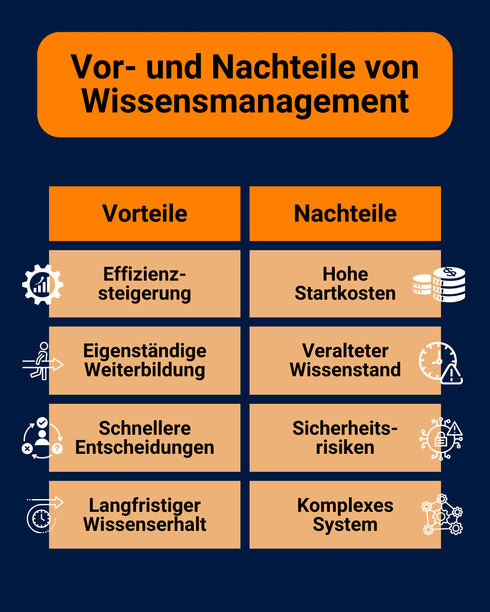
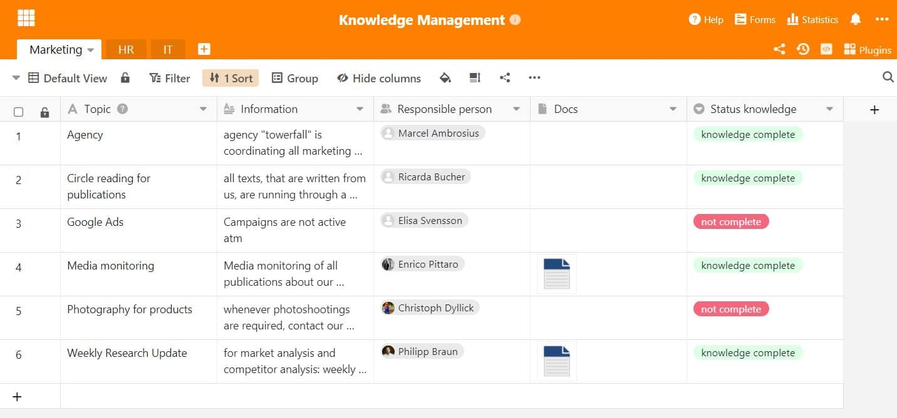

La connaissance est l'une des ressources les plus importantes de toute entreprise. Ce n'est pas pour rien que le savoir est déjà cité comme [facteur de production](https://de.wikipedia.org/wiki/Produktionsfaktor) au même titre que la terre, le capital et le travail lorsqu'il s'agit de la réussite d'une entreprise. Mais que faut-il pour que les connaissances de vos collaborateurs soient utiles à d'autres dans votre entreprise ? La réponse : une **gestion des connaissances** qui fonctionne !

Vous apprendrez ici comment gérer avec succès les connaissances accumulées dans votre entreprise, quels sont les défis ou les opportunités qui en découlent et ce à quoi vous devez veiller lors du choix d'un **système de gestion des connaissances** approprié.

## Qu'est-ce que la gestion des connaissances ?

Optimiser l'utilisation des connaissances au sein de l'entreprise, tel est l'objectif de la gestion des connaissances (également appelée _Knowledge Management_ ). L'objectif général est de créer une **base de connaissances** qui rendra les processus de l'entreprise plus efficaces et plus innovants.

Vous y parviendrez en collectant les connaissances cachées dans votre entreprise, en les préparant, en les rendant accessibles à tous et, en fin de compte, en les appliquant efficacement.



## Tous les savoirs ne se valent pas

Si vous souhaitez utiliser les connaissances accumulées dans votre entreprise, il convient tout d'abord de distinguer la nature de ces connaissances.

### Connaissances explicites

Le terme **explicite** désigne toutes les connaissances que vous ou vos collaborateurs pouvez mettre par écrit de manière facilement compréhensible. Il s'agit par exemple des instructions pour les appareils ou des directives d'entreprise écrites.

### Connaissances implicites

En revanche, **les connaissances implicites** sont tout le savoir-faire de vos professionnels qu'ils ont du mal à exprimer et à transmettre par écrit à d'autres. Par exemple, vous pouvez probablement distinguer intuitivement un bon travail d'un mauvais, sans nécessairement en définir les critères exacts. Ce savoir est stocké implicitement dans votre tête et, pour que vous puissiez le rendre accessible à tous vos collaborateurs, il doit être transformé en savoir explicite.

Il est donc essentiel pour la gestion des connaissances dans votre entreprise de consigner les solutions individuelles développées par vos collaborateurs dans un système de gestion des connaissances.

Une ambiance de travail agréable vous aide à rassembler et à partager les connaissances.

Pour que votre gestion des connaissances soit la plus efficace possible, les connaissances explicites et implicites doivent aller de pair. Créez donc dans votre entreprise une **culture** dans laquelle les collaborateurs sont motivés à partager leurs trésors de connaissances cachés et à transmettre activement leur savoir.

## Deux stratégies dans la gestion des connaissances

Comment rendre les connaissances d'un collaborateur accessibles à tous les autres ? Pour que l'ensemble de l'organisation puisse profiter des connaissances implicites de certains collaborateurs, il existe deux **stratégies** pour faire circuler les connaissances.

### Stratégie people-to-document

Dans cette variante, vous regroupez les connaissances de personnes individuelles dans un **lieu de stockage central** accessible à tous. Vous devez veiller à ce que les connaissances soient présentées de manière compréhensible, afin que les informations soient rapidement comprises et immédiatement utilisables.

### Stratégie people-to-people

Cette variante est utilisée lorsque les connaissances sont trop complexes pour être formulées de manière compréhensible pour tous. Il faut alors **des experts** qui transmettent personnellement leur savoir à certains collègues et qui sont également disponibles en cas de questions.

Si vous avez des experts dans votre entreprise, ils doivent pouvoir être contactés rapidement et facilement en cas de problème.

Vous pouvez également combiner les deux stratégies, par exemple en partageant vos connaissances lors d'un atelier et en documentant les principaux résultats et en les mettant à disposition dans une base de connaissances.

## Ce que la gestion des connaissances doit apporter

Pour pouvoir utiliser efficacement les connaissances accumulées par votre entreprise, vous devez être conscient des **huit éléments qui** composent la gestion des connaissances.

Systématique selon Probst, Raub et Romhardt

Il en résulte une sorte de guide dont vous pouvez vous inspirer pour élaborer un système de gestion des connaissances efficace.

- **Identification des connaissances :** repérer les sources de connaissances dans l'entreprise et analyser leur pertinence.
- **Développement des connaissances :** générer des connaissances en interne et les mettre à disposition de manière explicite dans des systèmes numériques.
- **Acquisition de connaissances :** acheter des connaissances à des experts externes pour combler les lacunes de connaissances.
- **Partage des connaissances :** accès ouvert et partage actif des connaissances existantes.

Un grand nombre de méthodes connues entrent en ligne de compte pour la diffusion des connaissances, par exemple [les ateliers](https://seatable.io/fr/workshop-planen/), les leçons apprises, les [réunions d'équipe](https://seatable.io/fr/in-4-schritten-zu-effizienteren-teammeetings/), le mentoring, [l](https://seatable.io/fr/onboarding/) '[onboarding](https://seatable.io/fr/onboarding/) ou les newsletters internes.

Pour une bonne gestion des connaissances, il est important d'avoir un échange actif.

Les autres éléments constitutifs sont

- **Utilisation des connaissances :** utiliser les connaissances existantes pour améliorer les résultats du travail et de l'entreprise.
- **Conservation des connaissances :** sauvegarder les connaissances accumulées dans un lieu de stockage central et les actualiser en permanence.
- **Objectifs en matière de connaissances :** Définition des objectifs à atteindre par la gestion des connaissances.
- **Évaluation des connaissances :** évaluation de la mesure dans laquelle les connaissances ont été acquises et les objectifs atteints.

## Dans quels domaines pouvez-vous utiliser la gestion des connaissances ?

La gestion des connaissances peut apporter beaucoup et peut donc être utilisée avec profit pour différents processus d'entreprise. Les domaines d'application peuvent être répartis en gros entre l **'** utilisation **interne** et l'utilisation **externe**.

### Utilisation externe

Dans le domaine du **support client**, par exemple, un système de gestion des connaissances sophistiqué peut vous décharger de nombreuses tâches. Pour des questions telles que "Comment modifier mes données d'adresse ?" ou "Où puis-je désactiver les notifications ?", les clients ont rarement besoin d'un interlocuteur personnel par téléphone ou par e-mail. Au lieu de cela, un **portail en libre-service** est mis en place, dans lequel les questions les plus fréquentes des clients peuvent être consultées avec une solution immédiatement mise à disposition.

Épargnez beaucoup de travail à vos collaborateurs en proposant à vos clients de les aider à s'aider eux-mêmes.

[Cette rubrique d'aide](https://seatable.io/fr/docs/) est un exemple de système de gestion des connaissances bien géré. Cela vous permet d'une part de réduire les efforts d'assistance de vos collaborateurs et d'autre part d'épargner à vos clients un long temps d'attente.

### Utilisation interne

Mais il est encore plus important pour la pérennité d'une entreprise de rendre les connaissances utilisables de manière efficace en interne. Il est de plus en plus important de mettre à disposition les connaissances collectées sur les produits, les clients, les collaborateurs et les processus de travail dans tous les départements.

Une **culture d'entreprise** basée sur le partage des connaissances aide chaque collaborateur dans l'accomplissement de ses tâches, encourage l'acquisition autonome de connaissances et rend les processus plus efficaces. De plus, un système de gestion des connaissances peut vous aider à briser **les silos d'information**.

## Opportunités et défis de la gestion des connaissances

Si vous vous demandez si un système de gestion des connaissances est rentable pour votre entreprise, ne vous inquiétez pas : à long terme, la gestion des connaissances est toujours rentable ! Il y a toutefois quelques **défis à relever**.

Pesez le pour et le contre.

### Avantages :

- **Augmentation de l'efficacité**: en classant systématiquement les informations, vos collaborateurs peuvent les trouver plus rapidement et les utiliser pour leur travail.
- **Formation continue autonome**: Grâce à la préparation claire et compréhensible des connaissances existantes, vos collaborateurs ont la possibilité d'acquérir des connaissances de manière autonome.
- **Des processus décisionnels plus rapides**: Comme tous les collaborateurs ont accès aux données et aux documents pertinents, ils peuvent prendre des décisions éclairées de manière autonome.
- **Conservation des connaissances à long terme**: dans un système de gestion des connaissances, les connaissances sont stockées pour une longue durée et peuvent être conservées indépendamment des personnes individuelles.

### Inconvénients :

- **Coûts de démarrage élevés**: pour mettre en place un système de gestion des connaissances, vous devez prévoir des ressources financières et temporelles pour la mise en place de systèmes numériques ainsi que pour l'élaboration, la structuration et la préparation des connaissances.
- **Niveau de connaissances obsolète**: maintenir les connaissances à jour demande beaucoup de temps et d'énergie et exige de la discipline de la part de vos collaborateurs.
- **Les risques pour la sécurité**: De nos jours, les informations sensibles sont généralement stockées sur un serveur central. Cependant, les droits d'accès et les politiques de protection des données qui y sont associées comportent également des risques.
- **Un système complexe**: les systèmes de gestion des connaissances sont généralement complexes. Une longue période de formation est donc nécessaire pour que vos collaborateurs puissent utiliser le système de manière efficace.

## Quel système de gestion des connaissances vous convient le mieux ?

Si vous souhaitez mettre en place une gestion des connaissances efficace dans votre entreprise, vous ne pouvez guère faire l'impasse sur un **système de gestion des connaissances** sous la forme d'un logiciel. Le choix de **solutions logicielles** adaptées est vaste. En fonction de vos exigences, il existe une énorme variété de systèmes avec des objectifs différents :



Wikis et systèmes de gestion de l'information|||

exemples : Confluence, Guru


Groupware et systèmes de collaboration|||

des exemples : BSCW, Microsoft SharePoint


Messageries instantanées et systèmes de communication|||

Exemples : Slack, Microsoft Teams


Systèmes de gestion de documents et d'échange de fichiers|||

Exemples : Seafile, Nextcloud, iCloud, Google Drive, OneDrive, Dropbox


Systèmes de gestion de la relation client|||

exemples : Pipedrive, Salesforce


Systèmes de gestion de projets|||

Exemples : Asana, Jira


Systèmes de gestion des RH et du personnel|||

Exemples : Personio, DATEV


Systèmes de gestion de contenu|||

des exemples : WordPress, TYPO3



Pour trouver le logiciel le mieux adapté à votre entreprise, vous devriez tester plusieurs solutions en vous posant les questions suivantes :

- Comment mes collaborateurs peuvent-ils facilement introduire et gérer de nouvelles connaissances ?
- En combien de temps les chercheurs peuvent-ils trouver des entrées spécifiques dans le logiciel ?
- Mes collaborateurs peuvent-ils collaborer et partager des informations en temps réel ?
- Sur quels serveurs les données sont-elles stockées ? Puis-je héberger moi-même le système ?
- Le logiciel est-il évolutif si l'entreprise devait connaître une forte croissance à l'avenir ?
- L'activité de mes collaborateurs est-elle documentée afin de pouvoir suivre l'historique des changements ?
- Existe-t-il d'autres types de visualisation que la forme textuelle pour présenter les informations de manière compréhensible ?

## Une gestion des connaissances flexible et efficace avec SeaTable

La base de connaissances **SeaTable**, intuitive et simple d'utilisation **,** est une bonne réponse à toutes ces questions. À différents niveaux (bases, tableaux, vues, lignes), elle vous permet, à vous et à vos collaborateurs, de saisir des informations de manière structurée, de les trouver rapidement, de les partager facilement avec d'autres ou de les filtrer en fonction de leur pertinence pour un groupe de personnes donné. Ainsi, vous et vos collaborateurs gardez toujours une vue d'ensemble.

En choisissant SeaTable, vous offrez à vos collaborateurs une boîte à outils complète qui leur permet de créer une base de connaissances flexible. SeaTable permet une [collaboration](https://seatable.io/fr/docs/seatable-nutzen/zusammenarbeit/) en temps réel, avec [des commentaires](https://seatable.io/fr/docs/arbeiten-mit-zeilen/die-kommentarfunktion-in-seatable/) et [un historique](https://seatable.io/fr/docs/historie-und-versionen/historie-und-logs/) complet [des modifications](https://seatable.io/fr/docs/historie-und-versionen/historie-und-logs/). Vous et vos collaborateurs pouvez ainsi transformer vos connaissances personnelles implicites en connaissances explicites et les mettre à la disposition des autres. SeaTable vous permet également de visualiser graphiquement les données à l'aide de différents [plug-ins](https://seatable.io/fr/docs/plugins/alle-plugins-in-der-uebersicht/) et [applications](https://seatable.io/fr/docs/apps/universelle-app/).

Vous pouvez utiliser SeaTable dans le cloud, qui est hébergé dans des centres de données allemands conformément au RGPD, ou l'installer [sur site](https://seatable.io/fr/on-premises/) sur vos propres serveurs. Vos données sont ainsi sécurisées dans tous les cas ! Les autorisations vous permettent en outre de contrôler précisément qui peut voir et traiter quelles données à de nombreux endroits de SeaTable.

## Conclusion : construisez votre propre gestion des connaissances

Tout début est difficile, mais cela en vaut la peine ! Investissez du temps et des efforts dans la gestion des connaissances afin de rendre utilisables les connaissances cachées dans votre entreprise.

Vous souhaitez utiliser SeaTable pour la gestion de vos connaissances ? Alors [inscrivez-vous](https://seatable.io/fr/enregistrement/) gratuitement.
