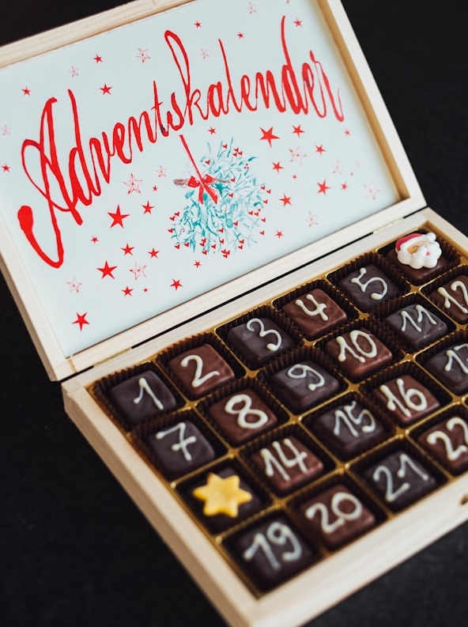
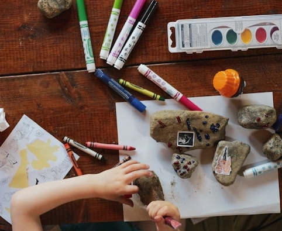
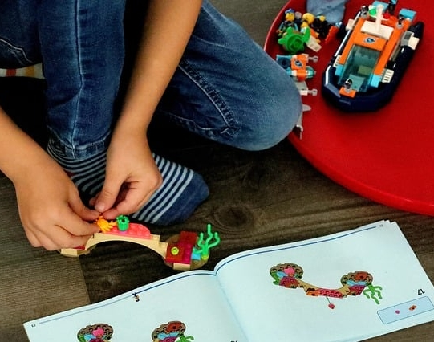
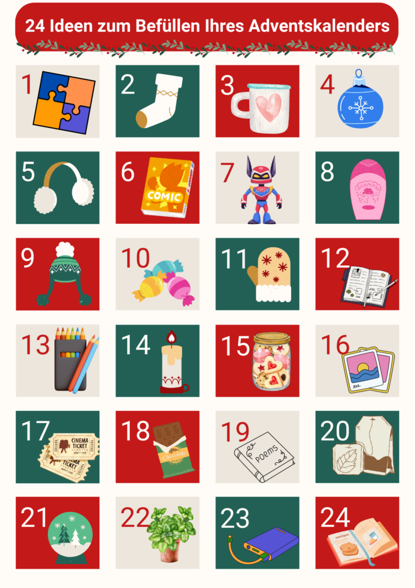

Every year, the **anticipation of Christmas** is great. The smell of freshly baked cookies is in the air, the snow is falling softly outside and the first door on the Advent calendar is already eagerly waiting for you to open it. So you have a reason to be happy every day in December. The joy is even greater if you **make your own Advent calendar** with a lot of dedication and give it to your loved ones as a gift.

In this article, you can find out what you need to consider when planning your project, what you can use to fill the Advent calendar and pack the contents, and what digital alternatives are available.

## Why make your own advent calendar?

A homemade Advent calendar is a gift that comes **from the heart**. By putting some thought and effort into it, you show your loved ones how much they mean to you. There are no limits to your creativity when putting together the contents and packaging.



If you would like to know where the tradition of the Advent calendar comes from, click [here](https://www.adventskalender.de/der-adventskalender-die-geschichte-und-entstehung.html).



## Make your own advent calendar in 5 steps

The Advent calendar must be ready by November 30 at the latest. The following planning will help you to ensure that nothing stands in the way:

These steps lead to success.

## 1\. who is the advent calendar for?

Whether young or old - everyone looks forward to opening a new door in the morning with excitement. An advent calendar knows **no age limit**. Give presents to your children, your parents, your partner and your best friends, for example.

When planning, consider **who** you are filling the Advent calendar **for**. Because not everyone enjoys the same things.

When a door is opened, the joy is often great.

If you are not sure what the person you are giving the gift to likes, don't be afraid to ask inconspicuously. After all, even the most elaborate Advent calendar is useless if the person doesn't like it.

## 2\. determine total budget

Under 10 euros, no expenses at all or as much money as you need? Determine your budget before you start planning content and packaging.

How much you spend on an Advent calendar should depend on the person receiving it. For example, you can budget more money for family and friends than for distant relatives or work colleagues. If you are giving each other Advent calendars in a group, a maximum amount is usually set. A free option is a digital Advent calendar. You can find a helpful template [here]().

As soon as you have determined an approximate value, you can start with further planning.

## 3\. select content carefully

Let's get down to the nitty gritty. How you fill the Advent calendar yourself depends above all on what the recipient might like.

### For those with a sweet tooth

The **chocolate Advent calendar** is without doubt the classic among Advent calendars. Whether as a simple bar, poured into a Christmas shape or as a fine praline - the taste is convincing! If you want to make someone happy who doesn't want to miss out on sweets during the Advent season, you can make your own Advent calendar with a variety of treats to suit the person's taste.

Decorating chocolate yourself makes the Advent calendar unique.

Don't limit yourself to just one sweet, but vary. From fruit gums and muesli bars to gingerbread, you can buy anything your heart desires. You can also fill the Advent calendar with homemade cookies or drinking chocolate on a stick. It's all in the mix!

### For gourmets

A **culinary journey** around the world; this Advent calendar is particularly good for amateur chefs. Give the gift of packaged **spices**, fine oils or exotic spice pastes and a suitable recipe for cooking.



However, buying 24 different spices is expensive. First look around your home to see which spices you can cut down on. Because even everyday spices can be used to prepare a variety of tasty dishes.

### For creative people

For people who are artistically active, a self-assembled **craft or painting set** is ideal. Let your loved one's creativity run wild or give them a set of crafting instructions so that they can continue working on the project a little every day.

It doesn't take much to be creative.

Possible small items that you can fill the Advent calendar with include pens, tubes of paint, glitter glue, chalk, washi tape or stencils.

### For poets

Are you a master of words and like to forge sentences? Then hide a handwritten Christmas **message**, a self-written **poem** or an inspiring **quote** behind the little doors.

"Oh, how nice it is when it's Christmas. I only wish it were Christmas a little more often."  
Astrid Lindgren

### For puzzlers

The following applies to filling Advent calendars, especially **for children**: The more exciting, the better. Prepare something for your child that they will enjoy for longer. For example, a puzzle or Lego set in which a section is put together every day.

Give your child something they will enjoy.

An admittedly challenging idea is to design a puzzle in which the child gets one step closer to the solution every day. You can hide clues around the house like a scavenger hunt and make the Advent calendar interactive.

### For DIY fans

Would you like to give something as a gift that comes from the heart and that you have put a lot of work and heart and soul into? Then **homemade gifts** are the perfect choice. Decorate mugs or Christmas tree baubles, for example, and surprise your loved ones with unique gifts.

Give the gift of **time together** in the form of vouchers, for example for long walks in the snow, a relaxed cooking evening or a useful sewing machine course.

Your gift will look particularly unique if you combine it with a symbolic object. Instead of writing the surprise on a piece of paper, how about a carrot as a symbol for building a snowman or a golden ticket announcing a movie night together?

**24 ideas for your advent calendar at a glance**

A mixture of different products ensures excitement right up to the last second.

It's all in the mix.

## 4\. search for suitable packaging

The contents are one thing, the right packaging is another. To ensure that the surprise is a success every day, the gift should be securely wrapped away from prying eyes.

When selecting packaging, you should ask yourself the following questions:

- Should all packaging look the same?
- Is the sustainability of the calendar important to me?
- What crafting tools do I need?
- Where should the Advent calendar be placed?

### Materials

So how should the gifts be wrapped? First of all, it depends on whether you prefer a uniform style. If the contents are different sizes, this is immediately noticeable in **paper bags**. If you don't want people to guess what's behind the door based on the size, **cardboard boxes** are suitable.

If you make your own Advent calendar and all the contents (e.g. chocolate bars) are roughly the same size, you can paint toilet paper rolls and use them as packaging.

The easiest way to pack is with paper bags.

### Sustainability

Invest in robust material such as cloth bags or wooden boxes or use existing tins and jars to wrap your gifts. On the one hand, this will ensure that there is less waste and, on the other hand, you can reuse the packaging next year.

### Tools

To give the packaging the finishing touch, you should add the numbers from 1 to 24. Paint, punch out, glue - whatever you like is allowed.

You also have the option of adding further embellishments. Depending on how you want to design your packaging, you may find the following tools helpful: scissors, glue, pens, stickers, adhesive tape, stapler, cord.

### Placement and presentation of the Advent calendar

If you are preparing the Advent calendar for someone in your household, you should also think about the presentation. After all, an Advent calendar works best when it is constantly present, so that the suspense of what is behind the next door is almost unbearable.

If the packages are light, you can hang them on a wall with a string or coat hangers, for example. Heavy packages or jars can be lined up or stacked on a flat surface. It looks particularly impressive if you attach the parcels to a banister.

## 5\. buy everything you need

There is a lot to get and little time. To make sure you get everything you need, it makes sense to draw up a [shopping list](https://seatable.io/en/einkaufsliste/). Research early enough where you can get what you need. Especially if you do a lot of DIY, you should not only think about the materials, but also about the tools.

### Plan online what to fill your Advent calendars with

Especially if you make several Advent calendars yourself, it can quickly become chaotic. [SeaTable's]() customizable [online planner]() will help you with your preparations. Enter what you need for your Advent calendars and see at a glance what quantities you need to buy and which presents you need to hide behind which doors.

Even if you fill a dozen private Advent calendars, you will never lose the overview thanks to the different views, which are organized by person (Table 2 & 3).

## Your virtual advent calendar to share

A **digital Advent calendar** is both sustainable and creative. If you want to make someone happy who lives far away, this alternative is the right thing for you. You can send pictures, videos or texts as digital messages. Such a calendar is also suitable for a larger group of people, as the contents are easy to reproduce.

You can use SeaTable to create your virtual Advent calendar. Design a little door for each day, create a gallery with the help of an app and make your lovingly selected content easily available via a link.

If you would like to use SeaTable to create analog and/or digital Advent calendars, simply [register]() for free with your e-mail address. You can also find the free template [here]().
