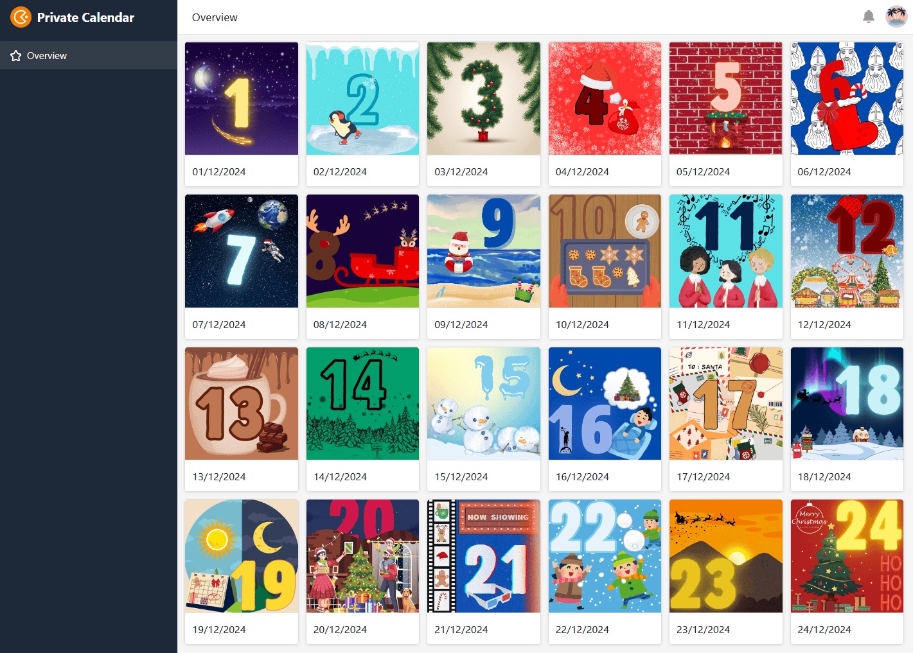

Chaque année, **l'attente de Noël** est grande. L'odeur des biscuits fraîchement cuits flotte dans l'air, la neige tombe doucement dehors et la première porte du calendrier de l'Avent attend déjà avec impatience que vous l'ouvriez. Ainsi, en décembre, vous avez chaque jour une raison de vous réjouir. La joie est encore plus grande si vous **fabriquez vous-même** avec beaucoup de dévouement un **calendrier de l'Avent** et que vous l'offrez à vos proches.

Dans cet article, vous découvrirez ce qu'il faut prendre en compte lors de la planification de votre projet, avec quoi vous pouvez remplir le calendrier de l'Avent et emballer son contenu, ainsi que les alternatives numériques disponibles.

## Pourquoi fabriquer soi-même un calendrier de l'Avent ?

Un calendrier de l'Avent que vous avez confectionné vous-même est un cadeau qui vient **du cœur**. En y réfléchissant et en vous en donnant la peine, vous montrez à ceux que vous aimez combien ils comptent pour vous. Votre créativité n'a pas de limites pour composer le contenu et l'emballage.



Si vous voulez savoir d'où vient la tradition du calendrier de l'Avent, cliquez [ici](https://www.adventskalender.de/der-adventskalender-die-geschichte-und-entstehung.html).



## Fabriquer soi-même un calendrier de l'Avent en 5 étapes

Le calendrier de l'Avent doit être prêt au plus tard le 30 novembre. Pour que rien ne s'y oppose, la planification suivante vous aidera :

Ces étapes mènent au succès.

## 1\. à qui s'adresse le calendrier de l'avent ?

Que l'on soit jeune ou moins jeune, tous se réjouissent d'ouvrir une nouvelle porte le matin avec excitation. Un calendrier de l'Avent ne connaît **pas de limite d'âge**. Offrez par exemple des cadeaux à vos enfants, à vos parents, à votre partenaire et à vos meilleurs amis.

Lors de la planification, pensez à la **personne pour laquelle** vous remplissez le calendrier de l'Avent. En effet, tout le monde ne se réjouit pas des mêmes choses.

Lorsqu'une porte s'ouvre, la joie est souvent grande.

Si vous n'êtes pas sûr de ce que la personne à qui vous voulez faire un cadeau aime, n'hésitez pas à insister discrètement. Après tout, même le calendrier de l'Avent le plus élaboré ne sert à rien s'il ne plaît pas à la personne.

## 2\. déterminer le budget total

Moins de 10 euros, sans aucune dépense ou autant d'argent que nécessaire ? Déterminez votre budget avant de commencer à planifier le contenu et le conditionnement.

Le montant que vous dépensez pour un calendrier de l'Avent devrait dépendre de la personne qui le reçoit. Vous pouvez par exemple prévoir plus d'argent pour la famille et les amis que pour des parents éloignés ou des collègues de travail. Si vous vous offrez mutuellement des calendriers de l'Avent au sein d'un groupe, un montant maximal est généralement fixé. Une option gratuite est un calendrier de l'Avent numérique. Vous trouverez [ici]() un modèle utile.

Une fois que vous avez déterminé une valeur approximative, vous pouvez commencer à planifier la suite.

## 3\. choisir soigneusement le contenu

Passons aux choses sérieuses. La manière dont vous remplissez vous-même le calendrier de l'Avent dépend avant tout de ce qui pourrait plaire aux personnes à qui vous l'offrez.

### Pour les gourmands

Le **calendrier de l'Avent au chocolat** est sans aucun doute le classique parmi les calendriers de l'Avent. Qu'il s'agisse d'une simple tablette, d'un moule de Noël ou d'une praline raffinée, le goût est convaincant ! Si vous souhaitez faire plaisir à quelqu'un qui ne peut pas se passer de sucreries pendant la période de l'Avent, vous pouvez lui proposer des friandises que vous aurez composées vous-même et qui répondront à ses goûts et lui permettront de réaliser lui-même un calendrier de l'Avent de manière variée.

Décorer soi-même le chocolat rend le calendrier de l'Avent unique.

Ne vous limitez pas à une seule friandise, mais variez les plaisirs. Vous pouvez acheter tout ce que vous désirez, des gommes aux fruits aux barres de céréales en passant par le pain d'épices. En outre, vous pouvez remplir le calendrier de l'Avent avec des pâtisseries faites maison ou du chocolat à boire sur bâtonnet. C'est le mélange qui fait la différence !

### Pour les gourmands

Un **voyage culinaire** autour du monde ; vous pouvez faire plaisir aux cuisiniers amateurs avec ce calendrier de l'Avent. Offrez des **épices** préemballées, des huiles raffinées ou des pâtes d'épices exotiques, ainsi qu'une recette adaptée à réaliser.



L'achat de 24 épices différentes est toutefois coûteux. Regardez d'abord chez vous quelles sont les épices dont vous pouvez prélever une petite portion. Car même avec des épices de tous les jours, il est possible de préparer différents plats savoureux.

### Pour les créatifs

Pour les personnes qui ont une activité artistique, un **kit de bricolage ou de peinture** à composer soi-même est une bonne idée. Laissez libre cours à la créativité de vos proches ou ajoutez des instructions de bricolage qui leur permettront d'avancer chaque jour un peu plus dans leur projet.

Il suffit de peu pour être créatif.

Les petites choses possibles avec lesquelles vous pouvez remplir le calendrier de l'Avent sont par exemple des crayons, des tubes de peinture, de la colle à paillettes, de la craie, du washi tape ou des pochoirs.

### Pour les poètes

Vous êtes un maître des mots et aimez forger des phrases ? Alors cachez derrière les portes un **message** de Noël écrit à la main, un **poème** que vous avez écrit vous-même ou une **citation** inspirante.

"Oh, comme c'est bon quand c'est Noël ! J'aimerais juste que ce soit Noël un peu plus souvent".  
Astrid Lindgren

### Pour les amateurs de puzzles

**Les enfants** sont particulièrement concernés par le remplissage du calendrier de l'Avent : Plus c'est excitant, mieux c'est. Préparez pour votre enfant quelque chose qui lui fera plaisir plus longtemps. Par exemple, un puzzle ou un set de Lego, dont une partie sera reconstituée chaque jour.

Offrez à votre enfant quelque chose qui lui fera plaisir.

Une idée exigeante, il est vrai, consiste à concevoir une énigme dans laquelle l'enfant se rapproche chaque jour un peu plus de la résolution. Comme une sorte de jeu de piste, vous pouvez cacher des indices dans la maison et rendre le calendrier de l'Avent interactif.

### Pour les fans de DIY

Vous souhaitez offrir quelque chose qui vient du cœur et dans lequel vous avez mis beaucoup de travail et de cœur ? Dans ce cas, **les attentions faites maison** sont idéales. Décorez par exemple des tasses ou des boules de Noël et surprenez vos proches avec des cadeaux uniques.

Offrez **du temps ensemble** sous forme de bons, par exemple pour de longues promenades dans la neige, une soirée cuisine détendue ou un cours de couture utile.

Votre cadeau sera particulièrement unique si vous l'associez à un objet symbolique. Au lieu d'écrire la surprise sur une feuille de papier, que diriez-vous d'une carotte symbolisant la construction d'un bonhomme de neige ou d'un billet doré annonçant une soirée cinéma en commun ?

**24 idées pour votre calendrier de l'Avent en un clin d'œil**

Un mélange de différents produits garantit le suspense jusqu'à la dernière seconde.

C'est le mélange qui fait la différence.

## 4\. chercher des emballages adaptés

Le contenu est une chose, l'emballage adéquat en est une autre. Pour que la surprise soit renouvelée chaque jour, le cadeau doit être emballé à l'abri des regards indiscrets.

Lors du choix des emballages, posez-vous les questions suivantes :

- Tous les emballages doivent-ils se ressembler ?
- La durabilité du calendrier est-elle importante pour moi ?
- De quels outils de bricolage ai-je besoin ?
- Où placer le calendrier de l'avent ?

### Matériaux

Alors, comment emballer les cadeaux ? Cela dépend d'abord de votre préférence pour un style uniforme. Si les contenus sont de tailles différentes, cela se verra tout de suite dans des **sacs en papier**. Si vous souhaitez que l'on ne puisse pas deviner ce qui se cache derrière la porte, il est préférable d'**utiliser des boîtes en carton**.

Si vous fabriquez vous-même un calendrier de l'Avent et que tous les contenus (par exemple les barres de chocolat) ont à peu près la même taille, vous pouvez peindre des rouleaux de papier toilette et les utiliser comme emballage.

Le plus simple est d'utiliser des sacs en papier pour l'emballage.

### Durabilité

Investissez dans du matériel robuste comme des sacs en tissu ou des boîtes en bois, ou utilisez des boîtes et des bocaux existants pour emballer vos cadeaux. Vous éviterez ainsi de produire trop de déchets et pourrez réutiliser les emballages l'année prochaine.

### Outils

Pour donner la touche finale à vos emballages, il est conseillé de les décorer avec des chiffres de 1 à 24. Peindre, découper, coller - tout ce qui vous plaît est permis.

En outre, vous pouvez, en option, procéder à d'autres embellissements. En fonction de la manière dont vous souhaitez personnaliser vos emballages, les outils suivants pourraient vous être utiles : ciseaux, colle, stylos, autocollants, ruban adhésif, agrafeuse, cordelette.

### Placement et présentation du calendrier de l'Avent

Lorsque vous préparez le calendrier de l'Avent pour une personne de votre foyer, vous devez également penser à la présentation. Après tout, un calendrier de l'Avent est du meilleur effet lorsqu'il est constamment présent, de sorte que le suspense sur ce qui se trouve derrière la prochaine porte est difficilement supportable.

Si les paquets sont légers, vous pouvez par exemple les suspendre à un mur à l'aide d'une ficelle ou de cintres. Les paquets lourds ou les verres peuvent être alignés ou empilés sur une surface plane. L'effet est particulièrement impressionnant si vous fixez les paquets à une rampe d'escalier.

## 5\. acheter tout ce dont vous avez besoin

Il y a beaucoup de choses à acheter et peu de temps. Pour obtenir tout ce dont vous avez besoin, il est judicieux d'établir une [liste de courses](https://seatable.io/fr/einkaufsliste/). Faites des recherches suffisamment tôt pour savoir où vous pouvez vous procurer quoi. Surtout si vous bricolez beaucoup vous-même, vous devriez penser non seulement au matériel, mais aussi aux outils.

### Planifier en ligne avec quoi vous remplissez vos calendriers de l'Avent

C'est justement lorsque vous faites vous-même plusieurs calendriers de l'Avent que cela peut vite devenir chaotique. Le [planificateur en ligne]() personnalisable [de SeaTable]() vous aide à vous préparer. Inscrivez ce dont vous avez besoin pour vos calendriers de l'Avent et voyez d'un coup d'œil les quantités que vous devez acheter et derrière quelle porte vous cachez quels cadeaux.

Même si vous remplissez une douzaine de calendriers de l'Avent privés, vous ne perdrez jamais le fil grâce aux différentes vues classées par personne (tableaux 2 & 3).

## Votre calendrier de l'Avent virtuel à partager

Un **calendrier de l'Avent numérique** est à la fois durable et créatif. Si vous souhaitez faire plaisir à quelqu'un qui vit loin de chez vous, cette alternative est faite pour vous. Vous pouvez envoyer des images, des vidéos ou des textes en guise de messages numériques. De plus, un tel calendrier convient également à un grand groupe de personnes, car le contenu peut être facilement reproduit.

Pour créer votre calendrier de l'Avent virtuel, vous pouvez utiliser SeaTable. Créez une porte pour chaque jour, créez une galerie à l'aide d'une application et partagez facilement le contenu que vous avez sélectionné avec soin via un lien.

Si vous souhaitez utiliser SeaTable pour créer des calendriers de l'Avent analogiques et/ou numériques, il vous suffit de [vous inscrire](https://seatable.io/fr/enregistrement/) gratuitement avec votre adresse e-mail. Vous trouverez le modèle, également gratuit, [ici]().
