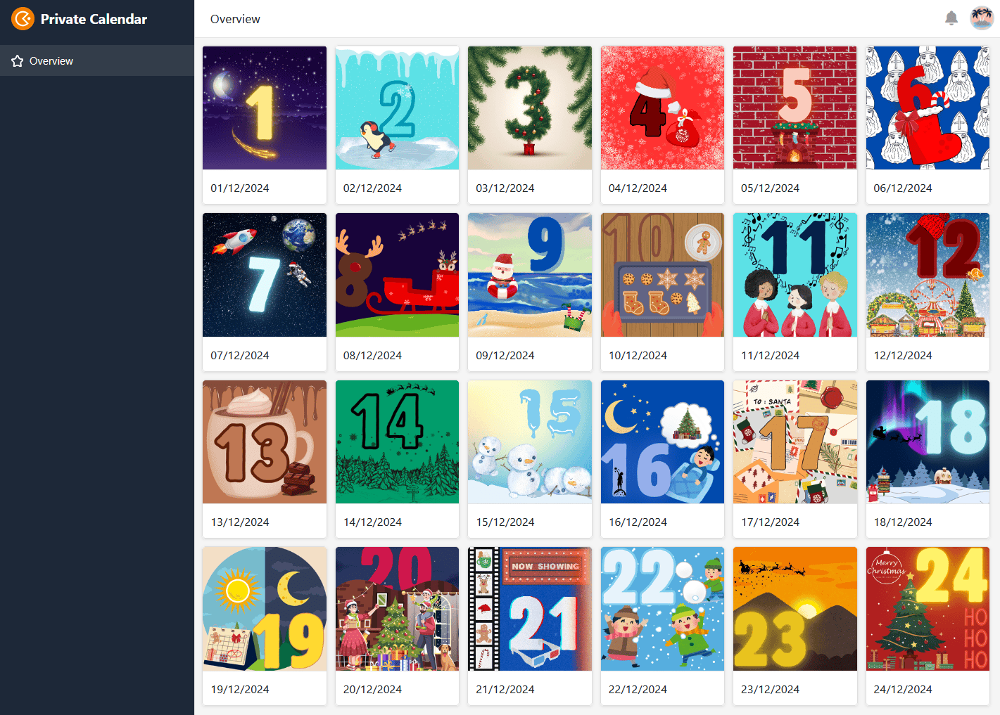

Todos os anos, a **antecipação do Natal** é grande. O cheiro a biscoitos acabados de fazer paira no ar, a neve cai suavemente lá fora e a primeira porta do calendário do Advento já está à espera que a abra. Assim, todos os dias de dezembro são motivo de alegria. A alegria é ainda maior se fizeres **o teu próprio calendário do Advento** com muita dedicação e o ofereceres aos teus entes queridos como presente.

Neste artigo, pode descobrir o que deve ter em conta ao planear o seu projeto, o que pode utilizar para encher o calendário do Advento e embalar o conteúdo e quais as alternativas digitais disponíveis.

## Porquê fazer o seu próprio calendário do advento?

Um calendário do Advento feito em casa é uma prenda que vem **do coração**. Ao dedicar-lhe alguma atenção e esforço, mostra aos seus entes queridos o quanto eles significam para si. Não há limites para a sua criatividade na elaboração do conteúdo e da embalagem.



Se quiser saber de onde vem a tradição do calendário do Advento, clique [aqui](https://www.adventskalender.de/der-adventskalender-die-geschichte-und-entstehung.html).



## Faça o seu próprio calendário do advento em 5 passos

O calendário do Advento deve estar pronto, o mais tardar, a 30 de novembro. O planeamento que se segue ajudá-lo-á a garantir que nada se interpõe no caminho:

Estes passos conduzem ao sucesso.

## 1\. A quem se destina o calendário do advento?

Seja jovem ou idoso - toda a gente anseia por abrir uma nova porta de manhã com entusiasmo. Um calendário do advento não conhece **limites de idade**. Ofereça presentes aos seus filhos, aos seus pais, ao seu parceiro e aos seus melhores amigos, por exemplo.

Ao planear, tenha em conta **para quem** está a preencher o calendário do Advento. Porque nem toda a gente gosta das mesmas coisas.

Quando uma porta se abre, a alegria é muitas vezes grande.

Se não tiver a certeza do que a pessoa a quem vai oferecer o presente gosta, não tenha medo de perguntar discretamente. Afinal de contas, mesmo o calendário do Advento mais elaborado é inútil se a pessoa não gostar dele.

## 2\. determinar o orçamento total

Menos de 10 euros, nenhuma despesa ou todo o dinheiro que precisar? Determine o seu orçamento antes de começar a planear o conteúdo e a embalagem.

A quantia a gastar num calendário do Advento deve depender da pessoa que o recebe. Por exemplo, é possível gastar mais dinheiro com familiares e amigos do que com parentes distantes ou colegas de trabalho. Se se oferecerem calendários do Advento uns aos outros num grupo, é normalmente estabelecido um montante máximo. Uma opção gratuita é um calendário do Advento digital. Pode encontrar um modelo útil [aqui](https://seatable.io/pt/vorlage/si5fsu0nrny8wtabksc6iq/).

Assim que tiver determinado um valor aproximado, pode começar a planear mais.

## 3\. selecionar cuidadosamente os conteúdos

Vamos ao que interessa. A forma como se preenche o calendário do Advento depende, acima de tudo, do que o destinatário poderá gostar.

### Para quem gosta de doces

O **calendário do Advento de chocolate** é, sem dúvida, o clássico dos calendários do Advento. Quer se trate de uma simples barra, moldada em forma de Natal ou de um fino praliné - o sabor é convincente! Se quiser fazer feliz alguém que não quer deixar de comer doces durante a época do Advento, pode ir ao encontro do gosto dessa pessoa com guloseimas preparadas por si e fazer o seu próprio calendário do Advento de várias formas.

Decorar você mesmo o chocolate torna o calendário do Advento único.

Não se limite a um só doce, mas varie. Desde gomas de fruta e barras de muesli a pão de gengibre, pode comprar tudo o que o seu coração desejar. Também pode encher o calendário do Advento com bolachas caseiras ou chocolate em pau. Tudo depende da mistura!

### Para os gourmets

Uma **viagem gastronómica** à volta do mundo; este calendário do Advento é particularmente adequado para chefes amadores. Ofereça **especiarias** embaladas, óleos finos ou pastas de especiarias exóticas e uma receita a condizer para cozinhar.



No entanto, comprar 24 especiarias diferentes é dispendioso. Em primeiro lugar, dê uma vista de olhos à sua casa para ver quais as especiarias que pode reduzir. Porque mesmo as especiarias do dia a dia podem ser utilizadas para preparar uma variedade de pratos saborosos.

### Para pessoas criativas

Para as pessoas artisticamente activas, um **conjunto de trabalhos manuais ou de colorir** montado pelo próprio é ideal. Deixe a criatividade do seu ente querido correr à solta ou dê-lhe um conjunto de instruções de trabalhos manuais que lhe permita trabalhar no projeto um pouco mais todos os dias.

Não é preciso muito para ser criativo.

Entre os pequenos objectos com que se pode preencher o calendário do Advento contam-se canetas, tubos de cor, cola brilhante, giz, fita washi ou stencils.

### Para os poetas

É um mestre das palavras e gosta de forjar frases? Então esconda uma **mensagem** de Natal escrita à mão, um **poema** escrito por si ou uma **citação** inspiradora atrás das pequenas portas.

"Oh, como é bom quando é Natal. Só gostava que fosse Natal um pouco mais vezes."  
Astrid Lindgren

### Para os puzzles

O seguinte aplica-se ao preenchimento de calendários do Advento, especialmente **para crianças**: Quanto mais emocionante, melhor. Prepare para o seu filho algo de que ele goste durante mais tempo. Por exemplo, um puzzle ou um conjunto de Lego em que todos os dias se junta uma parte.

Dê ao seu filho algo de que ele goste.

Uma ideia reconhecidamente desafiante é conceber um puzzle em que a criança se aproxime um pouco mais da solução todos os dias. Pode esconder pistas pela casa, como numa caça ao tesouro, e tornar o calendário do Advento interativo.

### Para os fãs da bricolage

Gostaria de oferecer algo que viesse do coração e no qual tivesse colocado muito trabalho, coração e alma? Então, **as prendas feitas em casa** são a escolha perfeita. Decore canecas ou enfeites de árvore de Natal, por exemplo, e surpreenda os seus entes queridos com presentes únicos.

Ofereça o **tempo em conjunto** sob a forma de vales, por exemplo, para longos passeios na neve, uma noite de culinária descontraída ou um curso útil de máquina de costura.

O seu presente parecerá particularmente único se o combinar com um objeto simbólico. Em vez de escrever a surpresa num pedaço de papel, que tal uma cenoura como símbolo da construção de um boneco de neve ou um bilhete dourado a anunciar uma noite de cinema em conjunto?

**24 ideias para o seu calendário do advento em resumo**

Uma mistura de produtos diferentes garante a emoção até ao último segundo.

Está tudo na mistura.

## 4\. procura de embalagens adequadas

O conteúdo é uma coisa, a embalagem correta é outra. Para garantir que a surpresa seja um sucesso todos os dias, o presente deve ser embrulhado de forma segura, longe de olhares indiscretos.

Ao selecionar a embalagem, deve colocar a si próprio as seguintes questões:

- As embalagens devem ser todas iguais?
- A sustentabilidade do calendário é importante para mim?
- De que ferramentas de trabalho manual necessito?
- Onde deve ser colocado o calendário do Advento?

### Materiais

Como é que as prendas devem ser embrulhadas? Em primeiro lugar, depende se prefere um estilo uniforme. Se o conteúdo tiver tamanhos diferentes, isso é imediatamente percetível em **sacos de papel**. Se não quiser que as pessoas adivinhem o que está por detrás da porta com base no tamanho, **as caixas de cartão** são adequadas.

Se estiver a fazer o seu próprio calendário do Advento e todos os conteúdos (por exemplo, barras de chocolate) tiverem aproximadamente o mesmo tamanho, pode pintar rolos de papel higiénico e utilizá-los como embalagem.

A forma mais fácil de embalar é com sacos de papel.

### Sustentabilidade

Invista em materiais robustos, como sacos de pano ou caixas de madeira, ou utilize latas e frascos existentes para embrulhar os seus presentes. Por um lado, isto garante menos desperdício e, por outro lado, pode reutilizar a embalagem no próximo ano.

### Ferramentas

Para dar o toque final à embalagem, deves decorá-la com os números de 1 a 24. É permitido colorir, perfurar, colar - tudo o que quiseres.

Também tens a possibilidade de acrescentar outros enfeites. Dependendo da forma como pretende conceber a sua embalagem, poderá ser útil utilizar as seguintes ferramentas: tesoura, cola, canetas, autocolantes, fita adesiva, agrafador, cordão.

### Colocação e apresentação do calendário do Advento

Se está a preparar o calendário do Advento para alguém da sua casa, deve também pensar na apresentação. Afinal, um calendário do advento funciona melhor quando está constantemente presente, de modo a que o suspense sobre o que está por detrás da porta ao lado seja quase insuportável.

Se os pacotes forem leves, pode pendurá-los numa parede com um fio ou cabides, por exemplo. Os pacotes ou frascos pesados podem ser alinhados numa superfície plana ou empilhados uns sobre os outros. É particularmente impressionante se prender os embrulhos a um corrimão.

## 5\. comprar tudo o que é necessário

Há muito para comprar e pouco tempo. Para ter a certeza de que tem tudo o que precisa, faz sentido elaborar uma [lista de compras](https://seatable.io/pt/einkaufsliste/). Pesquise com antecedência onde pode obter o que precisa. Especialmente se fizer muita bricolage, não deve pensar apenas nos materiais, mas também nas ferramentas.

### Planear em linha o que encher os calendários do Advento

Pode tornar-se rapidamente caótico, especialmente se estiver a fazer vários calendários do Advento. [A agenda em linha](https://seatable.io/pt/vorlage/si5fsu0nrny8wtabksc6iq/) personalizável [da SeaTable](https://seatable.io/pt/vorlage/si5fsu0nrny8wtabksc6iq/) ajudá-lo-á nos seus preparativos. Introduza o que precisa para os seus calendários do Advento e veja rapidamente quais as quantidades que precisa de comprar e quais os presentes que precisa de esconder atrás de que portas.

Mesmo que encha uma dúzia de calendários de Advento privados, nunca perderá a visão geral graças às diferentes vistas, que estão organizadas por pessoa (quadros 2 e 3).

## O seu calendário do advento virtual para partilhar

Um **calendário do advento digital** é simultaneamente sustentável e criativo. Se quer fazer feliz alguém que vive longe, esta alternativa é a mais indicada para si. Pode enviar imagens, vídeos ou textos como mensagens digitais. Este calendário também é adequado para um grupo maior de pessoas, uma vez que o conteúdo é fácil de duplicar.

Pode utilizar o SeaTable para criar o seu calendário virtual do Advento. Crie uma pequena porta para cada dia, crie uma galeria com a ajuda de uma aplicação e disponibilize facilmente o seu conteúdo cuidadosamente selecionado através de uma ligação.

Se quiser utilizar o SeaTable para criar calendários do Advento analógicos e/ou digitais, basta [registar-se](https://seatable.io/pt/registrierung/) gratuitamente com o seu endereço de correio eletrónico. Também pode encontrar o modelo gratuito [aqui](https://seatable.io/pt/vorlage/si5fsu0nrny8wtabksc6iq/).
