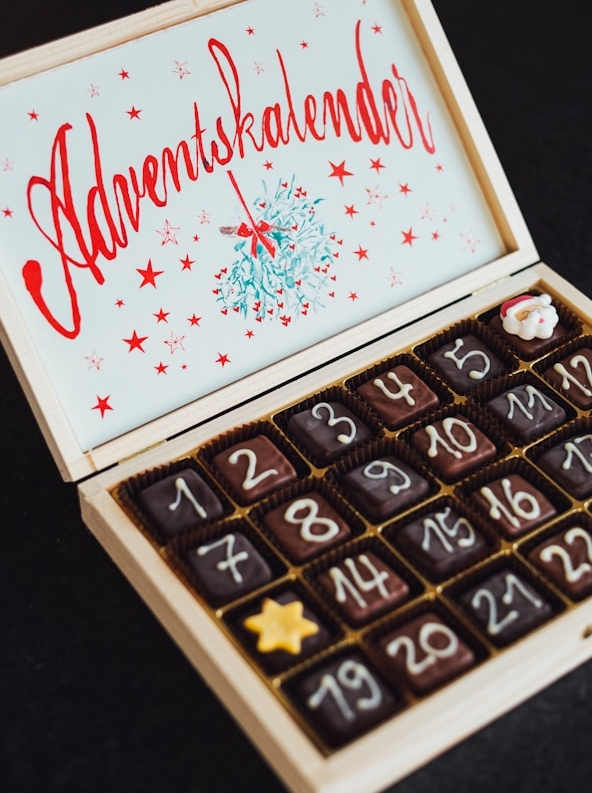
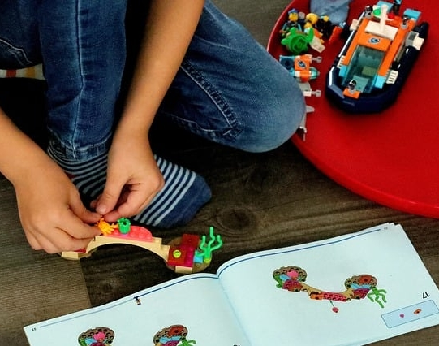
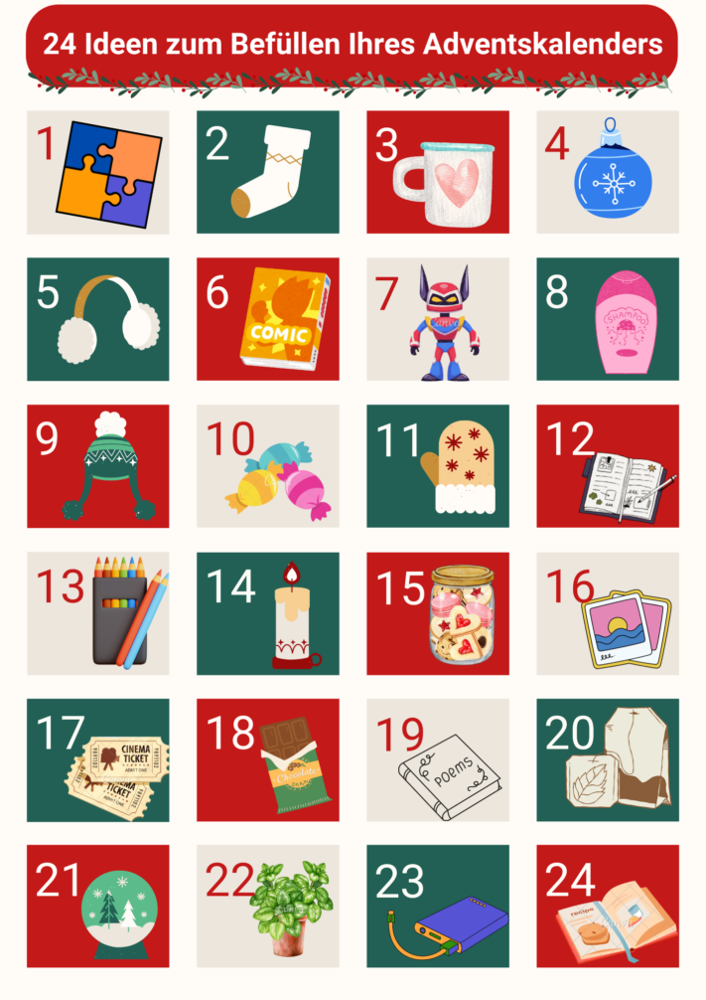
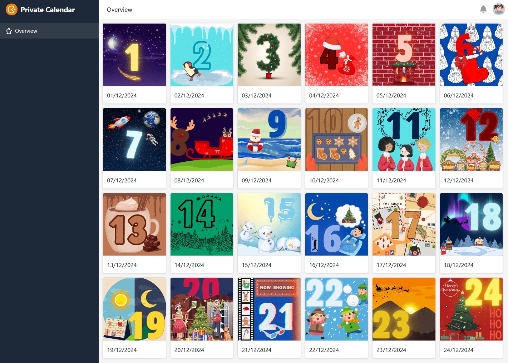

Каждый год **предвкушение Рождества** велико. В воздухе витает запах свежеиспеченного печенья, за окном тихо падает снег, а первая дверца адвент-календаря уже с нетерпением ждет, когда вы ее откроете. Так что у вас есть повод радоваться каждому дню в декабре. Радость будет еще больше, если вы **сделаете свой собственный адвент-календарь** с большим количеством посвящений и подарите его своим близким.

В этой статье вы узнаете, что нужно учитывать при планировании проекта, что можно использовать для наполнения адвент-календаря и упаковки его содержимого, а также какие существуют цифровые альтернативы.

## Зачем делать свой собственный адвент-календарь?

Самодельный адвент-календарь - это подарок, который идет **от сердца**. Вкладывая в него мысли и усилия, вы показываете своим близким, как много они для вас значат. Нет никаких ограничений для вашего творчества при составлении содержимого и упаковки.



Если вы хотите узнать, откуда пошла традиция адвент-календаря, нажмите [здесь](https://www.adventskalender.de/der-adventskalender-die-geschichte-und-entstehung.html).



## Сделайте свой собственный адвент-календарь за 5 шагов

Адвент-календарь должен быть готов не позднее 30 ноября. Следующее планирование поможет вам сделать так, чтобы ничто не помешало:

Эти шаги ведут к успеху.

## 1\. Для кого предназначен адвент-календарь?

Неважно, молод человек или стар - все с нетерпением ждут утра, чтобы открыть новую дверь. Адвент-календарь **не** знает **возрастных ограничений**. Подарите подарки своим детям, родителям, партнеру, лучшим друзьям и т.д.

При планировании подумайте, **для кого** вы заполняете адвент-календарь. Ведь не всем нравятся одни и те же вещи.

Когда дверь открывается, радость часто бывает огромной.

Если вы не уверены, что нравится человеку, которому вы дарите подарок, не бойтесь ненавязчиво спросить. В конце концов, даже самый изысканный адвент-календарь будет бесполезен, если он не понравится человеку.

## 2\. определить общий бюджет

Менее 10 евро, вообще никаких расходов или столько денег, сколько нужно? Определите свой бюджет до того, как начнете планировать контент и упаковку.

То, сколько вы потратите на адвент-календарь, должно зависеть от того, кто его получит. Например, для родных и близких можно выделить больше денег, чем для дальних родственников или коллег по работе. Если вы дарите адвент-календари друг другу в группе, обычно устанавливается максимальная сумма. Бесплатный вариант - цифровой адвент-календарь. Полезный шаблон можно найти [здесь]().

Как только вы определите приблизительную стоимость, можно приступать к дальнейшему планированию.

## 3\. тщательно отбирайте содержание

Давайте перейдем к деталям. То, как вы сами заполните адвент-календарь, зависит прежде всего от того, что может понравиться получателю.

### Для тех, кто любит сладкое

**Шоколадный адвент-календарь** - это, без сомнения, классика среди адвент-календарей. Простая плитка, рождественская форма или изысканное пралине - вкус убедителен! Если вы хотите порадовать человека, который не хочет отказываться от сладостей в сезон Адвента, вы можете удовлетворить его вкус с помощью угощений, которые вы приготовили сами, и сделать свой собственный адвент-календарь самыми разнообразными способами.

Если украсить шоколад самостоятельно, адвент-календарь станет уникальным.

Не ограничивайте себя только одной сладостью, а разнообразьте ее. Можно купить все, что душа пожелает: от фруктовых жевательных резинок и батончиков мюсли до имбирных пряников. Вы также можете наполнить адвент-календарь домашним печеньем или питьевым шоколадом на палочке. Все дело в сочетании!

### Для гурманов

**Кулинарное путешествие** по всему миру - этот адвент-календарь особенно понравится поварам-любителям. Подарите упакованные **специи**, изысканные масла или экзотические пасты для специй и подходящий рецепт для приготовления.



Однако покупка 24 различных специй обходится недешево. Для начала осмотрите свой дом, чтобы понять, какие специи вы можете сократить. Ведь даже повседневные специи можно использовать для приготовления множества ароматных блюд.

### Для творческих людей

Для людей, ведущих активный творческий образ жизни, идеально подойдет **набор для** самостоятельной сборки **поделок или раскрасок**. Позвольте творчеству вашего близкого человека разгуляться или подарите ему набор инструкций по рукоделию, который позволит ему с каждым днем все больше и больше работать над проектом.

Для того чтобы быть креативным, не нужно многого.

В адвент-календарь можно положить такие мелкие предметы, как ручки, тюбики с красками, клей с блестками, мелки, ленту васи или трафареты.

### Для поэтов

Вы мастер слова и любите составлять предложения? Тогда спрячьте за маленькими дверцами написанное от руки рождественское **послание**, **стихотворение** собственного сочинения или вдохновляющую **цитату**.

"Как хорошо, когда наступает Рождество. Только хотелось бы, чтобы Рождество наступало почаще".  
Астрид Линдгрен

### Для любителей головоломок

При заполнении адвент-календарей, особенно **для детей**, можно руководствоваться следующим: Чем интереснее, тем лучше. Подготовьте для ребенка что-то, что ему будет нравиться дольше. Например, пазл или набор Lego, в котором каждый день нужно собирать одну из секций.

Подарите ребенку то, что ему понравится.

Непростая идея - придумать головоломку, в которой ребенок каждый день становится на шаг ближе к разгадке. Вы можете спрятать подсказки по всему дому, как в охоте на мусор, и сделать адвент-календарь интерактивным.

### Для любителей "сделай сам

Хотите преподнести в подарок что-то, что идет от сердца и во что вы вложили много труда, души и сердца? Тогда **самодельные подарки** - идеальный выбор. Украсьте, например, кружки или елочные игрушки и удивите своих близких уникальными подарками.

Подарите **совместное времяпрепровождение** в виде ваучеров, например, на долгие прогулки по снегу, вечер непринужденной кулинарии или полезный курс обучения работе на швейной машинке.

Ваш подарок будет выглядеть особенно уникальным, если вы объедините его с символическим предметом. Вместо того чтобы написать сюрприз на листке бумаги, как насчет морковки в качестве символа строительства снеговика или золотого билета, анонсирующего совместный вечер в кино?

**24 идеи для адвент-календаря с первого взгляда**

Смесь различных продуктов обеспечивает возбуждение до последней секунды.

Все дело в сочетании.

## 4\. поиск подходящей упаковки

Содержимое - это одно, а правильная упаковка - совсем другое. Чтобы сюрприз удавался каждый день, подарок должен быть надежно упакован вдали от посторонних глаз.

Выбирая упаковку, задайте себе следующие вопросы:

- Должны ли все упаковки выглядеть одинаково?
- Важна ли для меня экологичность календаря?
- Какие инструменты мне понадобятся?
- Где должен располагаться адвент-календарь?

### Материалы

Как же следует упаковывать подарки? Прежде всего, это зависит от того, предпочитаете ли вы единый стиль. Если содержимое разного размера, это сразу будет заметно в **бумажных пакетах**. Если же вы не хотите, чтобы люди догадывались о том, что находится за дверью, по размеру, подойдут **картонные коробки**.

Если вы делаете адвент-календарь своими руками и все содержимое (например, шоколадные батончики) примерно одинакового размера, вы можете раскрасить туалетные рулоны и использовать их в качестве упаковки.

Самый простой способ упаковки - это бумажные пакеты.

### Устойчивое развитие

Инвестируйте в прочные материалы, такие как тканевые мешочки или деревянные коробки, или используйте для упаковки подарков имеющиеся банки и жестянки. С одной стороны, это обеспечит меньше отходов, а с другой - вы сможете повторно использовать упаковку в следующем году.

### Инструменты

Чтобы придать упаковке завершающий штрих, украсьте ее цифрами от 1 до 24. Раскрашивайте, вырезайте, приклеивайте - все, что вам нравится, разрешается.

У вас также есть возможность добавить дополнительные украшения. В зависимости от того, как вы хотите оформить упаковку, вам могут пригодиться следующие инструменты: ножницы, клей, ручки, наклейки, клейкая лента, степлер, шнур.

### Размещение и презентация адвент-календаря

Если вы готовите адвент-календарь для кого-то из своих домочадцев, вам стоит подумать и о презентации. Ведь адвент-календарь лучше всего работает, когда он постоянно присутствует, так что ожидание того, что находится за соседней дверью, становится почти невыносимым.

Если посылки легкие, их можно повесить на стену с помощью веревки или, например, вешалки. Тяжелые посылки или банки можно выложить на ровной поверхности или сложить друг на друга. Особенно эффектно смотрится, если прикрепить посылки к перилам.

## 5\. купить все необходимое

Нужно многое купить, а времени мало. Чтобы быть уверенным, что вы получите все необходимое, имеет смысл составить [список покупок](). Заранее узнайте, где можно приобрести все необходимое. Особенно если вы часто занимаетесь самоделками, вам следует подумать не только о материалах, но и об инструментах.

### Планируйте онлайн, чем заполнить адвент-календари

Это может быстро превратиться в хаос, особенно если вы сами делаете несколько адвент-календарей. Настраиваемый [онлайн-планировщик SeaTable]() поможет вам в подготовке. Укажите, что вам нужно для адвент-календарей, и сразу же увидите, какое количество товаров вам нужно купить и какие подарки спрятать за дверцами.

Даже если вы заполните дюжину личных адвент-календарей, вы никогда не потеряете общую картину благодаря различным представлениям, организованным по персоналиям (табл. 2 и 3).

## Ваш виртуальный адвент-календарь для совместного использования

**Цифровой адвент-календарь**\- это и экологично, и креативно. Если вы хотите порадовать кого-то, кто живет далеко, эта альтернатива вам подойдет. Вы можете отправлять фотографии, видео или тексты в виде цифровых сообщений. Такой календарь подойдет и для большой группы людей, так как его содержимое легко дублируется.

С помощью SeaTable вы можете создать свой виртуальный адвент-календарь. Оформите маленькую дверцу на каждый день, создайте галерею с помощью приложения и сделайте так, чтобы выбранные с любовью материалы были легко доступны по ссылке.

Если вы хотите использовать SeaTable для создания аналоговых и/или цифровых адвент-календарей, просто [зарегистрируйтесь]() бесплатно, указав свой адрес электронной почты. Вы также можете найти бесплатный шаблон [здесь]().
