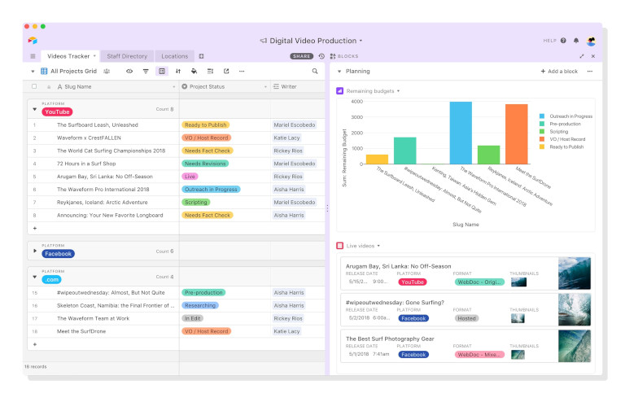

## Was ist Airtable?

Airtable ist eine **cloudbasierte Kollaborationsplattform**, die eine **Mischung aus Tabellenkalkulation und Datenbanksoftware** darstellt. Je nach Blickwinkel kann man die Frage "Was ist Airtable?" deshalb unterschiedlich beantworten: Da man seine Daten dort meist in Tabellen erfasst und strukturiert, wird es oft als leistungsfähigere [Excel Alternative]() betrachtet. Airtable wird aber auch als [No-Code-Datenbank]() bezeichnet, mit der man ohne tiefergehende Programmierkenntnisse Datenbanken erstellen, managen und nutzen kann.  

Weil in einer digitalisierten Welt so gut wie überall Daten anfallen, gibt es eine große Bandbreite an **Anwendungsmöglichkeiten**, um mit Airtable Erfahrungen zu machen. Daher bietet Airtable kostenlos Einstiegslösungen für verschiedene Bereiche wie Produktentwicklung, Marketing, Operations, Projektmanagement, Personal, Vertrieb und Finanzen an. Bei höheren Anforderungen und größeren Teams geht das Airtable Pricing aber schnell ins Geld.

 

## Wichtige Airtable Funktionen

Wie bereits erwähnt, ist Airtable mehr als ein Tabellen-Tool. Die Software gliedert sich vielmehr in unterschiedliche hierarchische Ebenen: **Workspaces, Bases, Tabellen, Datensätze und Felder**. Bei den Feldern handelt es sich um die senkrechten Spalten innerhalb einer Tabelle, bei denen Sie im Gegensatz zu Excel vorab **feste Datentypen** definieren müssen. Dank der Nähe zu traditionellen Spreadsheets ist die anfängliche Dateneingabe sehr intuitiv. 
  
Bei der **Visualisierung der Daten** zeigt sich Airtable äußerst flexibel: Neben der klassischen Tabellenansicht können Sie unter anderem Kanban, Gantt, Galerie und Kalender auswählen. Um Ihre Daten passend aufzubereiten, haben Sie Filter, Sortierungen und Gruppierungen zur Hand. Für die strukturierte Datenerfassung gibt es zudem **Formulare**.

Darüber hinaus bietet Airtable **Erweiterungen** für Reporting und Statistiken, Page Design und Time Tracking an. Die **Automatisierungen und Integrationen** (z. B. via Zapier oder Make) erlauben es Ihnen, manuelle Arbeitsschritte durch effiziente Workflows zu ersetzen, die unter bestimmten Bedingungen von allein ablaufen. Nicht zuletzt können Sie mit dem **Airtable Interface Designer** sogar eigene Webanwendungen auf Basis Ihrer Datenbanken bauen – oder Ihre Idee von **Omni**, Airtables eigenem KI-Assistenten, umsetzen lassen.

## Vor- und Nachteile von Airtable

Basierend auf Hunderten Online-Bewertungen, in denen Nutzer ihre Airtable Erfahrungen schildern, kristallisieren sich einige Stärken und Schwächen von Airtable heraus. Hier die wichtigsten Argumente und Kritikpunkte im Überblick:

### Beliebte Features und Vorteile von Airtable

 
Auf den ersten Blick fällt bei Airtable die minimalistische, cleane Benutzeroberfläche ins Auge. Sie können Ihre Daten jederzeit übersichtlich ordnen und in verschiedenen Ansichten anzeigen lassen. Dies ist besonders vorteilhaft, wenn Ihre Datenbanken größer und komplexer werden.


 
Airtable ist hochgradig flexibel und für unterschiedlichste Projekte und Arbeitsabläufe geeignet. Sie können es an Ihre individuellen Anforderungen anpassen und für eine Vielzahl von Anwendungsfällen einsetzen – von einfachen Listen bis hin zu komplexen Systemen.



Mit zahlreichen Feldtypen können Sie die Informationen in Ihren Datensätzen vielseitig konfigurieren und die Datentypen festlegen, die in Feldern erlaubt sind. Dadurch vereinheitlichen Sie die Datenformate und minimieren Eingabefehler. 


 
Künstliche Intelligenz ist bei Airtable ebenso für das Interface Design verfügbar wie als eigener Feldtyp integriert. Mit den richtigen Prompts können Sie im großen Stil Anwendungen erstellen und Inhalte aus Ihren Daten generieren.


### Häufig genannte Nachteile und Probleme


Das ist die Kehrseite der Flexibilität. Sie bedienen sich aus einem Baukasten und benötigen gewisse konzeptionelle Fähigkeiten, um sinnvolle Datenstrukturen anzulegen. Nutzer, die bisher wenig Airtable Erfahrungen oder generell Vorkenntnisse im Umgang mit Datenbanken und Tabellen haben, fühlen sich von der Anzahl der Funktionen gerade am Anfang überfordert. 



Dieser Nachteil geht mit dem zuvor genannten Punkt einher. Anders als spezielle Branchensoftware können Sie Airtable flexibel an Ihre Anforderungen anpassen. Von Grund auf neue Workflows zu bauen dauert zu Beginn aber meist länger. Im Vergleich zu [Asana]() ist Airtable als Projektmanagement Tool beispielsweise nur bedingt zu empfehlen, da man sich vieles selbst zusammenbasteln muss.



Viele Teams, die mit Airtable kostenlos begonnen haben, stoßen bald an Limits und sehen sich mit explodierenden Airtable Kosten konfrontiert. Denn der preisliche Sprung von Airtable kostenlos zu einer kostenpflichtigen Version ist enorm; eine Team-Lizenz schlägt derzeit mit 20 US-Dollar pro Nutzer und Monat zu Buche. Einen günstigeren Einstiegstarif gibt es nicht, dafür aber günstigere Airtable Alternativen: Viele Nutzer wechseln beispielsweise zu SeaTable, weil Sie mit dem Airtable Pricing unzufrieden sind.



Immer wieder stößt bei Airtable der Datenschutz auf harte Kritik. Die Speicherung von Kundendaten auf Cloud-Servern in den USA und die fehlende Option, Airtable On-Premises zu installieren, machen Airtable für viele Unternehmen mit höheren Sicherheitsanforderungen unattraktiv. Für Unternehmen in der EU ist die Software sogar rechtlich bedenklich, da Airtable die DSGVO Compliance nicht vollumfänglich gewährleistet.



Der Support und die Benutzeroberfläche von Airtable sind ausschließlich in englischer Sprache verfügbar. Was bei IT-Fachkräften rund um die Welt selbstverständlich ist, kann den Anwendern in Fachabteilungen durchaus Verständnisprobleme bereiten. Deshalb bieten Anbieter von ähnlichen Tools wie Airtable auch Deutsch, Französisch, Spanisch oder andere Sprachen in ihrer Software an.



Neben diesen wesentlichen Nachteilen wird auch immer wieder Kritik an einzelnen Airtable Funktionen laut. Viele Nutzer finden zum Beispiel das Benutzerzugriffs- und Berechtigungsmanagement verwirrend oder dass fortgeschrittene Berechnungen mit Formeln in Airtable schnell zu kompliziert werden. Ebenso berichten Nutzer, dass in der mobilen Version von Airtable einige Funktionen aus der Desktop-Version fehlen und die Navigation in der Airtable App eine Herausforderung darstellt. Zwar gibt es in Airtable kostenlos eine Kommentarfunktion für jeden Datensatz, manche Nutzer würden sich aber einen Gruppenchat oder private Nachrichten für einen intensiveren Austausch wünschen.


## Airtable und die DSGVO

Unternehmen in der EU unterliegen der Datenschutzgrundverordnung (DSGVO). Daher werfen wir im Folgenden einen ausführlicheren Blick darauf, wie genau es Airtable mit dem Datenschutz nimmt. Auf seiner Website schreibt Airtable dazu, dass sein Datenschutzprogramm darauf ausgelegt sei, Anforderungen, Gesetze und Vorschriften einschließlich der DSGVO zu erfüllen. **Kundendaten von Airtable werden allerdings von Amazon Web Services (AWS) auf Servern gehostet, die größtenteils in den USA stehen**.

Zwar bietet Ihnen Airtable gemäß DSGVO die **European Data Residency** an, bei der Kundendaten in einem AWS-Rechenzentrum in Frankfurt (Deutschland) verwaltet und Backups in einem AWS-Rechenzentrum in Irland gesichert werden. Diese Option ist aber erst ab dem teuersten Abonnement (Enterprise Scale) verfügbar, das für viele Nutzer überhaupt nicht in Frage kommt. Selbst wenn Sie die European Data Residency in Anspruch nehmen, wird nur der **Datenbankinhalt** (z. B. Datensätze, Dateien und die Änderungshistorie) in der EU gespeichert. Alle weiteren Informationen wie Benutzer- und Authentifizierungsdaten, Metadaten (z. B. Datenbanknamen und -beschreibungen) und Supportdaten liegen weiterhin in den USA. EU-Unternehmen, die Airtable verwenden, können somit nicht die Einhaltung der DSVGO garantieren, welche die **Weitergabe personenbezogener Daten** an Drittländer wie die USA ohne ausdrückliche Zustimmung untersagt.

Diesbezüglich sollten Sie wissen, dass der sogenannte [USA Patriot Act](https://de.wikipedia.org/wiki/USA\_Patriot\_Act) in Folge der Terroranschläge vom 11. September 2001 einigen US-Behörden wie dem FBI, der NSA oder der CIA erlaubt, ohne richterliche Anordnung auf die Server von US-Unternehmen zuzugreifen und personenbezogene Daten abzuschöpfen. Im Jahr 2013 wurde bekannt, dass dies nicht nur in Einzelfällen geschieht, sondern die **Überwachung von Servern großer US-Tech-Konzerne** wie Microsoft und Google systematisch, massenhaft und kontinuierlich stattfindet. Was für Firmen in den USA als notwendiges Übel gilt, ist für Unternehmen in Europa und in vielen anderen Teilen der Welt ein No-Go. Einige Fachleute befürchten sogar, dass von den USA gezielt **Wirtschaftsspionage** betrieben wird, und raten generell davon ab, Daten in US-Clouds zu speichern.

### Ist es möglich, Airtable self-hosted zu nutzen?

Wenn Sie nun über Wege nachdenken, wie Sie Airtable vielleicht doch DSGVO-konform nutzen können, haben Sie vermutlich die Idee, self-hosted Airtable zu deployen. Viele Interessenten mit **hohen Anforderungen an die Datensicherheit**, vor allem Unternehmen der kritischen Infrastruktur, hegen ebenfalls den Wunsch, Airtable self-hosted auf ihren eigenen Servern zu installieren und zu betreiben. Solch ein Airtable Download ist aber nicht möglich, da die Lösung ausschließlich als [cloudbasiertes SaaS-Produkt]() verfügbar ist und Airtable nicht vorhat, zukünftig eine On-Premises-Variante anzubieten.


Als Alternative zu Airtable kommt hier vor allem die No-Code-Lösung [SeaTable]() ins Spiel. Diese steht der Konkurrenz aus den USA in nichts nach, bietet aber mehr Funktionen als Airtable kostenlos an und ist auch in den bezahlten Abonnements deutlich günstiger. Sie haben die freie Wahl, ob Sie die DSGVO-konforme [SeaTable Cloud]() nutzen möchten, die ausschließlich auf deutschen Servern eines Schweizer Anbieters gehostet wird, oder mit [SeaTable Server]() die volle Datenhoheit einer On-Premises-Installation genießen. Mehr dazu erfahren Sie im Airtable Test und Toolvergleich:




## Airtable Pricing und Abos

Airtable setzt wie die meisten Cloud-Anbieter auf ein **skalierbares Pay-as-you-go-Modell**. Das heißt, dass Sie mit einer kostenlosen Basis-Version starten, die Sie upgraden müssen, sobald Sie **erweiterte Funktionen** brauchen, **mehr Nutzer** hinzufügen möchten oder bestimmte **Limits** überschreiten. Prinzipiell zahlen Sie also nur für den Produktumfang, den Sie wirklich nutzen. Hier die verschiedenen Tarife im Überblick:

|                                | **Airtable kostenlos**        | **Airtable Team**             | **Airtable Business**         | **Airtable Enterprise Scale** |
| ------------------------------ | ----------------------------- | ----------------------------- | ----------------------------- | ----------------------------- |
| **Preis pro Nutzer/Monat**     | –                             | 20 USD                        | 45 USD                        | individuell                   |
| **Maximale Benutzerzahl**      | 5                             | unbegrenzt                    | unbegrenzt                    | unbegrenzt                    |
| **Datensätze pro Base**        | 1.000                         | 50.000                        | 125.000                       | 500.000                       |
| **Speicherplatz pro Base**     | 1 GB                          | 20 GB                         | 100 GB                        | 1.000 GB                      |
| **Automationsläufe pro Monat** | 100                           | 25.000                        | 100.000                       | 500.000                       |
| **Änderungshistorie**          | 2 Wochen                      | 1 Jahr                        | 2 Jahre                       | 3 Jahre                       |
| **KI-Guthaben**                | 500                           | 15.000                        | 20.000                        | 25.000                        |

In dieser Tabelle sind die wichtigsten Limits aufgeführt, die Sie zu einem Upgrade veranlassen könnten. Wenn Sie sich genauer dafür interessieren, welche Airtable Funktionen in welchem Abonnement enthalten sind, können Sie das Airtable Pricing im Detail auf der Webseite des Unternehmens nachlesen.

### Wie Sie Airtable kostenlos nutzen können

Wenn Sie einen Airtable Test wagen möchten, benötigen Sie zuallererst einen **Account**. Diesen können Sie mit Airtable kostenlos einrichten. Nach Ihrem ersten Airtable Login werden Sie ohnehin gratis für 14 Tage auf das kostenpflichtige Team-Abo hochgestuft, damit Sie die erweiterten Funktionen unverbindlich testen können. Danach kehren Sie zur kostenlosen Version zurück, die nur die grundlegenden Airtable Funktionen enthält.

### Airtable Kosten im Vergleich

Zunächst lässt sich feststellen, dass Airtable sein Pricing in der Vergangenheit bereits angepasst hat. Während **das günstigste Bezahl-Abonnement** (Airtable Plus) im Jahr 2023 noch 10 US-Dollar pro Nutzer und Monat kostete, ist dieses heute mit **20 US-Dollar pro Nutzer und Monat** (Airtable Team) doppelt so teuer – denn das Plus-Abo existiert nicht mehr. Dies erhöht vor allem für kleine Unternehmen die finanzielle Hürde, auf eine kostenpflichtige Version umzusteigen.  
  

Kurze Zeit nach dem kostenlosen Einstieg kommt oft ein böses Erwachen: Denn wenn Sie erst einmal Ihre Unternehmensprozesse auf Airtable umgestellt haben, Ihr Team und Ihre Datenmengen wachsen, müssen Sie entweder tief in Ihre Tasche greifen oder wieder auf eine preiswerte Software umsteigen. Dabei ist es ein offenes Geheimnis, dass Airtable **nicht das beste Preis-Leistungs-Verhältnis** bietet. Sie können sich also viel Geld und Aufwand sparen, wenn Sie sich direkt für einen günstigeren Airtable Konkurrenten entscheiden.

## Fazit: Airtable Pricing und Datenschutz überzeugen nicht

Airtable hat im Test zunächst recht gut abgeschnitten: Die Software punktet mit vielen **nützlichen Funktionen** rund um das Datenmanagement, einer aufgeräumten Benutzeroberfläche und beeindruckenden KI-Features. Viele Nutzer loben die hohe **Flexibilität**, von Grund auf eigene Anwendungen entwerfen zu können, auch wenn Airtable zu Beginn mehr Zeit und konzeptionellen Aufwand erfordert als herkömmliche Software. Zudem kann es für Nutzer, die nicht gut **Englisch** sprechen, anfangs herausfordernd sein, dass Airtable weder auf Deutsch noch in anderen Sprachen verfügbar ist.
  
Als **US-Cloud ohne On-Premises-Variante** weckt der Anbieter jedoch große Zweifel, ob Airtable den Datenschutz wirklich gewährleisten kann. Da personenbezogene Daten auf Servern von US-Firmen möglicherweise ausgespäht werden, ist Airtable mit der DSGVO unvereinbar und für Unternehmen in der EU nicht einsatzfähig. Gerade für kleine Teams mit wachsenden Datenmengen und Benutzerzahlen ist auch das **Airtable Pricing** weniger geeignet, da von der Gratis-Version zum Team-Abo die Airtable Kosten sprunghaft ansteigen.
  
Wenn Sie nach einer Alternative suchen, die einen ähnlichen Funktionsumfang, **mehr Datensicherheit und ein besseres Preis-Leistungs-Verhältnis** bietet, ist vor allem SeaTable eine Überlegung wert. Werfen Sie doch mal einen Blick in die kostenlose Basis-Version von SeaTable, die über **großzügigere Limits als Airtable** verfügt.  
  


## Häufige Fragen zu Airtable

 
Airtable ist eine cloudbasierte Datenbanksoftware und Kollaborationsplattform. Auf den ersten Blick wirkt es wie ein klassisches Spreadsheet, daher wird es auch als leistungsstarke Excel Alternative angesehen.



Ja, zu Beginn steigen Sie bei Airtable kostenlos ein, Sie müssen allerdings mit eingeschränkten Funktionen und Speicherlimits auskommen. Bei einem Upgrade erhöhen sich die Airtable Kosten schlagartig. Die günstigste Bezahlversion beginnt bei 20 US-Dollar pro Nutzer und Monat.


 
Nein, leider gibt es keine Möglichkeit, Airtable self-hosted auf den eigenen Servern zu installieren und zu betreiben. Es existieren jedoch Airtable Konkurrenten wie beispielsweise SeaTable, die nicht nur eine Cloud, sondern auch eine On-Premises-Lösung anbieten.


  
Airtable ist zwar darum bemüht, die DSGVO zu erfüllen; als US-Cloud-Anbieter ohne self-hosted Airtable Option ist aber fraglich, ob Airtable den Datenschutz nach europäischen Standards wirklich gewährleisten kann. Denn US-Behörden wie das FBI, die NSA oder die CIA dürfen ohne richterliche Anordnung auf die Server von US-Unternehmen zugreifen und personenbezogene Daten auswerten. Einen verbesserten Schutz könnte die European Data Residency von Airtable bieten, die aber erst ab dem teuersten Abonnement (Enterprise Scale) wählbar ist, was für die meisten Nutzer gar nicht in Frage kommt.


 
Nein, es gibt keine Version von Airtable auf Deutsch oder in anderen Sprachen. Die Oberflächensprache und der Support von Airtable sind ausschließlich auf Englisch verfügbar.
