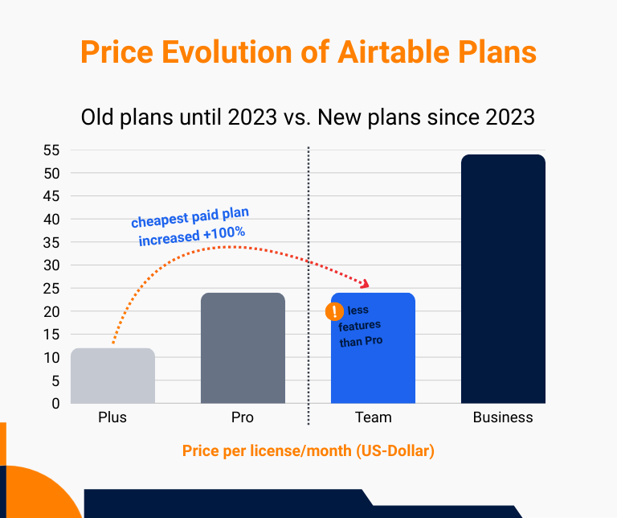

## Airtable – o que é?

Airtable é uma **plataforma de colaboração baseada na nuvem** e uma **mistura de software de folha de cálculo e de base de dados**. Dependendo do seu ponto de vista, a pergunta "O que é Airtable?" pode, portanto, ser respondida de forma diferente: Como normalmente regista e estrutura os seus dados em tabelas, é frequentemente considerado como uma [alternativa ao Excel]() mais poderosa. No entanto, Airtable também é referido como uma [base de dados sem código](), que lhe permite criar, gerir e utilizar bases de dados sem conhecimentos profundos de programação.  

Uma vez que os dados são gerados em quase todo o lado num mundo digitalizado, existe uma **vasta gama de opções de aplicação** para ganhar experiência com Airtable. Assim, Airtable oferece soluções gratuitas de nível de entrada para várias áreas, tais como desenvolvimento de produtos, marketing, operações, gestão de projectos, RH, vendas e finanças, embora estas sejam muito limitadas. Para necessidades mais elevadas e equipas maiores, os preços do Airtable aumentam rapidamente.



## Funções importantes do Airtable

Como já foi referido, Airtable é mais do que uma simples ferramenta de folha de cálculo. Em vez disso, o software está organizado em diferentes níveis hierárquicos: **Espaços de trabalho, Bases, Tabelas, Registos e Campos**. Os campos são as colunas verticais dentro de uma tabela onde, ao contrário do Excel, tem de definir previamente **tipos de dados fixos**. Graças à proximidade com as folhas de cálculo tradicionais, a introdução inicial de dados é muito intuitiva.
  
Airtable é extremamente flexível no que diz respeito à **visualização dos dados**: para além da clássica vista de tabela, pode selecionar Kanban, Gantt, Galeria e Calendário, entre outros. Estão disponíveis filtros, ordenação e agrupamento para o ajudar a preparar os seus dados de forma adequada. Existem também **formulários** para a introdução estruturada de dados.

Airtable também oferece **extensões** para relatórios e estatísticas, design de páginas e controlo de tempo. As **automatizações e integrações** (por exemplo, através de Zapier ou Make) permitem-lhe substituir etapas de trabalho manual por fluxos de trabalho eficientes que são executados automaticamente sob determinadas condições. Por último, mas não menos importante, pode até utilizar o **Airtable Interface Designer** para construir as suas próprias aplicações Web com base nas suas bases de dados – ou fazer com que a sua ideia seja concretizada pelo **Omni**, o assistente de IA do Airtable.

## Vantagens e desvantagens do Airtable

Com base em centenas de comentários online em que os utilizadores descrevem as suas experiências com Airtable, cristalizaram-se alguns pontos fortes e fracos do Airtable. Aqui tem uma visão geral dos argumentos e pontos de crítica mais importantes:

### Caraterísticas e vantagens populares do Airtable

1. **Interface de fácil utilização**: À primeira vista, a interface de utilizador minimalista e limpa do Airtable chama a atenção. Pode organizar os seus dados de forma clara em qualquer altura e apresentá-los em diferentes vistas. Os clientes internacionais ficarão satisfeitos por saber que, embora Airtable não ofereça o português, oferece o inglês, o alemão, o francês e o espanhol como idiomas.
   
2. **Gestão de dados flexível**: Airtable é altamente flexível e adequado a uma grande variedade de projectos e fluxos de trabalho. Pode personalizá-lo de acordo com os seus requisitos individuais e utilizá-lo para uma variedade de casos de utilização - desde listas simples a sistemas complexos.
   
3. **Campos personalizados**: Com numerosos tipos de campos, pode configurar a informação nos seus registos de dados de muitas formas diferentes e definir os tipos de dados que são permitidos nos campos. Isto permite-lhe normalizar os formatos de dados e minimizar os erros de introdução.
   
4. **Integração inteligente da IA**: A inteligência artificial está disponível no Airtable para a conceção de interfaces, bem como integrada como um tipo de campo separado. Com os prompts certos, pode criar aplicações em grande escala e gerar conteúdos a partir dos seus dados.

### Desvantagens e problemas frequentemente mencionados

1. **Quase não existem estruturas predefinidas**: Este é o lado negativo da flexibilidade. Está a utilizar um kit de construção e precisa de certas competências conceptuais para criar estruturas de dados com significado. Os utilizadores que têm pouca experiência com Airtable ou que geralmente não têm conhecimentos prévios de bases de dados e tabelas podem sentir-se sobrecarregados pelo número de funções, especialmente no início.
   
2. **Mais tempo necessário no início**: Esta desvantagem anda de mãos dadas com o ponto anterior. Ao contrário do software especializado da indústria, pode adaptar Airtable de forma flexível às suas necessidades. No entanto, a criação de novos fluxos de trabalho a partir do zero demora normalmente mais tempo no início. Em comparação com [Asana](), por exemplo, Airtable só pode ser recomendado de forma limitada como ferramenta de gestão de projectos, uma vez que tem de organizar muitas coisas por si próprio.
   
3. **Proteção de dados insuficiente**: A proteção de dados do Airtable é constantemente alvo de críticas severas. O armazenamento dos dados dos clientes em servidores na nuvem nos EUA e a falta de uma opção para instalar Airtable no local tornam-no pouco atrativo para muitas empresas com requisitos de segurança mais elevados. Para as empresas da UE, a utilização do software é mesmo juridicamente questionável, uma vez que Airtable não garante totalmente a conformidade com o RGPD.
   
4. **Custos elevados do Airtable**: Muitas equipas que começaram a utilizar Airtable gratuitamente atingem rapidamente os seus limites e são confrontadas com custos explosivos. Os custos do Airtable são dificilmente escaláveis no início e os saltos de preços são imensos; uma licença de equipa custa atualmente 24 dólares americanos por utilizador e por mês. Não existe uma tarifa de entrada mais barata, mas existem alternativas mais baratas: muitos utilizadores mudam para SeaTable, por exemplo, porque não estão satisfeitos com o Airtable Pricing.
   

   
Para além destas grandes desvantagens, as funções individuais do Airtable são também repetidamente criticadas. Por exemplo, muitos utilizadores consideram confusa a gestão do acesso e das autorizações dos utilizadores ou que os cálculos avançados com Airtable fórmulas se tornam rapidamente demasiado complicados. Os utilizadores também referem que algumas funções da versão de secretária não existem na versão móvel do Airtable e que a navegação na Airtable App é um desafio. Embora exista uma função de comentário livre para cada conjunto de dados no Airtable, alguns utilizadores gostariam de ter uma conversa de grupo ou mensagens privadas para uma troca mais intensa.

## Airtable e o RGPD

As empresas na UE estão sujeitas ao Regulamento Geral sobre a Proteção de Dados (RGPD). Por isso, vamos analisar mais de perto a forma com Airtable lida com a proteção de dados. No seu sítio Web, Airtable afirma que o seu programa de proteção de dados foi concebido para cumprir os requisitos, leis e regulamentos, incluindo o RGPD. **No entanto, os dados dos clientes do Airtable são alojados pela Amazon Web Services (AWS) em servidores que estão maioritariamente localizados nos EUA**.

De acordo com o RGPD, Airtable oferece-lhe a **Residência Europeia de Dados**, em que os dados dos clientes são geridos num centro de dados da AWS em Frankfurt (Alemanha) e as cópias de segurança são protegidas num centro de dados da AWS na Irlanda. No entanto, esta opção só está disponível a partir da subscrição mais cara (Enterprise Scale), o que está fora de questão para muitos utilizadores. Mesmo que tire partido da Residência Europeia de Dados, apenas o **conteúdo da base de dados** (por exemplo, registos de dados, ficheiros e histórico de alterações) é armazenado na UE. Todas as outras informações, tais como dados de utilizador e de autenticação, metadados (por exemplo, nomes e descrições da base de dados) e dados de suporte continuarão a ser armazenados nos EUA. Por conseguinte, as empresas da UE que utilizam Airtable não podem garantir a conformidade com o RGPD, que proíbe a **transferência de dados pessoais** para países terceiros, como os EUA, sem consentimento explícito.

A este respeito, deve saber que o chamado [USA Patriot Act](https://pt.wikipedia.org/wiki/USA_PATRIOT_Act), na sequência dos ataques terroristas de 11 de setembro de 2001, permite que algumas autoridades norte-americanas, como o FBI, a NSA ou a CIA, acedam aos servidores de empresas norte-americanas sem ordem judicial e desviem dados pessoais. Em 2013, soube-se que isto não estava a acontecer apenas em casos individuais, mas que a **vigilância dos servidores de grandes empresas tecnológicas americanas**, como a Microsoft e a Google, estava a ocorrer de forma sistemática, em massa e contínua. O que é considerado um mal necessário para as empresas nos Estados Unidos é um não-lugar para as empresas na Europa e em muitas outras partes do mundo. Alguns especialistas receiam mesmo que os EUA estejam deliberadamente a praticar **espionagem industrial** e desaconselham, em geral, o armazenamento de dados em nuvens americanas.

### É possível utilizar Airtable auto-hospedado?

Se está agora a pensar em formas de poder utilizar Airtable de uma forma compatível com o RGPD, provavelmente tem a ideia de implementar Airtable auto-hospedado. Muitas partes interessadas com **elevados requisitos de segurança de dados**, especialmente empresas de infra-estruturas críticas, também têm o desejo de instalar e operar Airtable self-hosted nos seus próprios servidores. No entanto, essa transferência do Airtable não é possível, uma vez que a solução só está disponível como um [produto SaaS baseado na nuvem]() e Airtable não tem planos para oferecer uma versão no local no futuro.


Como alternativa a Airtable, a solução sem código [SeaTable]() entra em jogo aqui. Esta não é de modo algum inferior à concorrência dos EUA, mas oferece mais funções do que Airtable gratuitamente e é também significativamente mais barata nas subscrições pagas. Pode escolher livremente se pretende utilizar a [SeaTable Cloud](), em conformidade com o RGPD, que está alojada exclusivamente em servidores alemães de um fornecedor suíço, ou desfrutar da total soberania de dados de uma instalação no local com o [SeaTable Server]().




## Airtable Pricing e Subscrições

Tal como a maioria dos fornecedores de serviços na nuvem, Airtable baseia-se num modelo de **pagamento à medida que vai utilizando**. Isto significa que começa com uma versão básica gratuita, que terá de atualizar assim que precisar de **funções alargadas**, quiser adicionar **mais utilizadores** ou exceder determinados **limites**. Em princípio, só paga pelo âmbito do produto que efetivamente utiliza. Aqui tem uma visão geral das várias tarifas:

| | **Airtable Free** | **Airtable Team** | **Airtable Business** | **Airtable Enterprise Scale** |
| ------------------------------ | ----------------------------- | ----------------------------- | ----------------------------- | ----------------------------- |
| **Preço por utilizador/mês** | - | 24 USD | 54 USD | individual |
| **Número máximo de utilizadores** | 5 | ilimitado | ilimitado | ilimitado |
| **Registos por base** | 1.000 | 50.000 | 125.000 | 500.000 |
| **Armazenamento por base** | 1 GB | 20 GB | 100 GB | 1.000 GB |
| **Execuções de automação por mês** | 100 | 25.000 | 100.000 | 500.000 |
| **Histórico de alterações** | 2 semanas | 1 ano | 2 anos | 3 anos |
| **Créditos de IA** | 500 | 15.000 | 20.000 | 25.000 |

Esta tabela apresenta os limites mais importantes que podem levá-lo a atualizar. Se estiver interessado em saber mais sobre as funções do Airtable que estão incluídas em cada subscrição, pode ler o Airtable Pricing em pormenor no sítio Web da empresa.

### Como pode utilizar Airtable gratuitamente

Se quiser testar Airtable, a primeira coisa de que necessita é uma **conta**. Pode criá-la com Airtable Free. Após o seu primeiro início de sessão no Airtable, será atualizado para a subscrição de Team paga durante 14 dias gratuitos, para que possa testar as funções alargadas sem compromisso. Depois disso, regressará à versão gratuita, que contém apenas as funções básicas do Airtable.

### Comparação dos custos do Airtable

Em primeiro lugar, podemos ver que Airtable já ajustou os seus preços no passado. Enquanto **a subscrição paga mais barata** (Airtable Plus) continuava a custar 12 dólares americanos por utilizador e por mês em 2023, agora é duas vezes mais cara, a **24 dólares americanos por utilizador e por mês** (Airtable Team) – porque a subscrição Plus já não existe. Este facto aumenta o obstáculo financeiro para que as pequenas empresas, em particular, mudem para uma versão paga.

Além disso, a subscrição Team **contém menos funcionalidades do que a anterior subscrição Pro**, apesar de custar o mesmo que a sua antecessora. Por exemplo, Airtable reduziu para metade o número de execuções de automatização, de um máximo de 50 000 por mês para apenas 25 000 por mês, e introduziu um limite de 100 000 por mês para as chamadas API anteriormente ilimitadas. Os utilizadores mais exigentes que não gostem desta situação têm de atualizar para a **subscrição Business**, que é mais do dobro do preço.

Como pode ver, é frequente haver um despertar rude logo após a entrada gratuita: Porque depois de ter mudado os processos da sua empresa para Airtable e a sua equipa e volume de dados crescerem, tem de ir ao fundo dos seus bolsos ou voltar a usar software barato. É um segredo aberto que Airtable **não oferece a melhor relação preço-desempenho**. Por isso, pode poupar muito dinheiro e esforço optando diretamente por um concorrente mais barato do Airtable.

## Conclusão: Os preços e a proteção de dados do Airtable não são convincentes

Inicialmente, Airtable teve um desempenho bastante bom no teste: O software pontua com muitas **funções úteis** relacionadas com a gestão de dados, uma interface de utilizador organizada e caraterísticas de IA impressionantes. Muitos utilizadores elogiam a elevada **flexibilidade** de poderem conceber as suas próprias aplicações a partir do zero, mesmo que Airtable exija inicialmente mais tempo e esforço concetual do que o software convencional.
  
No entanto, como uma **nuvem americana sem uma versão local**, o fornecedor levanta grandes dúvidas sobre se Airtable pode realmente garantir a proteção de dados. Como os dados pessoais nos servidores de empresas americanas podem ser espiados, Airtable é incompatível com o RGPD e não pode ser utilizado por empresas na UE. O **Airtable Pricing** é também menos adequado para pequenas equipas com volumes de dados e números de utilizadores crescentes, uma vez que os custos do Airtable disparam da versão gratuita para a subscrição de Team.

Se estiver à procura de uma alternativa que ofereça **mais segurança de dados e uma melhor relação preço-desempenho**, vale a pena considerar SeaTable em particular. Porque não dá uma vista de olhos à versão básica gratuita do SeaTable, que tem uma vasta gama de funções e **limites mais generosos do que Airtable**.



## Perguntas frequentes sobre Airtable


Airtable é um software de base de dados baseado na nuvem e uma plataforma de colaboração. À primeira vista, parece uma folha de cálculo clássica, razão pela qual também é vista como uma poderosa alternativa ao Excel.



Sim, pode começar a utilizar Airtable gratuitamente, mas terá de se contentar com funções limitadas e limites de memória. Quando fizer uma atualização, os custos do Airtable aumentam drasticamente. A versão paga mais barata começa em 24 dólares americanos por utilizador e por mês.



Não, infelizmente não existe uma forma de instalar e utilizar Airtable self-hosted nos seus próprios servidores. No entanto, existem concorrentes do Airtable, como SeaTable, que oferecem não só uma solução na nuvem, mas também uma solução no local.



Airtable está a esforçar-se por cumprir o RGPD; no entanto, como fornecedor de serviços na nuvem dos EUA sem uma opção auto-hospedada, é questionável se Airtable pode realmente garantir a proteção de dados de acordo com as normas europeias. Isto porque as autoridades norte-americanas, como o FBI, a NSA e a CIA, estão autorizadas a aceder aos servidores de empresas norte-americanas e a analisar dados pessoais sem uma ordem judicial. A Residência Europeia de Dados do Airtable poderia oferecer uma melhor proteção, mas esta só está disponível na subscrição mais cara (Enterprise Scale), o que está fora de questão para a maioria dos utilizadores.



Não. Não pode configurar a interface de utilizador do Airtable para português, mas pode configurá-la para inglês, alemão, francês ou espanhol.
