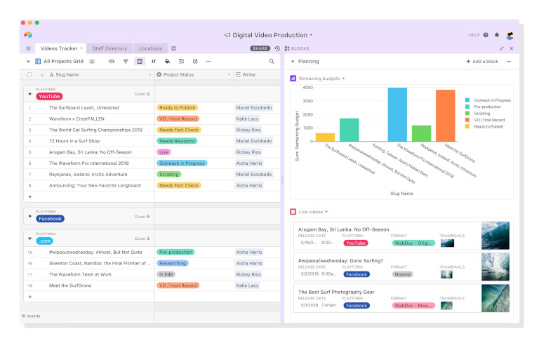
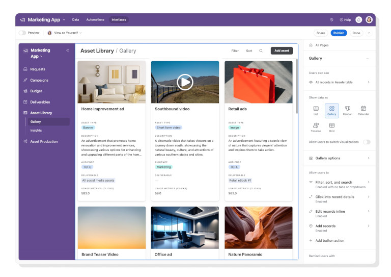
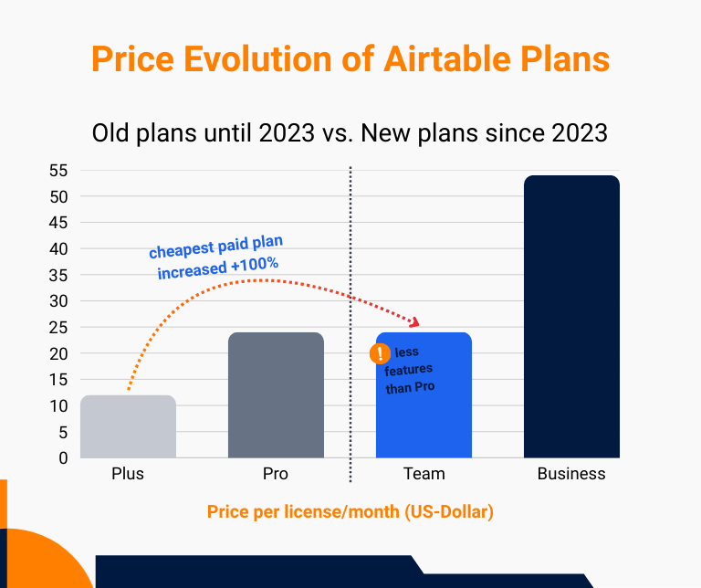

## Что такое Airtable?

Airtable – это **облачная платформа для совместной работы**, которая представляет собой **смесь электронных таблиц и программ для работы с базами данных**. В зависимости от Вашей точки зрения, на вопрос "Что такое Airtable?" можно ответить по-разному: поскольку Вы обычно записываете и структурируете свои данные в таблицах, его часто рассматривают как более мощную [альтернативу Excel](). Однако Airtable также называют [базой данных без кода](), с помощью которой можно создавать, управлять и использовать базы данных без глубоких знаний программирования.  

Поскольку в оцифрованном мире данные генерируются практически повсеместно, существует широкий спектр **приложений** для получения опыта работы с Airtable. Поэтому Airtable предлагает бесплатные решения начального уровня для различных областей, таких как разработка продуктов, маркетинг, операционная деятельность, управление проектами, управление персоналом, продажи и финансы, хотя они очень ограничены. Для более высоких требований и больших команд цены на Airtable быстро растут.



## Важные функции Airtable

Как уже упоминалось, Airtable – это не просто инструмент для работы с электронными таблицами. Скорее, программа организована в виде различных иерархических уровней: **Рабочие пространства, Базы, Таблицы, Записи и Поля**. Поля – это вертикальные столбцы внутри таблицы, где, в отличие от Excel, Вам необходимо заранее определить **фиксированные типы данных**. Благодаря близости к традиционным электронным таблицам, первоначальный ввод данных очень интуитивен.
  
Airtable очень гибко подходит к **визуализации данных**: помимо классического табличного представления, Вы можете выбрать Канбан, Гантт, галерею, календарь и другие. Фильтры, сортировка и группировка помогут Вам подготовить данные должным образом. Также есть **формы** для структурированного ввода данных.

Airtable также предлагает **расширения** для отчетов и статистики, дизайна страниц и учета рабочего времени. **Автоматизации и интеграции** (например, через Zapier или Make) позволяют Вам заменить ручные действия эффективными рабочими процессами, которые запускаются автоматически при определенных условиях. И последнее, но не менее важное: Вы можете использовать **Конструктор интерфейсов Airtable** для создания собственных веб-приложений на основе Ваших баз данных – или попросить реализовать Вашу идею **Омни**, собственного ИИ-помощника Airtable.

## Преимущества и недостатки Airtable

На основе сотен отзывов в Интернете, в которых пользователи описывают свой опыт работы с Airtable, выкристаллизовались некоторые сильные и слабые стороны Airtable. Здесь представлен обзор наиболее важных аргументов и пунктов критики:

### Популярные особенности и преимущества Airtable

1. **Удобный для пользователя интерфейс**: С первого взгляда минималистичный, чистый пользовательский интерфейс Airtable привлекает внимание. Вы можете в любой момент четко упорядочить свои данные и отобразить их в различных видах. Иностранные пользователи будут рады узнать, что Airtable доступен на английском, немецком, французском и испанском языках.
   
2. **Гибкое управление данными**: Airtable очень гибок и подходит для самых разных проектов и рабочих процессов. Вы можете настроить его в соответствии с Вашими индивидуальными требованиями и использовать для самых разных целей – от простых списков до сложных систем.
   
3. **Настраиваемые поля**: Благодаря многочисленным типам полей Вы можете по-разному конфигурировать информацию в Ваших записях данных и определять типы данных, которые разрешено использовать в полях. Это позволит Вам стандартизировать форматы данных и свести к минимуму ошибки ввода.
   
4. **Умная интеграция искусственного интеллекта**: [Искусственный интеллект]() доступен в Airtable для проектирования интерфейса, а также интегрирован в качестве отдельного типа поля. С помощью правильных подсказок Вы можете создавать приложения в больших масштабах и генерировать контент на основе Ваших данных.

### Часто упоминаемые недостатки и проблемы

1. **Едва ли есть предопределенные структуры**: Это обратная сторона гибкости. Вы используете строительный набор и нуждаетесь в определенных концептуальных навыках для создания значимых структур данных. Пользователи, которые имеют небольшой опыт работы с Airtable или вообще не имеют предварительных знаний о базах данных и таблицах, могут почувствовать себя ошеломленными количеством функций, особенно в начале работы.
   
2. **Больше времени потребуется на начальном этапе**: Этот недостаток связан с предыдущим пунктом. В отличие от специализированного отраслевого программного обеспечения, Вы можете гибко адаптировать Airtable к своим требованиям. Однако создание новых рабочих процессов с нуля обычно занимает больше времени на начальном этапе. По сравнению, например, с [Asana](), Airtable можно рекомендовать лишь в ограниченной степени как инструмент управления проектами, поскольку Вам придется многое собирать воедино самостоятельно.
   
3. **Недостаточная защита данных**: Снова и снова защита данных Airtable подвергается жесткой критике. Хранение данных клиентов на облачных серверах в США и отсутствие возможности установки Airtable на локальных серверах делают Airtable непривлекательным для многих компаний с повышенными требованиями к безопасности. Для компаний в ЕС использование этого программного обеспечения даже незаконно, поскольку Airtable не гарантирует полного соответствия GDPR.
   
4. **Высокая стоимость Airtable**: Многие команды, которые начали использовать Airtable бесплатно, вскоре достигли своего предела и столкнулись со стремительно растущими расходами. Расходы на Airtable неуправляемы на начальном этапе, с трудом масштабируются, а скачки цен просто огромны; в настоящее время лицензия для команды стоит 24 доллара США на одного пользователя в месяц. Более дешевого тарифа начального уровня не существует, но есть более дешевые альтернативы Airtable: многие пользователи переходят на SeaTable, например, потому что их не устраивает ценообразование Airtable.
   

   
В дополнение к этим основным недостаткам, отдельные функции Airtable также неоднократно подвергались критике. Например, многие пользователи находят управление доступом и авторизацией пользователей запутанным, или что продвинутые расчеты с формулами в Airtable быстро становятся слишком сложными. Пользователи также отмечают, что некоторые функции из настольной версии отсутствуют в мобильной версии Airtable, а навигация в приложении Airtable вызывает затруднения. Хотя в Airtable есть функция бесплатных комментариев для каждого набора данных, некоторые пользователи хотели бы иметь групповой чат или личные сообщения для более интенсивного обмена мнениями.

## Airtable и GDPR

Компании в ЕС подпадают под действие Общего регламента по защите данных (GDPR). Поэтому мы рассмотрим подробнее, как Airtable относится к защите данных. На своем сайте компания Airtable заявляет, что ее программа защиты данных разработана в соответствии с требованиями, законами и нормативными актами, включая GDPR. **Однако данные клиентов Airtable размещаются на серверах Amazon Web Services (AWS), которые в основном находятся в США**.

В соответствии с GDPR, Airtable предлагает Вам **Европейскую резиденцию данных**, при которой данные клиентов хранятся в дата-центре AWS во Франкфурте (Германия), а резервные копии защищены в дата-центре AWS в Ирландии. Однако эта опция доступна только в самой дорогой подписке (Enterprise Scale), что не по карману многим пользователям. Даже если Вы воспользуетесь преимуществами европейского резидентства данных, в ЕС будет храниться только **содержимое базы данных** (например, записи данных, файлы и история изменений). Вся остальная информация, такая как данные о пользователях и аутентификации, метаданные (например, имена и описания баз данных) и данные поддержки будут по-прежнему храниться в США. Поэтому компании из ЕС, использующие Airtable, не могут гарантировать соблюдение GDPR, который запрещает **передачу персональных данных** в третьи страны, такие как США, без явно выраженного согласия.

В этой связи Вам следует знать, что так называемый [USA Patriot Act](https://de.wikipedia.org/wiki/USA_Patriot_Act), принятый после террористических атак 11 сентября 2001 года, позволяет некоторым американским властям, таким как ФБР, АНБ или ЦРУ, получать доступ к серверам американских компаний без решения суда и выкачивать персональные данные. В 2013 году стало известно, что это происходит не только в отдельных случаях, но и что **слежка за серверами крупных американских технологических компаний**, таких как Microsoft и Google, ведется систематически, массово и непрерывно. То, что считается необходимым злом для компаний в США, является недопустимым для компаний в Европе и многих других частях света. Некоторые эксперты даже опасаются, что США намеренно занимаются **промышленным шпионажем**, и вообще не советуют хранить данные в американских "облаках".

### Можно ли использовать Airtable на собственном хостинге?

Если Вы сейчас думаете о том, как использовать Airtable в соответствии с требованиями GDPR, у Вас, вероятно, возникла идея развернуть Airtable на собственном хостинге. Многие заинтересованные лица, предъявляющие **высокие требования к безопасности данных**, особенно компании с критически важной инфраструктурой, также имеют желание установить и эксплуатировать Airtable на собственных серверах. Однако такая загрузка Airtable невозможна, поскольку решение доступно только как [облачный SaaS-продукт](), и Airtable не планирует предлагать локальную версию в будущем.


В качестве альтернативы Airtable здесь выступает бескодовое решение [SeaTable](). Оно ни в чем не уступает конкуренту из США, но предлагает больше функций, чем Airtable, бесплатно, а также значительно дешевле в платных подписках. Вы вольны выбирать, использовать ли Вам [SeaTable Cloud](), отвечающий требованиям GDPR, который размещается исключительно на немецких серверах швейцарского провайдера, или наслаждаться полным суверенитетом данных при локальной установке с [SeaTable Server]().




## Цены и подписки на Airtable

Как и большинство облачных провайдеров, Airtable работает по модели **оплата по мере использования**. Это означает, что Вы начинаете с бесплатной базовой версии, которую Вы должны обновить, как только Вам понадобятся **расширенные функции**, Вы захотите добавить **больше пользователей** или превысите определенные **лимиты**. В принципе, Вы платите только за тот объем продукта, который Вы фактически используете. Здесь представлен обзор различных тарифов:

| | **Airtable Free** | **Airtable Team** | **Airtable Business** | **Airtable Enterprise Scale** | 
| ------------------------------ | ----------------------------- | ----------------------------- | ----------------------------- | ----------------------------- |
| **Цена за пользователя/месяц** | – | 24 USD | 54 USD | индивидуально |
| **Макс. количество пользователей** | 5 | неограниченное | неограниченное | неограниченное | неограниченное |
| **Записи на базу** | 1,000 | 50,000 | 125,000 | 500,000 |
| **Место для хранения данных на базе** | 1 ГБ | 20 ГБ | 100 ГБ | 1,000 ГБ |
| **Автоматизация в месяц** | 100 | 25,000 | 100,000 | 500,000 |
| **История изменений** | 2 недели | 1 год | 2 года | 3 года |
| **Исполнение ИИ** | 500 | 15,000 | 20,000 | 25,000 |

В этой таблице перечислены наиболее важные ограничения, которые могут побудить Вас к обновлению. Если Вам интересно узнать больше о том, какие функции Airtable включены в ту или иную подписку, Вы можете подробно ознакомиться с ценами на Airtable на сайте компании.

### Как Вы можете использовать Airtable бесплатно

Если Вы хотите протестировать Airtable, первое, что Вам нужно, – это **аккаунт**. Вы можете создать его бесплатно с помощью Airtable. После Вашего первого входа в Airtable Вы в любом случае будете бесплатно переведены на платную командную подписку на 14 дней, чтобы Вы могли протестировать расширенные функции без каких-либо обязательств. После этого Вы вернетесь к бесплатной версии, которая содержит только базовые функции Airtable.

### Стоимость Airtable в сравнении

Прежде всего, мы видим, что Airtable уже корректировал свое ценообразование в прошлом. Если **самая дешевая платная подписка** (Airtable Plus) в 2023 году все еще стоила 12 долларов США за пользователя в месяц, то сейчас она вдвое дороже – **24 доллара США за пользователя в месяц** (Airtable Team) – потому что подписки Plus больше не существует. Это увеличивает финансовое препятствие для небольших компаний, особенно для тех, кто хочет перейти на платную версию.

Кроме того, подписка Team **содержит меньше функций, чем прежняя подписка Pro**, хотя стоит она столько же, сколько и ее предшественница. Например, Airtable вдвое сократил количество запусков автоматизации – с максимальных 50 000 в месяц до всего лишь 25 000 в месяц – и ввел ограничение в 100 000 в месяц для ранее неограниченного количества вызовов API. Заядлым пользователям, которым это не нравится, придется перейти на **Бизнес-подписку**, которая стоит более чем в два раза дороже.

Как Вы можете видеть, вскоре после бесплатного входа часто наступает грубое пробуждение: Потому что как только Вы переведете процессы своей компании на Airtable, а Ваша команда и объемы данных вырастут, Вам придется либо поглубже залезть в карман, либо снова перейти на недорогое программное обеспечение. Открытым секретом является то, что Airtable **не предлагает лучшего соотношения цены и качества**. Поэтому Вы можете сэкономить кучу денег и усилий, сделав выбор в пользу более дешевого конкурента Airtable.

## Вывод: цены на Airtable и защита данных неубедительны

Изначально Airtable показал неплохие результаты в тесте: У программы много **полезных функций**, связанных с управлением данными, аккуратный пользовательский интерфейс и впечатляющие возможности искусственного интеллекта. Многие пользователи хвалят высокую **гибкость**, позволяющую создавать собственные приложения с нуля, даже если Airtable изначально требует больше времени и концептуальных усилий, чем обычное ПО.
  
Однако, будучи **американским облаком без локальной версии**, поставщик вызывает большие сомнения в том, действительно ли Airtable может гарантировать защиту данных. Поскольку личные данные на серверах американских компаний могут быть предметом шпионажа, Airtable несовместим с GDPR и не может использоваться компаниями в ЕС. **Ценообразование Airtable** также не подходит для небольших команд с растущими объемами данных и количеством пользователей, поскольку стоимость Airtable резко возрастает с бесплатной версии до командной подписки.

Если Вы ищете альтернативу, предлагающую **большую безопасность данных и лучшее соотношение цены и качества**, то стоит обратить внимание, в частности, на SeaTable. Почему бы не взглянуть на бесплатную базовую версию SeaTable, которая обладает широким набором функций и **более щедрыми лимитами, чем Airtable**.



## Часто задаваемые вопросы о Airtable


Airtable – это облачное программное обеспечение для работы с базами данных и платформа для совместной работы. На первый взгляд, она похожа на классическую электронную таблицу, поэтому ее также рассматривают как мощную альтернативу Excel.



Да, Вы можете начать работать с Airtable бесплатно, но Вам придется довольствоваться ограниченными функциями и лимитом памяти. Когда Вы переходите на новую версию, стоимость Airtable значительно возрастает. Самая дешевая платная версия начинается от 24 долларов США за пользователя в месяц.



Нет, к сожалению, не существует возможности установить и использовать Airtable самостоятельно на своих собственных серверах. Однако есть конкуренты Airtable, такие как SeaTable, которые предлагают не только облачное, но и локальное решение.



Airtable старается соответствовать GDPR; однако, поскольку Airtable является американским облачным провайдером и не имеет возможности самостоятельного хостинга, сомнительно, что Airtable действительно может гарантировать защиту данных в соответствии с европейскими стандартами. Это связано с тем, что американские власти, такие как ФБР, АНБ и ЦРУ, имеют право получать доступ к серверам американских компаний и анализировать личные данные без судебного ордера. Европейское резидентство данных Airtable могло бы предложить более надежную защиту, но она доступна только в самой дорогой подписке (Enterprise Scale), что не по карману большинству пользователей.



Нет, Вы можете настроить пользовательский интерфейс Airtable только на немецкий, английский, французский или испанский языки.
