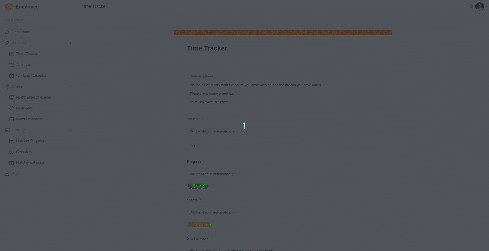

Wahrscheinlich haben Sie es bereits aus den Medien erfahren: Das Bundesarbeitsministerium plant für 2023 eine Reform des Arbeitszeitgesetzes. Doch was ändert sich dadurch für Sie und Ihr Unternehmen? Müssen Sie teure Zeiterfassungssysteme anschaffen oder reicht eine [kostenlose Software]()? In diesem Artikel zeigen wir Ihnen, wie Sie die Zeiterfassung Ihrer Mitarbeiter mit minimalem Verwaltungsaufwand umsetzen und dabei geltendes Recht einhalten.

## Die aktuelle Rechtslage zur Zeiterfassung in Unternehmen

Nachdem der Europäische Gerichtshof (EuGH) bereits im Mai 2019 entschieden hatte, dass Unternehmen in der EU die Arbeitszeit ihrer Mitarbeiter erfassen müssen, ließ sich die Politik in Deutschland erst einmal viel Zeit mit der Umsetzung in nationales Recht. [Den ersten Entwurf zur Reform des Arbeitszeitgesetzes hat das Bundesarbeitsministerium im April 2023 vorgelegt.](https://www.tagesschau.de/wirtschaft/unternehmen/arbeitszeit-erfassung-heil-101.html) Demzufolge müssen Beginn, Ende und Dauer der täglichen Arbeitszeit aufgezeichnet werden – und zwar elektronisch und in der Regel noch am selben Tag.

Das Bundesarbeitsgericht hatte zuvor mit seiner [Entscheidung vom 13. September 2022](https://www.verdi.de/themen/recht-datenschutz/++co++0ba8cc14-1882-11ed-9793-001a4a160129) Fakten geschaffen: Es bestätigte in seinem Urteil, dass deutsche Arbeitgeber zur Zeiterfassung in ihren Unternehmen verpflichtet sind. Der Gedanke dahinter ist, die Mitarbeiter vor zu langen Arbeitszeiten, zu wenigen Pausen und zu kurzen Ruhezeiten zu schützen.

Denn laut geltendem Arbeitszeitgesetz müssen Arbeitgeber bereits sicherstellen, dass

- die **reguläre Arbeitszeit** im Durchschnitt **8 Stunden pro Werktag** bzw. 48 Stunden pro Woche nicht überschreitet.
- die Mitarbeiter **maximal 10 Stunden pro Tag** bzw. maximal 60 Stunden pro Woche arbeiten.
- die Mitarbeiter bei einem 8-Stunden-Tag mindestens **30 Minuten Pause** einlegen.
- die Mitarbeiter nach Beendigung der täglichen Arbeitszeit mindestens eine **Ruhezeit von 11 Stunden** bis zum erneuten Arbeitsantritt einhalten.

Damit ein Verstoß gegen diese Regeln überhaupt auffallen kann, muss ein Arbeitgeber die Arbeitszeit seiner Mitarbeiter zunächst erfassen.

## Ist das Ende der Vertrauensarbeitszeit eingeläutet?

In vielen Unternehmen – vielleicht auch in Ihrem – gibt es bisher die sogenannte **Vertrauensarbeitszeit**. Hierbei verzichtet der Arbeitgeber gänzlich darauf, Arbeitsbeginn und -ende zu definieren. Vielmehr setzt er darauf, dass seine Mitarbeiter ihre Aufgaben ohne Chef im Nacken erfüllen und ihre Arbeitszeiten selbst im Blick behalten. Der **Wert der Arbeit** bemisst sich dabei an den Ergebnissen und nicht an der reinen Anwesenheitszeit, wogegen per Gesetz nichts spricht.

Was den Mitarbeitern große Flexibilität und Selbstbestimmung bietet, steht scheinbar jedoch im krassen **Widerspruch zur verpflichtenden Zeiterfassung**. Diese soll vom Gesetz abweichende Arbeitszeiten und vor allem Überstunden sichtbar machen. Dem liegt die Annahme zugrunde, dass Menschen in Vertrauensarbeitszeit ihre tatsächliche Arbeitszeit häufig über- oder unterschätzen und bisweilen die gesetzlichen Regelungen überhaupt nicht kennen.

Ohne Zeiterfassung der Mitarbeiter ist es daher unmöglich, eine dauerhaft **zu hohe oder zu niedrige Stundenzahl** sicher erkennen zu können. Auch eine Ausnutzung übermotivierter Mitarbeiter durch die Arbeitgeber ist bei Vertrauensarbeitszeit nicht auszuschließen. Denn was viele nicht wissen: Niemand ist zu **Überstunden** verpflichtet – und wenn Arbeitgeber sie anordnen, müssen sie Überstunden mit Geld oder Freizeit wieder ausgleichen. Steht im Arbeitsvertrag, dass Überstunden pauschal mit dem Festgehalt abgegolten sind, ist das unwirksam.

In den meisten Fällen ist die Vertrauensarbeitszeit dennoch von beiden Seiten gewünscht, fördert sie doch das **Vertrauensverhältnis** zwischen Arbeitnehmer und Arbeitgeber – ein hohes Gut, das durch Arbeitszeitkontrolle keinen Schaden nehmen soll. Wenn Sie das bislang in Ihrem Unternehmen so gehändelt haben, kann die Lösung wie folgt aussehen: Die Mitarbeiter erfassen ihre Arbeitszeiten in einem System, das der jeweiligen Führungskraft ermöglicht die Einhaltung der Arbeitszeitregelungen zu überprüfen, sie gestalten die Arbeitseinteilung aber (im Rahmen des Arbeitszeitgesetzes) weiterhin frei und eigenverantwortlich.

Dabei können Sie sich folgenden Umstand zunutze machen: Grundsätzlich trägt zwar der Arbeitgeber die Verantwortung für eine ordnungsgemäße und korrekte Zeiterfassung, er kann diese Aufgabe aber auch an seine Mitarbeiter delegieren. Dann liegt es in ihren Händen, den Arbeitsbeginn, das Ende und die Pause(n) selbst zu bestimmen und gewissenhaft zu dokumentieren.

## Wie Sie die Zeiterfassung technisch umsetzen

Das EuGH-Urteil fordert ein „objektives, verlässliches und zugängliches System“, mit dem Sie die täglich geleistete Arbeitszeit messen können. Aber was genau ist damit gemeint?

Seit der Corona-Krise ist klar: Das **Homeoffice** ist in vielen Unternehmen nicht mehr wegzudenken und **hybrides Arbeiten** an verschiedenen Orten schon Normalität. Während Stechuhren stillstanden und Stundenzettel verstaubten, hielten digitale Lösungen Einzug in die Arbeitswelt – anders war die Zeiterfassung der Mitarbeiter schlichtweg nicht mehr möglich. Und auch für die Zukunft heißt das, dass an Büroräume gebundene Stechuhren kein zugängliches System darstellen, wenn sich die Mitarbeiter nicht remote einloggen können.

Viele Unternehmen sind dazu übergegangen, die Stunden statt auf Papier in digitalen Tabellen einzutragen. Aber auch das ist keine gute Lösung: Für die Mitarbeiter ist das Eintragen der Stunden z. B. in **Excel Tabellen** oder **Google Sheets** sehr zeitaufwändig und fehleranfällig: Schnell ist es passiert, dass man sich unbemerkt vertippt oder bei der Eingabe in der Zeile bzw. Spalte verrutscht. Zudem pflegen dann alle Mitarbeiter eigene Tabellen an verschiedenen Ablageorten, was es für die Führungskräfte und die Personalabteilung schwierig macht, die Daten regelmäßig zusammenzuführen und im Blick zu behalten: Spätestens am Monatsende werden sie jedes Mal von einer Masse an digitalen Stundentabellen erschlagen.

## Optimale Zeiterfassung Ihrer Mitarbeiter mit SeaTable

Wie also lässt sich die Arbeitszeit der Mitarbeiter schnell, einfach und rechtskonform erfassen? Mit einer speziell auf diesen Anwendungsfall zugeschnittenen Vorlage von SeaTable!

Wie bei jeder SeaTable Vorlage handelt es sich um eine **Datenbank** mit verschiedenen Tabellen, die Sie an Ihre eigenen spezifischen Bedürfnisse anpassen können. In der ersten Tabelle haben wir für Sie eine übergreifende Admin-Ansicht angelegt, in die alle **Arbeitszeiten**, **Urlaubsanträge** und **Krankmeldungen** Ihrer Mitarbeiter einfließen. Als Führungskraft haben Sie den vollen Überblick über die An- und Abwesenheiten aller Mitarbeiter in Ihrem Team.

Admin-Ansicht der Arbeitszeit-Tabelle

Über personalisierte, [mit der User-ID gefilterte Ansichten](https://seatable.io/docs/ansichtsoptionen/was-ist-die-id-des-users-und-warum-kann-man-danach-filtern/) können Sie exakt steuern, wer welche Daten sehen kann, und so jedem Mitarbeiter sein eigenes Stundenkonto mit den für ihn relevanten Daten erstellen. Mehr dazu erfahren Sie in unserem [Erklärvideo auf YouTube](https://www.youtube.com/watch?v=nLXLACzVhAQ).

Damit sowohl Ihre Mitarbeiter als auch Sie selbst jederzeit die Einhaltung der Arbeitszeitregelungen im Blick haben, errechnet SeaTable die geleistete Stundenzahl sowie die Über- oder Unterstunden in Bezug auf die reguläre tägliche Arbeitszeit. Durch die [farbliche Markierung](https://seatable.io/docs/ansichtsoptionen/farbliche-markierung-von-zellen/) der Zeilen sehen Sie und Ihre Teammitglieder direkt, ob der Stundensaldo eines Tages im Minus (rot) oder im Plus (grün) ist.

In einer mit SeaTable gebauten Mitarbeiter-App können Sie die Datenerfassung intuitiv und benutzerfreundlich gestalten, indem Sie Ihre Mitarbeiter die Arbeitszeiten, Urlaubsanträge und Krankmeldungen in [Webformularen](https://seatable.io/docs/webformulare/webformulare/) erfassen lassen. Dabei können Sie die Eingabefelder mit konkreten Anweisungen versehen, um die Ausfüllenden sicher durch den Prozess zu leiten. Ein ausgefülltes Webformular entspricht je einem Werktag, einem Urlaubsantrag oder einer Krankmeldung.

Mitarbeiter-App für Arbeitszeiten, Urlaubsanträge und Krankmeldung

Wenn Ihre Mitarbeiter die Formulare absenden, fügt SeaTable neue Einträge in den entsprechenden Tabellen hinzu, die Sie als Führungskraft anschließend in der Management-App freigeben oder ablehnen können. Auf Ihrem Dashboard können Sie Statistiken einbauen, mit denen Sie alle Überstunden, Urlaube und Krankmeldungen Ihrer Mitarbeiter im Blick behalten. Der [Kalender](https://seatable.io/docs/plugins/anleitung-zum-kalender-plugin/) ermöglicht zudem die Darstellung der Daten in einer kalendarischen Übersicht.

Management-App mit Dashboard

Zur Erinnerung: Hierbei handelt es sich nur um eine beispielhafte Vorlage, die wir für Sie erstellt haben. Alle Grundfunktionen sind in einem kostenlosen Free Abonnement enthalten, für den vollen Funktionsumfang inklusive Automationen benötigen Sie aber ein Enterprise Abonnement. Natürlich können Sie noch viele weitere Features von SeaTable nutzen, um ganz nach Ihren Wünschen eine eigene Anwendung für die Zeiterfassung in Ihrem Unternehmen zu entwickeln.

[Erfahren Sie hier alles zu unserem Template](), das Ihre Arbeitszeiterfassung revolutionieren wird.

## Fazit: Warum sich SeaTable für Sie lohnt

Schlussendlich können Sie in SeaTable alle notwendigen Prozesse abbilden, um die Arbeitszeiten Ihrer Mitarbeiter der aktuellen Rechtslage entsprechend und mit minimalem Verwaltungsaufwand zu erfassen. Um die Einhaltung der Arbeitszeitregelungen sicherzustellen, können Sie sich stets ein vollständiges Bild von den geleisteten Stunden im Team machen und mithilfe einer Management-App die Daten für einzelne Mitarbeiter auswerten.

In SeaTable dokumentieren Sie und Ihre Mitarbeiter die Zeiterfassung, Urlaubsanträge und Krankheitstage an einem zentralen Ort, anstatt viele verstreute Stundentabellen (z. B. in Excel oder Google Sheets) zu pflegen. Alles, was Sie dafür benötigen, ist ein Internet-Browser und eine E-Mail-Adresse.

Dennoch ist die Zeiterfassung nur ein einziger Anwendungsfall der schier unendlichen Möglichkeiten, die SeaTable Ihnen bietet. Entdecken Sie in unseren [Vorlagen](), welche beeindruckenden Software-Lösungen Sie mit SeaTable bauen können, und starten Sie am besten gleich mit einem [kostenlosen Free Account]().
