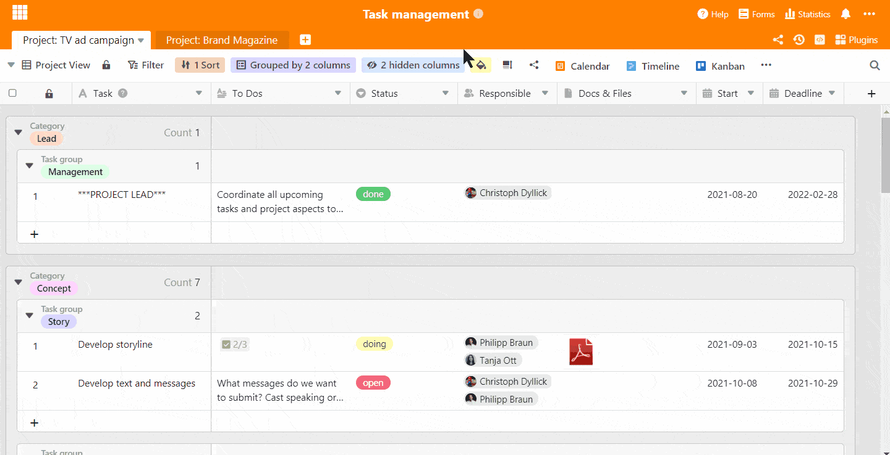
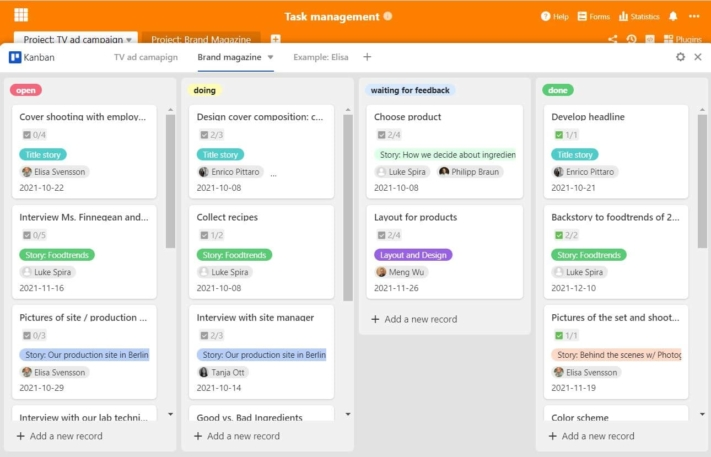
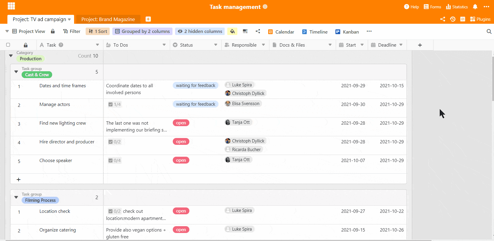
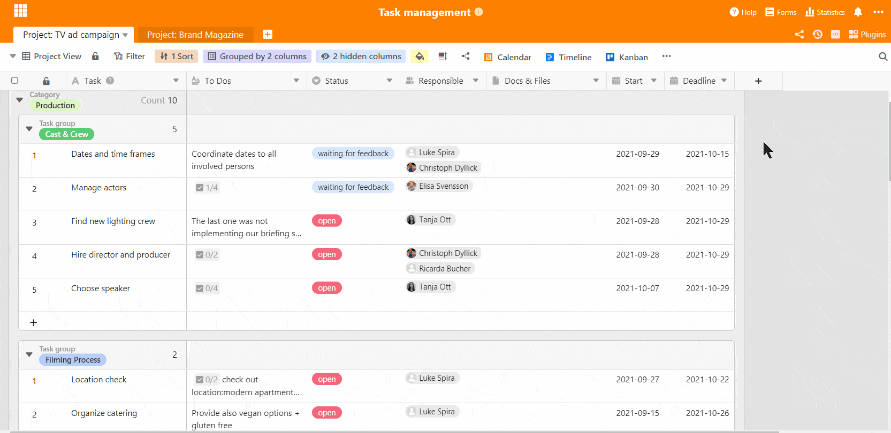

La gestión y administración de tareas son elementos clave del éxito en la gestión de proyectos. Estas habilidades requieren un alto nivel de talento organizativo y la capacidad de **coordinar y distribuir tareas con eficacia**. Una potente herramienta de gestión de tareas es esencial para mantener una visión de conjunto, cumplir los plazos y garantizar el éxito del proyecto. Como [herramienta de cartera de proyectos](), SeaTable ofrece la oportunidad de implantar una gestión ágil de proyectos y completarlos con éxito. Con SeaTable puede optimizar su gestión de tareas y cubrir todos los aspectos importantes de la gestión de tareas.

## Aspectos básicos de la gestión de tareas

La gestión de tareas comprende la planificación, coordinación, gestión y control de las tareas de un proyecto14. Una gestión eficaz de las tareas incluye

- Definición clara de los objetivos del proyecto
- Definición clara de los objetivos del proyecto
- Planificación y distribución precisas de las tareas
- Gestión de recursos y del tiempo
- Minimización de riesgos y optimización de oportunidades
- Control de calidad durante la ejecución del proyecto
- Evaluación final del proyecto

**La gestión estructurada de tareas es la clave del éxito de un proyecto**. Permite mantener una visión de conjunto de todas las actividades, establecer prioridades y supervisar los avances.

## Métodos de gestión de tareas

Existen varios enfoques de la gestión de tareas que difieren en cuanto a su estructura y forma de trabajo. La elección de un método adecuado depende de los requisitos específicos del proyecto, el equipo y la empresa. Los métodos ágiles como Scrum pueden ser muy eficaces, pero no son ideales para todos los proyectos. **SeaTable ofrece la flexibilidad necesaria para aplicar diferentes métodos de gestión de tareas** y adaptarlos a sus necesidades individuales.

Con una sólida herramienta de gestión de tareas como SeaTable, puede:

- Planificar y supervisar las tareas con eficacia
- Centralizar la comunicación del equipo
- Seguimiento del progreso del proyecto en tiempo real
- Notificaciones automáticas
- Utilizar los datos para tomar decisiones informadas

Utilizando un potente sistema de gestión de tareas, puede aumentar la eficacia de sus proyectos y garantizar su éxito.

**1\. estructura de desglose del trabajo**  
La estructura de desglose del trabajo es uno de los métodos clásicos en los que el proyecto se divide en diferentes paquetes de trabajo, como el desarrollo y diseño de un logotipo para una nueva marca. Esto tiene la ventaja de que todas las tareas y responsabilidades están claras desde el principio. Esto significa que las estructuras están claras y se puede empezar enseguida.

**2\. scrum**  
El método Scrum se utiliza para proyectos especialmente complejos en los que no se han finalizado todas las tareas al principio. En estos casos, se requieren métodos de trabajo ágiles y flexibles para planificar y ejecutar el avance del proyecto cada semana. Por tanto, el trabajo se lleva a cabo en un ciclo repetitivo y cada semana se presentan nuevos resultados, en base a los cuales se continúa trabajando.

**3\. kanban**  
Seguro que ya has oído hablar de él. Este método funciona especialmente bien con la visualización de tareas, por lo que es muy popular en la gestión de tareas. En este tipo de gestión de tareas, las tareas se mueven de una columna a otra en forma de tarjetas Kanban en un tablero Kanban visual, normalmente de "Abierto" a "Haciendo" y a "Hecho".

Puede ver que los métodos difieren en su enfoque y que algunos pueden ser más adecuados para su proyecto que otros. En todos los casos, sin embargo, necesitas una herramienta de gestión de tareas que te apoye en todas las áreas para completar con éxito tu proyecto. Hay muchos proveedores diferentes, todos con sus ventajas y desventajas. SeaTable tiene la ventaja decisiva de ser un software flexible que no sólo puede cartografiar todo el proyecto, sino también cualquier otro proceso, como [el registro del tiempo](), [el CRM]() o la creación de un plan editorial.

Como herramienta de gestión de proyectos, SeaTable es muy flexible y puede **personalizarse para satisfacer todas sus necesidades**. Con SeaTable, puede implicar a sus empleados en el proyecto, simplificar los procesos de trabajo y comunicación y **estructurar su proyecto de principio a fin** con la ayuda de asignaciones y descripciones de tareas claras.

## Gestión integral de tareas en pocos pasos

Como **solución flexible de hoja de cálculo**, SeaTable ofrece un diseño completamente personalizado para su gestión de tareas. Hemos configurado nuestra base con toda la información importante necesaria para un proyecto, como tareas pendientes, responsable, plazo, fecha de inicio y documentos importantes. Se pueden utilizar varios tipos de columnas para personalizar y especificar las entradas. Esto permite crear una nueva línea para cada tarea que surja e introducir la tarea en detalle. Este proceso es comparable a la creación de un ticket, como ocurre en algunos sistemas.

Casi todos los tipos de columnas pueden utilizarse para una estructuración y evaluación más detalladas. Para una mejor visión de conjunto y clasificación de las tareas, se realizó una doble agrupación por categoría y área de tareas en la tabla "Campaña publicitaria en TV" y una agrupación por área de tareas y prioridad en el proyecto paralelo "Revista de marca". No obstante, las tablas de gestión de tareas también podrían agruparse por empleado o plazo, tal y como usted necesite los datos en cada momento.

### Gestión de tareas en tiempo real

La base para la gestión de tareas puede utilizarse completamente como base de trabajo en la que se pueden compartir archivos entre sí, ya que SeaTable también funciona como base de datos. Todos los documentos e imágenes que se cargan allí se almacenan en calidad original y pueden descargarse para ser editados por cualquier persona autorizada. Al tratarse de una base de datos en línea, todos los cambios y el progreso del trabajo también se sincronizan en tiempo real para que todos estén siempre al día.

### La comunicación del equipo en un solo lugar

SeaTable permite la comunicación directa dentro de las mesas, eliminando la necesidad de comunicación por correo electrónico fuera de Base. Al abrir una fila, se puede añadir personal a la discusión en el [campo de comentarios]() de la derecha y se pueden enviar comentarios, preguntas o reacciones. De este modo, todos saben exactamente a qué tarea se refiere una pregunta y la comunicación es transparente, sincrónica y rastreable.

## Gestión de tareas con el tablero Kanban

Para una mejor visualización y un manejo más sencillo de la gestión de tareas, el plugin Kanban es justo lo que necesita. El plugin integrado funciona como todas las herramientas estándar de gestión de tareas Kanban y permite mover las tareas de un lado a otro en forma de tarjetas basadas en diversas categorías de categorización, como el estado. Cuando se completa una tarea, la persona responsable puede simplemente mover la tarjeta de "haciendo" a "hecho" y la tarea se marca como completada.

También son concebibles otras categorizaciones, como por ejemplo según paquetes de tareas superiores, por ejemplo el diseño de un sitio web. Esta forma de trabajar es mucho más fácil para muchos, ya que las tareas están claramente estructuradas y visualizadas. Esto también ayuda a poder evaluar un proyecto y el esfuerzo que supone en términos reales. Por ello, estas herramientas son muy populares, sobre todo entre los equipos o empresas más pequeños.

### Vistas individuales para cada empleado

Para los tableros individuales de su personal, deben crearse [vistas]() separadas de antemano. Esto se hace fácilmente estableciendo un filtro en el que la columna "Responsable" debe contener el nombre de un miembro concreto de la plantilla ("Responsable tiene cualquiera de XY"). Esto hace que todos los demás compañeros desaparezcan de la vista y sólo se muestren las tareas de ese empleado. Esta función está incluida en todas las licencias y ofrece infinitas posibilidades de diseño. Si desea crear una vista con sólo las tareas abiertas, por ejemplo, la función de filtro es "Estado no realizado".

Las innumerables opciones de filtrado ofrecen una visión muy individualizada de la gestión de sus tareas y puede adoptar una perspectiva diferente en cualquier momento. Lo bueno es que los diferentes puntos de vista son completamente independientes entre sí en su presentación. Un filtro en la vista A no influye en la visualización en la vista B. Sin embargo, el cambio de datos siempre se ejecuta de forma sincronizada y se implementa inmediatamente en todas las vistas.

Si las vistas de nuestra plantilla de gestión de tareas son realmente sólo para ser vistas por el empleado respectivo, pueden ser compartidas con todos individualmente - esto significa que sólo la persona compartida también tiene acceso a esta vista (esto es parte de los paquetes de pago Plus y Enterprise). Otras personas no ven este punto de vista. Sin embargo, esto sólo funciona si la Base no se comparte en un entorno común.

## Vigila siempre la hora: Con la línea de tiempo y el calendario

El complemento de la línea de tiempo es una gran ayuda para visualizar el tiempo de toda la gestión de tareas. Con ella, puedes ver de un vistazo si sigues con tu planificación de tiempo o si algunas tareas ya están atrasadas. Al establecer la fecha de inicio y la fecha límite de la tarea, ésta se puede visualizar perfectamente en la línea de tiempo. Defina qué otra información debe mostrarse, como la persona responsable, el plazo exacto o las tareas pendientes.

Para las vistas individuales del personal, se crean por adelantado sus propias vistas para cada miembro del personal. De esta manera, cada uno ve sus propias tareas en su propia línea de tiempo y sabe cuánto tiempo queda para las tareas individuales. También puede ver el grado de ocupación de sus empleados al planificar las tareas y puede reprogramarlas si la carga de trabajo se distribuye de forma desigual.

Al igual que el complemento de la línea de tiempo, el complemento del calendario ofrece una visión temporal de todo el proyecto y de todas las fases de planificación de la gestión de tareas, pero totalmente en estilo calendario. La vista por día, semana, mes, año o en su totalidad en la vista de la agenda permite ver día a día los pasos del proyecto y muestra en qué día hay que hacer. Aquí también es posible la creación de tableros personales de personal sin ningún problema en función de las vistas creadas.

## Reciba automáticamente todos los avances del proyecto

Las notificaciones automáticas son muy importantes para que todos los empleados estén siempre al día de sus tareas y de la gestión de las mismas. Por lo tanto, ya no es necesario comprobar obligatoriamente la base para ver si hay novedades. En nuestra plantilla, hemos establecido una regla de notificación que se activa con los cambios en la columna "Responsable". Cuando se asigna una tarea a un empleado, éste recibe una notificación directa y automáticamente.  

Si es necesario obtener información de un colega o del supervisor, basta con asignar la tarea a esta persona; de nuevo, la regla se activa automáticamente y se informa a la persona responsable. Esto elimina la necesidad de enviar correos electrónicos con consultas, comentarios o instrucciones de trabajo. Una vez procesada, la tarea se devuelve a la persona correspondiente para que continúe el flujo de trabajo.

Los comentarios dentro de una línea utilizando la función de comentario también activan una notificación automática para que las personas mencionadas sean informadas directamente. Si lo desea, puede crear sus propias reglas, por ejemplo, cuando las tareas cambian al estado "Hecho" para estar al tanto del progreso del proyecto. También hemos establecido una regla de notificación en la gestión de tareas que te recuerda periódicamente los próximos plazos, para que todas las tareas se terminen a tiempo.

## La gestión de tareas es más fácil que nunca

SeaTable convierte la gestión de tareas en una herramienta eficaz para ahorrar tiempo en sus proyectos. Para utilizar nuestra plantilla, debe [registrarse]() con nosotros. Como software de hoja de cálculo y base de datos, SeaTable va mucho más allá de la introducción de datos: estructurar, clasificar, delegar, discutir, organizar, planificar, ejecutar y completar: todo esto y mucho más es posible con SeaTable.
