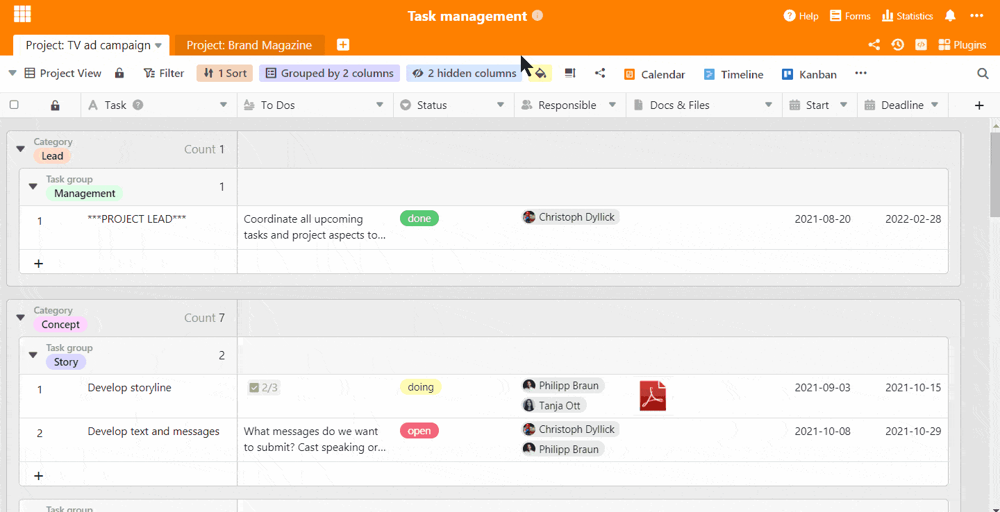
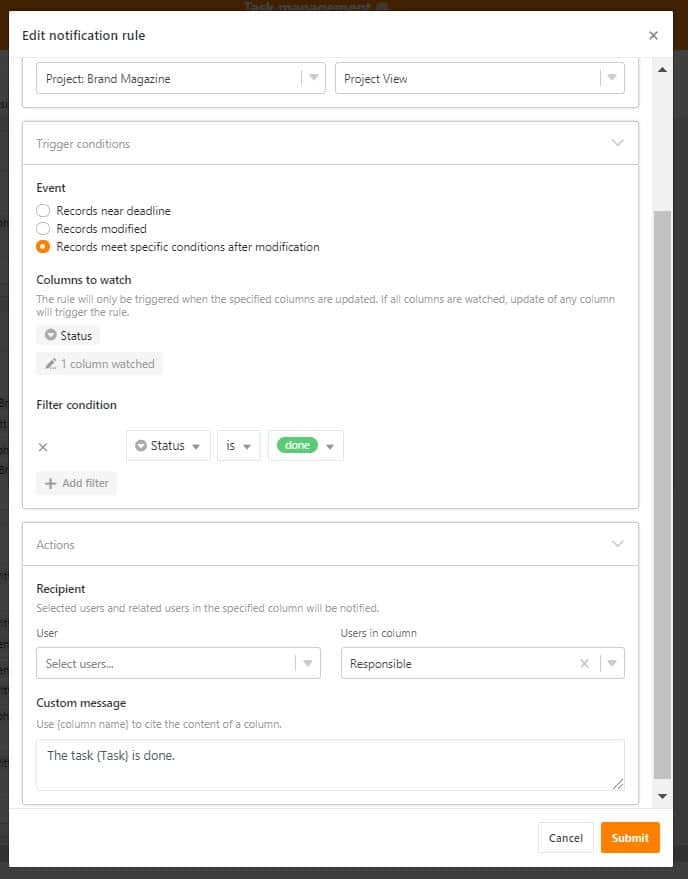

La gestion et l'administration des tâches sont des éléments clés d'une gestion de projet réussie. Ces compétences requièrent un grand sens de l'organisation et la capacité de **coordonner et de répartir efficacement les tâches**. Un outil de gestion des tâches performant est alors indispensable pour garder une vue d'ensemble, respecter les délais et garantir la réussite du projet. En tant qu'[outil de portefeuille de projets](), SeaTable offre la possibilité de mettre en œuvre une gestion de projet agile et de mener à bien les projets. SeaTable vous permet d'optimiser la gestion des tâches et de couvrir tous les aspects importants de la gestion des tâches.

## Les bases de la gestion des tâches

La gestion des tâches comprend la planification, la coordination, la gestion et le contrôle des tâches au sein d'un projet14. Une gestion des tâches efficace comprend

- Définition claire des objectifs du projet
- Définition claire des objectifs du projet
- Planification et répartition précises des tâches
- Gestion des ressources et du temps
- Réduction des risques et optimisation des chances
- Contrôle de la qualité pendant la mise en œuvre du projet
- Évaluation finale du projet

**Une gestion structurée des tâches est la clé de la réussite d'un projet**. Elle permet de garder une vue d'ensemble de toutes les activités, de fixer des priorités et de surveiller les progrès.

## Méthodes de gestion des tâches

Il existe différentes approches de la gestion des tâches, qui se distinguent par leur structure de gestion des tâches et leur méthode de travail. Le choix de la méthode appropriée dépend des exigences spécifiques du projet, de l'équipe et de l'entreprise. Les méthodes agiles telles que Scrum peuvent être très efficaces, mais ne sont pas optimales pour chaque projet. **SeaTable offre la flexibilité de mettre en œuvre différentes méthodes de gestion des tâches** et de les adapter à vos besoins individuels.

Avec un outil de gestion des tâches robuste comme SeaTable, vous pouvez :

- Planifier et surveiller les tâches de manière efficace
- Centraliser la communication de l'équipe
- Suivre l'avancement du projet en temps réel
- Configurer des notifications automatisées
- Utiliser les données pour prendre des décisions éclairées

En utilisant un système de gestion des tâches performant, vous pouvez améliorer l'efficacité de vos projets et garantir leur succès.

**1\. l'organigramme de projet**  
L'organigramme de projet fait partie des méthodes classiques qui consistent à diviser le projet en différents lots de travail, comme par exemple le développement et la conception d'un logo pour une nouvelle marque. Cela présente l'avantage de définir dès le départ toutes les tâches et les responsabilités. Les structures sont ainsi claires et il est possible de passer directement à la première étape.

**2\. la méthode Scrum**  
La méthode Scrum est utilisée pour les projets particulièrement complexes, dans lesquels toutes les tâches ne sont pas encore définies au départ. Dans ces cas, des méthodes de travail agiles et flexibles sont nécessaires pour planifier et mettre en œuvre l'avancement du projet chaque semaine. Il s'agit donc de travailler dans un cycle répétitif et de présenter chaque semaine de nouveaux résultats sur la base desquels le travail se poursuit.

**3\. le Kanban**  
Vous en avez certainement déjà entendu parler. Cette méthode travaille particulièrement avec la visualisation des tâches et jouit ainsi d'une grande popularité dans la gestion des tâches. Dans ce type de gestion des tâches, les tâches sous forme de cartes Kanban sont déplacées d'une colonne à l'autre sur un tableau Kanban visuel - généralement de "Open" à "Doing" à "Done".

Vous pouvez constater que les méthodes diffèrent dans leur approche et que certaines peuvent être plus adaptées à votre projet que d'autres. Mais dans tous les cas, vous avez besoin d'un outil de gestion des tâches qui vous aide à mener à bien votre projet dans tous les domaines de tâches. Il existe pour cela de nombreux fournisseurs différents, qui ont tous leurs avantages et leurs inconvénients. SeaTable présente l'avantage décisif d'être un logiciel flexible, capable de gérer non seulement l'ensemble du projet, mais aussi tous les autres processus tels que [la saisie du temps de travail](https://seatable.io/fr/zeiterfassung-im-unternehmen/), [la gestion de la relation client](https://seatable.io/fr/crm-angebotsmanagement/) ou la création d'un plan éditorial.

SeaTable est un outil de gestion de projet très flexible qui s'adapte parfaitement **à tous vos besoins**. SeaTable vous permet d'impliquer vos collaborateurs dans le projet, de simplifier les processus de travail et de communication et de **structurer votre projet du début à la fin** à l'aide d'une attribution et d'une description claires des tâches.

## Gestion globale des tâches en quelques étapes

SeaTable est une **solution de feuille de calcul flexible** qui vous permet de personnaliser votre gestion des tâches. Nous avons construit notre base avec toutes les informations importantes nécessaires pour un projet, comme les choses à faire, la personne responsable, l'échéance, la date de début et les documents importants. Différents types de colonnes peuvent être utilisés, ce qui permet de personnaliser et de préciser les données. Ainsi, il est possible de créer une nouvelle ligne pour chaque tâche à effectuer et de la saisir de manière détaillée. Ce processus est comparable à la création d'un ticket, comme il en existe dans certains systèmes.

Presque chaque type de colonne peut être utilisé pour des structurations et des évaluations plus poussées. Pour une meilleure vue d'ensemble et un meilleur classement des tâches, un double regroupement par catégorie et par domaine d'activité a été effectué pour le tableau "TV Ad Campaign" et un regroupement par domaine d'activité et priorité pour le projet annexe "Brand Magazine". Mais les gestions de tâches pourraient aussi être regroupées par collaborateur ou par échéance - tout comme vous avez besoin des données sur le moment.

### Gestion des tâches en temps réel

La base de gestion des tâches peut être entièrement utilisée comme base de travail dans laquelle les fichiers peuvent être partagés, car SeaTable fait également office de base de données. Tous les documents et images qui y sont téléchargés le sont en qualité originale et peuvent être téléchargés par toute personne autorisée à les modifier. En tant que base de données en ligne, toutes les modifications et la progression du travail sont également synchronisées en temps réel afin que tout le monde soit toujours au même niveau.

### Communication d'équipe en un seul lieu

SeaTable permet une communication directe au sein des tableaux, ce qui rend inutile la communication par e-mail en dehors de la base. Lorsqu'une ligne est ouverte, des collaborateurs peuvent être ajoutés à la discussion dans le [champ de commentaire](https://seatable.io/fr/docs/handbuch/zusammenarbeit/kommentare/) à droite et des remarques, questions ou feedback peuvent être envoyés. Ainsi, tous savent exactement à quelle tâche se rapporte une question et la communication est transparente, synchrone et compréhensible.

## Gestion des tâches avec le tableau Kanban

Pour une meilleure visualisation et une manipulation plus simple de la gestion des tâches, le plugin Kanban est exactement ce qu'il vous faut. Le plugin intégré fonctionne comme tous les outils de gestion des tâches Kanban courants et permet de déplacer les tâches sous forme de cartes en fonction de différentes catégories de classement, comme le statut. Lorsqu'une tâche est terminée, la personne responsable peut simplement faire glisser la carte de "doing" à "done" et la tâche est marquée comme terminée.

D'autres catégorisations sont également envisageables, par exemple en fonction de paquets de tâches supérieurs, par exemple la conception d'un site web. Cette méthode de travail est nettement plus simple pour beaucoup, car les tâches sont clairement structurées et visualisées. Cela aide également à évaluer réellement un projet et l'effort à fournir. Ces outils sont donc très appréciés des petites équipes ou des entreprises.

### Des vues individuelles pour chaque employé

Pour les tableaux individuels de vos collaborateurs, il faut créer au préalable des [vues](https://seatable.io/fr/docs/handbuch/seatable-nutzen/ansichten/) spécifiques. Cela fonctionne très facilement en définissant un filtre dans lequel la colonne "Responsible" doit contenir le nom d'un collaborateur spécifique ("Responsible has any of XY"). Ainsi, tous les autres collègues disparaissent de la vue et seules les tâches de ce collaborateur sont affichées. Cette fonction est incluse dans toutes les licences et offre des possibilités de conception infinies. Si vous souhaitez par exemple ne créer une vue qu'avec des tâches ouvertes, la fonction de filtrage est par exemple "Status is not done".

Les innombrables possibilités de filtrage offrent des vues hautement personnalisées de votre gestion des tâches et vous pouvez à tout moment adopter une autre perspective. L'avantage : les différentes vues sont toutes complètement indépendantes les unes des autres dans leur représentation. Un filtre dans la vue A n'influence pas la représentation dans la vue B. Cependant, la modification des données se fait toujours de manière synchrone et est immédiatement appliquée dans toutes les vues.

Si les vues de notre modèle de gestion des tâches ne doivent vraiment être vues que par l'employé concerné, elles peuvent être partagées individuellement avec chacun - c'est-à-dire que seule la personne partagée a également accès à cette vue (cela fait partie des packs payants Plus et Enterprise). Les autres personnes ne voient pas cette vue. Cela ne fonctionne toutefois que si la base n'est pas partagée dans un environnement commun.

## Toujours avoir l'heure en tête : Avec la ligne du temps et le calendrier

Le plug-in Timeline est d'une grande aide pour la visualisation temporelle de toute votre gestion des tâches. Il vous permet de voir en un coup d'œil si vous êtes encore dans les temps ou si certaines tâches ont déjà pris du retard. En définissant la date de début et l'échéance de la tâche, celle-ci peut être parfaitement représentée dans la ligne du temps. Déterminez quelles autres informations doivent être affichées, comme la personne responsable, la date limite exacte ou les choses à faire.

Pour les vues individuelles des collaborateurs, vous pouvez créer au préalable des vues pour chaque collaborateur. Ainsi, chacun voit ses propres tâches dans sa propre ligne de temps et sait combien de temps il reste pour chaque tâche. Vous voyez également quelle est la charge de travail de vos collaborateurs lors de la planification des tâches et vous pouvez modifier la planification si la charge de travail est inégalement répartie.

Le plug-in Calendrier offre, comme le plug-in Ligne de temps, une vue d'ensemble temporelle de l'ensemble du projet et de toutes les étapes de planification de la gestion des tâches, mais dans un style tout à fait calendaire. L'affichage par jour, semaine, mois, année ou entièrement dans l'aperçu de l'agenda permet de voir les étapes du projet au jour près et indique quel jour et combien il reste à faire. Ici aussi, la création de tableaux personnels pour les collaborateurs est possible sans problème sur la base des vues créées.

## Recevoir automatiquement toutes les avancées du projet

Pour que tous les collaborateurs soient toujours à jour en ce qui concerne leurs tâches et la gestion des tâches, les notifications automatiques sont très importantes. Il n'est donc plus nécessaire de vérifier obligatoirement dans la base s'il y a des nouveautés. Dans notre modèle, nous avons défini une règle de notification qui se déclenche en cas de modification dans la colonne "Responsable". Lorsqu'une tâche est attribuée à un collaborateur, celui-ci reçoit directement et automatiquement une notification.  

S'il est nécessaire de demander un feedback à un collègue ou à un supérieur, il suffit d'attribuer la tâche à cette personne - là encore, la règle se déclenche automatiquement et la personne responsable est informée. Il n'est donc plus nécessaire d'envoyer des e-mails avec des questions, des commentaires ou des instructions de travail. Une fois la tâche traitée, elle est renvoyée à la personne concernée afin de poursuivre le flux de travail.

Les commentaires à l'intérieur d'une ligne à l'aide de la fonction commentaire déclenchent également une notification automatique, de sorte que les personnes mentionnées sont directement informées. Si vous le souhaitez, vous pouvez créer vos propres règles, par exemple lorsque les tâches passent au statut "terminé", afin de garder un œil sur l'avancement du projet. Nous avons également mis en place une règle de notification dans la gestion des tâches, qui rappelle régulièrement les échéances à venir - afin que toutes les tâches soient terminées à temps.

## La gestion des tâches n'a jamais été aussi simple

Avec SeaTable, votre gestion des tâches devient un gamechanger efficace et qui fait gagner du temps dans vos projets. Pour utiliser notre modèle, vous devez [vous inscrire](https://seatable.io/fr/enregistrement/) chez nous. En tant que logiciel de tableur et base de données, SeaTable va bien au-delà de l'enregistrement de données : structurer, trier, déléguer, discuter, organiser, planifier, mettre en œuvre et terminer - tout cela et plus encore est possible avec SeaTable.
