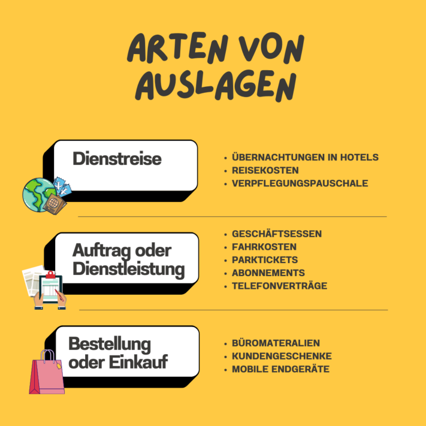

Whether it's a business meal, train ticket or company cell phone - do you regularly make advance payments at work and want to know what you need to consider when **reimbursing expenses**? Or are you an employer yourself and looking for a way to make the expense reimbursement process more efficient for your employees?

This article not only provides you with everything you need to know about reimbursing expenses - it also offers you a free [template]() that can make your day-to-day work easier.

As an entrepreneur, it is important to keep track of all expenses.

## What reimbursement of expenses means for you

The [Income Tax Act](https://www.gesetze-im-internet.de/estg/) defines out-of-pocket **expenses** as business expenses that employees pay **in advance** and later receive back from the company. The reimbursement of expenses ensures that employees are not permanently financially burdened when they incur expenses on **behalf of the company**. The exact process and the accepted expense categories can be regulated both by law and internally within the company.

## Display types you should know

Paragraphs 4 and 5 of the German Income Tax Act contain the relevant regulations regarding business expenses. For example, costs incurred in connection with **business trips** can be reimbursed as expenses. The same applies to expenses arising from the fulfillment of orders or the provision of services, such as a **business meal** with your customers. You can also claim **purchases** or orders such as office supplies or fruit for the office kitchen as reimbursable expenses.

There are various costs that you can have reimbursed as expenses.

## Reimbursement of expenses vs. transitory funds

Have you already looked into the reimbursement of expenses and come across the term " **transitory funds** "? Then you have probably wondered what exactly the difference is. In principle, the same regulations apply to both the reimbursement of expenses and transitory funds. The only difference is the **time** at which the employee receives the money.

- **Reimbursement of expenses**: You first pay in advance and are only reimbursed after the transaction.
- **Pass-through funds**: You do not have to pay out of your own pocket in advance, but receive the funds from your company before you spend them.

Transitory funds are generally used for **foreseeable expenses** that are incurred at regular intervals, whereas expense reimbursements tend to be used for **one-off expenses**.



## Exceptional case: Flat-rate reimbursement of expenses

Companies can also offset the reimbursement of expenses against a lump **sum**. These lump sums can include, for example, **travel, meals and accommodation costs**. However, you must note that the tax office sets the maximum rates. The maximum annual limit for accommodation and meals is 1,000 euros. If you exceed this, it makes more sense to have your expenses reimbursed in detail rather than as a lump sum.

If you travel a lot on business, you should not rely on the flat-rate reimbursement of expenses.

## Conditions for expenses exempt from tax and social security contributions

According to [§ 3 No. 50 EStG](https://www.gesetze-im-internet.de/estg/__3.html), expenses are **exempt from tax and social security contributions**. To ensure that the tax office recognizes the expenses as tax-free, you must follow a few **conditions**. Here is an overview of the most important ones:

- **Earmarking**: Only expenses that you incur on behalf of and at the expense of your company count as out-of-pocket expenses.
- **Documentation**: You must prove your expenses with legally valid, original invoices and receipts. For amounts up to 250 euros, a simple receipt is sufficient. According to the current [GoBD guidelines](https://ao.bundesfinanzministerium.de/ao/2021/Anhaenge/BMF-Schreiben-und-gleichlautende-Laendererlasse/Anhang-64/anhang-64.html), the scanning of receipts is expressly permitted.
- **Work equipment**: The expenses must be clearly necessary for business purposes and must not include any private items. The tax office assumes a non-cash benefit if the evidence is unclear.
- **Correct invoicing**: Expenses should be invoiced correctly, with each individual item shown separately on the receipt or invoice.
- **Lump-sum reimbursement of expenses**: You must keep a clear record of regular expenses, as the tax office only grants a lump sum if documentation is provided over a certain period of time.

Reimbursement of expenses can quickly overwhelm you without a good structure.

## Challenges that you need to overcome when reimbursing expenses

The reimbursement of expenses poses its own challenges. In particular, the **bureaucratic effort** involved should not be underestimated - receipts and documentation pile up in folders and take up **space**. In order for you to be able to settle accounts in full, every receipt and every invoice must be meticulously submitted. However, there is a risk that the receipts will be lost more quickly than you would like.



The process of reimbursing expenses is not only **time-consuming**, but also **error-prone**, especially if it is still done on paper. You need to be completely on top of things to avoid accidentally transposing figures. There are also the **format specifications** of the tax office to consider, as they only accept contiguous PDFs.

Companies and employees must demonstrate **perseverance** and **precision** during the expense reimbursement process in order to successfully overcome the challenge. However, there is no need to worry, because even in the greatest confusion of receipts and forms, there is always a ray of hope.

## The advantages of digital expense reimbursement for you

To make expense reimbursement easier and more efficient, it makes sense to use digital methods. This not only gives you a **better overview** of all expenses incurred, but also reduces the workload thanks to **faster recording**. By using digital methods, you can achieve a **lower error rate**, as automated processes leave less room for human error.

Another advantage is the **increased transparency**. Companies can better understand financial transactions by tracking their expenses digitally. The annoying **paper chaos** that often accompanies traditional methods is completely eliminated. Switching to digital expense reimbursement keeps your relevant documents organized and **accessible** online from anywhere.

## Free template for reimbursement of expenses

If you want to take the step from analog to digital expense reimbursement, SeaTable's [free template]() is an excellent option for you.

You can enter your expenses in the spreadsheet and **categorize** them by mouse click in **specially defined categories** such as office equipment, travel expenses or business meals. Employees can store **digital receipts and invoices** directly in the spreadsheet, ensuring that no more evidence is lost. You can also see at a glance which expenses you have already reimbursed and which are still outstanding. After reimbursement, you can easily create documents in which you confirm the reimbursement. Using the **statistics**, you can see at a glance which costs are incurred most frequently and which you may even be able to reduce.

Register for [free]() on SeaTable and use the template according to your wishes and needs. Keep track of your expense reimbursements and successfully minimize your day-to-day workload. [Click here to access the template.]()
