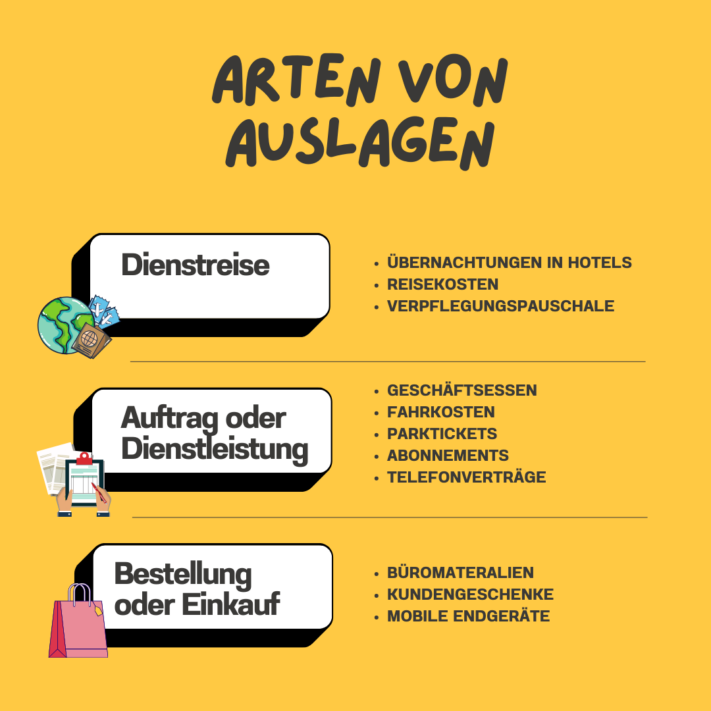

Seja um jantar de negócios, uma passagem de trem ou um celular corporativo – você frequentemente antecipa despesas no trabalho e quer saber o que deve ser considerado na **restituição de despesas**? Ou você é empregador e procura uma forma de tornar o processo de reembolso de despesas para seus funcionários mais eficiente?

Este artigo não só apresenta tudo o que você precisa saber sobre o tema reembolso de despesas – como também oferece um [modelo gratuito]() que pode facilitar seu dia a dia profissional.

Como empresário, é importante manter o controle de todas as despesas.

## O que significa reembolso de despesas para você

A [Lei do Imposto de Renda](https://www.gesetze-im-internet.de/estg/) define **despesas** como gastos empresariais que os funcionários pagam **antecipadamente** e depois recebem de volta da empresa. O reembolso de despesas garante que os funcionários não fiquem sobrecarregados financeiramente de forma permanente ao realizar **despesas a serviço da empresa**. O processo exato e as categorias de despesas aceitas podem ser regulamentados tanto por lei quanto internamente pela empresa.

## Tipos de despesas que você deve conhecer

Nos parágrafos 4 e 5 da lei alemã do imposto de renda, você encontra as regras relevantes sobre despesas empresariais. Por exemplo, custos relacionados a **viagens a trabalho** podem ser reembolsados como despesas. O mesmo vale para gastos decorrentes do cumprimento de tarefas ou da prestação de serviços, como um **jantar de negócios** com seus clientes. Da mesma forma, **compras** ou pedidos como material de escritório ou frutas para a copa podem ser declarados como despesas reembolsáveis.

Existem diversos custos que você pode ter reembolsados como despesas.

## Reembolso de despesas vs. valores transitórios

Você já se deparou com o termo **valores transitórios** ao pesquisar sobre reembolso de despesas? Então, provavelmente se perguntou qual é a diferença. Em princípio, as mesmas regras se aplicam tanto ao reembolso de despesas quanto aos valores transitórios. A única diferença é o **momento** em que o empregado recebe o dinheiro.

- **Reembolso de despesas**: Você faz o pagamento antecipado e só recebe o reembolso após a transação.
- **Valores transitórios**: Você não precisa pagar do próprio bolso antecipadamente, pois recebe os valores da empresa antes de gastar.

Valores transitórios são geralmente usados para **despesas previsíveis** que ocorrem regularmente, enquanto o reembolso de despesas é mais comum para **gastos pontuais**.



## Exceção: reembolso de despesas por valor fixo

As empresas também podem reembolsar despesas com um **valor fixo**. Entre esses valores fixos podem estar, por exemplo, **custos de transporte, alimentação e hospedagem**. No entanto, é importante observar que a Receita Federal determina os limites máximos. O limite anual para hospedagem e alimentação é de 1.000 euros. Se você ultrapassar esse valor, um reembolso detalhado faz mais sentido do que um reembolso por valor fixo.

Se você viaja muito a trabalho, não deve recorrer ao reembolso de despesas por valor fixo.

## Condições para despesas isentas de impostos e contribuições sociais

Segundo o [§ 3 n.º 50 EStG](https://www.gesetze-im-internet.de/estg/__3.html), as despesas são consideradas **isentas de impostos e contribuições sociais**. Para garantir que a Receita reconheça os gastos como isentos, é preciso seguir algumas **condições**. Aqui estão as principais:

- **Finalidade específica**: Apenas despesas feitas em nome e por conta da empresa são consideradas reembolsáveis.
- **Documentação**: Suas despesas devem ser comprovadas com notas fiscais e recibos originais e válidos. Para valores até 250 euros, um recibo simples já é suficiente. Segundo as atuais [diretrizes GoBD](https://ao.bundesfinanzministerium.de/ao/2021/Anhaenge/BMF-Schreiben-und-gleichlautende-Laendererlasse/Anhang-64/anhang-64.html), digitalizar recibos é expressamente permitido.
- **Material de trabalho**: As despesas devem ser claramente necessárias para a empresa e não podem incluir itens pessoais. Caso contrário, a Receita pode presumir uma vantagem em espécie.
- **Lançamento correto**: O lançamento das despesas deve ser feito corretamente, com cada item listado separadamente no recibo ou nota fiscal.
- **Reembolso por valor fixo**: Gastos recorrentes devem ser registrados de forma compreensível, pois a Receita só concede um valor fixo se houver documentação adequada por um certo período.

Sem uma boa estrutura, o reembolso de despesas pode rapidamente sobrecarregar você.

## Desafios que você precisa superar no reembolso de despesas

O reembolso de despesas traz seus próprios desafios. Principalmente o **trabalho burocrático** não deve ser subestimado – recibos e documentos se acumulam nas pastas e ocupam **espaço**. Para fazer a prestação de contas completa, é necessário apresentar cada recibo e nota fiscal com precisão. No entanto, existe o risco de que esses comprovantes se percam rapidamente.



O processo de reembolso de despesas não é apenas **demorado**, mas também **propenso a erros**, especialmente se ainda for feito em papel. É preciso estar totalmente atento para não cometer enganos nos números. Além disso, existem as **exigências de formato** da Receita, que só aceita PDFs contínuos.

Empresas e funcionários precisam de **persistência** e **precisão** durante o reembolso de despesas para superar o desafio com sucesso. Mas não se preocupe: mesmo no maior caos de recibos e formulários, sempre há uma luz no fim do túnel.

## Quais as vantagens do reembolso digital de despesas

Para tornar o reembolso de despesas mais simples e eficiente, faz sentido recorrer a métodos digitais. Assim, você mantém uma **visão geral melhor** de todos os gastos realizados e ainda reduz o esforço graças ao **registro mais rápido**. Com processos digitais, há **menos propensão a erros**, pois a automação reduz as falhas humanas.

Outro ponto positivo é a **maior transparência**. As empresas podem acompanhar melhor as transações financeiras por meio do controle digital dos gastos. O incômodo **caos de papel** das formas tradicionais desaparece completamente. A migração para o reembolso digital garante o armazenamento organizado dos documentos relevantes, que ficam **acessíveis online** de qualquer lugar.

## Modelo gratuito para reembolso de despesas

Se você quer migrar do reembolso analógico para o digital, o [modelo gratuito]() da SeaTable é uma excelente opção.

Você pode registrar suas despesas na planilha e classificá-las com um clique em **categorias personalizadas** como equipamentos de escritório, despesas de viagem ou refeições de negócios. Os funcionários podem anexar **recibos e notas digitais** diretamente na tabela, garantindo que nenhum comprovante se perca. Além disso, você vê facilmente quais despesas já foram reembolsadas e quais ainda estão pendentes. Após o reembolso, é possível gerar documentos confirmando a restituição. Com as **estatísticas**, você identifica rapidamente quais custos ocorrem com mais frequência e onde talvez possa economizar.

[Cadastre-se gratuitamente]() na SeaTable e use o modelo conforme suas necessidades. Mantenha o controle do seu reembolso de despesas e reduza com sucesso o esforço no seu dia a dia de trabalho. [Clique aqui para acessar o modelo.]()
