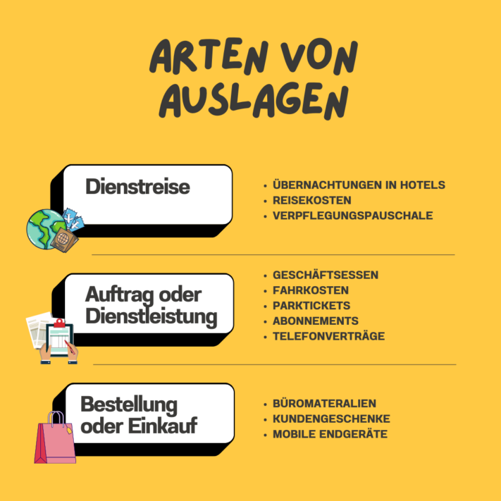

Деловой обед, билет на поезд или корпоративный мобильный телефон - вы регулярно делаете авансовые платежи на работе и хотите знать, что нужно иметь в виду при **возмещении расходов**? Или вы сами являетесь работодателем и ищете способ сделать процесс возмещения расходов более эффективным для своих сотрудников?

В этой статье вы не только узнаете все, что нужно знать о возмещении расходов, но и найдете бесплатный [шаблон](), который облегчит вашу повседневную работу.

Предпринимателю важно следить за всеми расходами.

## Что означает для вас возмещение расходов

Согласно [Закону о подоходном налоге](https://www.gesetze-im-internet.de/estg/), под **расходами** "из собственных средств" понимаются деловые расходы, которые сотрудники оплачивают **заранее**, а затем получают обратно от компании. Компенсация расходов гарантирует, что сотрудники не будут постоянно нести финансовую нагрузку, когда они несут расходы от **имени компании**. Точный процесс и допустимые категории расходов могут регулироваться как законом, так и внутри компании.

## Типы дисплеев, которые вы должны знать

Параграфы 4 и 5 Закона о подоходном налоге содержат соответствующие положения, касающиеся деловых расходов. Например, расходы, понесенные в связи с **командировками**, могут быть возмещены как расходы. То же самое касается расходов, связанных с выполнением заказов или предоставлением услуг, например, **деловых обедов** с вашими клиентами. Вы также можете заявить в качестве возмещаемых расходов **покупки** или заказы, например, канцелярские принадлежности или фрукты для офисной кухни.

Существуют различные расходы, которые вы можете получить в качестве компенсации.

## Возмещение расходов против транзитных фондов

Вы уже изучали вопрос о возмещении расходов и столкнулись с термином **"транзитные средства** "? Тогда вы наверняка задавались вопросом, в чем именно заключается разница. В принципе, и к возмещению расходов, и к транзитным средствам применяются одни и те же правила. Единственное различие заключается в том, в какой **момент** сотрудник получает деньги.

- **Возмещение расходов**: Вы сначала вносите предоплату, а компенсацию получаете только после совершения сделки.
- **Транзитные средства**: Вы не платите из своего кармана заранее, а получаете средства от своей компании, прежде чем потратить их.

Транзитные средства обычно используются для покрытия **прогнозируемых расходов**, которые осуществляются через регулярные промежутки времени, в то время как средства на возмещение расходов обычно используются для покрытия **разовых расходов**.



## Исключительный случай: возмещение расходов по фиксированной ставке

Компании также могут зачесть возмещение расходов в счет единовременной **выплаты**. К таким единовременным суммам могут относиться, например, **расходы на проезд, суточные и проживание**. Однако следует учитывать, что максимальные ставки устанавливает налоговая служба. Максимальный годовой лимит на проживание и питание составляет 1 000 евро. Если вы превышаете этот лимит, то целесообразнее возмещать расходы не единовременно, а по частям.

Если вы часто ездите в командировки, не стоит полагаться на возмещение расходов по фиксированной ставке.

## Условия для расходов, освобождаемых от налогов и взносов на социальное страхование

Согласно § [3 № 50 EStG](https://www.gesetze-im-internet.de/estg/__3.html), расходы **освобождаются от налогов и взносов на социальное страхование**. Для того чтобы налоговая служба признала расходы необлагаемыми налогом, необходимо соблюсти несколько **условий**. Ниже приведен обзор наиболее важных из них:

- **Целевое назначение**: только те расходы, которые вы несете от имени и за счет своей компании, считаются карманными расходами.
- **Документация**: Вы должны подтвердить свои расходы юридически действительными, оригинальными счетами и квитанциями. Для сумм до 250 евро достаточно простого чека. Согласно действующему [руководству GoBD](https://ao.bundesfinanzministerium.de/ao/2021/Anhaenge/BMF-Schreiben-und-gleichlautende-Laendererlasse/Anhang-64/anhang-64.html), сканирование квитанций разрешено.
- **Рабочее оборудование**: расходы должны быть явно необходимы для целей бизнеса и не должны включать никаких личных вещей. Налоговая инспекция считает, что выгода неденежная, если доказательства неясны.
- **Правильное выставление счетов**: Счета на оплату расходов должны выставляться правильно, с указанием каждой отдельной статьи в чеке или счете.
- **Единовременное возмещение расходов**: Вы должны вести четкий учет регулярных расходов, поскольку налоговая служба предоставляет единовременную сумму только при условии ведения документации в течение определенного периода времени.

Возмещение расходов может быстро захлестнуть вас без хорошей структуры.

## Проблемы, которые необходимо преодолеть при возмещении расходов

Возмещение расходов сопряжено с определенными трудностями. В частности, не стоит недооценивать **бюрократическую** волокиту - квитанции и документация скапливаются в папках и занимают много **места**. Чтобы иметь возможность полностью рассчитаться, необходимо скрупулезно представлять каждую квитанцию и каждый счет. Однако есть риск, что квитанции будут потеряны быстрее, чем вам хотелось бы.



Процесс возмещения расходов не только **отнимает много времени**, но и **чреват ошибками**, особенно если он все еще выполняется на бумаге. Вы должны быть полностью сосредоточены, чтобы избежать случайного переноса цифр. Кроме того, необходимо учитывать **требования** налогового ведомства к **формату**, поскольку они принимают только цельные PDF-файлы.

Чтобы успешно справиться с этой задачей, компании и сотрудники должны проявить **настойчивость** и **точность** в процессе возмещения расходов. Однако не стоит беспокоиться, ведь даже в самой большой путанице квитанций и бланков всегда есть луч надежды.

## Преимущества цифрового возмещения расходов для вас

Чтобы сделать возмещение расходов более простым и эффективным, имеет смысл использовать цифровые методы. Это не только даст вам возможность **лучше видеть** все понесенные расходы, но и снизит рабочую нагрузку благодаря **более быстрому учету**. Использование цифровых методов позволяет **свести к минимуму риск ошибок**, поскольку автоматизированные процессы оставляют меньше возможностей для человеческого фактора.

Еще один плюс - **повышение прозрачности**. Компании могут лучше понимать финансовые операции, отслеживая свои расходы в цифровом формате. Досадный **бумажный хаос**, который часто сопровождает традиционные методы, полностью исключен. Переход на цифровое возмещение расходов позволяет сохранить все необходимые документы в упорядоченном виде и **получить доступ** к ним в режиме онлайн из любого места.

## Бесплатный шаблон для возмещения расходов

Если вы хотите перейти от аналогового к цифровому возмещению расходов, [бесплатный шаблон]() SeaTable - отличный вариант для вас.

Вы можете вводить свои расходы в электронную таблицу и одним щелчком мыши **распределять** их по **конкретным категориям**, таким как офисное оборудование, командировочные расходы или деловое питание. Сотрудники могут хранить **цифровые квитанции и счета-фактуры** прямо в электронной таблице, чтобы не потерять ни одного доказательства. Вы также можете сразу увидеть, какие расходы вы уже возместили, а какие еще не оплачены. После возмещения расходов вы можете легко создать документы, подтверждающие возмещение. С помощью **статистики** можно сразу определить, какие расходы происходят чаще всего и какие можно даже сократить.

Зарегистрируйтесь [бесплатно]() на SeaTable и используйте шаблон в соответствии с вашими желаниями и потребностями. Следите за возмещением расходов и успешно минимизируйте ежедневную нагрузку. [Нажмите здесь, чтобы получить доступ к шаблону.]()
