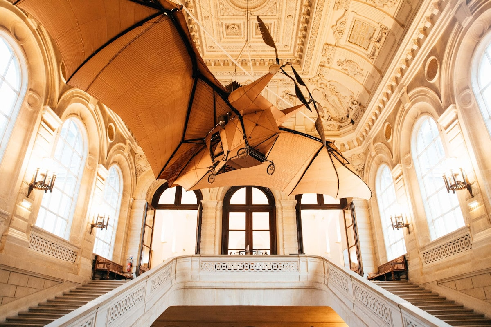
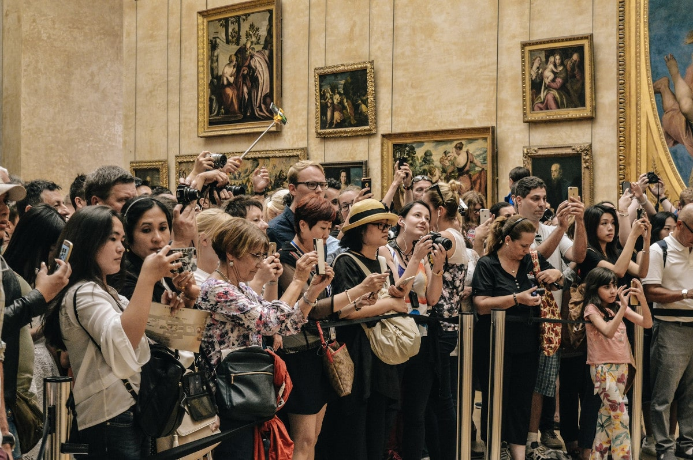
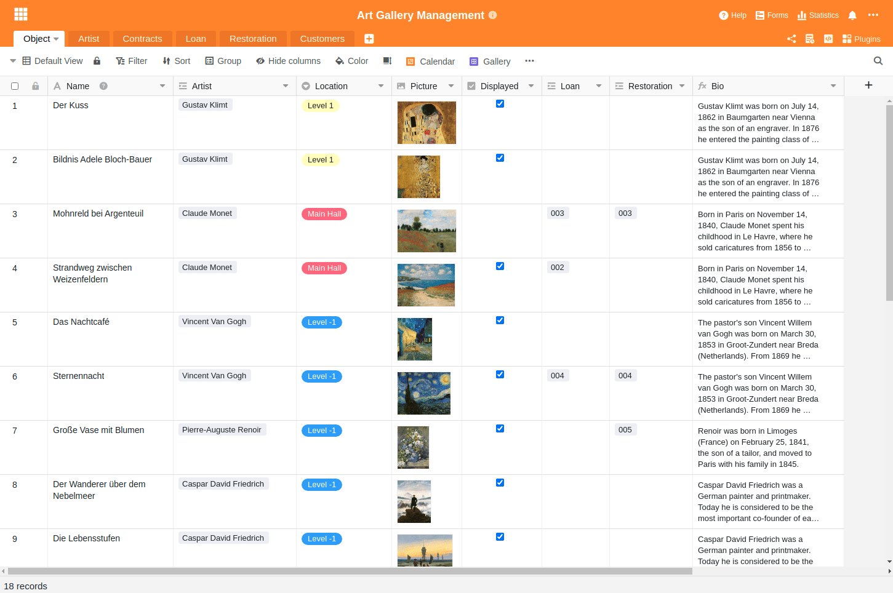
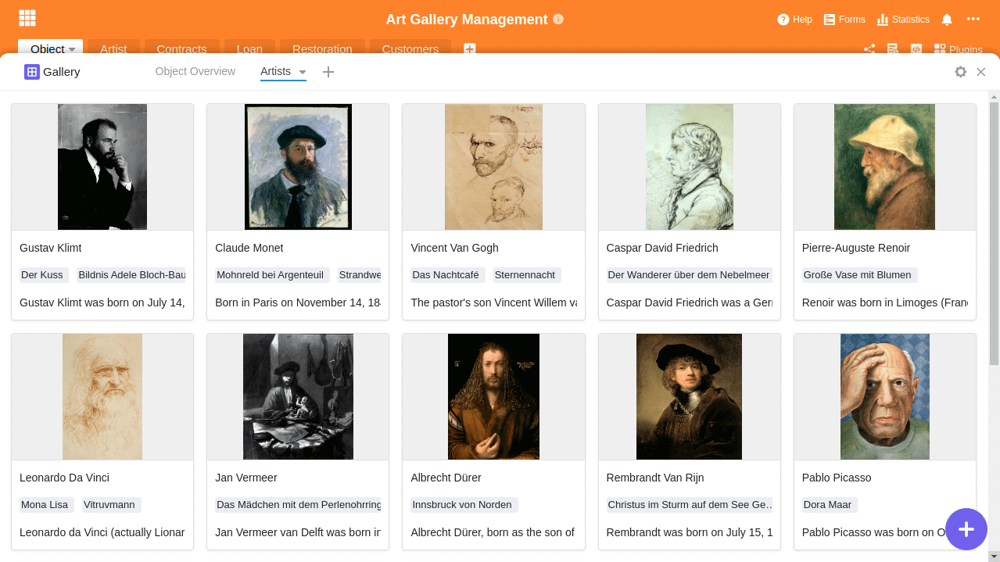
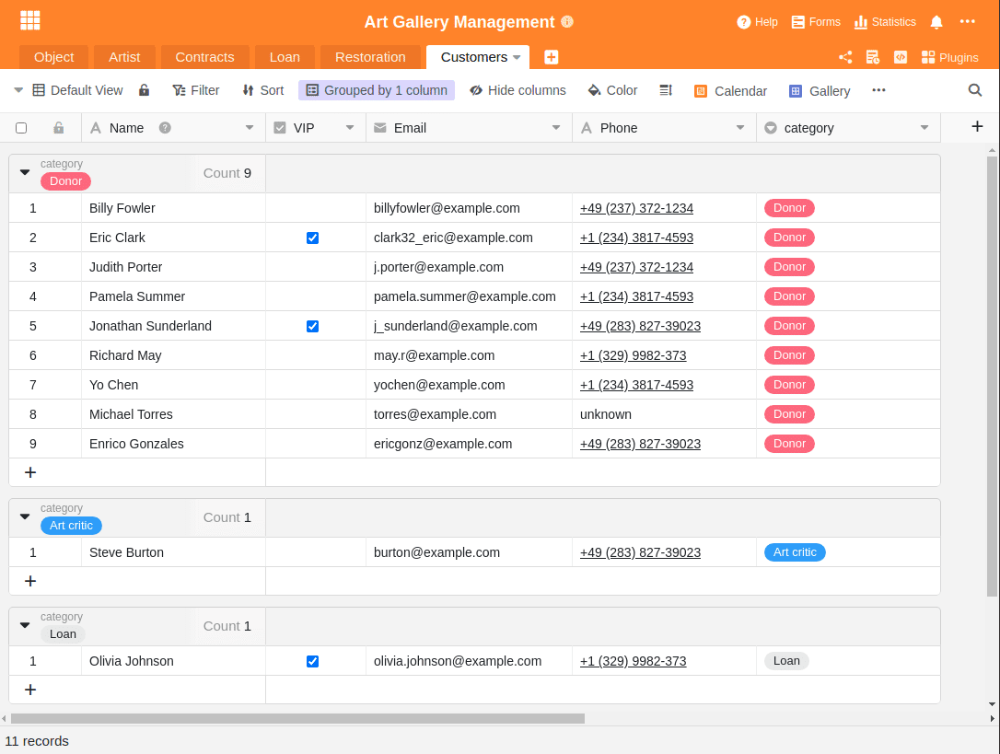

There are around [55,000 museums](https://www.zukunftsinstitut.de/artikel/die-zukunft-des-museums-ist-integrativ/) worldwide and countless other galleries, exhibitions, theaters and art stages. Everyone will agree that art in its various forms plays an important role in our lives. Without digital tools, managing and operating such an art institution would be almost inconceivable today. Applying for public funds, inventorying exhibits, and (especially during the Corona pandemic) registering visitors - there are certainly easier tasks than in art management.

This article describes the challenges of arts management, addresses the differences in managing a public arts institution as opposed to a business, outlines the problems of inflexible industry solutions to arts management, and identifies efficient ways you can overcome these challenges.

## What is art management and what are the tasks of a museum?

To be able to describe art management, one must first understand the tasks of a museum. But as simple as this may seem at first, even the [International Council of Museums](https://icom-deutschland.de) has struggled for decades to find a suitable and comprehensive definition. The impact of art on our society is too complex. Thus, in 2019 in Kyoto, the following description was agreed upon:

> Museums are democratising, inclusive and polyphonic spaces for critical dialogue about the pasts and the futures. Acknowledging and addressing the conflicts and challenges of the present, they hold artifacts and specimens in trust for society, safeguard diverse memories for future generations and guarantee equal rights and equal access to heritage for all people.

It is thus the task of public museums, exhibitions and galleries to be a haven of history. They are to preserve art objects and preserve them for present and future generations. The core tasks thus include "collecting, researching, preserving, exhibiting and communicating".

Art management is therefore about taking on precisely this difficult challenge and finding ways and means to fulfill the aforementioned core tasks in the public sphere.

## The differences between arts management and the management of a company

At first glance, running a business and running an art institution seem similar. The big difference, however, is that art exhibitions and museums are public and in most cases can act less independently. While businesses are profit-oriented and can decide for themselves what strategy to pursue, art institutions are largely funded by the state, can only generate a small part of their costs themselves through their visitors, and are often prohibited from trading their art. As a result, they are deprived of a potential source of income and are dependent on their financial backer - the state.

In addition, museums, galleries and exhibitions not only have to do a consistently good job in terms of content and organization, but they also have to permanently justify their own existence and continued financing. Museum directors live in a constant balancing act. They are expected to meet the high demands of the general public for art, while at the same time they are subject to constant public criticism and are often restricted in their activities by decisions of the public authorities and sponsors.

A small insight into the problem was given by the [resignation of Udo Kittelmann in 2019](https://www.tagesspiegel.de/kultur/staatliche-museen-in-der-krise-udo-kittelmanns-ruecktritt-wirft-ein-schlaglicht-auf-gravierende-probleme/24944096.html). Kittelmann renounced the chief post of the German National Gallery, probably the most renowned exhibition in Germany. Too little budget and too little freedom in combination with the permanent need for representation by politics had made him throw in the towel.

Few museums have the same appeal as the Louvre in Paris. The picture shows visitors in front of the Mona Lisa.

Financially, many museums, galleries and exhibitions are struggling. Even if they are funded by the state, the pressure to justify each of these institutions is increasing. For world-famous museums like the [Louvre](https://www.louvre.fr/en), it's easy to cover costs and attract visitors in droves. But how are small museums, exhibitions or artists' projects supposed to develop this kind of charisma?

Therefore, especially when revenues cannot cover costs, it is high time to think about efficient art management. Money that is not spent on the cost side does not have to be generated on the revenue side. This reduces the pressure to justify and facilitates the continued existence of such institutions.

## The challenges in art management

In addition to the difficult framework conditions of art management, however, there are also challenges in terms of content. The most difficult is certainly that art exists in a wide variety of forms and always has different requirements. Works of art cause high and mostly permanent follow-up costs through professional storage and restoration.

In addition, art objects often do not belong to museums, but are on loan for a certain period of time. Due to the usually high value, appropriate insurances have to be taken out. Often, the very building in which a museum is located is an art-historical asset and must be cared for. Depending on the type of exhibition, the necessary information to be recorded is diverse and can even change fundamentally from exhibition to exhibition.

It is the task of art management to master this complexity with digital solutions. These solutions must be able to cope with each of these challenges and must not cost too much.

Art management software must be flexible and simple at the same time. An unsolvable challenge for usual industry solutions

## Why industry solutions are often not suitable

As an industry outsider, you may be surprised at how many such industry solutions exist in exhibition, museum and art management. Even a brief search yields a multitude of possible solutions. Among the best known are: MuseumPlus, Axiell Collections Management, Artwork Archive, CatalogIt, PastPerfect, Argos Art Management, Versai Museum Management Software, Veevart and many more. Each of these solutions has its own unique focus, and can often be divided into two categories: One category focuses on the creation of catalogs, visual elements and exhibition information, while the other category takes care of the administrative work in the background.

The problem with all these special solutions is their fixed structure. It forces its users into a process and a way of working that the software finds useful. At the same time, the only way to cope with the multiple challenges in the art environment is flexibility. Only if the management software can adapt to the requirements and the reality, it will really facilitate the work of the users.

### SeaTable as flexible art management software

That's why you should take a look at SeaTable. Because SeaTable offers you exactly this flexibility you need to develop your own processes and workflows. In SeaTable you can combine all your information, no matter what kind, in your very own personal database and thus organize your daily work more efficiently. At the same time, SeaTable is as easy and intuitive to use as an Excel spreadsheet.

Manage and organize exhibitions, collections, contracts, loans, restoration tasks, customer bases, and information of any kind in a single intuitive software. Design your custom applications based on your information. Powerful filters, sorting, and grouping give you the freedom to tailor your work exactly the way you need it. Link SeaTable with your other [business applications]() and automate your workflows.

SeaTable is not rigid, but adapts flexibly to the needs and requirements of art management. The following sections describe typical art management tasks and how you can solve them with SeaTable. They are intended to give you a sense of the flexibility that SeaTable can provide.

## 1\. collection management

Collection management ensures the reliable capture, cataloging, indexing and management of all objects including all relevant information. Depending on the object, a different type of information capture may be relevant, but SeaTable allows you to respond flexibly. For a painting, in addition to the core data such as title, artist, dating and dimensions, the material and origin could also be relevant. At the same time, however, information about planned restorations or loans must also be recorded.

The strength of SeaTable lies in the fact that you determine yourself what information you want to capture and can expand it as you wish. At the same time, you can create any links between the different information and, with the help of rollup columns, also take over information from another table.

Our template [Art Gallery Management]() has some sample entries to show you the possibilities. The individual art objects are at the center of the collection management and are linked to the artists. At the same time, where the artwork is currently located is recorded and there are links to planned restorations and loans. An extension to include public references, creative periods or art categories can be added at any time.

Object overview of the Art Gallery Template

### Visual representation of the objects with the gallery plug-in

The table view of SeaTable can be flexibly adapted to the needs of your individual employees with individual views. In addition, SeaTable has other display options besides the tabular view. For entries with pictures, for example, it can make sense to use the [gallery plugin]() to get a clear overview and quickly find the desired entry. A click on the entry is sufficient to switch to the detailed view and make adjustments to the data.

The artists represented in a gallery

## 2\. exhibition management

The organization of an exhibition is complex and requires careful planning, management and control of multiple activities. SeaTable supports you with its flexible structure to coordinate the people, institutions, venues and lenders involved. Manage loans or monitor transportation to ensure complete traceability of all objects at all times. For example, every movement inside and outside the museum grounds can be recorded and documented via a movement log. You retain control of whether an exhibit is currently in the exhibition, in the restoration workshop, or in transit. Thanks to the powerful filters, groupings and sortings, you will not lose sight of any object.

Every museum has to manage a large number of contracts, agreements and insurances related to the exhibitions, loans and objects. In SeaTable you'll be able to record any type of information in a structured way to file a complete documentation. Manage your documents in specific file columns, get automatic email reminders before the expiration of a deadline or monitor the monthly costs using the statistical evaluations.

Evaluation of monthly costs by expenditure category

## 3\. contacts and contractors in art management

Contact and contract management is about managing all the people and companies you are in contact with. These can be employees, but also artists, restorers, patrons and sponsors, editors, press representatives as well as shipping companies and insurance companies. You determine which information you want to record and how you link this information to the exhibited art objects.

Do you want to save the date of birth of your sponsors in addition to the address? With just a few clicks, you can add another date column to your data entry and save this information as well from now on. The possibilities are almost limitless; for example, in addition to master data such as salutation, name, address, telephone number and e-mail, you could also maintain address groups and distribution lists as well as a complete contact history.

Group and filter your contacts

## 4\. restoration and care of works of art

The care of historical works of art represents a major challenge for art management. In addition to technical expertise, logging makes up a large part of the work. With SeaTable, you can record both incoming documentation and condition logs before and after restoration in images, videos, and descriptions. All measures for each object can be retrieved via a link column. In this way, you can link data on storage, transport or general condition directly to the object and always have it at hand.

## 5\. loans, transport and logistics in art management

In the case of an exhibition with loan objects, the coordination of transports, the people and institutions involved is an important task. In doing so, you must record the venues, lenders and the entry and exit protocols. At any point in time, the traceability of each loaned exhibit must be guaranteed. With SeaTable, you can meet this art management challenge with ease and guarantee complete traceability of all objects, whether on loan or owned by the collection. You know at any time whether an exhibit is currently in the archive, in the restoration workshop, in the exhibition, or in transit.

## 6\. literature archive for the art management

What would an art object be without the necessary background information? No matter what information you want to capture in addition to the objects, SeaTable gives you the possibility to do so. You can enter bibliographic entries of any kind or create literature references to objects. Alternatively, you can of course link directories, books, catalogs, periodicals and articles to the respective objects and thus create the basis for an exhibition documentation. Thus, our template is also suitable as a literature archive for art management.

## 7\. internet presence

Every exhibition, gallery and collection needs a website to provide art enthusiasts with more information about the artworks, artists and eras before, during and after their visit. Avoid duplicate data maintenance and simply use the information stored in SeaTable to create an engaging website. Thanks to the well-documented REST API, you can use any programming language to retrieve the content from SeaTable and display it on a web page.

This way you can display your exhibits on your website in your corporate design and create a suitable online presence. Once set up, the website updates automatically when you customize your objects in SeaTable or add more objects.

A single section of code is all you need to get your exhibits onto a web page. Just use the code as a source of inspiration and experiment with it. You can find the full API documentation at [https://api.seatable.com.](https://api.seatable.com)

## A platform for the individual workflows and processes of museums, galleries and exhibitions

The administration and management of museums, galleries and art exhibitions, or any form of art management, is certainly a great challenge. It requires intuition and that you constantly reinvent yourself. Use a software solution that can adapt to your specific needs and that is as flexible to new challenges as you are. Try SeaTable - and you'll be amazed at how versatile and flexible you can use it to develop your very own processes and workflows.
