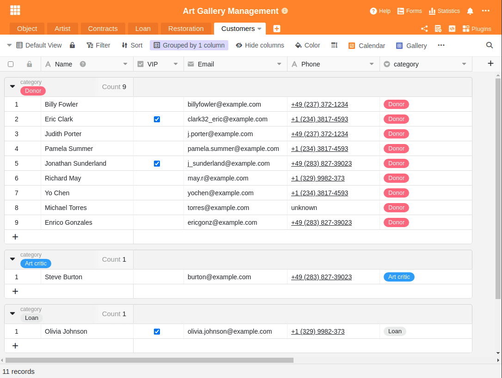

Il existe environ [55 000 musées](https://www.zukunftsinstitut.de/artikel/die-zukunft-des-museums-ist-integrativ/) dans le monde et d'innombrables autres galeries, expositions, théâtres et scènes artistiques. Tout le monde sera d'accord pour dire que l'art, sous ses différentes formes, joue un rôle important dans notre vie. Sans les outils numériques, il serait difficile d'imaginer aujourd'hui la gestion et l'exploitation d'une telle institution artistique. Demander des fonds publics, faire l'inventaire des pièces exposées et (surtout pendant la pandémie de Corona) enregistrer les visiteurs - il y a certainement des tâches plus simples que dans la gestion artistique.

Cet article décrit les défis de la gestion artistique, aborde les différences entre la gestion d'une institution artistique publique et celle d'une entreprise, esquisse les problèmes posés par les solutions sectorielles inflexibles dans la gestion artistique et propose des moyens efficaces pour relever ces défis.

## Qu'est-ce que la gestion de l'art et quelles sont les missions d'un musée ?

Pour pouvoir décrire la gestion de l'art, il faut d'abord comprendre les missions d'un musée. Mais aussi simple que cela puisse paraître au premier abord, même le [Conseil international des musées](https://icom-deutschland.de) peine depuis des décennies à trouver une définition appropriée et complète. L'impact de l'art sur notre société est trop complexe. C'est ainsi qu'en 2019, à Kyoto, les participants se sont mis d'accord sur la description suivante :

> Les musées sont des espaces démocratiques, inclusifs et polyphoniques pour un dialogue critique sur le passé et l'avenir. Acknowledging and addressing the conflicts and challenges of the present, they hold artefacts and specimens in trust for society, save diverse memories for future generations and guarantee equal rights and equal access to heritage for all people.

Les musées publics, les expositions et les galeries ont donc pour mission d'être un refuge pour l'histoire. Ils doivent conserver des objets d'art et les préserver pour les générations actuelles et futures. Les missions principales sont donc de "collecter, rechercher, conserver, exposer et transmettre".

La gestion de l'art consiste donc précisément à relever ce défi difficile et à trouver les moyens d'accomplir les tâches essentielles mentionnées dans l'espace public.

## Les différences entre la gestion artistique et la gestion d'une entreprise

A première vue, la gestion d'une entreprise et celle d'une institution artistique semblent similaires. La grande différence réside toutefois dans le fait que les expositions d'art et les musées sont publics et que, dans la plupart des cas, ils peuvent agir de manière moins autonome. Alors que les entreprises sont orientées vers le profit et peuvent décider elles-mêmes de la stratégie à adopter, les institutions artistiques sont en grande partie financées par l'État, ne peuvent générer qu'une petite partie de leurs coûts par leurs visiteurs et n'ont souvent pas le droit de faire commerce de leur art. Cela les prive d'une source de revenus potentielle et les rend dépendants de leur bailleur de fonds - l'État.

En outre, les musées, les galeries et les expositions doivent non seulement fournir un travail de qualité constant en termes de contenu et d'organisation, mais ils doivent également justifier en permanence leur propre existence et la poursuite de leur financement. Les directeurs de musées sont constamment sur la corde raide. Ils doivent répondre aux exigences élevées du public en matière d'art, tout en étant soumis à la critique publique permanente et en étant souvent limités dans leur activité par les décisions des pouvoirs publics et des organismes responsables.

On a eu un petit aperçu du problème avec la [démission d'Udo Kittelmann en 2019](https://www.tagesspiegel.de/kultur/staatliche-museen-in-der-krise-udo-kittelmanns-ruecktritt-wirft-ein-schlaglicht-auf-gravierende-probleme/24944096.html). Kittelmann a renoncé à son poste de chef de la Nationalgalerie allemande, sans doute l'exposition la plus prestigieuse d'Allemagne. Trop peu de budget et trop peu de liberté, combinés au besoin permanent de représentation du monde politique, l'avaient poussé à jeter l'éponge.

Peu de musées ont un pouvoir d'attraction comme le Louvre à Paris. La photo montre des visiteurs devant la Joconde.

De nombreux musées, galeries et expositions ont des difficultés financières. Même s'ils sont financés par l'État, la pression pour justifier leur existence augmente pour chacun d'entre eux. Pour les musées de renommée mondiale comme [le Louvre](https://www.louvre.fr/en), il est facile de couvrir les frais et d'attirer des visiteurs en masse. Mais comment les petits musées, les expositions ou les projets d'artistes peuvent-ils développer un tel rayonnement ?

C'est pourquoi, surtout lorsque les recettes ne peuvent pas couvrir les coûts, il est grand temps de réfléchir à une gestion efficace de l'art. L'argent qui n'est pas dépensé du côté des coûts ne doit pas être généré du côté des recettes. Cela réduit la pression de justification et facilite la pérennité de telles institutions.

## Les défis de la gestion de l'art

Outre les conditions difficiles de la gestion de l'art, il y a cependant aussi des défis de fond. Le plus difficile est certainement le fait que l'art existe sous les formes les plus diverses et que ses exigences sont toujours différentes. Les œuvres d'art entraînent des coûts consécutifs élevés et généralement durables en raison d'un stockage et d'une restauration appropriés.

En outre, les objets d'art n'appartiennent souvent pas aux musées, mais sont prêtés pour une certaine durée sous forme de prêt. En raison de leur valeur généralement élevée, des assurances appropriées doivent être souscrites. Souvent, le bâtiment même qui abrite un musée est un bien historique et artistique et doit être entretenu. Selon le type d'exposition, les informations nécessaires à saisir sont multiples et peuvent même changer fondamentalement d'une exposition à l'autre.

C'est la tâche de la gestion artistique de maîtriser cette complexité avec des solutions numériques. Ces solutions doivent pouvoir faire face à chacun de ces défis et ne doivent pas être trop coûteuses.

Les logiciels de gestion de l'art doivent être à la fois flexibles et simples. Un défi insurmontable pour les solutions sectorielles habituelles

## Pourquoi les solutions industrielles ne sont souvent pas adaptées

En tant que personne étrangère au secteur, on peut être surpris par le nombre de solutions sectorielles de ce type qui existent dans le domaine de la gestion des expositions, des musées et des œuvres d'art. Même une recherche rapide fournit une multitude de solutions possibles. Parmi les plus connues, on trouve : MuseumPlus, Axiell Collections Management, Artwork Archive, CatalogIt, PastPerfect, Argos Art Management, Versai Museum Management Software, Veevart et bien d'autres. Chacune de ces solutions a ses propres points forts, et l'on peut souvent distinguer deux catégories : L'une se focalise sur la création de catalogues, d'éléments visuels et d'informations sur les expositions, tandis que l'autre catégorie s'occupe du travail administratif en arrière-plan.

Le problème de toutes ces solutions spécialisées est leur structure fixe. Elle contraint ses utilisateurs à suivre un processus et une méthode de travail que le logiciel considère comme judicieux. Pourtant, la seule façon de faire face aux multiples défis de l'environnement artistique est la flexibilité. Ce n'est que si le logiciel de gestion peut s'adapter aux exigences et à la réalité qu'il facilitera réellement le travail des utilisateurs.

### SeaTable, un logiciel flexible de gestion de l'art

C'est pourquoi vous devriez jeter un coup d'œil à SeaTable. En effet, SeaTable vous offre exactement la flexibilité dont vous avez besoin pour développer vos propres processus et flux de travail. SeaTable vous permet de rassembler toutes vos informations, quelle que soit leur nature, dans votre base de données personnelle et d'organiser ainsi votre travail quotidien de manière plus efficace. SeaTable est aussi simple et intuitif à utiliser qu'un tableau Excel.

Gérez et organisez des expositions, des collections, des contrats, des prêts, des tâches de restauration, des bases de clients et des informations de tout type dans un seul logiciel intuitif. Créez vos applications individuelles sur la base de vos informations. De puissants filtres, tris et regroupements vous donnent la liberté d'organiser votre travail exactement comme vous le souhaitez. Reliez SeaTable à vos autres [applications professionnelles](https://seatable.io/fr/integrations/) et automatisez vos processus de travail.

SeaTable n'est pas figé, mais s'adapte de manière flexible aux besoins et aux exigences de la gestion des arts. Les sections suivantes décrivent des tâches typiques de la gestion des œuvres d'art et la manière dont vous pouvez les résoudre avec SeaTable. Ils visent à vous donner une idée de la flexibilité que SeaTable peut vous offrir.

## 1\. la gestion des collections

La gestion des collections garantit la saisie, le catalogage, l'indexation et la gestion fiables de tous les objets, y compris toutes les informations pertinentes. Selon l'objet, un autre type de saisie d'informations peut être pertinent, mais avec SeaTable, vous pouvez y répondre de manière flexible. Pour un tableau, outre les données de base telles que le titre, l'artiste, la datation et les dimensions, le matériau et l'origine peuvent également être pertinents. Mais en même temps, il faut aussi saisir des informations sur les restaurations prévues ou les prêts.

La force de SeaTable réside dans le fait que vous définissez vous-même les informations que vous souhaitez saisir et que vous pouvez les étendre à volonté. En même temps, vous pouvez créer des liens entre les différentes informations et utiliser les colonnes déroulantes pour reprendre des informations d'un autre tableau.

Notre modèle [Art Gallery Management](https://seatable.io/vorlage/wgdomegftn67lag0z_zjkg/) dispose de quelques exemples d'entrées pour vous présenter les possibilités. Les différents objets d'art sont au centre de la gestion de la collection et sont liés aux artistes. En même temps, l'endroit où se trouve l'œuvre d'art à un moment donné est enregistré et il existe des liens vers les restaurations prévues et les prêts. Une extension avec des références publiques, des périodes de création ou des catégories d'art peut être ajoutée à tout moment.

Aperçu des objets du modèle de galerie d'art

### Représentation visuelle des objets avec le plug-in galerie

L'affichage sous forme de tableau de SeaTable peut être adapté de manière flexible aux besoins de chacun de vos collaborateurs grâce à des vues individuelles. En plus de la présentation sous forme de tableau, SeaTable dispose d'autres possibilités d'affichage. Ainsi, pour les entrées contenant des images, il peut être judicieux d'utiliser le [plug-in Galerie](https://seatable.io/fr/docs/handbuch/seatable-nutzen/ansichten/) pour obtenir une vue d'ensemble claire et trouver rapidement l'entrée souhaitée. Il suffit de cliquer sur l'entrée pour passer à l'affichage détaillé et procéder à des adaptations des données.

Les artistes, présentés dans une galerie

## 2\. la gestion des expositions

L'organisation d'une exposition est complexe et nécessite une planification, une gestion et un contrôle minutieux de multiples activités. Grâce à sa structure flexible, SeaTable vous aide à coordonner les personnes, les institutions, les lieux et les prêteurs impliqués. Gérez les prêts ou surveillez le transport afin d'assurer à tout moment la traçabilité complète de tous les objets. Chaque mouvement à l'intérieur et à l'extérieur de l'enceinte du musée peut par exemple être enregistré et documenté via un protocole de mouvement. Vous gardez le contrôle sur le fait de savoir si un objet exposé se trouve actuellement dans l'exposition, dans l'atelier de restauration ou en cours de transport. Grâce aux puissants filtres, regroupements et tris, vous ne perdez aucun objet de vue.

Chaque musée doit gérer une multitude de contrats, d'accords et d'assurances concernant les expositions, les prêts et les objets. Dans SeaTable, vous pouvez saisir tout type d'information de manière structurée et ainsi classer une documentation complète. Gérez vos écrits dans des colonnes de fichiers spécifiques, recevez des rappels automatiques par e-mail avant l'expiration d'un délai ou surveillez les coûts mensuels à l'aide des rapports statistiques.

Évaluation des coûts mensuels par catégorie de dépenses

## 3\. contacts et partenaires contractuels dans la gestion des arts

La gestion des contacts et des contrats concerne la gestion de toutes les personnes et entreprises avec lesquelles vous êtes en relation. Il peut s'agir de collaborateurs, mais aussi d'artistes, de restaurateurs, de promoteurs et de sponsors, de rédacteurs, de représentants de la presse ainsi que de sociétés de transport et d'assurances. Vous déterminez quelles informations vous souhaitez saisir et comment vous souhaitez les relier aux objets d'art exposés.

Vous souhaitez enregistrer la date de naissance de vos sponsors en plus de leur adresse ? En quelques clics, vous ajoutez une nouvelle colonne de date à votre saisie de données et pouvez dès à présent enregistrer cette information. Les possibilités sont presque illimitées ; par exemple, en plus des données de base telles que la civilité, le nom, l'adresse, le numéro de téléphone et l'e-mail, vous pourriez également gérer des groupes d'adresses et des listes de distribution ainsi qu'un historique complet des contacts.

Regroupez et filtrez vos contacts

## 4\. restauration et entretien d'œuvres d'art

L'entretien d'œuvres d'art historiques représente un grand défi pour la gestion de l'art. Outre l'expertise professionnelle, la rédaction de protocoles représente une grande partie du travail. Avec SeaTable, vous pouvez enregistrer aussi bien la documentation entrante que les protocoles d'état avant et après la restauration, sous forme d'images, de vidéos et de descriptions. Une colonne de liens permet de consulter toutes les mesures prises pour chaque objet. Vous pouvez ainsi relier directement les données relatives au stockage, au transport ou à l'état général à l'objet et les avoir toujours à portée de main.

## 5\. prêts, transport et logistique dans la gestion de l'art

Lors d'une exposition avec des objets prêtés, la coordination des transports, des personnes et des institutions impliquées est une tâche importante. Pour ce faire, vous devez enregistrer les lieux de la manifestation, les prêteurs et les protocoles d'entrée et de sortie. La traçabilité de chaque objet prêté doit être garantie à tout moment. SeaTable vous permet de relever facilement ce défi de la gestion des œuvres d'art et de garantir une traçabilité complète de tous les objets, qu'ils soient prêtés ou qu'ils appartiennent à la collection. Vous savez à tout moment si une pièce se trouve actuellement dans les archives, dans l'atelier de restauration, dans l'exposition ou en cours de transport.

## 6\. archives littéraires pour la gestion de l'art

Que serait un objet d'art sans les informations de fond nécessaires ? Quelles que soient les informations que vous souhaitez saisir en plus des objets, vous en avez la possibilité avec SeaTable. Vous pouvez saisir des entrées bibliographiques de tout type ou créer des références bibliographiques pour les objets. Vous pouvez également relier des répertoires, des livres, des catalogues, des périodiques et des articles aux objets concernés et créer ainsi la base d'une documentation d'exposition. Ainsi, notre modèle peut également servir d'archive littéraire pour la gestion de l'art.

## 7\. présence sur Internet

Chaque exposition, galerie et collection a besoin d'un site web pour fournir aux personnes intéressées par l'art des informations supplémentaires sur les œuvres, les artistes et les époques avant, pendant et après leur visite. Évitez de gérer les données en double et utilisez simplement les informations stockées dans SeaTable pour créer un site web attrayant. Grâce à l'API REST bien documentée, vous pouvez utiliser n'importe quel langage de programmation pour récupérer le contenu de SeaTable et l'afficher sur une page web.

Vous pouvez ainsi présenter vos objets sur votre site web en respectant votre charte graphique et créer une présence en ligne adaptée. Une fois configuré, le site web se met automatiquement à jour lorsque vous adaptez vos objets dans SeaTable ou lorsque vous ajoutez d'autres objets.

Une seule section de code suffit pour placer vos expositions sur une page web. Utilisez simplement le code comme source d'inspiration et expérimentez-le. Vous trouverez la documentation complète de l'API sur [https://api.seatable.io.](https://api.seatable.io)

## Une plateforme pour les flux de travail et les processus individuels des musées, des galeries et des expositions.

L'administration et la gestion de musées, de galeries et d'expositions d'art, ou toute autre forme de gestion artistique, est certainement un grand défi. Il faut faire preuve de doigté et se réinventer en permanence. Utilisez une solution logicielle qui s'adapte à vos besoins et qui est aussi flexible que vous pour relever de nouveaux défis. Essayez SeaTable et vous découvrirez avec quelle souplesse et quelle flexibilité vous pouvez développer vos propres processus et flux de travail.
