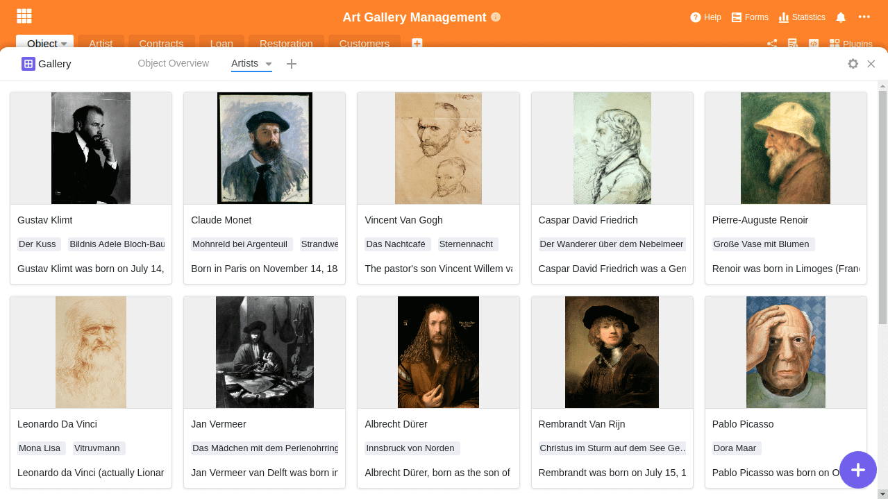

Existem cerca de [55.000 museus](https://www.zukunftsinstitut.de/artikel/die-zukunft-des-museums-ist-integrativ/) em todo o mundo e inúmeras outras galerias, exposições, teatros e palcos de arte. Todos concordarão que a arte, nas suas várias formas, desempenha um papel importante nas nossas vidas. Sem as ferramentas digitais, a gestão e o funcionamento de uma instituição de arte deste tipo seriam hoje em dia quase inimagináveis. Candidatar-se a fundos públicos, fazer o inventário das exposições e (especialmente durante a pandemia do coronavírus) registar os visitantes - há certamente tarefas mais fáceis do que a gestão da arte.

Este artigo descreve os desafios da gestão das artes, aborda as diferenças entre a gestão de uma instituição artística pública e a de uma empresa, descreve os problemas das soluções sectoriais inflexíveis na gestão das artes e mostra formas eficazes de ultrapassar estes desafios.

## O que é a gestão da arte e quais são as funções de um museu?

Para descrever a gestão da arte, é necessário compreender primeiro as tarefas de um museu. Mas por mais simples que isto possa parecer à primeira vista, mesmo o [Conselho Internacional de Museus](https://icom-deutschland.de) tem lutado durante décadas para encontrar uma definição adequada e abrangente. O impacto da arte na nossa sociedade é demasiado complexo. Em 2019, em Quioto, chegou-se a acordo sobre a seguinte descrição:

> Os museus são espaços democratizantes, inclusivos e polifónicos para o diálogo crítico sobre o passado e o futuro. Reconhecendo e abordando os conflitos e desafios do presente, guardam artefactos e espécimes em confiança para a sociedade, salvaguardam memórias diversas para as gerações futuras e garantem a igualdade de direitos e de acesso ao património para todas as pessoas.

Assim, a tarefa dos museus públicos, das exposições e das galerias é ser um refúgio da história. Devem conservar objectos de arte e preservá-los para as gerações presentes e futuras. As tarefas fundamentais incluem, assim, "recolher, investigar, preservar, expor e mediar".

A gestão da arte consiste, portanto, em assumir precisamente este difícil desafio e em encontrar formas e meios de cumprir as tarefas essenciais acima mencionadas no espaço público.

## As diferenças entre a gestão artística e a gestão de uma empresa

À primeira vista, a gestão de uma empresa e de uma instituição de arte parecem semelhantes. A grande diferença, no entanto, é que as exposições de arte e os museus são públicos e, na maioria dos casos, podem atuar de forma menos independente. Enquanto as empresas são orientadas para o lucro e podem decidir por si próprias a estratégia que pretendem seguir, as instituições de arte são em grande parte financiadas pelo Estado, só podem gerar uma pequena parte dos seus custos através dos seus visitantes e estão frequentemente proibidas de comercializar a sua arte. Este facto priva-os de uma potencial fonte de rendimento e torna-os dependentes do seu financiador - o Estado.

Além disso, os museus, as galerias e as exposições não só têm de fazer um trabalho consistentemente bom em termos de conteúdo e organização, como também têm de justificar permanentemente a sua própria existência e a continuação do seu financiamento. Os directores de museus vivem num constante equilíbrio. Espera-se que satisfaçam a elevada procura de arte por parte do público em geral, ao mesmo tempo que estão sujeitos a uma crítica pública constante e são frequentemente limitados nas suas actividades por decisões das autoridades públicas e dos patrocinadores.

Uma pequena visão do problema foi fornecida pela [demissão de Udo Kittelmann em 2019](https://www.tagesspiegel.de/kultur/staatliche-museen-in-der-krise-udo-kittelmanns-ruecktritt-wirft-ein-schlaglicht-auf-gravierende-probleme/24944096.html). Kittelmann renunciou ao seu cargo de diretor da Galeria Nacional Alemã, provavelmente a exposição mais famosa da Alemanha. Pouco orçamento e pouca liberdade, em combinação com a necessidade permanente de representação na política, levaram-no a desistir.

Poucos museus têm o mesmo atrativo que o Louvre, em Paris. A imagem mostra os visitantes em frente à Mona Lisa.

Do ponto de vista financeiro, muitos museus, galerias e exposições estão a passar por dificuldades. Mesmo que sejam financiados pelo Estado, a pressão para justificar cada uma destas instituições aumenta. Para os museus mundialmente famosos, como o [Louvre](https://www.louvre.fr/en), é fácil cobrir os custos e atrair visitantes em massa. Mas como é que os pequenos museus, exposições ou projectos de artistas podem desenvolver esse brilho?

Por conseguinte, especialmente quando as receitas não conseguem cobrir os custos, é altura de pensar numa gestão artística eficiente. O dinheiro que não é gasto em termos de custos não tem de ser gerado em termos de receitas. Isto reduz a pressão para justificar e facilita a existência continuada de tais instituições.

## Os desafios da gestão das artes

No entanto, para além das difíceis condições de enquadramento da gestão da arte, existem também desafios em termos de conteúdo. O mais difícil é certamente o facto de a arte existir nas mais diversas formas e ter sempre necessidades diferentes. As obras de arte implicam custos de acompanhamento elevados e, na maior parte dos casos, permanentes, através de armazenamento e restauro profissionais.

Além disso, muitas vezes os objectos de arte não pertencem aos museus, mas são emprestados por um determinado período de tempo. Devido ao seu valor geralmente elevado, devem ser subscritos os seguros correspondentes. Muitas vezes, o edifício onde se encontra um museu é já um bem histórico-artístico e deve ser cuidado. Dependendo do tipo de exposição, a informação necessária a registar é diversa e pode mesmo mudar fundamentalmente de exposição para exposição.

Cabe à gestão artística lidar com esta complexidade através de soluções digitais. Estas soluções devem ser capazes de fazer face a cada um destes desafios e não devem ser demasiado dispendiosas.

O software de gestão da arte deve ser flexível e simples ao mesmo tempo. Um desafio insolúvel para as soluções habituais do sector

## Porque é que as soluções industriais não são frequentemente adequadas

Como alguém de fora do sector, pode ficar surpreendido com a quantidade de soluções deste tipo existentes na gestão de exposições, museus e arte. Até mesmo uma breve pesquisa produz uma infinidade de soluções possíveis. Entre as mais conhecidas estão: MuseumPlus, Axiell Collections Management, Artwork Archive, CatalogIt, PastPerfect, Argos Art Management, Versai Museum Management Software, Veevart e muitos outros. Cada uma destas soluções tem o seu próprio enfoque individual, e é frequente distinguir duas categorias: Uma categoria centra-se na criação de catálogos, elementos visuais e informações sobre exposições, enquanto a outra categoria se ocupa do trabalho administrativo em segundo plano.

O problema de todas estas soluções especiais é a sua estrutura fixa. Obriga os seus utilizadores a um processo e a uma forma de trabalhar que o software considera úteis. Ao mesmo tempo, a única forma de lidar com os múltiplos desafios do meio artístico é a flexibilidade. Só se o software de gestão puder adaptar-se às exigências e à realidade é que facilitará verdadeiramente o trabalho dos seus utilizadores.

### SeaTable como software flexível de gestão artística

Por este motivo, deve dar uma vista de olhos ao SeaTable. Porque o SeaTable oferece-lhe exatamente a flexibilidade de que necessita para desenvolver os seus próprios processos e fluxos de trabalho. No SeaTable, pode reunir toda a sua informação, independentemente do tipo, na sua própria base de dados pessoal e, assim, organizar o seu trabalho diário de forma mais eficiente. O SeaTable é tão fácil e intuitivo de utilizar como uma folha de cálculo do Excel.

Gerir e organizar exposições, colecções, contratos, empréstimos, tarefas de restauro, bases de clientes e informações de qualquer tipo num único software intuitivo. Conceba as suas aplicações individuais com base nas suas informações. Poderosos filtros, ordenação e agrupamento dão-lhe a liberdade de conceber o seu trabalho exatamente da forma que necessita. Ligue o SeaTable às suas outras [aplicações comerciais](https://seatable.io/pt/integrationen/) e automatize os seus fluxos de trabalho.

O SeaTable não é rígido, mas adapta-se de forma flexível às necessidades e requisitos da gestão artística. As secções seguintes descrevem as tarefas típicas da gestão artística e a forma como podem ser resolvidas com o SeaTable. O objetivo é dar uma ideia da flexibilidade que o SeaTable pode oferecer.

## 1\. gestão de colecções

A gestão de colecções assegura o registo, a catalogação, a indexação e a gestão fiáveis de todos os objectos, incluindo todas as informações relevantes. Dependendo do objeto, pode ser relevante um tipo diferente de recolha de informações, mas com o SeaTable é possível responder de forma flexível. No caso de uma pintura, para além dos dados essenciais, como o título, o artista, a data e as dimensões, o material e a origem também podem ser relevantes. Ao mesmo tempo, no entanto, as informações sobre restauros planeados ou empréstimos também devem ser registadas.

A força do SeaTable reside no facto de ser o próprio utilizador a determinar a informação que pretende registar, podendo expandi-la como desejar. Ao mesmo tempo, pode criar quaisquer ligações entre as diferentes informações e, com a ajuda de colunas de roll-up, também pode assumir informações de outra tabela.

O nosso modelo [Art Gallery Management]() tem alguns exemplos de entradas para lhe mostrar as possibilidades. Os objectos de arte individuais estão no centro da gestão da coleção e estão ligados aos artistas. Ao mesmo tempo, a localização da obra de arte é registada e existem ligações para restauros e empréstimos planeados. A qualquer momento, pode ser acrescentada uma extensão para incluir referências públicas, períodos criativos ou categorias de arte.

Vista geral dos objectos do modelo da Galeria de Arte

### Representação visual dos objectos com o plug-in da galeria

A vista de tabela do SeaTable pode ser adaptada de forma flexível às necessidades de cada colaborador com vistas individuais. Além disso, o SeaTable tem outras opções de visualização para além da vista tabular. Para entradas com imagens, por exemplo, pode fazer sentido utilizar o [plugin da galeria](https://seatable.io/pt/docs/handbuch/seatable-nutzen/ansichten/) para obter uma visão geral clara e encontrar rapidamente a entrada desejada. Um clique na entrada é suficiente para mudar para a vista detalhada e fazer ajustes nos dados.

Os artistas, representados numa galeria

## 2\. gestão de exposições

A organização de uma exposição é complexa e requer um planeamento cuidadoso, gestão e controlo de múltiplas actividades. O SeaTable apoia-o com a sua estrutura flexível para coordenar as pessoas, as instituições, os locais e os financiadores envolvidos. Gerir os empréstimos ou monitorizar o transporte para garantir a rastreabilidade completa de todos os objectos em qualquer altura. Cada movimento dentro e fora do recinto do museu, por exemplo, pode ser registado e documentado através de um registo de movimentos. Pode controlar se uma peça está atualmente em exposição, na oficina de restauro ou em trânsito. Graças aos poderosos filtros, agrupamentos e ordenações, não perderá nenhum objeto de vista.

Todos os museus têm de gerir uma multiplicidade de contratos, acordos e seguros relacionados com as exposições, empréstimos e objectos. No SeaTable, é possível registar todo o tipo de informações de forma estruturada e, assim, arquivar toda a documentação. Gerir os seus documentos em colunas de arquivo específicas, ser automaticamente lembrado por correio eletrónico antes do fim de um prazo ou controlar os custos mensais através das avaliações estatísticas.

Avaliação dos custos mensais por categoria de despesas

## 3\. contactos e parceiros contratuais na gestão das artes

A gestão de contactos e contratos consiste na gestão de todas as pessoas e empresas com as quais está em contacto. Podem ser empregados, mas também artistas, restauradores, mecenas e patrocinadores, editores, representantes da imprensa, bem como empresas de transporte e companhias de seguros. O utilizador determina as informações que pretende registar e a forma de as associar aos objectos de arte expostos.

Pretende guardar a data de nascimento dos seus patrocinadores, para além do endereço? Com apenas alguns cliques, pode adicionar outra coluna de data à sua entrada de dados e guardar também esta informação. As possibilidades são quase ilimitadas; por exemplo, para além dos dados principais, como a saudação, o nome, a morada, o número de telefone e o e-mail, pode também manter grupos de endereços e listas de distribuição, bem como um histórico completo dos contactos.

Agrupe e filtre os seus contactos

## 4\. restauro e tratamento de obras de arte

A conservação de obras de arte históricas constitui um grande desafio para a gestão da arte. Para além dos conhecimentos técnicos, o registo constitui uma grande parte do trabalho. Com o SeaTable, é possível registar a documentação recebida e os registos do estado antes e depois do restauro em imagens, vídeos e descrições. Todas as medidas de cada objeto podem ser recuperadas através de uma coluna de ligação. Isto permite-lhe associar dados sobre armazenamento, transporte ou estado geral diretamente ao objeto e tê-los sempre à mão.

## 5\. empréstimos, transporte e logística na gestão da arte

Numa exposição com objectos emprestados, a coordenação dos transportes, das pessoas e das instituições envolvidas é uma tarefa importante. Para tal, é necessário registar os locais, os emprestadores e os protocolos de entrada e saída. A rastreabilidade de cada objeto emprestado deve ser garantida a todo o momento. Com o SeaTable, pode enfrentar facilmente este desafio de gestão de arte e garantir a rastreabilidade completa de todos os objectos - quer sejam emprestados ou propriedade da coleção. Sabe sempre se uma exposição está atualmente no arquivo, na oficina de restauro, na exposição ou em trânsito.

## 6\. arquivo literário para a gestão das artes

O que seria de um objeto de arte sem a informação de base necessária? Independentemente da informação que pretenda registar para além dos objectos, com o SeaTable tem a possibilidade de o fazer. Pode introduzir entradas bibliográficas de qualquer tipo ou criar referências bibliográficas aos objectos. Em alternativa, pode ligar directórios, livros, catálogos, publicações periódicas e artigos aos respectivos objectos, criando assim a base para uma documentação de exposição. Isto faz com que o nosso modelo também seja adequado como um arquivo de literatura para a gestão de arte.

## 7\. presença na internet

Todas as exposições, galerias e colecções precisam de um website para fornecer aos entusiastas da arte mais informações sobre as obras de arte, artistas e períodos antes, durante e depois da sua visita. Evite a manutenção de dados duplicados e utilize simplesmente as informações armazenadas no SeaTable para criar um sítio Web interessante. Graças à API REST bem documentada, é possível utilizar qualquer linguagem de programação para recuperar o conteúdo do SeaTable e apresentá-lo numa página Web.

Isto permite-lhe apresentar as suas exposições no seu sítio Web com o seu design corporativo e criar uma presença online correspondente. Uma vez configurado, o sítio Web é atualizado automaticamente quando personaliza os seus objectos no SeaTable ou adiciona mais objectos.

Uma única secção de código é tudo o que é necessário para colocar as suas exposições num sítio Web. Basta utilizar o código como fonte de inspiração e fazer experiências com ele. Pode encontrar a documentação completa da API em [https://api.seatable.io.](https://api.seatable.io)

## Uma plataforma para os fluxos de trabalho individuais e processos dos museus, galerias e exposições

A administração e gestão de museus, galerias e exposições de arte, ou qualquer forma de gestão artística, é certamente um grande desafio. Exige talento e que se reinvente constantemente. Utilize uma solução de software que se adapte às suas necessidades específicas e que seja tão flexível a novos desafios como você. Experimente o SeaTable - e ficará surpreendido com a versatilidade e flexibilidade com que o pode utilizar para desenvolver os seus próprios processos e fluxos de trabalho.
