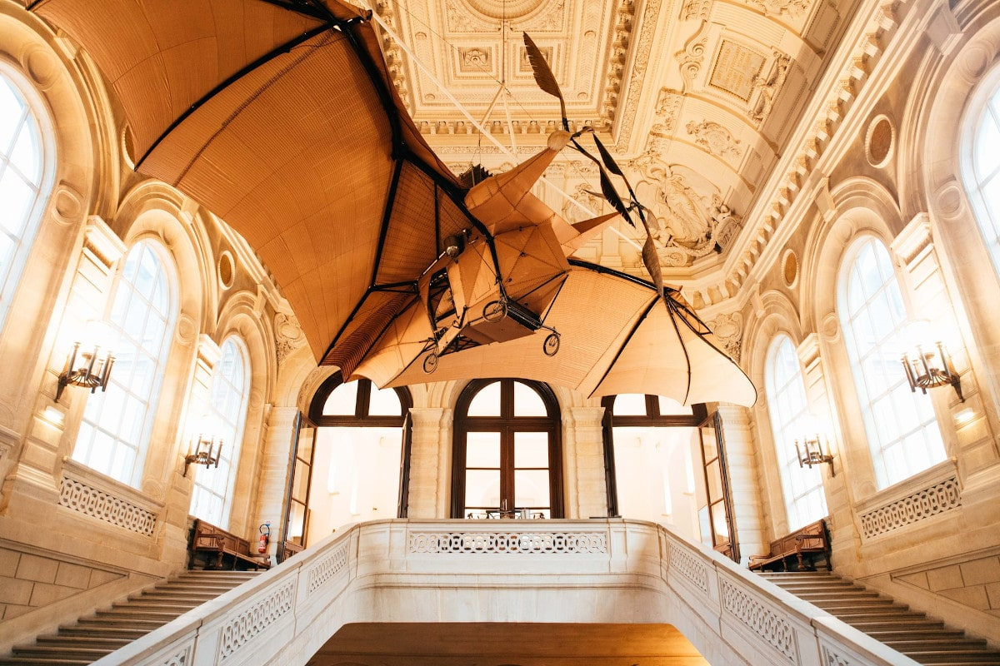
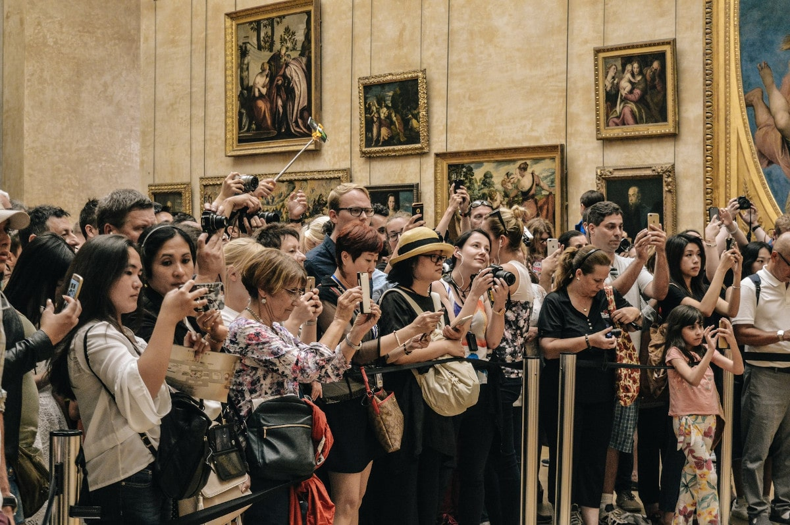

В мире насчитывается около [55 000 музеев](https://www.zukunftsinstitut.de/artikel/die-zukunft-des-museums-ist-integrativ/) и бесчисленное множество других галерей, выставок, театров и художественных площадок. Все согласятся, что искусство в его различных формах играет важную роль в нашей жизни. Без цифровых инструментов управление и эксплуатация такого учреждения искусства были бы сегодня практически немыслимы. Подача заявок на получение государственных средств, инвентаризация экспонатов и (особенно во время пандемии короны) регистрация посетителей - безусловно, есть задачи проще, чем управление искусством.

В этой статье описываются проблемы в управлении искусством, рассматриваются различия в управлении общественным учреждением искусства по сравнению с бизнесом, описываются проблемы негибких отраслевых решений в управлении искусством и показываются эффективные способы, с помощью которых вы можете преодолеть эти проблемы.

## Что такое арт-менеджмент и каковы задачи музея?

Для того чтобы описать арт-менеджмент, необходимо сначала понять задачи музея. Но каким бы простым это ни казалось на первый взгляд, даже [Международный совет музеев](https://icom-deutschland.de) на протяжении десятилетий пытался найти подходящее и всеобъемлющее определение. Влияние искусства на наше общество слишком сложно. В Киото в 2019 году было согласовано следующее описание:

> Музеи - это демократичные, инклюзивные и полифонические пространства для критического диалога о прошлом и будущем. Признавая и решая конфликты и проблемы настоящего, они хранят артефакты и образцы в доверительном управлении для общества, сохраняют разнообразную память для будущих поколений и гарантируют равные права и равный доступ к наследию для всех людей.

Таким образом, задача государственных музеев, выставок и галерей - быть прибежищем истории. Они должны сохранять предметы искусства и беречь их для нынешнего и будущих поколений. Таким образом, к основным задачам относятся "сбор, исследование, сохранение, экспонирование и посредничество".

Таким образом, арт-менеджмент - это принятие именно этого сложного вызова и поиск путей и средств для выполнения вышеупомянутых основных задач в общественном пространстве.

## Различия между художественным менеджментом и менеджментом компании

На первый взгляд, управление бизнесом и художественным учреждением кажется похожим. Однако большая разница заключается в том, что художественные выставки и музеи являются публичными и в большинстве случаев могут действовать менее независимо. В то время как компании ориентированы на получение прибыли и могут сами решать, какой стратегии им придерживаться, художественные учреждения в значительной степени финансируются государством, могут самостоятельно покрывать лишь небольшую часть своих расходов за счет посетителей, и им часто запрещено торговать своим искусством. Это лишает их потенциального источника дохода и делает их зависимыми от своего финансового спонсора - государства.

Кроме того, музеи, галереи и выставки должны не только постоянно хорошо работать с точки зрения содержания и организации, но и постоянно оправдывать свое существование и дальнейшее финансирование. Директора музеев находятся в состоянии постоянного балансирования. От них ожидают удовлетворения высоких требований широкой публики к искусству, но в то же время они подвергаются постоянной общественной критике и часто ограничены в своей деятельности решениями государственных органов и спонсоров.

Небольшое представление о проблеме дала [отставка Удо Киттельмана в 2019 г](https://www.tagesspiegel.de/kultur/staatliche-museen-in-der-krise-udo-kittelmanns-ruecktritt-wirft-ein-schlaglicht-auf-gravierende-probleme/24944096.html). Киттельман отказался от должности главы Немецкой национальной галереи, вероятно, самой известной выставки в Германии. Слишком маленький бюджет и слишком мало свободы в сочетании с постоянной потребностью в представительстве в политике заставили его выбросить полотенце.

Немногие музеи обладают такой же притягательностью, как Лувр в Париже. На фотографии изображены посетители перед Моной Лизой.

В финансовом отношении многие музеи, галереи и выставки испытывают трудности. Даже если они финансируются государством, давление, направленное на оправдание каждого из этих учреждений, возрастает. Для всемирно известных музеев, таких как [Лувр](https://www.louvre.fr/en), легко покрыть расходы и привлечь толпы посетителей. Но как небольшие музеи, выставки или проекты художников могут развить это сияние?

Поэтому, особенно когда доходы не могут покрыть расходы, самое время подумать об эффективном управлении искусством. Деньги, которые не тратятся на расходы, не нужно генерировать на доходы. Это снижает давление на оправдание и способствует дальнейшему существованию таких учреждений.

## Проблемы управления искусством

Помимо сложных рамочных условий управления искусством, однако, существуют также трудности в плане содержания. Самым сложным, безусловно, является то, что искусство существует в самых разнообразных формах и всегда предъявляет различные требования. Произведения искусства вызывают большие и, в основном, постоянные расходы на последующую деятельность, связанную с профессиональным хранением и реставрацией.

Кроме того, предметы искусства часто не принадлежат музеям, а передаются во временное пользование на определенный срок. В связи с тем, что их стоимость обычно высока, необходимо заключать соответствующие договоры страхования. Часто здание, в котором расположен музей, уже является художественно-исторической ценностью, и за ним необходимо ухаживать. В зависимости от типа выставки, необходимая информация, подлежащая регистрации, разнообразна и может даже кардинально меняться от выставки к выставке.

Задача арт-менеджмента - справиться с этой сложностью с помощью цифровых решений. Эти решения должны быть способны справиться с каждым из этих вызовов и не должны стоить слишком дорого.

Программное обеспечение для управления искусством должно быть гибким и простым одновременно. Неразрешимая задача для обычных отраслевых решений

## Почему промышленные решения часто не подходят

Как сторонний наблюдатель, человек может быть удивлен тем, как много подобных отраслевых решений существует в выставочном, музейном и арт-менеджменте. Даже беглый поиск дает множество возможных решений. К наиболее известным относятся: MuseumPlus, Axiell Collections Management, Artwork Archive, CatalogIt, PastPerfect, Argos Art Management, Versai Museum Management Software, Veevart и многие другие. Каждое из этих решений имеет свою индивидуальную направленность, и часто можно выделить две категории: Одна категория фокусируется на создании каталогов, визуальных элементов и выставочной информации, в то время как другая категория заботится об административной работе в фоновом режиме.

Проблема всех этих специальных решений заключается в их фиксированной структуре. Она заставляет своих пользователей придерживаться процесса и способа работы, который программное обеспечение считает полезным. В то же время, единственный способ справиться с многочисленными вызовами в художественной среде - это гибкость. Только если программное обеспечение для управления может адаптироваться к требованиям и реальности, оно будет действительно способствовать работе своих пользователей.

### SeaTable как гибкое программное обеспечение для управления искусством

По этой причине вам стоит обратить внимание на SeaTable. Потому что SeaTable предлагает вам именно ту гибкость, которая необходима для разработки собственных процессов и рабочих процессов. В SeaTable вы можете собрать всю свою информацию, независимо от ее вида, в свою собственную базу данных и таким образом организовать свою повседневную работу более эффективно. SeaTable так же проста и интуитивно понятна в использовании, как электронная таблица Excel.

Управляйте и организуйте выставки, коллекции, контракты, займы, задачи реставрации, клиентские базы и любую другую информацию в одном интуитивно понятном программном обеспечении. Создавайте индивидуальные приложения на основе вашей информации. Мощные фильтры, сортировка и группировка дают вам свободу создавать работу именно так, как вам нужно. Связывайте SeaTable с другими [бизнес-приложениями]() и автоматизируйте рабочие процессы.

SeaTable не является жестким, а гибко адаптируется к нуждам и требованиям управления искусством. В следующих разделах описаны типичные задачи в сфере управления искусством и то, как вы можете решить их с помощью SeaTable. Они призваны дать вам представление о гибкости, которую может предложить вам SeaTable.

## 1\. управление коллекциями

Управление коллекциями обеспечивает надежную регистрацию, каталогизацию, индексирование и управление всеми объектами, включая всю необходимую информацию. В зависимости от объекта может быть уместен разный тип сбора информации, но с помощью SeaTable вы можете гибко реагировать на ситуацию. Для картины, помимо основных данных, таких как название, художник, датировка и размеры, могут быть важны также материал и происхождение. В то же время, однако, информация о планируемой реставрации или заимствовании также должна быть зарегистрирована.

Сила SeaTable заключается в том, что вы сами определяете, какую информацию хотите записать, и можете расширять ее по своему усмотрению. В то же время вы можете создавать любые связи между различной информацией и, с помощью сворачивающихся колонок, также заимствовать информацию из другой таблицы.

Наш шаблон [Art Gallery Management]() есть несколько образцов записей, чтобы показать вам возможности. Отдельные предметы искусства находятся в центре управления коллекцией и связаны с художниками. В то же время указывается, где в настоящее время находится произведение искусства, а также ссылки на планируемые реставрации и займы. В любой момент можно расширить коллекцию, включив в нее ссылки на общественность, творческие периоды или категории искусства.

Обзор объектов шаблона художественной галереи

### Визуальное представление объектов с помощью плагина галереи

Табличный вид SeaTable можно гибко адаптировать к потребностям отдельных сотрудников с помощью индивидуальных представлений. Кроме того, SeaTable имеет и другие варианты отображения, помимо табличного представления. Например, для записей с фотографиями имеет смысл использовать [плагин галереи](https://seatable.io/ru/docs/handbuch/seatable-nutzen/ansichten/), чтобы получить наглядный обзор и быстро найти нужную запись. Достаточно щелкнуть по записи, чтобы перейти к детальному представлению и внести коррективы в данные.

Художники, представленные в галерее

## 2\. управление выставками

Организация выставки сложна и требует тщательного планирования, управления и контроля многочисленных мероприятий. SeaTable поможет вам с помощью своей гибкой структуры координировать людей, учреждения, места проведения выставки и кредиторов. Управляйте займами или контролируйте транспортировку, чтобы обеспечить полную отслеживаемость всех объектов в любое время. Например, каждое перемещение по территории музея и за его пределами может быть зафиксировано и задокументировано в журнале перемещений. Вы контролируете, находится ли экспонат в данный момент на выставке, в реставрационной мастерской или в пути. Благодаря мощным фильтрам, группировкам и сортировкам вы не потеряете из виду ни один объект.

Каждый музей должен управлять множеством контрактов, соглашений и страховок, связанных с выставками, займами и предметами. В SeaTable вы можете структурированно записывать любой тип информации и таким образом вести полную документацию. Управляйте документами в определенных колонках файлов, получайте автоматическое напоминание по электронной почте до истечения срока или контролируйте ежемесячные расходы с помощью статистических оценок.

Оценка ежемесячных затрат по категориям расходов

## 3\. контакты и договорные партнеры в сфере управления искусством

Управление контактами и контрактами - это управление всеми людьми и компаниями, с которыми вы контактируете. Это могут быть как сотрудники, так и художники, реставраторы, меценаты и спонсоры, редакторы, представители прессы, а также транспортные и страховые компании. Вы сами определяете, какую информацию вы хотите регистрировать и как связать эту информацию с выставленными предметами искусства.

Вы хотите сохранить дату рождения ваших спонсоров в дополнение к адресу? Всего несколькими щелчками мыши вы можете добавить еще один столбец с датой к вводу данных и сохранить и эту информацию. Возможности практически безграничны; например, в дополнение к основным данным, таким как приветствие, имя, адрес, номер телефона и электронная почта, вы можете вести группы адресов и списки рассылки, а также полную историю контактов.

Группируйте и фильтруйте контакты

## 4\. реставрация и уход за произведениями искусства

Уход за историческими произведениями искусства представляет собой большую проблему для арт-менеджмента. Помимо технической экспертизы, большую часть работы составляет протоколирование. С помощью SeaTable вы можете регистрировать как входящую документацию, так и журналы состояния до и после реставрации в виде изображений, видео и описаний. Все показатели по каждому объекту могут быть получены через колонку ссылок. Это позволяет связать данные о хранении, транспортировке или общем состоянии непосредственно с объектом и всегда иметь их под рукой.

## 5\. кредиты, транспорт и логистика в управлении искусством

На выставке с предметами, взятыми во временное пользование, важной задачей является координация перевозок, участвующих лиц и учреждений. При этом необходимо фиксировать места проведения выставки, кредиторов и протоколы входа и выхода. В любое время должна быть гарантирована отслеживаемость каждого экспоната, переданного во временное пользование. С помощью SeaTable вы можете легко решить эту задачу управления искусством и гарантировать полную прослеживаемость всех предметов - как переданных во временное пользование, так и принадлежащих коллекции. Вы всегда знаете, находится ли экспонат в данный момент в архиве, в реставрационной мастерской, на выставке или в пути.

## 6\. литературный архив для управления искусством

Чем был бы предмет искусства без необходимой справочной информации? Независимо от того, какую информацию вы хотите записать в дополнение к объектам, с помощью SeaTable у вас есть такая возможность. Вы можете вводить библиографические записи любого рода или создавать литературные ссылки на объекты. Кроме того, вы можете связать справочники, книги, каталоги, периодические издания и статьи с соответствующими объектами и таким образом создать основу для выставочной документации. Это делает наш шаблон также подходящим в качестве литературного архива для арт-менеджмента.

## 7\. присутствие в Интернете

Каждая выставка, галерея и коллекция нуждается в веб-сайте, чтобы предоставить любителям искусства больше информации о произведениях, художниках и периодах до, во время и после их посещения. Избегайте дублирования данных и просто используйте информацию, хранящуюся в SeaTable, для создания увлекательного веб-сайта. Благодаря хорошо документированному REST API вы можете использовать любой язык программирования для получения содержимого из SeaTable и отображения его на веб-странице.

Это позволит вам отобразить ваши экспонаты на вашем веб-сайте в вашем корпоративном дизайне и создать соответствующее онлайн-присутствие. После настройки веб-сайт автоматически обновляется, когда вы настраиваете свои объекты в SeaTable или добавляете новые объекты.

Достаточно одного участка кода, чтобы ваши экспонаты появились на сайте. Просто используйте код как источник вдохновения и экспериментируйте с ним. Вы можете найти полную документацию API на сайте [https://api.seatable.io.](https://api.seatable.io)

## Платформа для индивидуальных рабочих процессов и процессов музеев, галерей и выставок

Администрирование и управление музеями, галереями и художественными выставками, или любая форма управления искусством, - это, безусловно, большой вызов. Она требует чутья и постоянного обновления. Используйте программное решение, которое может адаптироваться к вашим конкретным потребностям и которое так же гибко реагирует на новые вызовы, как и вы. Попробуйте SeaTable - и вы будете поражены тем, насколько универсально и гибко вы можете использовать его для разработки своих собственных процессов и рабочих процессов.
