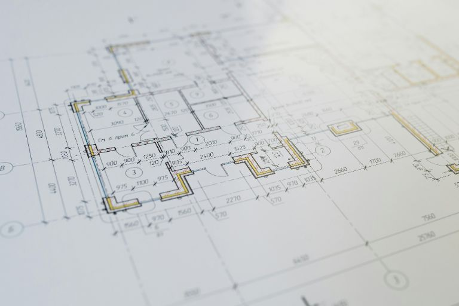

For many people, the dream of owning their own home is one of their biggest goals in life. But between buying the plot of land, obtaining permits and the actual construction, there are countless tasks that need to be perfectly coordinated. To ensure that construction planning doesn't end in chaos, you need a clear timetable - the construction schedule.

In this article, you will find out why a construction schedule is so helpful, what you should bear in mind and how you can get started right away with SeaTable's free construction schedule planner.

## What is a construction schedule?

A construction schedule is the heart of a successful construction organization. It provides a clear overview of the timeline of a construction project** and creates clarity about which work takes place at what time and how the individual steps interlock. From initial planning to execution and completion, the construction schedule ensures that everyone involved knows when their input is required.

This structured approach allows you to better coordinate construction phases, use resources efficiently and identify delays at an early stage. This makes the construction schedule a reliable tool in construction planning, allowing you to keep an eye not only on deadlines, but also on the quality and cost-effectiveness of your project.

## Why should I create a construction schedule?

A construction project is a complex interplay of many people, materials and decisions. Even small delays can have a major impact - a late delivery date, an unforeseen defect or an uncoordinated work step is often enough to throw the entire process into disarray. Good construction planning ensures that this does not happen to you.

The construction schedule creates transparency and planning security by showing you the clear time dependencies between the trades. This allows you to identify bottlenecks at an early stage, realistically adjust deadlines and keep costs under control. It also makes it easier for you as the client to communicate with tradesmen and planners because you are all working on the same information basis.

The construction schedule is a valuable tool, especially for private builders who are building a house for the first time. It removes uncertainty from the process, shows progress transparently and helps you to manage your own building project with confidence and structure. After all, without a clear schedule, neither your own home nor a large construction project will come together smoothly in the end.

## Construction schedule and construction schedule - the difference

The terms construction schedule and construction schedule are often used synonymously in everyday life, but describe different levels of planning. With a construction schedule, you **determine the time frame of the project**. It answers questions such as: When does the shell construction start? When will the roof be covered? When will the interior work start? It shows at a glance which work steps should take place at which time and how long they will each take.

The construction schedule goes beyond this. It not only describes when something happens, but also **how the individual works build on and depend on each other**. The focus here is therefore on the content and technical relationships. Typical questions are, for example: What work must be completed before the screed can be laid? When can the electrical installation begin? Which activities can run in parallel without interfering with each other?

## The most important phases of your construction project

Before you draw up your construction schedule, you should know the typical phases of the construction project. This will enable you to set realistic time frames and better assess dependencies.

### The planning phase

The first step is preparation. This is where the plot, financing and permits are clarified. During this time, you lay the foundations for your entire building project. Initial considerations about the timing will also help you to make faster progress later on.

### The shell

When the construction work begins, your dream home finally becomes visible. During this phase, the foundations, walls, ceilings and roof trusses are built. In a construction schedule for a solid construction house, you will usually need several weeks for this stage. The construction schedule ensures that the trades work in the correct order.

### The interior fit-out

Now life comes into the house. Electricians, plumbers, painters and floor layers take turns or work in parallel. Without precise planning, things can quickly get tight. A clear structure helps to ensure that nobody has to wait for each other and that all trades work together smoothly.

### The completion

At the end comes the finishing touches. This involves acceptance, remaining work and the finishing touches to the outdoor facilities. Here, too, you will benefit immensely if you draw up a construction schedule. That way, you can keep track of everything until the final touches have been made.

## Creating a construction schedule - step by step

A construction schedule may seem complex at first glance, but with a clear approach it can be well structured and clearly laid out.

1. **record tasks and trades:** Start by collecting all the work that needs to be done during the entire project. List all trades and work steps - from the earthworks and shell construction to the roof, windows, interior fittings and outdoor facilities. A complete overview is the basis of every construction schedule.

2. **Determine sequence and duration:** Then determine how long each task will take and in what order it should be carried out. Pay attention to logical dependencies: For example, the windows can only be installed once the shell has been completed.

3. **allow for buffer times:** On construction sites, things rarely go according to plan. Weather, delivery delays or technical problems can postpone deadlines. With sufficient buffer times, your construction schedule remains realistic and flexible.

4.	**Visualize the schedule:** Bring all the information into a clear form. A Gantt chart or calendar overview shows at a glance which work is running in parallel and where possible bottlenecks are emerging.

5.	**Update the plan regularly:** A construction schedule is not a static document. As soon as deadlines change or work steps are completed, you should update the schedule. This is the only way to maintain an overview of the current project status at all times.

## Typical mistakes that you should avoid

Construction scheduling is an important but often underestimated part of any construction project. Many builders start with good intentions but quickly stall because they underestimate the actual effort involved or plan too optimistically. One of the most common mistakes is to set **deadlines too tight**. If you plan individual work steps without a realistic buffer, even a small delay can throw the entire process into disarray.

A **lack of coordination between the trades involved** is just as problematic. If, for example, the electrician is scheduled before the walls are closed or the screed layer arrives while installations are still open, unnecessary waiting times and additional costs are incurred. You can avoid these conflicts if all parties involved are included in the scheduling right from the start.

One of the most common mistakes is to treat **all tasks as equally important**. On a construction site, numerous work steps run in parallel, but not every task has the same influence on the course of the project. Critical work, such as building the shell, waterproofing the roof or installing important supply lines, must be completed on time and in the right order, as they form the basis for many subsequent steps.

## Free construction schedule planner from SeaTable

Many private builders start their construction schedule with a simple Excel spreadsheet. This is certainly helpful for getting started, but as soon as several people are involved, it quickly becomes confusing. Different file versions, changes and a lack of synchronization often lead to confusion.

With SeaTable, you can create your construction schedule, adjust it at any time and share it with others. Changes are automatically applied and you can see immediately if something shifts. The [construction schedule]() is free of charge and ideal for private builders who want to manage their project in a structured and clear way.



Whether you want to create a construction schedule for an old building renovation or a construction schedule for your apartment building, you can flexibly adapt the free SeaTable template to your construction project. You have the option of inserting additional columns, for example for costs, delivery dates or material lists, and can display your plan as a table, calendar or Gantt chart as required.

The simultaneous collaboration of several people is particularly practical. Everyone involved - tradesmen, architects or family members - can access the same plan and have an overview of the current status at all times. SeaTable reduces misunderstandings, ensures transparent processes and makes it much easier to manage your construction project.

[Register yourself]() and experience how easily and clearly you can create your construction schedule.

## FAQs


Record all tasks and trades of your project and organize them according to sequence and duration. Plan buffer times to cushion delays. Visualize the plan, e.g. as a Gantt chart or calendar. Update the plan regularly to reflect the current status. This allows you to maintain an overview and manage your construction project efficiently.



The construction schedule defines the time frame and shows when which work will take place. The construction schedule also describes the technical and content-related dependencies between the work steps. Both plans are part of the overarching construction schedule. While the construction schedule provides an overview, the construction schedule ensures that everything runs smoothly on the construction site.



With SeaTable you can create your construction schedule free of charge, adjust it at any time and share it with others. Changes are automatically applied and you can see immediately if something is postponed. The construction schedule planner is free and ideal for private builders who want to manage their project in a structured and clear way.



The [Project structure plan]() breaks down a construction project into manageable work packages and sub-projects. It creates the basis for organizing the work logically. Based on this, the project schedule determines when these work packages are to be carried out. Together, they form the basis for the construction schedule by structuring dependencies, sequences and time sequences so that the construction project can be implemented efficiently and on time.



Civil engineering projects require special coordination between earthworks, pipe laying and foundations. Safety and environmental regulations must be strictly adhered to. Weather dependencies and material logistics are critical to the process. Buffer times are particularly important, as delays often trigger chain reactions. A well thought-out construction schedule ensures that the project runs efficiently and safely.

