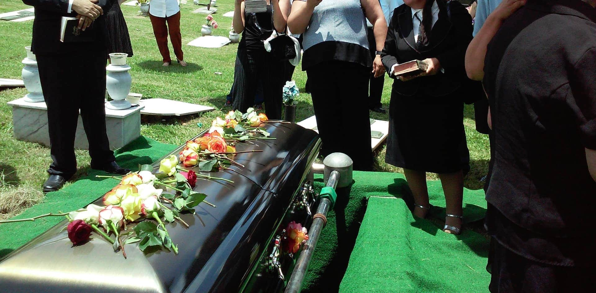
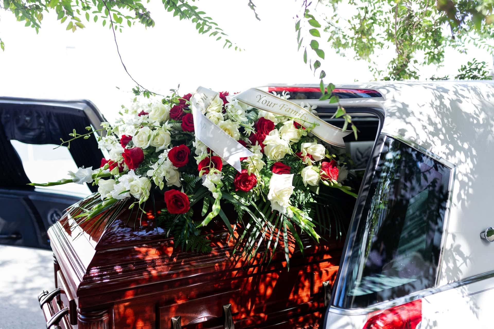

You’ve lost a loved one and want to handle the upcoming funeral as smoothly as possible? Or perhaps you want to plan your own funeral to relieve your family after your passing? This article provides you with all the important information you need to know about organizing a funeral.



The cost of a funeral can range from a few thousand to several tens of thousands of euros. An average funeral in Germany costs around €13,000. Find out where you might be able to save costs in the article.




In Germany, only two types of burial are generally permitted: burial in the ground and cremation. However, there are several places where the body or ashes can be interred, including cemeteries, columbaria, or selected natural areas. Learn more in the relevant chapter.




Among other things, you’ll need the deceased’s ID card, birth and marriage certificates, as well as the death certificate and medical certificate. The article also explains how to obtain these documents.




Yes. In Germany, it is legally required that certain tasks, such as the transport of the body, can only be performed by a funeral director.




You should inform all close contacts of the deceased as soon as possible. This includes relatives, friends, acquaintances, neighbors, and coworkers. Whether you want to hold the funeral in a small circle or invite the entire mourning community via an obituary is up to you.



## Good Reasons to Plan a Funeral in Advance

The death of a loved one is accompanied by great **grief** for family and friends. In this emotionally stressful time, it’s hard for many to take care of the funeral arrangements. In cases of sudden death, family members often don’t even know how the deceased wanted their own funeral to be.

A traditional cemetery funeral is still the first choice for many.

For this reason, you should talk openly with family and friends about death and funerals while you’re still alive. This way, you can express your own wishes, learn about your loved ones’ ideas, and ensure that the funeral arrangements reflect the deceased’s wishes.

## Designate Those Responsible for the Funeral

To avoid chaos in the event of death, you should clarify in advance who will handle the funeral and your legal affairs. Choose one or more **trusted people**—these can be close relatives like a spouse, children, or siblings, but also close friends.



Planning a funeral – in an emergency, many don’t know where to start.

To ensure your funeral goes as you wish, have an open conversation with your trusted people and share your wishes. **Early planning** and **financial arrangements** can greatly relieve your family—not least because, in Germany, family is legally obliged to arrange a proper burial.

## Choose the Type and Place of Burial

The type of burial is directly linked to the place where you or the deceased want to be laid to rest. This is the central decision you must make, as it determines the rest of the planning.

**Burial options allowed in Germany include:**

- A traditional burial at a cemetery
- Cremation with subsequent urn burial in a columbarium
- Cremation with subsequent natural burial (e.g., in a forest cemetery or designated areas at sea)

Maybe you have relatives or friends you’d like to be buried near? Then a shared grave might be an option. Besides cemeteries, alternative natural resting places are becoming increasingly popular.

A peaceful final resting place in nature is becoming more and more popular.

However, burials in Germany are only permitted on approved sites!



Talk to your family about how they would like to remember you. People’s opinions on how to remember a loved one vary greatly: Some prefer a grave as a place of remembrance, others a personal item or photos, and some do something special on the anniversary each year to remember the time spent together.

## Plan the Funeral Costs

The cost of a funeral can vary greatly. It depends on the type of burial, the design of the ceremony, and the funeral director’s prices. An **average funeral** in Germany costs about €13,000. But how expensive a funeral actually is depends on your choices. From a few thousand euros for an anonymous cremation to tens of thousands for a burial with a headstone and large ceremony, anything is possible.

The most expensive is the traditional cemetery burial. The largest portion of the costs goes to the **coffin**, **headstone**, and plot fees. Each of these can cost several thousand euros. You can save on these costs—and on future grave maintenance—by choosing cremation with a natural burial.

Urn or coffin? The type of burial has a big impact on the cost of the grave.

Grave fees also vary by cemetery, location, and size. Even if you can adjust some factors, funerals often mean high costs for family. That’s why you should ideally save money before your death to cover your wishes.

## Obtain the Necessary Documents

To bury a deceased person, you’ll need the following documents, among others:

- **ID card**
- **Birth and marriage certificates**
- **Death certificate and medical certificate**

While you already have the ID, birth, and marriage certificates during your lifetime, the family receives the death certificate and medical certificate only after death. Usually, obtaining these documents involves three steps:

1. The doctor who examines the body issues the medical certificate.
2. The family applies for the death certificate at the registry office once they have the medical certificate.
3. Only when all these documents are available can a funeral director be hired to register and carry out the funeral.

You can’t spare your family this process, but you can store all other documents in a safe place. You can also specify your last will in a **will** kept with your documents. As mentioned above, you should also give your trusted people a **power of attorney**. It may also make sense to record your wishes for the funeral and ceremony in a **funeral directive**. Be sure to tell your trusted people where these documents are.

## Hire a Funeral Director

In Germany, you cannot bury a deceased person without a funeral director. In most states, it’s legally required that the body be transported from the place of death to a funeral home—and from there to the final resting place.

**Other funeral services include:**

- Preparing and/or cremating the body
- Organizing the funeral, including all formalities
- Procuring a coffin or urn
- Individual services and advice

For basic funeral director services alone, you should budget at least €3,000. Before hiring a funeral director, it’s worth getting several quotes and comparing them. Ultimately, choose the one you feel best about. Nothing is worse than an insensitive funeral director or a botched funeral for a loved one. A dignified farewell should always be worth a few hundred euros more or less.

## Plan the Funeral Ceremony

If the deceased expressed their wishes, you only need to implement them. If not, plan the ceremony as you believe would best reflect their wishes. If the person belonged to a church or religious community, there may be a specific **ceremony** required.

### Hire a Funeral Speaker

Funeral ceremonies are usually led by an independent speaker or a clergy member from the local church. Contact a suitable funeral speaker early and discuss the ceremony with them. They will typically talk about the deceased’s life and will need detailed information and enough time to prepare.

Priest, pastor, or secular speaker: What fits your planned funeral?

A clergy member usually conducts the ceremony for free, while an independent speaker charges an hourly fee. A **professional speaker** who tailors the ceremony with you can be hired for a few hundred euros.

### Location and Structure of the Ceremony

Usually, the funeral ceremony takes place before the burial near the final resting place (e.g., at a cemetery) in a chapel or funeral hall. You can also hold the ceremony separately from the burial, such as at the funeral home or another location. Funeral directors usually have the contacts to coordinate **use of the venue**.

Ask family members in advance if they want to **actively participate** in the ceremony. For example, they might say a few words or read a poem. At religious ceremonies, **prayers** can be included. Play **music** the deceased enjoyed. Many funeral halls have good sound systems or even a piano. If some family members are musically and emotionally able, you can play instruments and sing together.

Music and singing can bring comfort at a funeral.

Often, the mourners gather after the funeral for a **funeral meal at a restaurant or café**. This is especially useful if many guests have traveled from afar. If you want to offer this, reserve tables early and discuss the menu with the restaurant.

### Wreaths, Flowers, and Decorations

At a funeral with a burial, the urn or coffin is usually prominently displayed. You can also place a nice **framed photo** of the deceased nearby. To avoid an empty-looking room, use **wreaths and floral arrangements**. You can hire a florist for the decorations, though this can be expensive depending on your wishes.

Often, other family members are happy to help provide wreaths or arrangements, resulting in a beautiful display. If you want to plant a grave later, **planters with seedlings** are a good idea. Usually, the funeral director ensures that wreaths and flowers are placed on the grave after the ceremony.

### Mourning Attire and Atmosphere

Traditional mourning attire varies by culture: In Europe and the West, **black** is typical; in Asia, **white** is the color of mourning; elsewhere, it can be colorful. In Germany, black is no longer required, but **subdued, conservative clothing** is expected—such as a dark blue suit with a white shirt, a plain sweater with black pants, or a dress that isn’t too tight or revealing.

Mourning attire isn’t mandatory. Unconventional or even cheerful funerals are allowed if the deceased wanted a **celebration of life** instead of a somber atmosphere. Plan the ceremony according to the deceased’s wishes, not tradition.

## Obituary and Inviting Mourners

You should inform **all close contacts** of the death as soon as possible. This includes relatives, friends, acquaintances, neighbors, and coworkers. Make a list of relevant people and contact them before finalizing the ceremony details. This gives everyone a chance to process the loss and, if needed, request time off.



For **notifying mourners**, ideally you have access to a contact list in the deceased’s phone or email account. If you know the deceased’s circle well, you can write down names from memory and find contact details. If the deceased was active on social media, you can reach out to contacts there.

Once you’ve set the date and location, you can also place an **obituary** in a local newspaper and invite people to the ceremony. If it’s held at a public place like a cemetery, anyone who receives the information can attend. You can, however, ask guests not to offer condolences in person.

Older people especially often read obituaries in local newspapers.

If you want a private ceremony, don’t include the date in the obituary so only invited guests attend. The closest contacts should always be invited **personally**—ideally a week before the ceremony—so everyone has time to say goodbye.

## Checklist and Online Planner for the Funeral

With everything to plan for a funeral, it’s easy to lose track. That’s why SeaTable has compiled the most important to-dos in a checklist. You can also use the online planner to coordinate invitations or calculate funeral costs.

SeaTable template with funeral cost overview

If you want to use SeaTable to organize a funeral, [register for free]() and create an overview with your own data. You’ll find the template [here]().
