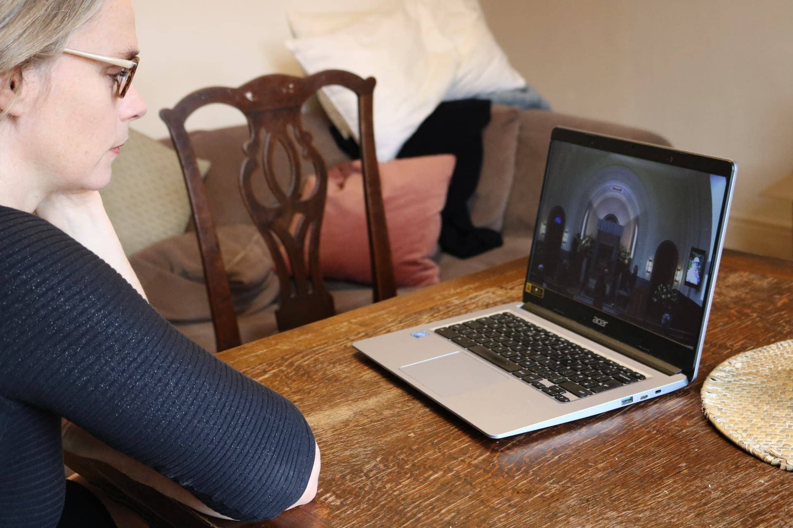
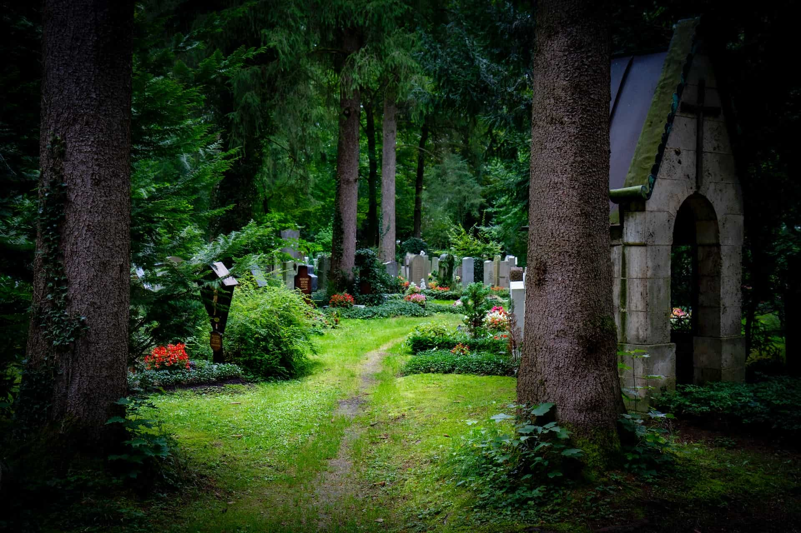
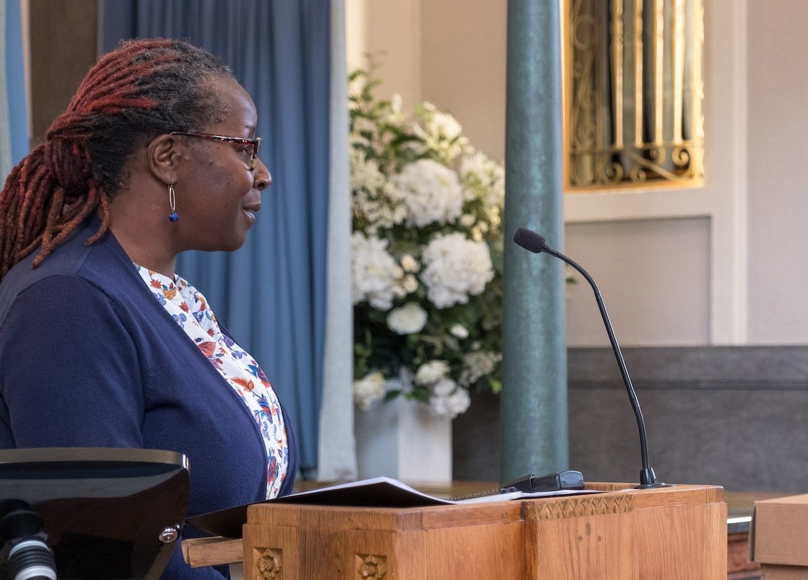
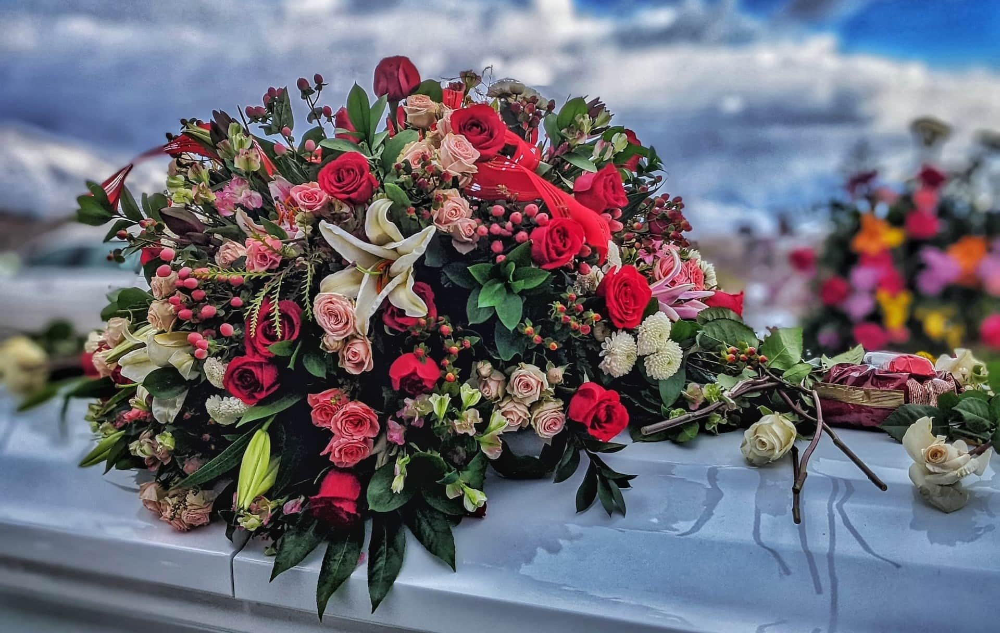

Vous avez perdu un être cher et souhaitez que les funérailles à venir se déroulent sans encombre ? Ou vous souhaitez organiser vos propres funérailles afin de soulager vos proches après votre décès ? Cet article vous fournit toutes les informations importantes dont vous devez tenir compte pour l'organisation des obsèques.



Le coût d'un enterrement peut varier de quelques milliers à plusieurs dizaines de milliers d'euros. Un enterrement moyen en Allemagne coûte environ 13.000 euros. Pour savoir où vous pouvez éventuellement économiser sur les frais, consultez l'article.




En Allemagne, seuls deux types d'enterrement sont en principe autorisés : l'inhumation et la crémation. Toutefois, il existe un certain nombre d'endroits au choix où le corps ou les cendres peuvent être enterrés. Il s'agit notamment des cimetières, des columbariums ou de zones sélectionnées dans la nature. Pour en savoir plus, consultez le chapitre correspondant.




Vous aurez notamment besoin de la carte d'identité du défunt, de son acte de naissance et de son acte de mariage, ainsi que de l'acte de décès et du certificat de décès. L'article vous explique également comment vous procurer ces documents.




Oui. En Allemagne, la loi stipule que certaines activités, comme le transport du corps, ne peuvent être effectuées que par un entrepreneur de pompes funèbres.




En cas de décès d'un être cher, vous devez en informer le plus rapidement possible toutes les personnes qui vous sont proches. Il s'agit notamment des parents, des amis, des connaissances, des voisins et des collègues de travail. C'est à vous de décider si vous préférez organiser la cérémonie en petit comité ou inviter l'ensemble de la communauté endeuillée à l'enterrement par le biais d'un avis de décès.



## De bonnes raisons de planifier les funérailles avant le décès

Le décès d'un proche est associé à une grande **tristesse** pour les proches. Dans cette période émotionnellement chargée, il n'est pas facile pour beaucoup de s'occuper des funérailles. En cas de décès soudain, les proches ne savent souvent même pas comment le ou la défunte aurait imaginé ses propres funérailles.

Un enterrement classique dans un cimetière reste pour beaucoup le premier choix.

C'est pourquoi il est conseillé de parler ouvertement de la mort et des funérailles avec votre famille et vos amis de votre vivant. Cela vous permettra non seulement d'exprimer vos propres souhaits, mais aussi de prendre connaissance des idées de vos proches et d'éviter que l'organisation des funérailles ne corresponde pas aux souhaits de la personne décédée.

## Désigner les responsables des funérailles

Afin d'éviter le chaos en cas de décès, il est préférable de déterminer au préalable qui s'occupera des obsèques et du règlement de vos affaires juridiques. Décidez d'une ou de plusieurs **personnes de confiance**. Il peut s'agir de parents proches comme le conjoint, les enfants ou les frères et sœurs, mais aussi d'amis proches.



Planifier des funérailles - en cas d'urgence, les personnes concernées ne savent souvent pas par quoi commencer.

Pour que vos obsèques se déroulent exactement comme vous l'avez imaginé, vous devriez rechercher un dialogue ouvert avec vos personnes de confiance et les mettre au courant de tous vos souhaits. Une **planification précoce** et une **prévoyance financière** de votre part peuvent soulager considérablement vos proches. D'autant plus qu'en Allemagne, ils sont tenus, en vertu de l'assistance légale aux morts, d'organiser des funérailles appropriées.

## Choisir le mode et le lieu d'inhumation

Le choix d'un mode de sépulture est directement lié à l'endroit où vous ou la personne décédée souhaitez être enterré(e). Il s'agit de la décision centrale que vous devez prendre. C'est de cette décision que découlera toute la planification ultérieure.

**Les types d'enterrement autorisés en Allemagne sont**

- Un enterrement classique dans un cimetière
- Une crémation suivie de l'inhumation de l'urne dans le columbarium
- une crémation suivie d'une inhumation dans la nature (par exemple dans une forêt de repos ou dans des zones maritimes désignées)

Peut-être y a-t-il des parents ou des amis à côté desquels vous aimeriez reposer ? Dans ce cas, une tombe commune pourrait également convenir. En dehors des cimetières, les lieux de repos alternatifs dans la nature sont de plus en plus populaires.

Un dernier repos paisible dans la nature est de plus en plus apprécié.

En Allemagne, les enterrements ne sont toutefois pas du tout autorisés partout, mais uniquement dans des zones autorisées !



Discutez avec vos proches de la manière dont ils aimeraient se souvenir de vous. En effet, les avis sont très partagés sur la manière dont on souhaite se souvenir d'un être cher : certains préfèrent une tombe comme lieu de commémoration, d'autres un objet personnel ou des photos en souvenir de la personne décédée ; et d'autres encore font chaque année, le jour du décès, quelque chose qui leur rappelle les moments passés ensemble.

## Planifier les frais d'obsèques

Les coûts d'un enterrement peuvent être très différents. En effet, ils dépendent entre autres du type de funérailles, de l'organisation de la cérémonie et des prix individuels des pompes funèbres. En Allemagne, un **enterrement moyen** coûte environ 13.000 euros. Mais c'est vous qui décidez du prix réel des funérailles. De quelques milliers d'euros pour une crémation anonyme à plusieurs dizaines de milliers d'euros pour une inhumation avec monument funéraire et grande cérémonie, tout est possible.

L'enterrement classique dans un cimetière est le plus cher. Une grande partie des frais d'obsèques est liée au **cercueil**, à la **pierre tombale** et aux frais d'utilisation d'une **tombe**. Chacun de ces trois postes de dépenses peut s'élever à plusieurs milliers d'euros. Vous pouvez économiser ces coûts - ainsi que l'entretien ultérieur de la tombe - en optant pour une crémation avec inhumation naturelle.

Urne ou cercueil ? Le type d'enterrement joue un rôle important dans le coût de la tombe.

Les frais de sépulture varient en outre selon le cimetière, l'emplacement et la taille de la tombe. Même si vous pouvez agir sur certains leviers, un enterrement signifie souvent des coûts élevés pour les proches. C'est pourquoi, dans l'idéal, vous devriez épargner de l'argent avant votre décès afin de couvrir les frais prévisibles pour vos souhaits.

## Obtenir les documents pour les funérailles

Pour qu'une personne décédée puisse être enterrée, vous avez besoin, entre autres, des documents suivants :

- **Carte d'identité**
- **Certificat de naissance et de mariage**
- **Acte de décès et certificat de décès**

Alors que l'on possède déjà sa carte d'identité, son acte de naissance et son acte de mariage de son vivant, les proches ne reçoivent le certificat de décès et l'acte de décès qu'après le décès. Habituellement, l'obtention de ces documents se déroule en trois étapes :

1. Le certificat de décès est établi par le médecin qui procède à l'examen du corps.
2. Les proches doivent demander l'acte de décès auprès du bureau d'état civil compétent dès qu'ils sont en possession du certificat de décès.
3. Ce n'est que lorsque tous les documents mentionnés sont disponibles que l'on peut faire appel à une entreprise de pompes funèbres qui se chargera d'annoncer et d'organiser les funérailles.

Vous ne pouvez pas épargner cette procédure à vos proches, mais vous pouvez déposer tous les autres documents dans un endroit sûr. De même, vous pouvez régler vos dernières volontés dans un **testament** que vous déposerez avec les documents. Comme mentionné ci-dessus, vous devriez également penser à **établir une procuration** pour vos personnes de confiance. En outre, il peut être judicieux de consigner vos souhaits en matière d'enterrement et de cérémonie dans des **dispositions funéraires**. Dans tous les cas, indiquez aux personnes de confiance où se trouvent ces documents.

## Faire appel à une entreprise de pompes funèbres

En Allemagne, il n'est pas possible d'enterrer un défunt sans faire appel à un entrepreneur de pompes funèbres. Par exemple, dans la plupart des Länder, la loi prévoit que le corps doit être transporté du lieu de décès à une entreprise de pompes funèbres - et de là à la dernière demeure.

**Les autres services funéraires sont**

- les soins et/ou l'incinération du corps
- l'organisation des obsèques, y compris toutes les formalités
- l'acquisition du cercueil ou de l'urne
- des services et des conseils personnalisés

Rien que pour les prestations de base d'une entreprise de pompes funèbres, vous devriez prévoir au moins 3.000 euros. Avant de faire appel à une entreprise de pompes funèbres, il vaut certainement la peine de demander plusieurs devis et de les comparer entre eux. Mais en fin de compte, choisissez l'entreprise de pompes funèbres avec laquelle vous avez le meilleur feeling. Rien n'est plus douloureux qu'un entrepreneur de pompes funèbres irrévérencieux ou des funérailles ratées pour un être cher. Dans le doute, un adieu digne devrait être plus important que quelques centaines d'euros de plus ou de moins.

## Planifier la cérémonie des funérailles

Si la personne décédée a exprimé ses souhaits ou les a consignés par écrit, il ne vous reste plus qu'à mettre en œuvre la planification de la cérémonie funéraire. Si ce n'est pas le cas, planifiez la cérémonie funéraire de la manière qui vous semble la plus proche des souhaits de la personne. Si la personne était membre d'une église ou d'une communauté religieuse, celle-ci peut imposer une certaine **cérémonie** pour les funérailles.

### Engager un orateur funéraire

Les cérémonies funéraires sont généralement accompagnées d'un orateur indépendant ou d'un ecclésiastique de la paroisse concernée. Contactez suffisamment tôt un orateur funéraire approprié et discutez avec lui du déroulement de la cérémonie. En règle générale, il abordera dans son **discours** la vie de la personne décédée et aura besoin pour cela d'informations détaillées et de suffisamment de temps de préparation.

Prêtre, pasteur ou orateur indépendant : qu'est-ce qui convient à vos funérailles prévues ?

Un ecclésiastique organise généralement la cérémonie gratuitement, tandis qu'un orateur indépendant est rémunéré sur une base horaire. Vous pouvez engager un **orateur professionnel** qui personnalisera la cérémonie avec vous pour quelques centaines d'euros.

### Lieu et déroulement d'une cérémonie funéraire

Dans la plupart des cas, les obsèques sont précédées d'une cérémonie à proximité de la dernière demeure (par exemple dans un cimetière), dans une chapelle ou une salle de cérémonie. Vous pouvez également organiser la cérémonie indépendamment de l'enterrement, par exemple au funérarium ou dans un tout autre lieu. Les pompes funèbres disposent généralement des contacts nécessaires dans leur région pour coordonner l'**utilisation des locaux**.

Demandez à temps aux proches s'ils souhaitent contribuer **activement** à la cérémonie funéraire. Ils pourraient par exemple adresser quelques mots à la personne décédée ou lire un poème. Lors de cérémonies religieuses, des **prières** peuvent également être prononcées. Faites jouer **de la musique** que la personne décédée aimait lors de la cérémonie. De nombreuses salles de cérémonie disposent d'une bonne chaîne stéréo ou même d'un piano. Si certains membres de la famille sont musicalement et émotionnellement capables de le faire, vous pouvez également jouer des instruments et chanter ensemble.

La musique et le chant peuvent apporter du réconfort lors d'une cérémonie funéraire.

Souvent, l'assemblée se réunit encore une fois après les funérailles **dans un restaurant ou un café** pour ce que l'on appelle **la veillée funèbre**. Cela est particulièrement utile si de nombreuses personnes sont venues de loin. Si vous souhaitez proposer ce service, vous devez réserver suffisamment tôt des tables dans un restaurant et convenir avec le restaurateur des plats et des boissons souhaités.

### Couronnes mortuaires, fleurs et décorations

Lors d'une cérémonie funéraire suivie de l'inhumation, l'urne ou le cercueil du défunt est généralement bien visible dans la pièce. À côté, vous pouvez placer une belle **photo encadrée** de la personne décédée. Pour que le reste de la pièce ne paraisse pas austère et vide, **des couronnes de deuil et des décorations florales** s'imposent. Pour la décoration, vous pouvez faire appel à un fleuriste, ce qui peut toutefois s'avérer coûteux en fonction de vos idées.

Souvent, les autres membres de la famille participent très volontiers à l'achat de couronnes funéraires ou de compositions florales, ce qui permet d'obtenir un ensemble floral appréciable. Si vous souhaitez par la suite fleurir une tombe, les **bacs à fleurs** avec des plants sont une bonne idée. En règle générale, l'entreprise de pompes funèbres s'occupe de déposer les couronnes mortuaires et les décorations florales sur la tombe après la cérémonie.

### Vêtements de deuil et atmosphère

Les vêtements de deuil traditionnels diffèrent d'une culture à l'autre : en Europe et dans le monde occidental, le **noir** est la couleur du deuil, en Asie, c'est surtout le **blanc** - et ailleurs, on peut même se permettre d'être coloré. En Allemagne, les vêtements portés lors d'un enterrement ne doivent plus être noirs aujourd'hui, mais on attend souvent **des vêtements discrets** aux couleurs sobres et aux coupes amples - par exemple un costume bleu foncé avec une chemise blanche, un pull uni avec un pantalon noir ou une robe qui ne soit pas trop moulante et ne laisse pas apparaître trop de peau.

Les vêtements de deuil ne sont toutefois pas obligatoires. Les cérémonies funéraires non conventionnelles ou joyeuses sont également autorisées si le défunt a souhaité que l'on célèbre sa vie et sa personne plutôt que **l'ambiance funèbre**. Planifiez donc la cérémonie funéraire en vous détachant des traditions et en respectant entièrement les souhaits du défunt.

## Avis de décès et invitation des personnes endeuillées

En cas de décès d'un être cher, vous devez **en informer** le plus rapidement possible **toutes les personnes qui vous sont proches**. Cela inclut les parents, les amis, les connaissances, les voisins et les collègues de travail. Le mieux est de faire une liste de toutes les personnes concernées et de les contacter avant même d'avoir réglé les détails de la cérémonie funéraire. Ainsi, tous les proches auront la possibilité d'assimiler le décès et, le cas échéant, de demander un congé spécial.



Pour **informer les personnes endeuillées**, vous avez, dans le meilleur des cas, accès à une liste de contacts dans le téléphone portable ou le compte e-mail du défunt. Si vous connaissez très bien l'entourage du défunt, vous pouvez également noter les personnes de mémoire et trouver leurs coordonnées. Si la personne décédée était active sur les médias sociaux, vous pouvez écrire à des contacts sur ces sites.

Une fois que vous avez planifié la date et le lieu de la cérémonie, vous pouvez également faire paraître un **avis de décès** dans un quotidien local et inviter à la cérémonie. Si celle-ci a lieu dans un lieu public tel qu'un cimetière, toute personne ayant reçu l'information peut assister à la cérémonie. Vous pouvez toutefois demander aux personnes présentes aux obsèques de s'abstenir de présenter leurs condoléances sur place.

Les personnes âgées, en particulier, lisent encore souvent les avis de décès dans les journaux locaux.

Si la cérémonie funéraire ne doit avoir lieu que dans un cercle restreint, n'inscrivez pas de date dans l'avis de décès, afin que seules les personnes invitées y participent vraiment. Vous devriez de toute façon inviter **personnellement** - et idéalement une semaine avant la cérémonie - les personnes les plus proches du défunt. Vous vous assurez ainsi que chacun reçoit la nouvelle à temps et a la possibilité de faire ses adieux au défunt.

## Liste de contrôle et planificateur en ligne pour les funérailles

Avec tout ce qu'il faut prévoir pour un enterrement, il est facile de se perdre. SeaTable a donc réuni les principales choses à faire dans une liste de contrôle. Vous pouvez également utiliser le planificateur en ligne pour coordonner l'invitation des personnes à enterrer ou calculer le coût des funérailles.

Modèle SeaTable avec aperçu des coûts pour les funérailles

Si vous souhaitez utiliser SeaTable pour organiser des funérailles, [il vous suffit de vous inscrire gratuitement](https://seatable.io/fr/enregistrement/) et de créer un aperçu avec vos propres données. Vous trouverez le modèle correspondant [ici]().
