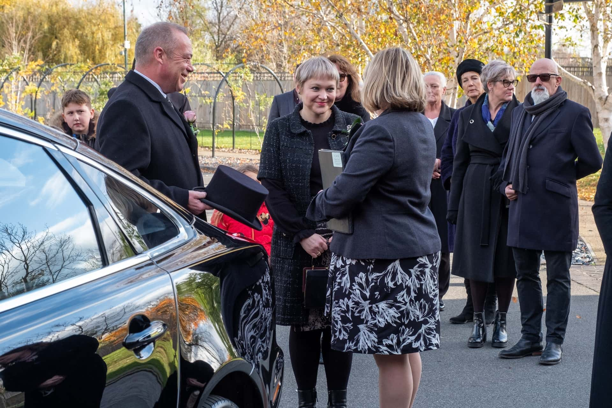

Perdeu um ente querido e gostaria de organizar o funeral sem problemas? Ou gostaria de planear o seu próprio funeral para aliviar os seus familiares após a sua morte? Este artigo fornece-lhe todas as informações importantes que precisa de saber sobre a organização de um funeral.



O custo de um funeral pode variar entre alguns milhares e várias dezenas de milhares de euros. Um funeral médio na Alemanha custa cerca de 13.000 euros. Pode descobrir onde pode poupar nos custos no artigo.




Basicamente, só são permitidos dois tipos de enterro na Alemanha: o enterro no solo e a cremação. No entanto, existem alguns locais à escolha onde o corpo ou as cinzas podem ser enterrados. Estes incluem cemitérios, columbários ou áreas seleccionadas na natureza. Pode obter mais informações sobre este assunto no capítulo correspondente.




É necessário, entre outros, o bilhete de identidade do falecido, a certidão de nascimento e de casamento, bem como o certificado de óbito e a certidão de óbito. Para saber como obter estes documentos, consulte o artigo.




Sim. Na Alemanha, a lei estipula que certas actividades, como a transferência do corpo, só podem ser realizadas por um agente funerário.




A morte de um ente querido deve ser comunicada o mais rapidamente possível a todas as pessoas de quem se gosta. Isto inclui familiares, amigos, conhecidos, vizinhos e colegas de trabalho. Cabe-lhe a si decidir se prefere realizar a cerimónia fúnebre num pequeno círculo ou convidar todos os enlutados para o funeral através de um obituário.



## Boas razões para planear um funeral antes da morte

A morte de uma pessoa próxima está associada a uma grande **dor** para os familiares. Neste período emocionalmente stressante, não é fácil para muitas pessoas tratar do funeral. No caso de mortes súbitas, os familiares muitas vezes nem sequer sabem como é que o falecido teria imaginado o seu próprio funeral.

Um enterro clássico num cemitério continua a ser a primeira escolha para muitos.

Por esta razão, deve falar abertamente com a família e os amigos sobre os temas da morte e do funeral enquanto ainda está vivo. Desta forma, pode não só exprimir os seus próprios desejos, mas também tomar nota das ideias dos seus familiares e evitar que não cumpra os desejos da pessoa falecida com a conceção de um funeral.

## Determinar quem é responsável pelo funeral

Para evitar o caos em caso de morte, deve esclarecer antecipadamente quem deve ocupar-se do funeral e da gestão dos seus negócios jurídicos. Escolha uma ou mais **pessoas da sua confiança**. Podem ser familiares próximos, como o cônjuge, os filhos ou os irmãos, mas também amigos próximos.



Planear um funeral - numa situação de emergência, as pessoas afectadas não sabem muitas vezes por onde começar.

Para que o seu funeral decorra exatamente como pretende, deve conversar abertamente com as pessoas em quem confia e transmitir-lhes todos os seus desejos. O **planeamento antecipado** e a **provisão financeira** da sua parte podem aliviar bastante a carga dos seus familiares. Até porque, na Alemanha, estes são obrigados a organizar um funeral adequado, de acordo com as disposições legais relativas à assistência aos mortos.

## Escolher o tipo e o local do enterro

A escolha de um tipo de enterro está diretamente relacionada com o local onde você ou a pessoa falecida gostariam de ser enterrados. Esta é a decisão central que tem de tomar. É a base de todo o planeamento posterior.

**Os tipos de enterramento permitidos na Alemanha são:**

- Um funeral clássico num cemitério
- Cremação seguida de inumação em urna no columbário
- Cremação seguida de uma inumação natural (por exemplo, numa floresta de repouso ou em zonas designadas no mar).

Talvez haja familiares ou amigos ao lado dos quais gostaria de encontrar o seu último lugar de descanso? Então, uma sepultura colectiva também pode ser uma opção. Para além dos cemitérios, os locais de repouso alternativos na natureza têm-se tornado cada vez mais populares.

Um descanso final tranquilo na natureza está a tornar-se cada vez mais popular.

No entanto, os enterros não são permitidos em toda a Alemanha, mas apenas em zonas autorizadas!



Fale com os seus entes queridos sobre a forma como gostariam de o recordar. Afinal, as opiniões variam muito sobre a questão de como gostaríamos de recordar um ente querido: alguns preferem um túmulo como local de recordação, outros um objeto pessoal ou fotografias como recordação da pessoa falecida; e outros ainda fazem algo todos os anos no aniversário da sua morte para recordar o tempo que passaram juntos.

## Planear os custos do funeral

Os custos de um funeral podem ser muito variáveis. Dependem, entre outros factores, do tipo de funeral, da conceção do serviço fúnebre e dos preços individuais do agente funerário. Um **funeral médio** na Alemanha custa cerca de 13.000 euros. No entanto, o preço real de um funeral depende de si. Tudo é possível, desde alguns milhares de euros para uma cremação anónima até várias dezenas de milhares de euros para um enterro com lápide e um grande serviço fúnebre.

O mais caro é o enterro clássico num cemitério. Uma grande parte dos custos do funeral é constituída pelo **caixão**, pela **lápide** e pelas taxas de utilização de um **local de sepultura**. Cada um destes três elementos de custo pode ascender a vários milhares de euros. Pode poupar estes custos - bem como a manutenção posterior da sepultura - com uma cremação com enterro natural.

Urna ou caixão? O tipo de enterro desempenha um papel importante no custo da sepultura.

Os custos de uma sepultura também variam consoante o cemitério, o local e o tamanho da sepultura. Mesmo que se possa fazer alguns ajustes, um funeral significa muitas vezes custos elevados para os familiares. Por isso, antes da sua morte, o ideal é poupar dinheiro para cobrir os custos previsíveis dos seus desejos.

## Obter os documentos para o funeral

Para que uma pessoa falecida possa ser enterrada, são necessários, entre outros, os seguintes documentos

- **Bilhete de identidade**
- **Certidão de nascimento e de casamento**
- **Certificado de óbito e certidão de óbito**

Enquanto as pessoas já possuem o bilhete de identidade, a certidão de nascimento e a certidão de casamento em vida, os seus familiares só recebem a certidão de óbito e o certificado de óbito após a morte. Normalmente, a obtenção dos documentos é efectuada em três etapas:

1. A certidão de óbito é emitida pelo médico que efectua o exame post-mortem.
2. Os familiares devem requerer a certidão de óbito na conservatória competente logo que disponham da certidão de óbito.
3. Só quando todos os documentos acima referidos estiverem disponíveis é que uma agência funerária pode ser encarregada de registar e realizar o funeral.

Não pode dispensar os seus familiares deste procedimento, mas pode depositar todos os outros documentos num local seguro. Do mesmo modo, pode regular a sua última vontade num **testamento** que depositará juntamente com os documentos. Como já foi referido, deve também pensar numa **procuração** para as suas pessoas de confiança. Além disso, pode fazer sentido registar os seus desejos para o funeral e o serviço fúnebre num **decreto de enterro**. Não se esqueça de dizer às pessoas de confiança onde se encontram estes documentos.

## Contratação de uma agência funerária

Na Alemanha, não é possível mandar enterrar uma pessoa falecida sem uma agência funerária. Por exemplo, na maior parte dos Estados federados, a lei exige que o corpo seja transferido do local de falecimento para uma agência funerária - e daí para o local de descanso final.

**Outros serviços funerários incluem:**

- o tratamento e/ou a cremação do corpo
- a organização do funeral, incluindo todas as formalidades
- a aquisição de caixão ou urna
- Serviços e conselhos individuais

Só para os serviços básicos de um agente funerário, deve contar com pelo menos 3.000 euros. Antes de contratar uma agência funerária, vale certamente a pena obter vários orçamentos e compará-los entre si. No final, no entanto, escolha a agência funerária com a qual tem um melhor pressentimento. Nada é mais doloroso do que uma agência funerária impiedosa ou um funeral falhado de um ente querido. Em caso de dúvida, uma despedida digna deve ser mais importante do que algumas centenas de euros a mais ou a menos.

## Planificação da cerimónia fúnebre para o enterro

Se a pessoa falecida tiver manifestado a sua vontade ou a tiver escrito, só tem de planear o serviço fúnebre. Caso contrário, planeie o serviço fúnebre da forma que considere mais próxima dos desejos da pessoa. Se a pessoa era membro de uma igreja ou comunidade religiosa, esta pode prescrever uma determinada **cerimónia** para o funeral.

### Contratar um orador funerário

Os serviços fúnebres são geralmente acompanhados por um orador independente ou por um clérigo da respectiva congregação religiosa. Contacte atempadamente um orador adequado e fale com ele sobre o desenrolar da cerimónia fúnebre. Normalmente, o orador abordará a vida da pessoa falecida no seu **discurso** e necessitará de informações pormenorizadas e de tempo de preparação suficiente para o efeito.

Sacerdote, pastor ou orador independente: o que se adequa ao seu funeral planeado?

Normalmente, um clérigo efectua a cerimónia fúnebre gratuitamente, ao passo que um orador independente recebe uma remuneração à hora. Pode contratar um **orador profissional**, que conceberá o serviço fúnebre individualmente consigo, por apenas algumas centenas de euros.

### Local e procedimento de uma cerimónia fúnebre

Na maioria dos casos, a cerimónia fúnebre realiza-se antes do enterro, perto do local de descanso final (por exemplo, num cemitério), numa capela ou salão de luto. No entanto, o serviço fúnebre também pode ser efectuado independentemente do enterro, por exemplo, na casa funerária ou num local completamente diferente. O agente funerário tem geralmente os contactos adequados na sua região para coordenar a **utilização das instalações**.

Pergunte atempadamente aos familiares se gostariam de contribuir **ativamente** para a cerimónia fúnebre. Por exemplo, podem dizer algumas palavras ao falecido ou ler um poema. As **orações** também podem ser proferidas em funerais religiosos. Ponha no funeral **música** de que a pessoa falecida gostava. Muitas agências funerárias têm boas aparelhagens de som ou mesmo um piano. Se alguns familiares forem musicalmente e emocionalmente capazes, podem também tocar instrumentos e cantar em conjunto.

A música e o canto podem proporcionar conforto numa cerimónia fúnebre.

Muitas vezes, os enlutados voltam a reunir-se depois do funeral para o chamado **banquete fúnebre num restaurante ou num café**. Isto é particularmente útil se muitos enlutados tiverem viajado de longe. Se quiser oferecer este serviço, deve reservar mesas num restaurante com bastante antecedência e combinar com o anfitrião a comida e as bebidas desejadas.

### Coroas fúnebres, flores e decoração

Numa cerimónia fúnebre seguida de enterro, a urna ou o caixão do defunto é geralmente bem visível na sala. Junto a ela, pode colocar uma bonita **fotografia emoldurada da** pessoa falecida. Para que o resto da sala não pareça **estéril** e vazia, as **coroas fúnebres e as decorações florais** são uma boa ideia. Pode contratar uma florista para a decoração, mas isso pode ser caro, dependendo das suas ideias.

Muitas vezes, os outros familiares têm todo o gosto em participar na aquisição de coroas de flores ou arranjos fúnebres e, assim, consegue-se uma exposição floral respeitável. Se pretender plantar uma sepultura mais tarde, **os vasos de flores** com mudas são uma boa ideia. Regra geral, o diretor da agência funerária providenciará para que as coroas fúnebres e os arranjos florais sejam colocados na sepultura após o serviço fúnebre.

### Traje funerário e ambiente

O vestuário tradicional de luto difere de cultura para cultura: na Europa e no mundo ocidental, **o preto** é a cor do luto, na Ásia é sobretudo **branco** - e noutros locais pode até ser colorido. Atualmente, na Alemanha, o vestuário do funeral já não tem de ser obrigatoriamente preto, mas espera-se frequentemente um **vestuário discreto** em cores suaves e cortes soltos - por exemplo, um fato azul-escuro com uma camisa branca, uma camisola de cor lisa com calças pretas ou um vestido que não seja demasiado justo e que não mostre demasiada pele.

No entanto, o traje de luto não é obrigatório. Também são permitidas cerimónias fúnebres pouco convencionais ou alegres, se o falecido desejar uma celebração dele e da sua vida em vez de um **ambiente de luto**. Assim, planeie o serviço fúnebre sem tradições e inteiramente de acordo com os desejos do falecido.

## Anúncio do falecimento e convite às pessoas de luto

A morte de um ente querido deve ser comunicada o mais rapidamente possível a **todas as pessoas** de quem se gosta. Isto inclui familiares, amigos, conhecidos, vizinhos e colegas de trabalho. O melhor é fazer uma lista de todas as pessoas relevantes e contactá-las ainda antes de esclarecer os pormenores do serviço fúnebre. Desta forma, todos os familiares têm a oportunidade de se inteirar do falecimento e, se necessário, solicitar uma licença especial.



O ideal é ter acesso a uma lista de contactos no telemóvel ou na conta de correio eletrónico da pessoa falecida para avisar as **pessoas de luto**. Se conhecer muito bem o ambiente da pessoa falecida, pode também tomar nota das pessoas de memória e descobrir os seus contactos. Se a pessoa falecida era ativa nas redes sociais, pode escrever aos seus contactos.

Depois de ter planeado a data e o local da cerimónia fúnebre, pode também publicar um **aviso de óbito** num jornal local, convidando as pessoas para a cerimónia fúnebre. Se for realizado num local público, como um cemitério, qualquer pessoa que tenha recebido a informação pode assistir ao serviço fúnebre. No entanto, pode pedir às pessoas que se abstenham de apresentar condolências no local.

As pessoas mais idosas, em particular, continuam a ler os obituários nos jornais locais.

Se a cerimónia fúnebre se realizar apenas no círculo mais próximo, não escreva uma data no obituário para que apenas as pessoas convidadas participem. De qualquer modo, deve convidar **pessoalmente** as pessoas mais importantes da pessoa falecida - de preferência, uma semana antes da cerimónia fúnebre. Desta forma, garante que todos recebem a notícia a tempo e têm a oportunidade de se despedir do falecido.

## Lista de controlo e planificador online para o funeral

Com tudo o que é necessário para planear um funeral, é fácil perder a noção de tudo. Por isso, a SeaTable compilou as tarefas mais importantes numa lista de verificação. Também pode utilizar o planeador em linha para coordenar o convite dos enlutados ou para calcular os custos do funeral.

Modelo de síntese de custos funerários SeaTable

Se quiser utilizar o SeaTable para organizar um funeral, [basta registar-se gratuitamente]() e criar uma visão geral com os seus próprios dados. Pode encontrar o modelo correspondente [aqui](https://seatable.io/pt/vorlage/kraqwv46rhgoay-y9okshq/).
