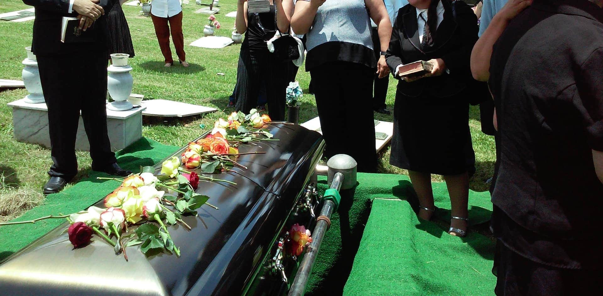
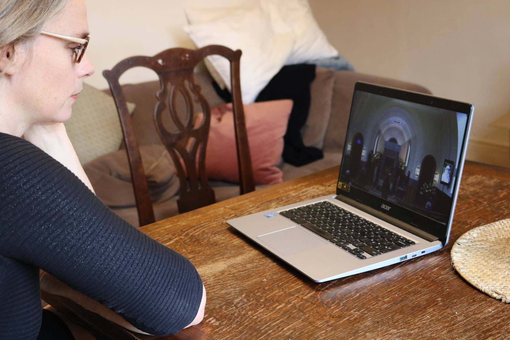
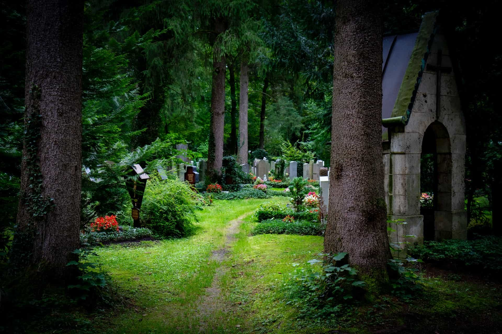
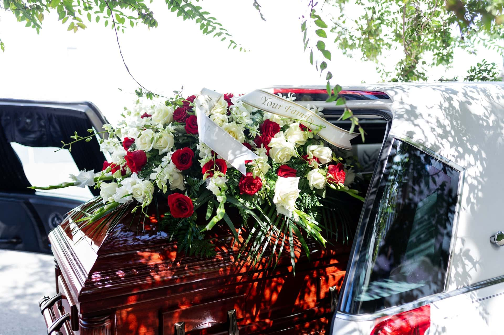
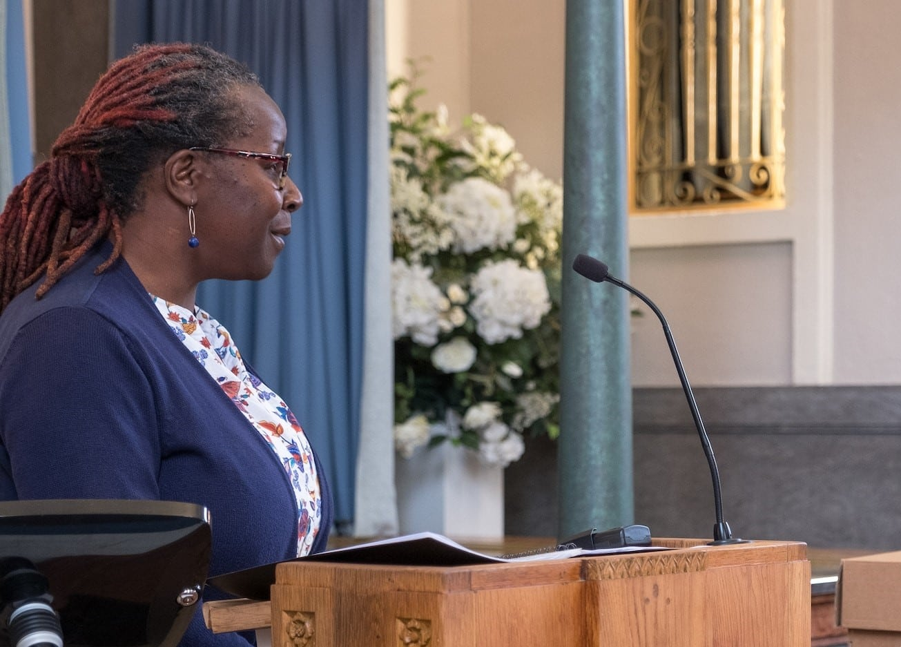
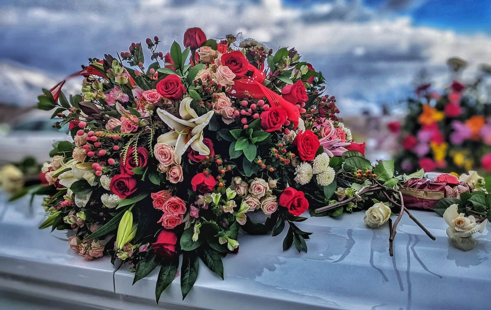

Вы потеряли близкого человека и хотите, чтобы предстоящие похороны прошли гладко? Или вы хотите сами спланировать свои похороны, чтобы облегчить жизнь родственникам после вашей смерти? В этой статье вы найдете всю необходимую информацию об организации похорон.



Стоимость похорон может составлять от нескольких тысяч до нескольких десятков тысяч евро. В среднем похороны в Германии стоят около 13 000 евро. О том, где можно сэкономить на этих расходах, вы можете узнать из статьи.




В принципе, в Германии разрешены только два вида захоронения: захоронение в землю и кремация. Однако есть несколько мест на выбор, где можно захоронить тело или прах. К ним относятся кладбища, колумбарии или отдельные участки на природе. Подробнее об этом читайте в соответствующей главе.




Помимо прочего, Вам понадобятся удостоверение личности умершего, свидетельство о рождении и браке, а также свидетельство о смерти и справка о смерти. О том, как получить эти документы, вы также можете узнать из статьи.




Да. В Германии закон предусматривает, что некоторые действия, например, передача тела, могут быть осуществлены только компанией-организатором.




О смерти близкого человека следует как можно скорее сообщить всем, кто вам дорог. К ним относятся родственники, друзья, знакомые, соседи и коллеги по работе. Предпочтете ли вы провести похоронную службу в узком кругу или пригласите на похороны всех скорбящих через некролог - решать вам.



## Веские причины планировать похороны до смерти

Смерть близкого человека сопряжена с большим **горем** для родственников. В это эмоционально напряженное время многим людям нелегко позаботиться о похоронах. В случае внезапной смерти родственники часто даже не знают, как бы умерший представлял себе свои собственные похороны.

Классическое захоронение на кладбище по-прежнему остается для многих первым выбором.

Поэтому еще при жизни следует открыто говорить с родными и близкими на темы смерти и похорон. Таким образом, вы сможете не только высказать собственные пожелания, но и принять к сведению идеи ваших близких и не дать себе труда не выполнить пожелания умершего человека при оформлении похорон.

## Определите, кто несет ответственность за похороны

Чтобы избежать хаоса в случае смерти, следует заранее определить, кто будет заниматься похоронами и ведением ваших юридических дел. Определите одного или нескольких **человек, которым вы доверяете**. Это могут быть как близкие родственники - супруги, дети, братья и сестры, так и близкие друзья.



Планирование похорон - в чрезвычайных ситуациях пострадавшие часто не знают, с чего начать.

Чтобы ваши похороны прошли именно так, как вы задумали, следует открыто обсудить с теми, кому вы доверяете, все ваши пожелания. **Заблаговременное планирование** и **финансовое** обеспечение с Вашей стороны может значительно облегчить бремя, лежащее на Ваших родственниках. Не в последнюю очередь это связано с тем, что в Германии они обязаны организовать соответствующие похороны в соответствии с установленным законом порядком ухода за умершими.

## Выбор типа и места захоронения

Выбор типа захоронения напрямую связан с местом, где вы или умерший человек хотели бы быть похоронены. Это главное решение, которое необходимо принять. Оно является основой для всего дальнейшего планирования.

**В Германии разрешены следующие виды захоронений:**

- Классические похороны на кладбище
- Кремация с последующим захоронением урны в колумбарии
- Кремация с последующим естественным захоронением (например, в лесу для отдыха или в специально отведенных местах на море).

Возможно, рядом с Вами есть родственники или друзья, с которыми Вы хотели бы найти последнее пристанище? В таком случае можно выбрать и братскую могилу. Помимо кладбищ, все большую популярность приобретают альтернативные места упокоения на природе.

Спокойный заключительный отдых на природе становится все более популярным.

Однако захоронения в Германии разрешены далеко не везде, а только в разрешенных местах!



Поговорите со своими близкими о том, каким бы они хотели вас запомнить. В конце концов, мнения по вопросу о том, каким бы Вы хотели видеть память о близком человеке, сильно расходятся: кто-то предпочитает могилу как место памяти, кто-то - личные вещи или фотографии на память об ушедшем человеке, а кто-то каждый год в годовщину смерти делает что-то, напоминающее о времени, проведенном вместе.

## Планирование расходов на похороны

Расходы на похороны могут сильно различаться. Они зависят, в частности, от типа похорон, оформления ритуальных услуг и индивидуальных расценок похоронного бюро. В **среднем похороны** в Германии стоят около 13 000 евро. Однако насколько дорогими будут похороны в действительности, зависит только от вас. Возможно все: от нескольких тысяч евро за анонимную кремацию до нескольких десятков тысяч евро за захоронение с надгробным памятником и большой похоронной службой.

Самым дорогим является классическое захоронение на кладбище. Значительную часть расходов на похороны составляют стоимость **гроба**, **надгробного камня** и плата за пользование **местом захоронения**. Каждая из этих трех статей расходов может составлять несколько тысяч евро. Кремация с естественным захоронением позволяет сэкономить на этих расходах, а также на последующем уходе за могилой.

Урна или гроб? Тип захоронения играет большую роль в стоимости могилы.

Плата за захоронение также различается в зависимости от кладбища, места расположения и размера могилы. Даже если вы сможете внести некоторые коррективы, похороны часто означают большие расходы для родственников. Поэтому перед смертью в идеале следует накопить деньги, которые покроют возможные расходы на исполнение ваших желаний.

## Получение документов на похороны

Для того чтобы похоронить умершего человека, вам потребуются, в частности, следующие документы:

- **Удостоверение личности**
- **Свидетельство о рождении и браке**
- **Свидетельство о смерти и справка о смерти**

Если удостоверение личности, свидетельство о рождении и свидетельство о браке люди получают еще при жизни, то свидетельство о смерти и свидетельство о смерти их родственники получают только после смерти. Обычно получение этих документов происходит в три этапа:

1. Свидетельство о смерти выдается врачом, проводившим вскрытие.
2. Родственники должны подать заявление о выдаче свидетельства о смерти в соответствующий орган ЗАГСа сразу же после получения свидетельства о смерти.
3. Только при наличии всех вышеперечисленных документов можно поручить похоронному бюро регистрацию и проведение похорон.

Вы не можете избавить своих родственников от этой процедуры, но можете сдать все остальные документы на хранение в надежное место. Аналогичным образом можно регламентировать свою последнюю волю и завещание в **завещании**, которое Вы передадите на хранение вместе с документами. Как уже говорилось выше, следует также подумать о **доверенности** на доверенных лиц. Кроме того, возможно, Вам имеет смысл зафиксировать свои пожелания относительно похорон и ритуальных услуг в **постановлении о погребении**. Не забудьте сообщить доверенным лицам, где находятся эти документы.

## Наем похоронного бюро

В Германии нельзя похоронить умершего человека без гробовщика. Например, в большинстве федеральных земель по закону тело должно быть доставлено с места смерти к гробовщику, а оттуда - к месту последнего упокоения.

**Другие похоронные услуги включают:**

- уход за телом и/или его кремация
- организация похорон, включая все формальности
- приобретение гроба или урны
- Индивидуальные услуги и консультации

Только на базовые услуги руководителя похоронного бюро следует планировать не менее 3 000 евро. Прежде чем нанимать похоронное бюро, конечно, стоит получить несколько расценок и сравнить их между собой. Однако в конечном итоге выбирайте того похоронщика, с которым у Вас лучше всего складывается интуиция. Нет ничего больнее, чем недобросовестный гробовщик или неудачные похороны близкого человека. В случае сомнений достойное прощание должно быть важнее, чем несколько сотен евро в большую или меньшую сторону.

## Планирование похоронной службы для погребения

Если покойный выразил свои пожелания или изложил их в письменном виде, то Вам остается только осуществить планирование похоронной службы. В противном случае планируйте похоронную службу так, как вам кажется наиболее близким к пожеланиям человека. Если человек был членом церкви или религиозной общины, это может предписывать определенную **церемонию** похорон.

### Нанять похоронного оратора

Похоронные службы обычно сопровождаются независимым оратором или священнослужителем из соответствующей церковной общины. Заранее свяжитесь с подходящим оратором и обсудите с ним ход похоронной службы. Как правило, в своей **речи** он будет касаться жизни умершего человека, и для этого ему потребуется подробная информация и достаточно времени для подготовки.

Священник, пастор или внештатный оратор: что подходит для планируемых похорон?

Священнослужитель, как правило, проводит заупокойную службу бесплатно, а внештатный оратор получает почасовую оплату. Нанять **профессионального о**ратора, который вместе с вами разработает индивидуальный план похоронной службы, можно всего за несколько сотен евро.

### Место и порядок проведения похорон

В большинстве случаев панихида проводится перед погребением рядом с местом последнего упокоения (например, на кладбище) в часовне или траурном зале. Однако панихиду можно провести и независимо от самого захоронения, например, в похоронном бюро или в совершенно другом месте. Обычно гробовщик имеет соответствующие контакты в своем регионе, чтобы согласовать **использование помещения**.

Заранее спросите родственников, хотели бы они принять **активное** участие в похоронной службе. Например, они могут сказать несколько слов в адрес покойного или прочитать стихотворение. На религиозных похоронах можно произносить **молитвы**. Включите на похоронах **музыку**, которая нравилась покойному. Во многих похоронных бюро есть хорошие стереосистемы или даже пианино. Если кто-то из родственников обладает музыкальными и эмоциональными способностями, вы можете играть на инструментах и петь вместе.

Музыка и песни могут служить утешением на похоронной службе.

Часто после похорон скорбящие вновь собираются вместе на так называемый **траурный банкет в ресторане или кафе**. Это особенно удобно, если многие скорбящие приехали издалека. Если вы хотите предложить такой вариант, то вам следует заранее забронировать столики в ресторане и договориться с хозяином о желаемых блюдах и напитках.

### Траурные венки, цветы и украшения

При отпевании с последующим захоронением урна или гроб с покойным обычно хорошо видны в помещении. Рядом с ней можно поставить красивую **фотографию** усопшего в **рамке**. Чтобы остальное помещение не казалось **пустым** и безлюдным, хорошо использовать **похоронные венки и цветочные украшения**. Для оформления можно нанять флориста, но это может быть дорого в зависимости от ваших идей.

Часто другие родственники с удовольствием принимают участие в приобретении похоронных венков или аранжировок, и получается вполне приличная цветочная композиция. Если вы хотите впоследствии озеленить могилу, то хорошим вариантом будут **цветочные чаши** с рассадой. Как правило, после отпевания распорядитель похорон организует возложение на могилу похоронных венков и цветочных композиций.

### Похоронный наряд и атмосфера

Традиционная траурная одежда различается в разных культурах: в Европе и Западном мире траурным цветом является **черный**, в Азии - преимущественно **белый**, а в других странах он может быть даже разноцветным. В Германии сегодня одежда на похоронах уже не обязательно должна быть черной, но часто ожидается **сдержанная одежда** приглушенных цветов и свободного покроя - например, темно-синий костюм с белой рубашкой, однотонный джемпер с черными брюками или платье, не слишком облегающее и не слишком открывающее кожу.

Однако траурная одежда не является обязательной. Допускаются и нетрадиционные, веселые похороны, если покойный желал не **траурной атмосферы**, а праздника, посвященного ему и его жизни. Поэтому планируйте похороны в отрыве от традиций и в полном соответствии с пожеланиями покойного.

## Объявление о смерти и приглашение скорбящих

О смерти близкого человека следует как можно скорее **сообщить всем, кто** вам дорог. К ним относятся родственники, друзья, знакомые, соседи и коллеги по работе. Лучше всего составить список всех нужных людей и связаться с ними еще до уточнения деталей похоронной службы. Это даст всем родственникам возможность узнать о смерти и, если необходимо, попросить специальный отпуск.



Идеально, если у вас есть доступ к списку контактов в мобильном телефоне или электронном почтовом ящике покойного для оповещения **скорбящих**. Если вы хорошо знаете окружение покойного, можно также записать людей по памяти и узнать их контактные данные. Если покойный был активен в социальных сетях, можно написать контактам там.

После того как вы определили дату и место проведения похорон, вы можете разместить в местной газете **объявление о смерти**, пригласив людей на похороны. Если похороны проводятся в общественном месте, например на кладбище, то все, кто получил информацию, могут присутствовать на похоронах. Однако можно попросить скорбящих воздержаться от выражения соболезнований на месте.

Пожилые люди, в частности, часто продолжают читать некрологи в местных газетах.

Если панихида будет проходить только в самом близком кругу, не стоит указывать в некрологе дату, чтобы в ней действительно участвовали только приглашенные лица. В любом случае необходимо **лично** пригласить наиболее важных персон покойного - и лучше всего за неделю до панихиды. Так вы обеспечите всем своевременное получение известий и возможность попрощаться с покойным.

## Контрольный список и онлайн-планировщик похорон

При планировании похорон легко упустить все из виду. Поэтому SeaTable собрал для вас наиболее важные дела в виде контрольного списка. С помощью онлайнового планировщика можно также согласовать приглашение участников похорон или рассчитать расходы на похороны.

Шаблон обзора затрат на похороны SeaTable

Если вы хотите использовать SeaTable для организации похорон, [просто зарегистрируйтесь бесплатно]() и создайте обзор с вашими собственными данными. Соответствующий шаблон можно найти [здесь]().
