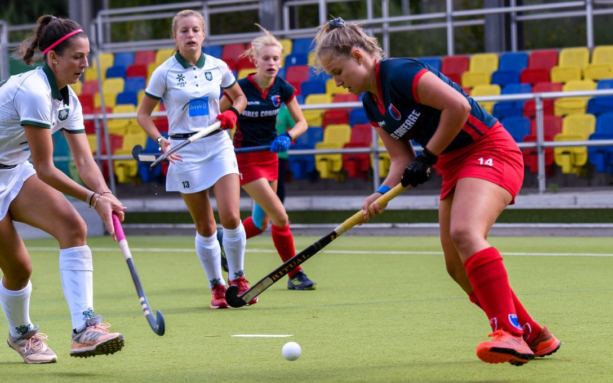

As a manager of a sports club, there are many areas to keep track of and manage, be it general accounting, pitch bookings or task management for all members. The Berlin Hockey Club uses SeaTable to transfer the many individual systems that currently exist into a single system and thus digitise its processes.

## The association at a glance

> Name: **Berlin Hockey Club**
> Division: **Sports club**
> Founded: **1905**
> Location: **Berlin, Germany**
> Employees: **1-10**

## The wide range of tasks requires a flexible tool

The [Berlin Hockey Club](https://www.berlinerhc.de/) is a multi-discipline club. In addition to field hockey, sports enthusiasts can also play tennis and lacrosse here. In the field of field hockey, the almost 120-year-old traditional club proudly counts itself among the most successful field hockey clubs in Germany. In the field hockey division alone, 800 members are active in sports. Both the men's and women's teams play in the 1st national league.

The daily tasks that arise in a sports club are many and varied. As a club manager, you have general administrative tasks, you look after members, do budgeting and take care of legal matters and insurance. Concrete examples include planning trips to away games in consultation with the relevant coaches, collecting subsidies and organizing coach training. In addition, there are numerous daily meetings with employees and volunteers.

With this wide range of tasks, the demands on a supporting system naturally grow.

> I have tried many apps, e.g. Asana, Monday or Google Docs. I liked the Excel-like database the most in SeaTable, because it is simply mapped more nicely here than in the other tools. Processes are more clearly represented and links between records are much easier to create.
>
> **Timo Stephan**, club manager of the Berliner Hockeyclub e.V.

## Handling of sensitive data and communication with honorary offices

Due to the diversity of the tasks, several solutions have been used so far. Some things were done in Excel, some in Google Docs, the Berlin Hockey Club even tried out Asana, Monday and Trello in the past. However, the desire for a superordinate system that would lead to a better overview and the establishment of general structures has always existed.

In addition, the club manager Timo Stephan would like to see better handling of sensitive data. He often has to deal with such data in his daily work. Be it coaches' salaries or contact and account data that must be securely shared with the appropriate people.

Many sports clubs are supported primarily by the commitment and enthusiasm of volunteers. As club manager, Timo Stephan distributes a wide variety of tasks to them and also always wants to keep track of the status of the distributed tasks. Now, volunteers are not on site every day, which naturally makes communication more difficult. Phone calls and e-mails pile up in the inbox, and the overview is quickly lost. A mobile solution must be found to include all these people.

## SeaTable for clearer structures and better communication

Communication with volunteers, coaches and committee members, who are not on site at the office every day, was made much easier by SeaTable. With the online spreadsheet solution SeaTable, the Berlin Hockey Club has found a way to distribute all its tasks in a structured and reliable way. In addition, SeaTable makes it easier to plan, as each task can be assigned a corresponding amount of time. Completed tasks can be marked as such by the corresponding employee and make it easier for the manager to monitor the set quarterly goals.

A solution for sensitive data could also be established with SeaTable. By assigning access rights, these can now be viewed much more easily and do not have to be isolated on the computer of the club manager.

Due to the flexibility of the SeaTable database, the previously isolated systems can all be mapped together with SeaTable and transferred into a single system. The individual structures can be linked much more easily in SeaTable, resulting in a very good overall view.

Timo Stephan is enthusiastic and is thinking about which functions he can still map in SeaTable. SeaTable definitely has the potential and he will continue to curiously test every new feature of SeaTable to see how he can use it profitably for the Berlin Hockey Club. In any case, he is glad to have stumbled upon SeaTable.

> As a sports club, we have limited financial resources. That's why I think it's great that we can use SeaTable for free.
>
> **Timo Stephan**, club manager of the Berliner Hockeyclub e.V.

## Summary

- The flexible structure of SeaTable allows the migration of many small processes into a higher-level system.
- Thanks to the ease of use of SeaTable, no training of volunteers is necessary and it is much easier to coordinate the different tasks.
- By restricting access rights, sensitive data such as salaries, contact and account data also find their place in SeaTable.
