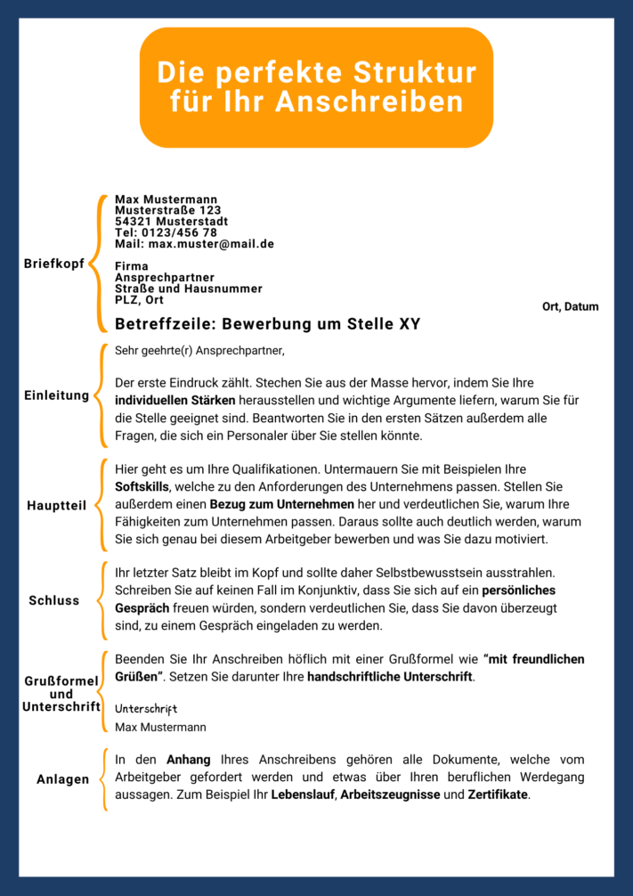

Whether it's an internship, apprenticeship or permanent position - the first step on the way to your dream job is always a successful **application**. Have you found lots of interesting **job vacancies**, but writing applications is giving you a headache? Don't worry, you're not alone. For many people, the **letter of application** is a major obstacle, as it requires an honest self-assessment and involves a lot of time-consuming formulation of your own skills.

But it's worth the effort, because only a successful application letter will open the door to a personal **interview** and bring you one step closer to your **dream job**. Below you will find out what you should pay attention to when writing your application.



To keep track of your applications, you can also use a planning tool. [Here]() you can find out how you can use this tool to generate various application letters from a template at the touch of a button.



## Why a letter of application is important

The cover letter is an integral part of every application. While you should include your **hard skills** in your **CV**, you should dedicate your cover letter to your **soft skills**. These have become increasingly important in recent years, which is why the personal cover letter has become more of a focus in the selection process.



With a cover letter, you have the opportunity to present yourself confidently and emphasize your positive qualities. On the one hand, it is about **self-presentation** by listing relevant qualifications, and on the other hand, it is about standing out from the crowd of applicants in terms of language.

## The preparation for your cover letter

Before you start writing, you should create an **information sheet**. After all, you need information about the company, the requirements and of course an overview of your own qualifications so that you can tailor your application letter to the job advertisement.

Use various sources for your research.

A structured approach will help you to work out relevant information and not write too much later on. The cover letter is based on your **application documents**. You should compile these beforehand and adapt them to the job advertisement if necessary.

### Find relevant qualifications in six steps

1. Read the job advertisement carefully and write down what is **expected** of you.
2. Compare the requirements profile with **your certificates, knowledge and experience**. Look for matches that qualify you for the position and add important qualifications to your CV if you have not already mentioned them.
3. Based on your hard skills and the job profile, ask yourself the following questions about your personal skills and answer them honestly:
    - What are my **strengths** and what can I improve?
    - Which tasks do I do with **enthusiasm**?
    - What do I **want** from the new job? In which area would I like to **learn** something?

These questions should reveal what makes up **your personality** and what **sets** you apart from others. To check the relevance of the insights gained above, it helps to present them in a table.

Combine the soft skills you have learned with the corresponding hard skills.

6. Write all your **hard skills** in the left-hand column of the table. In addition to professional experience, these include degrees, internships, foreign language and computer skills, as well as voluntary work.
7. The right-hand column contains **soft skills** that you have acquired or developed during your work. These include, for example, team spirit, enthusiasm or assertiveness.
8. Now mark which skills were mentioned in the job advertisement and should therefore be included in your application letter.

You can put aside any qualifications that you have not marked as **relevant to your application**. Be consistent and also delete information that says something positive about you but does not fit the position.



## Create application overview

You should create a table so that you don't lose track of where you have applied, when and with which documents during your job search. SeaTable offers you a [structured application overview]() so that you always have the information and documents you have prepared to hand. See all your applications and the associated documents at a glance and make it easier for you to create cover letters with the **page design**.

If you would like to use SeaTable for your application planner, simply [register]() free of charge. You can find the template [here]().

## Formalities in your letter of application

Before you start formulating your application, it is important to have a **uniform design** for all your application documents. This will not only make your application look more coherent at first glance, but you will also convey that you **neat** and **clean** work.

Look for a suitable font and pay attention to font size, line spacing and margins.

How you design your documents is entirely up to you, as there is no prescribed format. However, make sure that your writing is legible and that you structure your application letter clearly. Below you will find some recommendations:

- **Font**: easy to read, not too fancy, e.g. Times New Roman or Arial, ideally in 10-12 point size
- **Line spacing**: minimum single line and maximum 1.5 lines
- **Length**: maximum one DIN A4 page
- **Margins**: top and bottom 2cm each, left and right 2.5cm
- **Flush**: left-aligned, exception: date

Of course, you can also apply these formalities to other application documents in order to create a uniform and coherent image.

## The structure of your cover letter

The structure of an application letter always looks the same and can be divided into six sections.

Follow the structure and fill it with content.

## Letterhead

The letterhead is traditionally used when you send your application letter by post. However, you should also add a letterhead to your cover letter when submitting it online. This contains your **contact details** as well as the **address of** the company and the **recipient** to whom you are sending your application. Make sure that you enter the address details in the correct order, as shown in the illustration.

The address should always be free of errors and without gaps. Check that the **company name** is complete. To avoid unnecessary errors, copy the spelling of the company from the website. The **name of your contact person** should be correct and, if given, with an academic title.



The **date** then follows, some distance to the right. In Germany, this is structured as follows:

**Place, day.month.year**.

You can write the month either as a number or as a word.

This is followed by the **subject line** with two to three blank lines. You can emphasize this with bold letters or a larger font, for example. This allows the company to identify your request immediately, which enables quick processing. Indicate here which **position** you are applying for and add the **reference number** if applicable.

## Introduction

Before you have the opportunity to shine with your qualifications, you need to attract the attention of your contact person. Address them **personally** by name and only use the impersonal terms _ladies and gentlemen_ in an emergency if you don't know anyone by name. For more conservative companies, choose a classic **form of address** such as _Dear Ms. XY_ to introduce your request politely. For start-ups, you can also try an informal form of address such as _Hello dear marketing team, dear Ms. XY_.

Write politely to create a good first impression with your counterpart.

The first impression counts. You should therefore pay particular attention to the **first sentence** in your application letter. This is because it should **arouse interest** and decide whether the recruiter reads your application further. You should definitely avoid sentences such as " _I hereby apply for position XY_ ", as these do not provide the recruiter with any relevant information about you as a person.

It is important that the first sentence does not get lost in the crowd with a boring phrase. Make it clear what sets you apart from the other applicants. Use concise **keywords** that describe your personality and skills and that you can pick up on in the main body. For example, start with a personal connection to the company, your uniquely high motivation or an exciting unique selling point.

## Main part

The main section is the core of your cover letter. Here you should include all relevant information in **five to seven rows**. The aim is to present your **skills and motives** briefly and concisely and at the same time give the recruiter a comprehensive impression of your personality.

### Your qualifications

What makes you special? Address this question in detail here. Make it clear that you are qualified for all the tasks in the job advertisement and that you are also able to take on new challenges with your skills. To do this, combine the skills already listed in your CV with your soft skills. Give specific examples of situations in which you have acquired or applied skills in a professional or private context.

### Cultural fit to the company

It is also important whether you fit in with the company on a personal level in addition to your professional qualifications. Show that you identify with the company's values and want to integrate yourself into the corporate culture. You can achieve this by explaining how you will enrich the company and what motivates you to work there.

## Conclusion

We've saved the best for last. Here you can enter your **salary expectations** or earliest **starting date**.

The **final sentence** is particularly important, as this is what the recruiter will remember the longest. It is therefore important that you radiate **self-confidence** and make it clear once again that you expect positive feedback. To achieve this, you should avoid the **subjunctive** mood. A conclusion such as " _I would be delighted to be invited to an interview_ " comes across as reserved, as if you are unsure of your own qualifications for the position.

Keep your goal in mind: Go to the interview with self-confidence.

Find a good middle ground to sound friendly, polite and confident at the same time. A clear statement such as _"I look forward to meeting you in person at an interview_ " is a good way to do this.

## Greeting and signature

As with the salutation, the **greeting** should be appropriate to the company. _"Yours sincerely"_ is always the safest choice for you.

Now all that is missing is your **handwritten signature**. You can either place this on the printed application letter or, in the case of an online application, sign digitally via touchpad or scan your signature and insert it into your document.

## Attachments

List the required attachments at the end of your cover letter under the heading **Attachments**. These usually include your **CV, work and internship references and certificates**. Attach these to your application in a separate **PDF file**.



## Special forms of the letter of application

The classic application letter, as explained above, can vary in certain cases. Depending on which case applies to you, you should adapt your application documents accordingly.

### Internship

If you would like to apply as part of a school or university internship, recruiters require **no or few professional qualifications**. Instead, you will score points with suitable **soft skills and interests** that you pursue in certain subjects, vacation jobs, your free time or as part of your own projects and voluntary work.

Demonstrate your social commitment by volunteering.

Your contact person is also interested in your **motivation**. Why exactly do you want to work for this company? What do you hope to gain from the practical experience? Show what inspires you.

### Unsolicited application

You may not always find a suitable position among the **vacancies advertised** by your dream employer. But that's no reason to give up, because most companies offer the opportunity to send unsolicited applications. Your focus here is on extended **research**, as you have to gather all the information for your documents yourself. Be careful not to overload your application and reduce your cover letter to the aspects that seem most important to you.

### E-mail application

Most applications are sent **online** these days. If you send your documents by e-mail, the letter of application should be attached as a **PDF document**. The subject, i.e. the position you are applying for, should be placed in the **subject line** provided. Write a short two-liner in the text field in which you name your contact person and refer to the **documents in the attachment**. End the text with a greeting and your name.

## Tips and tricks for your cover letter

Is the content of your application ready and you want to put the finishing touches to it? Then you will find some helpful tips and examples here to perfect your application.

### Dos and don'ts

Pay attention to your writing style and the wording you use.

Make sure you use appropriate wording.

To express self-confidence, use active sentences and address people directly. Make sure you personalize your cover letter and stay true to yourself.

### Sample wording for your letter of application

Here you will find formulation aids for various situations in the cover letter:


I have already gained insights into journalistic work during several internships in the media industry. Now I would like to apply the skills I acquired there to the PR of your international company and develop them further.



Thanks to my 10 years in sales, I know how to inspire customers in direct contact, which is why I can successfully increase turnover in your sales team.



Thanks to my Romance studies, I have a B2-level command of Spanish and French and have applied and deepened this knowledge during internships abroad in Madrid and Paris.



In my position as deputy team leader, I have developed a collegial management style in which I treat my employees as equals and assign them tasks based on their individual skills. Together, we completed the project in half the allotted time.


### Checklist

Before you send off your application, you should **proofread** it. In addition to a **spell check**, the following checklist will help you to ensure that your cover letter is complete:

- Are all the names correct and are they spelled correctly?
- Have you formulated your letter of application clearly and not too clichéd?
- Does the recruiter get a comprehensive picture of your qualifications?
- Have you worked out your unique personality sufficiently?
- Can the recruiter assess what added value you bring to the company and whether you identify with the culture?

## Conclusion

Now nothing stands in the way of writing your next successful application. SeaTable has created an [online application planner]() for you so that you don't lose track of your documents even if you have several applications. This will help you to plan your next steps, organize your documents and always stay up to date with the application process.

If you would like to use SeaTable for your application overview, simply [register]() free of charge. You can find the template [here]().
