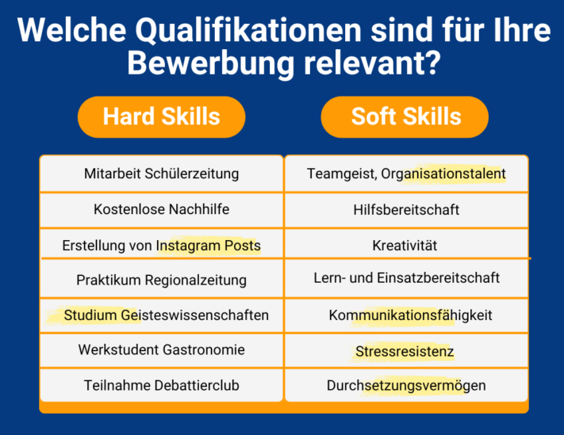
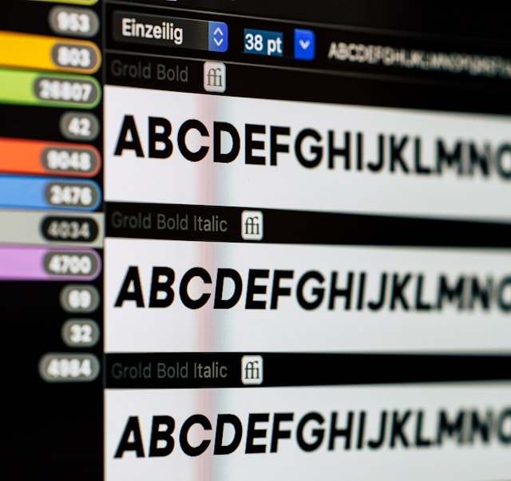

Tanto si se trata de unas prácticas como de un puesto de aprendiz o fijo, el primer paso para conseguir el trabajo de tus sueños es siempre una buena **solicitud**. ¿Has encontrado muchas **ofertas de trabajo** interesantes, pero redactar las solicitudes te da quebraderos de cabeza? No se preocupe, no es el único. Para muchas personas, la **carta de solicitud** es un gran obstáculo, ya que requiere una autoevaluación honesta e implica una formulación elaborada de sus propias habilidades.

Pero el esfuerzo merece la pena, porque sólo una carta de solicitud satisfactoria le abrirá la puerta a una **entrevista** personal y le acercará un paso más al **trabajo de sus sueños**. A continuación descubrirá a qué debe prestar atención al redactar su solicitud.



También puede utilizar una herramienta de planificación para hacer un seguimiento de sus solicitudes. [Aquí]() puede descubrir cómo utilizar esta herramienta para generar varias cartas de solicitud a partir de una plantilla con solo pulsar un botón.



## Por qué es importante una carta de solicitud

La carta de presentación es parte integrante de toda solicitud. Aunque debe incluir sus **aptitudes** en el **CV**, debe dedicar la carta de presentación a sus **aptitudes personales**. En los últimos años, estas aptitudes han cobrado cada vez más importancia, por lo que la carta de presentación personal se ha convertido en un punto central del proceso de selección.



Las competencias duras incluyen todos los conocimientos especializados que ha adquirido a través del trabajo, las prácticas o las actividades de ocio. En cambio, las competencias [blandas](https://www.karriereakademie.de/soft-skills) resumen las características que conforman tu personalidad.



Una carta de presentación le da la oportunidad de presentarse con confianza y destacar sus cualidades positivas. Por un lado, se trata de **presentarse** enumerando las cualificaciones pertinentes y, por otro, de destacar entre la multitud de candidatos.

## La preparación de su carta de presentación

Antes de empezar a escribir, debería crear una **hoja informativa**. Al fin y al cabo, necesitas información sobre la empresa, los requisitos y, por supuesto, un resumen de tus propias cualificaciones para poder adaptar tu carta de solicitud al anuncio de empleo.

Utiliza diversas fuentes para tu investigación.

Un enfoque estructurado le ayudará a elaborar la información pertinente y a no escribir demasiado después. La carta de presentación se basa en sus **documentos de solicitud**. Debe recopilarlos de antemano y adaptarlos al anuncio de empleo si es necesario.

### Encuentre las cualificaciones pertinentes en seis pasos

1. Lee atentamente el anuncio de trabajo y anota lo que se **espera** de ti.
2. Compare el perfil de los requisitos con **sus certificados, conocimientos y experiencia**. Busque coincidencias que le cualifiquen para el puesto y añada cualificaciones importantes a su CV si aún no las ha mencionado.
3. Basándose en sus aptitudes duras y en el perfil del puesto, hágase las siguientes preguntas sobre sus aptitudes personales y respóndalas con sinceridad:
    - ¿Cuáles son mis **puntos fuertes** y qué puedo mejorar?
    - ¿Qué tareas hago con **entusiasmo**?
    - ¿Qué **quiero** del nuevo trabajo? ¿En qué área me gustaría **aprender** algo?

Estas preguntas deberían revelar lo que **caracteriza su personalidad** y lo **que** le diferencia de los demás. Para comprobar la pertinencia de las conclusiones anteriores, es útil presentarlas en un cuadro.

Combina las habilidades blandas que has aprendido con las habilidades duras correspondientes.

6. Escriba todas sus **aptitudes en** la columna izquierda del cuadro. Además de la experiencia profesional, incluye títulos, periodos de prácticas, conocimientos de idiomas e informática, así como trabajos de voluntariado.
7. La columna de la derecha contiene **las competencias interpersonales** que ha adquirido o desarrollado durante su trabajo. Entre ellas figuran, por ejemplo, el espíritu de equipo, el entusiasmo o la asertividad.
8. Marque ahora las competencias que se mencionan en el anuncio de empleo y que, por tanto, debe incluir en su carta de candidatura.

Puede dejar de lado cualquier cualificación que no haya marcado como **relevante para su candidatura**. Sea coherente y elimine también la información que diga algo positivo de usted pero que no encaje con el puesto.



## Crear un resumen de la aplicación

Debería crear una tabla para no perder la pista de dónde ha presentado su candidatura, cuándo y con qué documentos durante su búsqueda de empleo. SeaTable le ofrece un [resumen estructurado]() de las solicitudes para que siempre tenga a mano la información y los documentos que ha preparado. Vea todas sus solicitudes y los documentos asociados de un vistazo y le facilitará la creación de cartas de presentación con el **diseño de página**.

Si desea utilizar SeaTable para su planificador de solicitudes, sólo tiene que [registrarse]() gratuitamente. Encontrará la plantilla [aquí]().

## Formalidades de su carta de candidatura

Antes de empezar a formular su solicitud, es importante tener una **Diseño normalizado** para todos sus documentos de solicitud. Esto no sólo hace que su solicitud parezca más coherente a primera vista, sino que también transmite que usted **aseado** y **limpiar** trabajo.

Busca un tipo de letra adecuado y presta atención al tamaño de la letra, el interlineado y los márgenes.

El diseño de sus documentos depende enteramente de usted, ya que no existe un formato prescrito. No obstante, asegúrese de que su escritura es legible y de que estructura su carta de solicitud con claridad. A continuación encontrará algunas recomendaciones:

- **Fuente**: fácil de leer, no demasiado elegante, por ejemplo Times New Roman o Arial, idealmente en tamaño de 10-12 puntos.
- **Interlineado**: mínimo una línea y máximo 1,5 líneas
- **Extensión**: máximo una página DIN A4
- **Márgenes**: superior e inferior 2 cm cada uno, izquierdo y derecho 2,5 cm
- **Flush**: alineado a la izquierda, excepción: fecha

Por supuesto, también puede aplicar estas formalidades a otros documentos de solicitud para crear una imagen uniforme y coherente.

## La estructura de su carta de presentación

La estructura de una carta de solicitud siempre es la misma y puede dividirse en seis secciones.

Siga la estructura y llénela de contenido.

## Membrete

El membrete se utiliza tradicionalmente cuando envía su carta de solicitud por correo postal. Sin embargo, también debe añadir un membrete a su carta de presentación cuando la envíe por Internet. En él figuran sus datos de **contacto**, así como la **dirección** de la empresa y del **destinatario** al que envía su solicitud. Asegúrese de introducir los datos de la dirección en el orden correcto, como se muestra en la ilustración.

La dirección debe ser siempre correcta y completa. Compruebe que el **nombre de la empresa** está completo. Para evitar errores innecesarios, copie la ortografía de la empresa de la página web. El **nombre de la persona de contacto** debe ser correcto y, si se indica, con título académico.



La **fecha** sigue a continuación, a cierta distancia a la derecha. En Alemania, la estructura es la siguiente:

**Lugar, día.mes.año**.

Puedes escribir el mes como un número o como una palabra.

A continuación aparece el **asunto**, con dos o tres líneas en blanco. Puede resaltarlo, por ejemplo, con letras en negrita o un tipo de letra más grande. De este modo, la empresa reconocerá inmediatamente su solicitud y la tramitará con rapidez. Indique aquí el **puesto** que solicita y añada el **número de referencia** si procede.

## Introducción

Antes de tener la oportunidad de brillar con sus cualificaciones, tiene que atraer la atención de su interlocutor. Diríjase a ellos **personalmente** por su nombre y sólo utilice los términos impersonales _señoras y señores_ en caso de emergencia si no conoce a nadie por su nombre. Para las empresas más conservadoras, elija una **forma** clásica **de dirigirse** como _Estimada Sra. XY_ para presentar su solicitud educadamente. En el caso de las empresas de nueva creación, también puede utilizar una forma informal de dirigirse a ellas, como " _Hola, estimado equipo de marketing, estimada_ Sra. XY".

Escriba con educación para crear una buena primera impresión en su interlocutor.

La primera impresión cuenta. Por eso debe prestar especial atención a la **primera frase** de su carta de solicitud. Debe **despertar interés** y decidir si el seleccionador sigue leyendo su solicitud. Evite frases como " _Por la presente solicito el puesto XY_ ", ya que no aportan información relevante sobre usted como persona.

Es importante que la primera frase no se pierda entre la multitud con una frase aburrida. Deje claro qué le diferencia de los demás candidatos. Utilice **palabras clave** concisas que describan su personalidad y sus aptitudes y que puedan retomarse en el cuerpo principal. Por ejemplo, empiece con una referencia personal a la empresa, su motivación única o un punto de venta único y emocionante.

## Parte principal

La sección principal es el núcleo de su carta de presentación. En ella debe incluir toda la información pertinente en un espacio de **cinco a siete líneas**. El objetivo es presentar tus **aptitudes y motivos de** forma breve y concisa y, al mismo tiempo, dar al seleccionador una impresión completa de tu personalidad.

### Sus cualificaciones

¿Qué le hace especial? Aborde esta pregunta en detalle aquí. Deje claro que está cualificado para todas las tareas del anuncio de empleo y que también es capaz de asumir nuevos retos con sus habilidades. Para ello, combine las aptitudes que ya figuran en su CV con sus habilidades interpersonales. Dé ejemplos concretos de situaciones en las que haya adquirido o aplicado habilidades en un contexto profesional o privado.

### Adecuación cultural a la empresa

También es importante si encajas en la empresa a nivel personal, además de por tus cualificaciones profesionales. Demuestre que se identifica con los valores de la empresa y que desea integrarse en la cultura corporativa. Puedes conseguirlo explicando cómo enriquecerás a la empresa y qué te motiva a trabajar en ella.

## Conclusión

Hemos dejado lo mejor para el final. Aquí puedes introducir tus **expectativas salariales** o tu **fecha de inicio** más temprana.

La **frase final** es especialmente importante, ya que es la que más recuerda el responsable de la contratación. Por lo tanto, es importante que irradie **confianza en sí mismo** y que haga hincapié una vez más en que espera una respuesta positiva. Para ello, evite el **subjuntivo**. Una conclusión como _"Estaría encantado de que me invitaran a una entrevista_ " da la impresión de reserva, como si no estuvieras seguro de tus aptitudes para el puesto.

Ten presente tu objetivo: acude a la entrevista con confianza en ti mismo.

Encuentre un buen término medio para sonar amable, educado y seguro al mismo tiempo. Una frase clara como _"Espero conocerle en persona en una entrevista_ " es una buena forma de hacerlo.

## Saludo y firma

Al igual que con el saludo, el **saludo** debe ser apropiado para la empresa. _"Atentamente"_ es siempre la opción más segura para usted.

Ahora sólo falta su **firma manuscrita**. Puede ponerla en la carta de solicitud impresa o, en el caso de una solicitud en línea, firmar digitalmente a través del teclado táctil o escanear su firma e insertarla en su documento.

## Archivos adjuntos

Enumere los anexos necesarios al final de su carta de presentación, bajo el epígrafe **Anexos**. Suelen incluir su **CV, referencias laborales y de prácticas y certificados**. Adjúntelos a su solicitud en un **archivo PDF** aparte.



## Formularios especiales de la carta de solicitud

La carta de solicitud clásica, como ya se ha explicado, puede variar en algunos casos. Dependiendo del caso que se le aplique, deberá adaptar sus documentos de solicitud en consecuencia.

### Prácticas

Si quieres presentar tu candidatura en el marco de unas prácticas escolares o universitarias, los reclutadores **no** exigen **ninguna o pocas cualificaciones profesionales**. En su lugar, ganarás puntos con las **aptitudes interpersonales** adecuadas **y los intereses** que persigas en determinadas asignaturas, trabajos de vacaciones, en tu tiempo libre o como parte de tus propios proyectos y trabajo voluntario.

Demuestre su compromiso social con el voluntariado.

Tu persona de contacto también está interesada en tu **motivación**. ¿Por qué quieres trabajar exactamente en esta empresa? ¿Qué esperas obtener de esta experiencia práctica? Muestra lo que te inspira.

### Solicitud espontánea

No siempre encontrará un puesto adecuado entre **las vacantes anunciadas** por la empresa de sus sueños. Pero eso no es motivo para rendirse, porque la mayoría de las empresas ofrecen la posibilidad de enviar solicitudes espontáneas. En este caso, debes centrarte en una **investigación exhaustiva**, ya que tienes que reunir toda la información para tus documentos tú mismo. Procura no sobrecargar tu solicitud y reduce tu carta de presentación a los aspectos que te parezcan más importantes.

### Solicitud por correo electrónico

Actualmente, la mayoría de las solicitudes se envían **por Internet**. Si envía sus documentos por correo electrónico, deberá adjuntar la carta de solicitud como **documento PDF**. El asunto, es decir, el puesto que solicita, debe colocarse en la **línea de asunto** prevista para ello. Escriba un breve texto de dos líneas en el campo de texto en el que nombre a su persona de contacto y haga referencia a los documentos **adjuntos**. Termine el texto con un saludo y su nombre.

## Consejos y trucos para su carta de solicitud

¿Está listo el contenido de su solicitud y quiere darle los últimos retoques? Entonces aquí encontrará algunos consejos y ejemplos útiles para perfeccionar su solicitud.

### Qué hacer y qué no hacer

Presta atención a tu estilo de escritura y a la redacción que utilizas.

Asegúrese de utilizar una redacción adecuada.

Para expresar confianza en ti mismo, utiliza frases activas y dirígete directamente a las personas. Personaliza tu carta de presentación y sé fiel a ti mismo.

### Modelo de carta de candidatura

Aquí encontrará ayudas de formulación para diversas situaciones de la carta de presentación:

Ya he adquirido conocimientos sobre el trabajo periodístico durante varias prácticas en el sector de los medios de comunicación. Ahora me gustaría aplicar las competencias que he adquirido allí a las relaciones públicas de su empresa internacional y desarrollarlas aún más.

Gracias a mis 10 años en ventas, sé cómo inspirar a los clientes en el contacto directo, por lo que puedo aumentar con éxito la facturación de su equipo de ventas.

Gracias a mis estudios de Románicas, domino el español y el francés a nivel B2 y he aplicado y profundizado estos conocimientos durante las prácticas en el extranjero, en Madrid y París.



"En mi puesto de jefe de equipo adjunto, he desarrollado un estilo de gestión colegiado en el que trato a mis empleados como iguales y les asigno tareas en función de sus capacidades individuales. Juntos, completamos el proyecto en la mitad del tiempo previsto".


### Lista de control

Antes de enviar su solicitud, debe **corregirla**. Además de **revisar la ortografía**, la siguiente lista de comprobación le ayudará a asegurarse de que su carta de presentación está completa:

- ¿Son correctos todos los nombres y están bien escritos?
- ¿Ha formulado su carta de solicitud de forma clara y no demasiado tópica?
- ¿Obtiene el reclutador una imagen completa de tus cualificaciones?
- ¿Ha elaborado lo suficiente su personalidad única?
- ¿Puede el responsable de contratación juzgar qué valor añadido aportas a la empresa y si te identificas con la cultura?

## Conclusión:

Ahora nada se interpondrá en su camino para redactar su próxima solicitud con éxito. SeaTable ha creado para usted un [planificador de solicitudes en línea]() para que no pierda de vista sus documentos aunque tenga varias solicitudes. Esto le ayudará a planificar sus próximos pasos, organizar sus documentos y mantenerse siempre al día con el proceso de solicitud.

Si desea utilizar SeaTable para el resumen de su solicitud, [regístrese]() gratuitamente. Encontrará la plantilla [aquí]().
