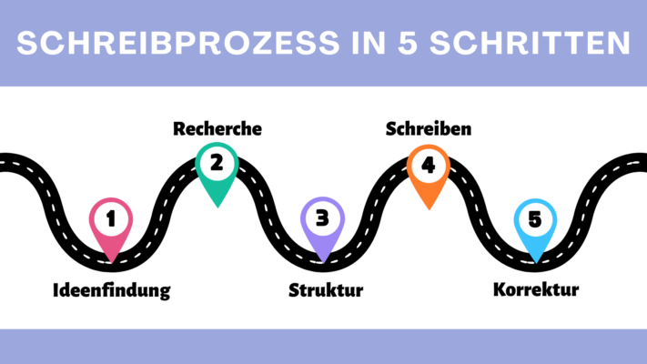

For many, writing a book is a fascinating but also challenging process. From the initial idea to the finished **manuscript**, there are numerous hurdles to overcome and steps to take. At a time when digital tools and software solutions are playing an ever-increasing role in **the creative process**, it is crucial for authors to find the right software to bring their visions to life. This article takes a closer look at **7 tools** to help you write your book.

Writing a book takes time and dedication.

## The Writing Process: How to Write a Book

A [writing process](https://de.wikipedia.org/wiki/Schreibprozess#Das_Schreibprozessmodell_von_Hayes) can be divided into five decisive phases:

- It all starts with **brainstorming**, a creative act in which you collect thoughts and discover inspiration.
- After finding ideas comes the **research** phase. This is where you look for relevant information and sources to support your book with well-founded facts and arguments.
- As soon as you have collected enough material, the **structuring** phase comes to the fore. Now it's about organizing the ideas you have collected and developing a clear central theme for your book.
- With the structure as a guide, the actual **writing** begins. In this phase, you put your ideas into words and develop the book further.
- The final step is **revision**. This is where the book is carefully checked to correct errors, improve the writing style and ensure that the text reaches the desired standard.

Writing process in 5 steps

## Why planning makes sense when writing a book

The importance of thorough planning should not be underestimated when writing a book with a program. By getting to grips with fundamental questions such as **genre**, **narrative perspective**, **narrative devices**, **structure** , and **goals** at the outset, you'll establish a solid framework that will guide and structure your writing project.

Planning is not only advantageous in terms of content, but also in terms of organization. Writing a book is a daunting project that is easier to accomplish if you break it down into **manageable chunks** . Not only does this breakdown make the writing process easier for you, but it also helps you keep **track** of the overall project and better track **progress** .

Even fictional stories often require thorough research to provide realistic details.

## Important Factors When Writing a Book

Even for experienced writers, writing a book can be a complex and demanding task. Numerous factors play a crucial role in creating a work that leaves a lasting impression on the reader. In this context, it is important to consider the following aspects that can significantly influence the writing process:

- **Plot:** A well-thought-out plot is the backbone of any story. He needs a conflict that moves the plot forward in order to provide an engaging reading experience.
- **Figures:** Characters need to evolve over the course of the plot to provide readers with an emotional connection.
- **Style:** An author's writing style is crucial to the atmosphere and impact of the book. Narrative devices should achieve the desired effects.
- **Routine:** Staying tuned and continuously working on the project is essential to maintain the flow of the story and ensure the quality of the text.
- **Feedback:** Feedback from professional editors or beta readers helps to identify weak points and further improve the work.

## Authoring software put to the test

For the following evaluation of seven selected book writing tools, we will compare the key criteria of **user-friendliness**, **range of functions**, **customization options** and **cost** for each program.

### Papyrus Author

Getting up to speed with Papyrus requires time to grasp the full range of functions, as the program offers a variety of book-writing features that are usually spread across multiple applications. It allows not only the management of **characters**, **places** and **objects**, but also the structuring of **storylines** and **research results**. A **thinking board** with templates can be used to visualize relationships. Despite its outdated design, this tool scores with plenty of bonus features like a **synonym finder**, **text analytics** , and the ability to highlight **verbatim speech** .

**Ease of use:** mediocre  
**Range of functions:** very high  
**Customization Ability:** High  
**Cost:** 199 Euro

In Papyrus you can create detailed databases.

### Scrivener

If you want to write a book with Scrivener, you can choose between non-fiction, novel and script right at the beginning. The easy-to-read **directory** allows authors to effortlessly navigate between different aspects of their book project, such as **manuscript**, **characters** , and **locations** . Especially for factual writers who prefer a focused work environment and don't need visual inspiration, Scrivener offers a suitable solution. In addition, the software allows the selection **of different manuscript formats** and the direct integration of **book covers**.

**Ease of use:** good  
**Features:** high  
**Customization capability:** very high  
**Cost:** 69.99 Euro

Scrivener allows for clear character sheets.

### Plottr

The core function of Plottr is a **schedule** that allows authors to plan the timeline of their action in a clear and intuitive way. This schedule can be divided into several plots and chapters and marked with different colors. In addition to scheduling, Plottr also offers the ability to capture **characters**, **locations** , and other important notes. Especially helpful are the **character templates**, which help writers better grasp their personalities. **Keywords** can also be assigned to each category to enable an efficient search for relevant information.

**Ease of use:** very high  
**Range of functions:** very high  
**Customization capability:** very high  
**Cost:** $149 – $299

Plottr makes it easy to visualize storylines.

### DramaQueen

Although the DramaQueen software is primarily designed for **screenplays** and **book series** , it is also suitable for various other stories. Although the program is not particularly intuitive at first, authors can achieve good results with a little training and the excellent **assistance** . A standout feature of DramaQueen is the ability to visualize **plotlines** . As a result, even before writing their book, authors can see in the program where the **dramaturgy** of their story may have weaknesses.

**Ease of use:** mediocre  
**Range of functions:** very high  
**Customization:** good  
**Cost:** free basic function

With DramaQueen, you can find out the weaknesses of your dramaturgy.

### Patchwork

Patchwork provides extensive support for authors through numerous **examples** and **suggestions**. The software allows you to capture **characters**, **places**, **objects**, a **timeline** , and much more. The **story building assistant** also makes it easier to create the plot. For authors who want to write a book together, the program offers the option of using a **team account** . A useful addition is the direct integration of the **Duden spelling aid**, which can be purchased separately.

**Ease of use:** high  
**Range of functions:** very high  
**Customization Ability:** High  
**Costs:** 154 – 189 Euro

### Campfire Pro

Campfire Pro is characterized by a simple design with **panels** that result in a clear and user-friendly view. The panels are individually adaptable and can be moved freely. In addition to the usual notes, information about **magic**, **culture**, **religion** and even **languages** or **philosophies** can also be recorded here. A handy feature is the direct link to **Unsplash**, which allows you to easily insert images for inspiration. Overall, Campfire offers an extensive and clear platform, but it is mainly intended for the direct publication of works on this website.

**Ease of use:** very high  
**Range of functions:** very high  
**Customization capability:** very high  
**Costs:** partly free of charge

### SeaTable

SeaTable's [writing schedule]() is extremely handy for writers who want to develop a plot before writing a book. Since the program is **free**, it's great for planning book projects. In addition to the main table, where you can record the plot, SeaTable offers the possibility to further elaborate on **characters**, **places**, symbolic elements or **relationships** with other **tables**. These tables can be freely managed and supplemented, while you can group and sort the content as you wish. The Timeline plugin also allows you to visualize the action on a **timeline**. An added bonus is the page design plugin, which allows you to create custom **profiles** for each character.

**Ease of use:** very high  
**Features:** high  
**Customization capability:** very high  
**Cost:** free of charge

## Conclusion: How to Write Your Book

The authoring software tools presented here offer a variety of features and capabilities to assist you at every stage of the writing process. Ultimately, choosing the right software depends on your individual needs and preferences when writing books. With the right program, you can streamline your writing process and successfully realize your creative visions.

If you'd like to use SeaTable's template for your book project, simply [register]() for free with your email address. So you can start with your personal [writing plan]() in just a few minutes.
