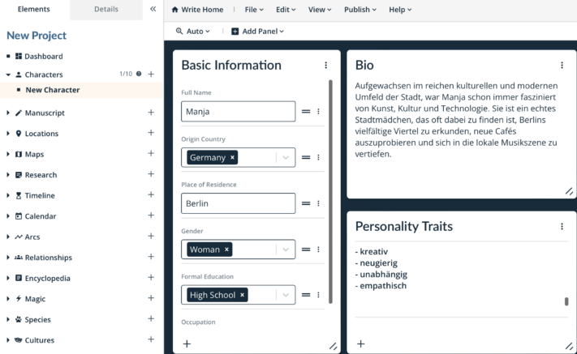

Escribir un libro es un proceso fascinante pero también desafiante para muchas personas. Desde la idea inicial hasta el **manuscrito** terminado, hay numerosos obstáculos que superar y pasos que dar. En una época en la que las herramientas digitales y las soluciones informáticas desempeñan un papel cada vez más importante en el **proceso creativo**, es crucial que los autores encuentren el software adecuado para dar vida a sus visiones. En este artículo analizamos **7 herramientas** que puedes utilizar para escribir tu libro.

Escribir un libro requiere tiempo y dedicación.

## El proceso de escritura: cómo escribir un libro

El [proceso de escritura](https://de.wikipedia.org/wiki/Schreibprozess#Das_Schreibprozessmodell_von_Hayes) puede dividirse en cinco fases decisivas:

- Todo empieza con **una lluvia de ideas**, un acto creativo en el que se recopilan pensamientos y se descubre la inspiración.
- Tras la búsqueda de ideas viene la fase de **investigación**. Aquí es donde buscas información y fuentes relevantes para apoyar tu libro con hechos y argumentos bien fundamentados.
- En cuanto haya reunido suficiente material, pasará a la fase de **estructuración**. El objetivo ahora es organizar las ideas recopiladas y desarrollar un tema central claro para el libro.
- Con la estructura como guía, comienza la **escritura** propiamente dicha. En esta fase pones en palabras tus ideas y desarrollas el libro.
- El último paso es la **revisión**. Aquí es donde el libro se revisa cuidadosamente para corregir errores, mejorar el estilo de redacción y asegurarse de que el texto alcanza el nivel deseado.

El proceso de escritura en 5 pasos

## Por qué la planificación tiene sentido a la hora de escribir un libro

No se debe subestimar la importancia de una planificación minuciosa cuando se escribe un libro con un programa. Al abordar cuestiones fundamentales como el **género**, la **perspectiva narrativa**, los **recursos narrativos**, la **estructura** y **los objetivos** desde el principio, establecerás un marco sólido que guiará y estructurará tu proyecto de escritura.

La planificación no solo es ventajosa en términos de contenido, sino también en términos de organización. Escribir un libro es un proyecto desalentador que es más fácil de lograr si lo divides en **partes manejables** . Este desglose no solo facilita el proceso de escritura, sino que también te ayuda a realizar **un seguimiento** general del proyecto y a realizar un mejor seguimiento del **progreso** .

Incluso las historias de ficción a menudo requieren una investigación exhaustiva para proporcionar detalles realistas.

## Factores importantes a la hora de escribir un libro

Incluso para los escritores experimentados, escribir un libro puede ser una tarea compleja y exigente. Numerosos factores juegan un papel crucial en la creación de una obra que deja una impresión duradera en el lector. En este contexto, es importante tener en cuenta los siguientes aspectos que pueden influir significativamente en el proceso de escritura:

- **Conspirar:** Una trama bien pensada es la columna vertebral de cualquier historia. Necesita un conflicto que haga avanzar la trama para proporcionar una experiencia de lectura atractiva.
- **Figuras:** Los personajes deben evolucionar a lo largo de la trama para proporcionar a los lectores una conexión emocional.
- **Estilo:** El estilo de escritura de un autor es crucial para la atmósfera y el impacto del libro. Los dispositivos narrativos deben lograr los efectos deseados.
- **Rutina:** Estar atento y trabajar continuamente en el proyecto es esencial para mantener el flujo de la historia y garantizar la calidad del texto.
- **Retroalimentación:** Los comentarios de los editores profesionales o de los lectores beta ayudan a identificar los puntos débiles y a mejorar aún más el trabajo.

## Software de creación puesto a prueba

En la siguiente evaluación de siete herramientas de escritura de libros seleccionadas, compararemos los criterios clave de **facilidad de uso**, **gama de funciones**, **opciones de personalización** y **costes** de cada programa.

### Autor del papiro

Ponerse al día con Papyrus requiere tiempo para comprender toda la gama de funciones, ya que el programa ofrece una variedad de funciones de escritura de libros que generalmente se distribuyen en múltiples aplicaciones. Permite no solo la gestión de **personajes**, **lugares** y **objetos**, sino también la estructuración de **historias** y resultados de **investigación**. Se puede utilizar un **tablero de pensamiento** con plantillas para visualizar las relaciones. A pesar de su diseño anticuado, esta herramienta cuenta con muchas funciones adicionales, como un **buscador de sinónimos**, **análisis de texto** y la capacidad de resaltar **el discurso literal** .

**Facilidad de uso:** mediocre  
**Gama de funciones:** muy alta  
**Capacidad de personalización: Alta**  
**Precio:** 199 euros

En Papyrus puedes crear bases de datos detalladas.

### Amanuense

Si quieres escribir un libro con Scrivener, puedes elegir entre no ficción, novela y guión desde el principio. El **directorio** fácil de leer permite a los autores navegar sin esfuerzo entre diferentes aspectos de su proyecto de libro, como **el manuscrito**, **los personajes** y **las ubicaciones** . Especialmente para los escritores de hechos que prefieren un entorno de trabajo centrado y no necesitan inspiración visual, Scrivener ofrece una solución adecuada. Además, el software permite la selección **de diferentes formatos de manuscritos** y la integración directa de **las portadas de los libros**.

**Facilidad de uso:** buena  
**Características:** alto  
**Capacidad de personalización:** muy alta  
**Precio:** 69,99 euros

Scrivener permite hojas de personaje claras.

### Plottr

La función principal de Plottr es un **cronograma** que permite a los autores planificar la línea de tiempo de su acción de una manera clara e intuitiva. Este horario se puede dividir en varias tramas y capítulos y marcar con diferentes colores. Además de la programación, Plottr también ofrece la posibilidad de capturar **personajes**, **ubicaciones** y otras notas importantes. Especialmente útiles son las plantillas de personajes, que ayudan a los escritores a comprender mejor sus **personalidades**. También se pueden asignar **palabras clave** a cada categoría para permitir una búsqueda eficiente de información relevante.

**Facilidad de uso:** muy alta  
**Gama de funciones:** muy alta  
**Capacidad de personalización:** muy alta  
**Costo:** $149 – $299

Plottr facilita la visualización de las historias.

### Reina del drama

Aunque el software DramaQueen está diseñado principalmente para **guiones** y **series de libros** , también es adecuado para otras historias. Aunque el programa no es particularmente intuitivo al principio, los autores pueden lograr buenos resultados con un poco de capacitación y una excelente **asistencia** . Una característica destacada de DramaQueen es la capacidad de visualizar **tramas** . Como resultado, incluso antes de escribir su libro, los autores pueden ver en el programa dónde la **dramaturgia** de su historia puede tener debilidades.

**Facilidad de uso:** mediocre  
**Gama de funciones:** muy alta  
**Personalización:** buena  
**Costo:** función básica gratuita

Con DramaQueen, puedes descubrir las debilidades de tu dramaturgia.

### Patchwork

Patchwork proporciona un amplio apoyo a los autores a través de numerosos **ejemplos** y **sugerencias**. El software le permite capturar **personajes**, **lugares**, **objetos**, una **línea de tiempo** y mucho más. El **asistente de construcción de historias** también facilita la creación de la trama. Para los autores que quieran escribir un libro juntos, el programa ofrece la opción de utilizar una **cuenta de equipo** . Una adición útil es la integración directa de la **ayuda ortográfica Duden**, que se puede comprar por separado.

**Facilidad de uso:** alta  
**Gama de funciones:** muy alta  
**Capacidad de personalización: Alta**  
**Coste:** 154 – 189 euros

### Campfire Pro

Campfire Pro se caracteriza por un diseño simple con **paneles** que dan como resultado una vista clara y fácil de usar. Los paneles se pueden adaptar individualmente y se pueden mover libremente. Además de las notas habituales, aquí también se puede registrar información sobre **magia**, **cultura**, **religión** e incluso **idiomas** o **filosofías** . Una característica útil es el enlace directo a **Unsplash**, que le permite insertar fácilmente imágenes para inspirarse. En general, Campfire ofrece una plataforma extensa y clara, pero está destinada principalmente a la publicación directa de obras en este sitio web.

**Facilidad de uso:** muy alta  
**Gama de funciones:** muy alta  
**Capacidad de personalización:** muy alta  
**Costes:** parcialmente gratuitos

### SeaTable

El [programa de escritura]() de SeaTable es extremadamente útil para los escritores que desean desarrollar una trama antes de escribir un libro. Dado que el programa es **gratuito**, es ideal para planificar proyectos de libros. Además de la mesa principal, donde se puede registrar la trama, SeaTable ofrece la posibilidad de profundizar en **personajes**, **lugares**, elementos simbólicos o **relaciones** con otras **mesas**. Estas tablas se pueden administrar y complementar libremente, mientras que puede agrupar y ordenar el contenido como desee. El plugin Timeline también te permite visualizar la acción en una **línea de tiempo**. Una ventaja adicional es el complemento de diseño de páginas, que le permite crear **perfiles** personalizados para cada personaje.

**Facilidad de uso:** muy alta  
**Características:** alto  
**Capacidad de personalización:** muy alta  
**Costo:** gratuito

## Conclusión: Cómo escribir tu libro

Las herramientas de software de autoría que se presentan aquí ofrecen una variedad de características y capacidades para ayudarlo en cada etapa del proceso de escritura. En última instancia, la elección del software adecuado depende de sus necesidades y preferencias individuales a la hora de escribir libros. Con el programa adecuado, puedes agilizar tu proceso de escritura y hacer realidad con éxito tus visiones creativas.

Si desea utilizar la plantilla de SeaTable para su proyecto de libro, simplemente [regístrese]() de forma gratuita con su dirección de correo electrónico. Así que puedes empezar con tu plan personal de [escritura]() en tan solo unos minutos.
