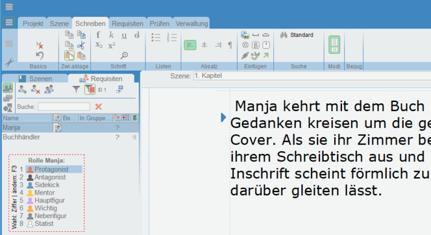

L'écriture d'un livre est pour beaucoup un processus fascinant, mais aussi un défi. De la première idée au **manuscrit** final, il y a de nombreux obstacles à surmonter et de nombreux jalons à poser. À une époque où les outils numériques et les solutions logicielles jouent un rôle de plus en plus important dans le **processus de création**, il est essentiel pour les auteurs de trouver le bon logiciel pour donner vie à leur vision. Cet article se penche de plus près sur **7 outils** qui vous permettront d'écrire votre livre.

Écrire un livre demande du temps et du dévouement.

## Le processus d’écriture : comment écrire un livre

Un [processus d'écriture](https://de.wikipedia.org/wiki/Schreibprozess#Das_Schreibprozessmodell_von_Hayes) peut être divisé en cinq phases décisives :

- Tout commence par la **recherche d'idées**, un acte créatif au cours duquel vous rassemblez des pensées et découvrez des inspirations.
- Après la recherche d'idées, vient la phase de **recherche**. C'est là que vous cherchez des informations et des sources pertinentes afin d'étayer votre livre avec des faits et des arguments fondés.
- Dès que vous avez réuni suffisamment de matériel, la phase de **structuration** passe au premier plan. Il s'agit maintenant de classer les idées rassemblées et de développer un fil conducteur clair pour votre livre.
- Avec la structure comme fil conducteur, l'**écriture** proprement dite commence. Au cours de cette phase, vous mettez vos idées en mots et développez le livre.
- La dernière étape est la **révision**. C'est à ce moment que le livre est soigneusement relu afin de corriger les erreurs, d'améliorer le style d'écriture et de s'assurer que le texte atteint le niveau souhaité.

Processus d'écriture en 5 étapes

## Pourquoi la planification a-t-elle du sens lors de l’écriture d’un livre ?

L’importance d’une planification minutieuse ne doit pas être sous-estimée lors de l’écriture d’un livre avec un programme. En abordant dès le départ des questions fondamentales telles que le **genre**, la **perspective narrative**, les **dispositifs narratifs**, la **structure** et **les objectifs** , vous établirez un cadre solide qui guidera et structurera votre projet d’écriture.

La planification n’est pas seulement avantageuse en termes de contenu, mais aussi en termes d’organisation. L’écriture d’un livre est un projet intimidant qui est plus facile à accomplir si vous le décomposez en **morceaux gérables** . Non seulement cette répartition vous facilite le **processus d’écriture** , mais elle vous aide également à suivre l’ensemble du projet et à mieux suivre **l’avancement** .

Même les histoires fictives nécessitent souvent des recherches approfondies pour fournir des détails réalistes.

## Facteurs importants lors de l’écriture d’un livre

Même pour les écrivains expérimentés, l’écriture d’un livre peut être une tâche complexe et exigeante. De nombreux facteurs jouent un rôle crucial dans la création d’une œuvre qui laisse une impression durable sur le lecteur. Dans ce contexte, il est important de prendre en compte les aspects suivants qui peuvent influencer de manière significative le processus d’écriture :

- **Complot:** Une intrigue bien pensée est l’épine dorsale de toute histoire. Il a besoin d’un conflit qui fasse avancer l’intrigue afin d’offrir une expérience de lecture engageante.
- **Chiffres:** Les personnages doivent évoluer au cours de l’intrigue pour fournir aux lecteurs un lien émotionnel.
- **Style:** Le style d’écriture d’un auteur est crucial pour l’atmosphère et l’impact du livre. Les dispositifs narratifs doivent produire les effets escomptés.
- **Routine:** Rester à l’écoute et travailler en permanence sur le projet est essentiel pour maintenir le flux de l’histoire et assurer la qualité du texte.
- **Rétroaction:** Les commentaires des rédacteurs professionnels ou des bêta-lecteurs permettent d’identifier les points faibles et d’améliorer encore le travail.

## Les logiciels auteurs mis à l’épreuve

Pour l'évaluation suivante de sept outils sélectionnés pour l'écriture de livres, nous allons comparer pour chaque programme les critères clés suivants : **facilité d'utilisation**, **fonctionnalités**, **possibilités de personnalisation** et **coût**.

### Papyrus Auteur

Se familiariser avec Papyrus nécessite du temps pour saisir toute la gamme des fonctions, car le programme offre une variété de fonctionnalités d’écriture de livres qui sont généralement réparties dans plusieurs applications. Il permet non seulement la gestion des **personnages**, des **lieux** et des **objets**, mais aussi la structuration des **intrigues et des** **résultats de recherche**. Un **tableau de réflexion** avec des modèles peut être utilisé pour visualiser les relations. Malgré sa conception obsolète, cet outil se distingue par de nombreuses fonctionnalités bonus telles qu’un **outil de recherche de synonymes**, **l’analyse de texte** et la possibilité de mettre en évidence le **discours verbatim** .

**Facilité d’utilisation :** médiocre  
**Gamme de fonctions :** très élevée  
**Capacité de personnalisation : Élevée**  
**Coût :** 199 Euro

Dans Papyrus, vous pouvez créer des bases de données détaillées.

### Scrivener

Si vous voulez écrire un livre avec Scrivener, vous pouvez choisir entre la non-fiction, le roman et le scénario dès le début. Le **répertoire** facile à lire permet aux auteurs de naviguer sans effort entre les différents aspects de leur projet de livre, tels que le **manuscrit**, **les personnages** et **les lieux** . En particulier pour les rédacteurs factuels qui préfèrent un environnement de travail ciblé et n’ont pas besoin d’inspiration visuelle, Scrivener offre une solution appropriée. De plus, le logiciel permet la sélection **de différents formats de manuscrits** et l’intégration directe des **couvertures de livres**.

**Facilité d’utilisation :** bonne  
**Caractéristiques :** élevé  
**Capacité de personnalisation :** très élevée  
**Coût :** 69.99 Euro

Scrivener permet d’obtenir des feuilles de personnage claires.

### Plottr

La fonction principale de Plottr est un **calendrier** qui permet aux auteurs de planifier la chronologie de leur action de manière claire et intuitive. Ce calendrier peut être divisé en plusieurs parcelles et chapitres et marqué de différentes couleurs. En plus de la planification, Plottr offre également la possibilité de capturer des **personnages**, **des lieux** et d’autres notes importantes. Les **modèles de personnages**, qui aident les écrivains à mieux saisir leur personnalité, sont particulièrement utiles. **Des mots-clés** peuvent également être attribués à chaque catégorie pour permettre une recherche efficace d’informations pertinentes.

**Facilité d’utilisation :** très élevée  
**Gamme de fonctions :** très élevée  
**Capacité de personnalisation :** très élevée  
**Coût :** 149 $ – 299 $

Plottr facilite la visualisation des scénarios.

### DramaQueen (en anglais seulement)

Bien que le logiciel DramaQueen soit principalement conçu pour les **scénarios** et **les séries de livres** , il convient également à diverses autres histoires. Bien que le programme ne soit pas particulièrement intuitif au début, les auteurs peuvent obtenir de bons résultats avec un peu de formation et une excellente **assistance** . L’une des caractéristiques les plus remarquables de DramaQueen est la possibilité de visualiser les **intrigues** . De ce fait, avant même d’écrire leur livre, les auteurs peuvent voir dans le programme où la **dramaturgie** de leur histoire peut avoir des faiblesses.

**Facilité d’utilisation :** médiocre  
**Gamme de fonctions :** très élevée  
**Personnalisation :** bonne  
**Coût :** fonction de base gratuite

Avec DramaQueen, vous pouvez découvrir les faiblesses de votre dramaturgie.

### Patchwork

Patchwork fournit un soutien étendu aux auteurs à travers de nombreux **exemples** et **suggestions**. Le logiciel vous permet de capturer des **personnages**, **des lieux**, des **objets**, une **chronologie** et bien plus encore. **L’assistant de construction d’histoire** facilite également la création de l’intrigue. Pour les auteurs qui souhaitent écrire un livre ensemble, le programme offre la possibilité d’utiliser un **compte d’équipe** . Un ajout utile est l’intégration directe de **l’aide à l’orthographe Duden**, qui peut être achetée séparément.

**Facilité d’utilisation :** élevée  
**Gamme de fonctions :** très élevée  
**Capacité de personnalisation : Élevée**  
**Coûts :** 154 – 189 Euro

### Feu de camp Pro

Campfire Pro se caractérise par un design simple avec des **panneaux** qui se traduisent par une vue claire et conviviale. Les panneaux sont adaptables individuellement et peuvent être déplacés librement. En plus des notes habituelles, des informations sur la **magie**, **la culture**, **la religion** et même les **langues** ou **les philosophies** peuvent également y être enregistrées. Une fonctionnalité pratique est le lien direct vers **Unsplash**, qui vous permet d’insérer facilement des images pour vous inspirer. Dans l’ensemble, Campfire offre une plate-forme étendue et claire, mais elle est principalement destinée à la publication directe d’œuvres sur ce site Web.

**Facilité d’utilisation :** très élevée  
**Gamme de fonctions :** très élevée  
**Capacité de personnalisation :** très élevée  
**Coûts :** en partie gratuits

### SeaTable

Le [calendrier d’écriture](https://seatable.io/fr/modele/lkngogoxqfaoj1kppa2awa/) de SeaTable est extrêmement pratique pour les écrivains qui souhaitent développer une intrigue avant d’écrire un livre. Comme le programme est **gratuit**, il est idéal pour planifier des projets de livres. En plus de la table principale, où vous pouvez enregistrer l’intrigue, SeaTable offre la possibilité d’élaborer davantage sur **les personnages**, **les lieux**, les éléments symboliques ou les **relations** avec d’autres **tables**. Ces tableaux peuvent être librement gérés et complétés, tandis que vous pouvez regrouper et trier le contenu comme vous le souhaitez. Le plugin Timeline vous permet également de visualiser l’action sur une **timeline**. Un bonus supplémentaire est le plugin de conception de page, qui vous permet de créer des **profils** personnalisés pour chaque personnage.

**Facilité d’utilisation :** très élevée  
**Caractéristiques :** élevé  
**Capacité de personnalisation :** très élevée  
**Coût :** gratuit

## Conclusion : Comment écrire votre livre

Les outils logiciels de création présentés ici offrent une variété de fonctionnalités et de capacités pour vous aider à chaque étape du processus de rédaction. En fin de compte, le choix du bon logiciel dépend de vos besoins et préférences individuels lors de l’écriture de livres. Avec le bon programme, vous pouvez rationaliser votre processus d’écriture et réaliser avec succès vos visions créatives.

Si vous souhaitez utiliser le modèle de SeaTable pour votre projet de livre, il vous suffit de [vous inscrire](https://seatable.io/fr/enregistrement/) gratuitement avec votre adresse e-mail. Ainsi, vous pouvez commencer avec votre [plan d’écriture](https://seatable.io/fr/modele/lkngogoxqfaoj1kppa2awa/) personnel en quelques minutes seulement.
