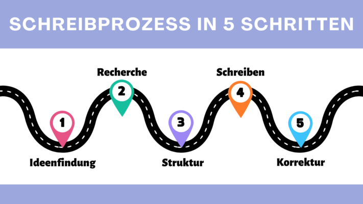
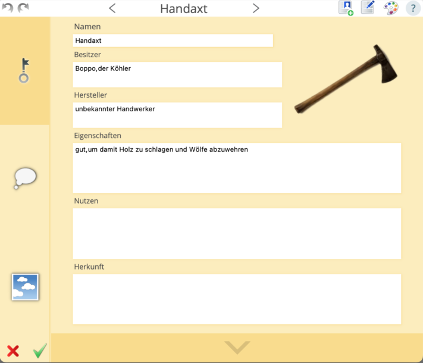
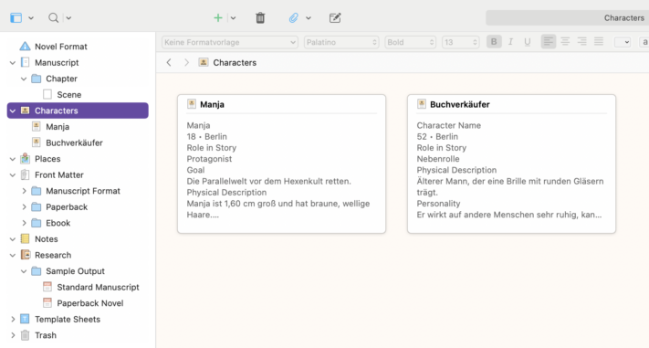
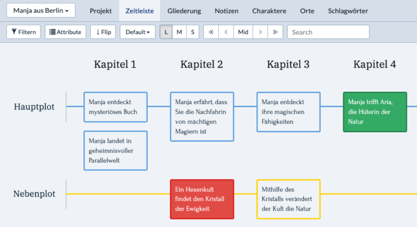
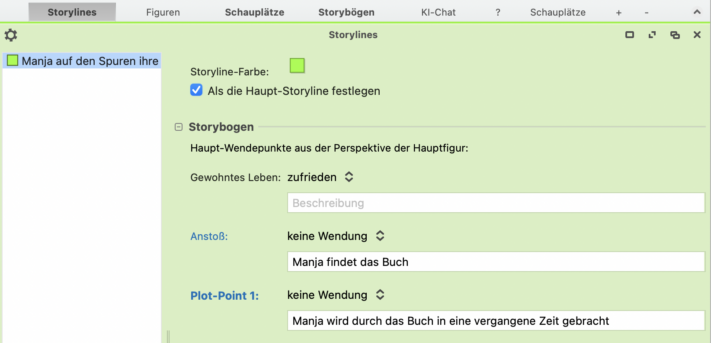
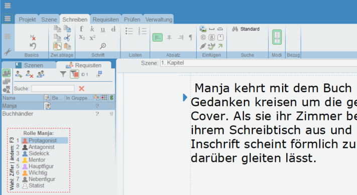
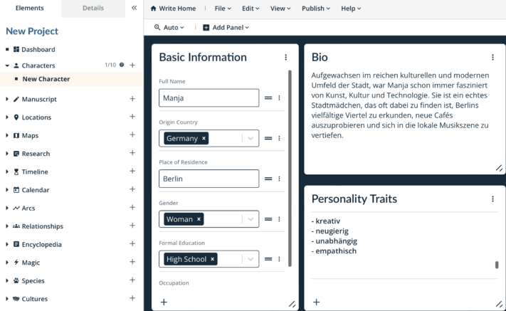

Escrever um livro é um processo fascinante, mas também desafiante para muitas pessoas. Desde a ideia inicial até ao **manuscrito** acabado, há inúmeros obstáculos a ultrapassar e passos a dar. Numa altura em que as ferramentas digitais e as soluções de software desempenham um papel cada vez mais importante no **processo criativo**, é crucial que os autores encontrem o software certo para dar vida às suas visões. Este artigo analisa em pormenor **7 ferramentas** que pode utilizar para escrever o seu livro.

Escrever um livro exige tempo e dedicação.

## O processo de escrita: como escrever um livro

Um [processo de escrita](https://de.wikipedia.org/wiki/Schreibprozess#Das_Schreibprozessmodell_von_Hayes) pode ser dividido em cinco fases decisivas:

- Tudo começa com o **brainstorming**, um ato criativo em que se recolhem pensamentos e se descobre inspiração.
- Depois de encontrar ideias, vem a fase de **investigação**. É aqui que se procura informação e fontes relevantes para apoiar o livro com factos e argumentos bem fundamentados.
- Assim que tiver recolhido material suficiente, começa a fase **de estruturação**. O objetivo agora é organizar as ideias que recolheu e desenvolver um tema central claro para o seu livro.
- Com a estrutura como guia, começa a **redação** propriamente dita. Nesta fase, põe as suas ideias em palavras e desenvolve o livro.
- A última etapa é a **revisão**. É aqui que o livro é cuidadosamente verificado para corrigir erros, melhorar o estilo de escrita e garantir que o texto atinge o nível desejado.

Processo de escrita em 5 etapas

## Por que planejar faz sentido ao escrever um livro

A importância de um planejamento completo não deve ser subestimada ao escrever um livro com um programa. Ao abordar inicialmente questões básicas como **gênero** , **perspectiva narrativa** , **dispositivos narrativos** , **estrutura** e **objetivos** , você estabelecerá uma estrutura sólida que orientará e estruturará seu projeto de escrita.

O planejamento não é benéfico apenas em termos de conteúdo, mas também em termos organizacionais. Escrever um livro é um projeto enorme que fica mais fácil quando dividido em **partes gerenciáveis** . Essa análise não apenas torna o processo de escrita mais fácil, mas também ajuda a **acompanhar** o projeto geral e acompanhar melhor **o progresso** .

Mesmo as histórias de ficção muitas vezes exigem uma pesquisa completa para fornecer detalhes realistas.

## Fatores importantes ao escrever um livro

Mesmo para autores experientes, escrever um livro pode ser uma tarefa complexa e exigente. Vários fatores desempenham um papel crucial na criação de uma obra que deixa uma impressão duradoura no leitor. Neste contexto, é importante considerar os seguintes aspectos que podem influenciar significativamente o processo de escrita:

- **Enredo:** Um enredo bem pensado é a espinha dorsal de toda história. É necessário um conflito que conduza o enredo para proporcionar uma experiência de leitura emocionante.
- **Personagens:** Os personagens devem se desenvolver ao longo da trama para proporcionar aos leitores uma conexão emocional.
- **Estilo de escrita:** O estilo de escrita de um autor é crucial para a atmosfera e o impacto do livro. Os dispositivos narrativos devem alcançar os efeitos desejados.
- **Rotina:** Perseverar e trabalhar continuamente no projeto é essencial para manter o fluxo da história e garantir a qualidade do texto.
- **Feedback:** O feedback de editores profissionais ou leitores beta ajuda a identificar pontos fracos e melhorar ainda mais o trabalho.

## Criação de software no teste

Para a avaliação que se segue de sete ferramentas de escrita de livros seleccionadas, compararemos os critérios-chave de **facilidade de utilização**, **gama de funções**, **opções de personalização** e **custos** de cada programa.

### Autor de papiro

Acostumar-se com o Papyrus requer tempo para compreender totalmente sua funcionalidade, pois o programa oferece uma variedade de recursos de escrita de livros que geralmente estão espalhados por vários aplicativos. Permite não só a gestão de **personagens** , **locais** e **objectos** , mas também a estruturação de **enredos** e **resultados de investigação** . Um **quadro de reflexão** com modelos pode ser usado para representar visualmente as conexões. Apesar de seu design desatualizado, esta ferramenta possui vários recursos extras, como **localizador de sinônimos** , **análise de texto** e capacidade de destacar **discurso literal** .

**Facilidade de uso:** medíocre  
**Gama de funções:** muito alta  
**Adaptabilidade:** alta  
**Custo:** 199 euros

No Papyrus você pode criar bancos de dados detalhados.

### Escrivão

Se quiser escrever um livro com Scrivener, você pode escolher entre não ficção, romance e roteiro desde o início. O **diretório** claro permite aos autores navegar facilmente entre diferentes aspectos do projeto do livro, como **manuscrito** , **personagens** e **locais** . Scrivener oferece uma solução adequada, especialmente para autores factuais que preferem um ambiente de trabalho focado e não precisam de inspiração visual. Além disso, o software permite a seleção de diferentes **formatos de manuscritos** e a integração direta de **capas de livros** .

**Facilidade de uso:** bom  
**Gama de funções:** alta  
**Adaptabilidade:** muito alta  
**Custo:** 69,99 euros

Scrivener permite fichas de personagens claras.

### plotter

A função principal do Plottr é um **cronograma** que permite aos autores planejar a linha do tempo de seu enredo de forma clara e intuitiva. Esta programação pode ser dividida em vários enredos e capítulos e marcada com cores diferentes. Além do agendamento, o Plottr também oferece a capacidade de capturar **personagens** , **locais** e outras notas importantes. Particularmente úteis são os **modelos de personagens** , que ajudam os autores a capturar melhor suas personalidades. **Palavras-chave** também podem ser atribuídas a cada categoria para permitir pesquisas eficientes de informações relevantes.

**Facilidade de uso:** muito alta  
**Gama de funções:** muito alta  
**Adaptabilidade:** muito alta  
**Custo:** $ 149 – $ 299

Plottr facilita a visualização de histórias.

### Rainha do drama

O software DramaQueen foi projetado principalmente para **roteiros** e **séries de livros** , mas também é adequado para várias outras histórias. Embora o programa não seja particularmente intuitivo no início, com um pouco de treinamento e um excelente **suporte** , os autores podem alcançar bons resultados. Uma característica marcante do DramaQueen é a capacidade de visualizar **enredos** . Isso significa que os autores podem usar o programa para ver onde a **dramaturgia** de sua história pode ter pontos fracos antes mesmo de escreverem seu livro.

**Facilidade de uso:** medíocre  
**Gama de funções:** muito alta  
**Adaptabilidade:** boa  
**Custo:** função básica gratuita

Com o DramaQueen você pode descobrir os pontos fracos da sua dramaturgia.

### colcha de retalhos

Patchwork oferece amplo suporte aos autores através de numerosos **exemplos** e **sugestões** . O software permite capturar **personagens** , **locais** , **objetos** , uma **linha do tempo** e muito mais. O **assistente de construção de histórias** também facilita a criação do enredo. Para autores que desejam escrever um livro juntos, o programa oferece a opção de usar uma **conta de equipe** . Uma adição útil é a integração direta do **auxílio ortográfico Duden** , que pode ser adquirido separadamente.

**Facilidade de uso:** alta  
**Gama de funções:** muito alta  
**Adaptabilidade:** alta  
**Custo:** 154 – 189 euros

### Fogueira Pro

Campfire Pro apresenta uma estrutura simples com **painéis** que resultam em uma visão clara e fácil de usar. Os painéis são ajustáveis individualmente e podem ser movidos livremente. Além das anotações habituais, também podem ser registradas aqui informações sobre **magia** , **cultura** , **religião** e até **línguas** ou **filosofias** . Um recurso prático é o link direto para **o Unsplash** , que permite inserir facilmente imagens para inspiração. No geral, Campfire oferece uma plataforma abrangente e clara, que se destina principalmente à publicação direta de trabalhos neste site.

**Facilidade de uso:** muito alta  
**Gama de funções:** muito alta  
**Adaptabilidade:** muito alta  
**Custos:** parcialmente gratuitos

### SeaTable

[O plano de escrita](https://seatable.io/pt/vorlage/lkngogoxqfaoj1kppa2awa/) do SeaTable é extremamente útil para autores que desejam desenvolver um enredo antes de escrever um livro. Por ser **gratuito** , o programa é ideal para planejar projetos de livros. Além da tabela principal na qual você pode registrar o enredo, o SeaTable oferece tabelas adicionais que permitem elaborar mais sobre **personagens** , **lugares** , **elementos simbólicos** ou **relacionamentos** . Essas tabelas podem ser gerenciadas e complementadas livremente, enquanto você pode agrupar e classificar o conteúdo como desejar. O plugin de linha do tempo também permite visualizar a ação em uma **linha do tempo** . Um bônus adicional é o plugin de design de página, que permite criar **perfis** projetados individualmente para cada personagem.

**Facilidade de uso:** muito alta  
**Gama de funções:** alta  
**Adaptabilidade:** muito alta  
**Gratuito**

## Conclusão: é assim que você pode escrever seu livro

As ferramentas de software de autoria apresentadas aqui oferecem uma variedade de funções e opções para apoiá-lo em todas as fases do processo de escrita. Em última análise, a escolha do software certo depende de suas necessidades e preferências individuais ao escrever um livro. Com o programa certo, você pode otimizar seu processo de escrita e concretizar com sucesso suas visões criativas.

Se você quiser usar o modelo do SeaTable para o projeto do seu livro, basta [registrar-se]() gratuitamente com seu endereço de e-mail. Você pode iniciar seu [plano de redação](https://seatable.io/pt/vorlage/lkngogoxqfaoj1kppa2awa/) pessoal em apenas alguns minutos.
