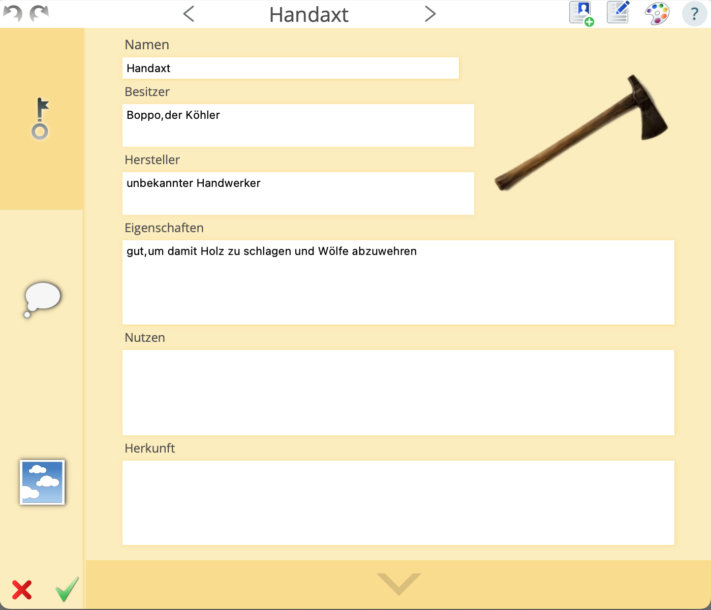
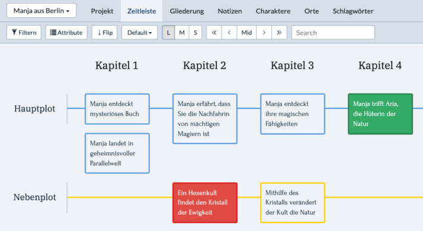
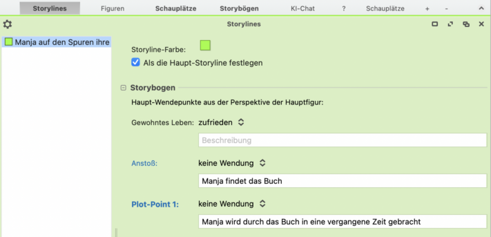

Написание книги - увлекательный, но в то же время сложный процесс для многих людей. От первоначальной идеи до готовой **рукописи** нужно преодолеть множество препятствий и сделать множество шагов. Сейчас, когда цифровые инструменты и программные решения играют все большую роль в **творческом процессе**, авторам крайне важно найти подходящее программное обеспечение для воплощения своих замыслов в жизнь. В этой статье мы рассмотрим **7 инструментов**, которые вы можете использовать для написания книги.

Написание книги требует времени и самоотверженности.

## Процесс написания: как написать книгу

[Процесс написания](https://de.wikipedia.org/wiki/Schreibprozess#Das_Schreibprozessmodell_von_Hayes) можно разделить на пять решающих фаз:

- Все начинается с **мозгового штурма**\- творческого акта, в ходе которого вы собираете мысли и находите вдохновение.
- После поиска идей наступает этап **исследования**. Здесь вы ищете необходимую информацию и источники, чтобы подкрепить свою книгу обоснованными фактами и аргументами.
- Как только вы соберете достаточно материала, на первый план выходит этап **структурирования**. Теперь цель состоит в том, чтобы упорядочить собранные идеи и разработать четкую центральную тему для вашей книги.
- Когда структура служит руководством к действию, начинается собственно **написание**. На этом этапе вы воплощаете свои идеи в слова и развиваете книгу дальше.
- Последний этап - **доработка**. На этом этапе книга тщательно проверяется, чтобы исправить ошибки, улучшить стиль написания и убедиться, что текст соответствует желаемому стандарту.

Процесс написания в 5 шагов

## Почему планирование имеет смысл при написании книги

Важность тщательного планирования не следует недооценивать при написании книги с программой. Разобравшись с фундаментальными вопросами, такими как **жанр**, **повествовательная перспектива**, **нарративные приемы**, **структура** и **цели** в самом начале, вы создадите прочную основу, которая будет направлять и структурировать ваш письменный проект.

Планирование выгодно не только с точки зрения содержания, но и с точки зрения организации. Написание книги — это сложный проект, который легче выполнить, если разбить его на **управляемые части** . Эта разбивка не только облегчает вам процесс написания, но и **помогает отслеживать весь** проект и лучше отслеживать **прогресс** .

Даже вымышленные истории часто требуют тщательного исследования, чтобы предоставить реалистичные детали.

## Важные факторы при написании книги

Даже для опытных писателей написание книги может быть сложной и ответственной задачей. Многочисленные факторы играют решающую роль в создании произведения, которое оставляет неизгладимое впечатление на читателя. В этом контексте важно учитывать следующие аспекты, которые могут существенно повлиять на процесс написания:

- **Участок:** Хорошо продуманный сюжет – основа любой истории. Ему нужен конфликт, который двигает сюжет вперед, чтобы обеспечить увлекательное чтение.
- **Цифра:** Персонажи должны развиваться по ходу сюжета, чтобы обеспечить читателям эмоциональную связь.
- **Стиль:** Стиль письма автора имеет решающее значение для атмосферы и воздействия книги. Повествовательные приемы должны достигать желаемых эффектов.
- **Рутина:** Оставаться на связи и постоянно работать над проектом важно для поддержания потока истории и обеспечения качества текста.
- **Обратная связь:** Обратная связь от профессиональных редакторов или бета-ридеров помогает выявить слабые места и в дальнейшем улучшить работу.

## Тестирование авторского программного обеспечения

В рамках приведенной ниже оценки семи выбранных инструментов для написания книг мы сравним ключевые критерии **удобства использования**, **набор функций**, **возможности настройки** и **стоимость** каждой программы.

### Автор папируса

Чтобы быстро освоить Papyrus, требуется время, чтобы понять весь спектр функций, так как программа предлагает множество функций для написания книг, которые обычно распределены по нескольким приложениям. Она позволяет не только управлять **персонажами**, **местами** и **объектами**, но и структурировать **сюжетные линии** и **результаты исследований**. Для визуализации взаимосвязей можно использовать **доску мышления** с шаблонами. Несмотря на устаревший дизайн, этот инструмент обладает множеством бонусных функций, таких как **поиск синонимов**, **анализ текста** и возможность выделять **дословную речь** .

**Простота использования:** посредственная  
**Диапазон функций:** очень высокий  
**Возможности настройки:** Высокая  
**Стоимость:** 199 евро

В Papyrus можно создавать подробные базы данных.

### Нотариус

Если вы хотите написать книгу с помощью Scrivener, вы можете выбрать между научно-популярной литературой, романом и сценарием в самом начале. Легко читаемый **каталог** позволяет авторам легко перемещаться между различными аспектами своего книжного проекта, такими как **рукопись**, **персонажи** и **места** . Специально для авторов, пишущих факты, которые предпочитают сосредоточенную рабочую среду и не нуждаются в визуальном вдохновении, Scrivener предлагает подходящее решение. Кроме того, программное обеспечение позволяет выбирать **различные форматы рукописей** и напрямую интегрировать **обложки книг**.

**Простота использования:** хорошая  
**Особенности:** высокий  
**Возможность настройки:** очень высокая  
**Стоимость:** 69,99 евро

Scrivener позволяет создавать четкие листы символов.

### Плоттр

Основной функцией Plottr является **составление расписания**, которое позволяет авторам планировать временную шкалу своих действий в четкой и интуитивно понятной форме. Это расписание можно разделить на несколько сюжетов и глав и пометить разными цветами. В дополнение к расписанию, Plottr также предлагает возможность захватывать **персонажей**, **местоположения** и другие важные заметки. Особенно полезны **шаблоны персонажей**, которые помогают сценаристам лучше понять их характеры. **Ключевые слова** также могут быть присвоены каждой категории, чтобы обеспечить эффективный поиск релевантной информации.

**Простота использования:** очень высокая  
**Диапазон функций:** очень высокий  
**Возможность настройки:** очень высокая  
**Стоимость:** $149 – $299

Plottr позволяет легко визуализировать сюжетные линии.

### ДрамаКоролева

Хотя программное обеспечение DramaQueen в первую очередь предназначено для **сценариев** и **книжных серий** , оно также подходит для различных других историй. Несмотря на то, что поначалу программа не особенно интуитивно понятна, авторы могут добиться хороших результатов при небольшом обучении и отличной **помощи** . Отличительной особенностью DramaQueen является возможность визуализации **сюжетных линий** . В результате, еще до написания своей книги авторы могут увидеть в программе, где **драматургия** их истории может иметь слабые места.

**Простота использования:** посредственная  
**Диапазон функций:** очень высокий  
**Кастомизация:** хорошая  
**Стоимость:** бесплатная базовая функция

С помощью DramaQueen вы можете узнать слабые стороны вашей драматургии.

### Лоскутный

Пэчворк предоставляет всестороннюю поддержку авторам с помощью многочисленных **примеров** и **предложений**. Программа позволяет захватывать **персонажей**, **места**, **объекты**, **временную шкалу** и многое другое. **Помощник по построению сюжета** также облегчает создание сюжета. Для авторов, которые хотят написать книгу вместе, программа предлагает возможность использования **командного аккаунта** . Полезным дополнением является прямая интеграция **орфографического пособия Duden**, которое можно приобрести отдельно.

**Простота использования:** высокая  
**Диапазон функций:** очень высокий  
**Возможности настройки:** Высокая  
**Стоимость:** 154 – 189 евро

### Кампер Про

Campfire Pro отличается простой конструкцией с **панелями** , которые обеспечивают четкий и удобный обзор. Панели индивидуально адаптируются и могут свободно перемещаться. В дополнение к обычным заметкам, здесь также может быть записана информация о **магии**, **культуре**, **религии** и даже **языках** или **философии** . Удобной функцией является прямая ссылка на **Unsplash**, которая позволяет легко вставлять изображения для вдохновения. В целом, Campfire предлагает обширную и понятную платформу, но в основном она предназначена для прямой публикации работ на этом сайте.

**Простота использования:** очень высокая  
**Диапазон функций:** очень высокий  
**Возможность настройки:** очень высокая  
**Стоимость:** частично бесплатно

### SeaTable

[График написания]() SeaTable чрезвычайно удобен для писателей, которые хотят развить сюжет перед написанием книги. Поскольку программа **бесплатна**, она отлично подходит для планирования книжных проектов. В дополнение к основному столу, где вы можете записать сюжет, SeaTable предлагает возможность более подробно проработать **персонажей**, **места**, символические элементы или **отношения** с другими **таблицами**. Этими таблицами можно свободно управлять и дополнять, при этом вы можете группировать и сортировать содержимое по своему усмотрению. Плагин «Временная шкала» также позволяет визуализировать действие на **временной шкале**. Дополнительным бонусом является плагин дизайна страниц, который позволяет создавать пользовательские **профили** для каждого персонажа.

**Простота использования:** очень высокая  
**Особенности:** высокий  
**Возможность настройки:** очень высокая  
**Стоимость:** бесплатно

## Заключение: как написать свою книгу

Представленные здесь программные средства для разработки предлагают множество функций и возможностей, которые помогут вам на каждом этапе процесса написания. В конечном счете, выбор правильного программного обеспечения зависит от ваших индивидуальных потребностей и предпочтений при написании книг. С помощью правильной программы вы сможете оптимизировать процесс написания и успешно реализовать свои творческие замыслы.

Если вы хотите использовать шаблон SeaTable для своего книжного проекта, просто [зарегистрируйтесь]() бесплатно, указав свой адрес электронной почты. Таким образом, вы можете начать свой личный [план написания всего]() за несколько минут.
