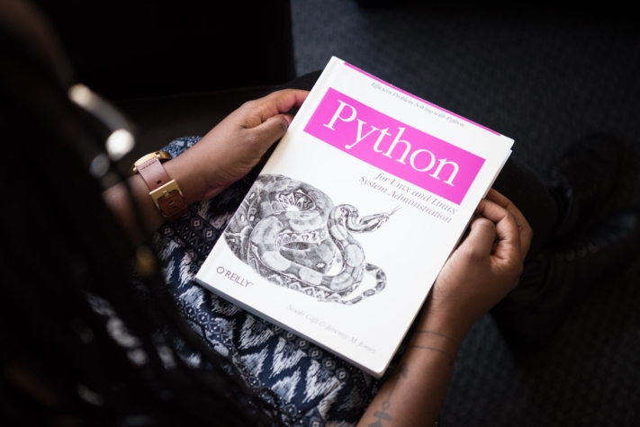
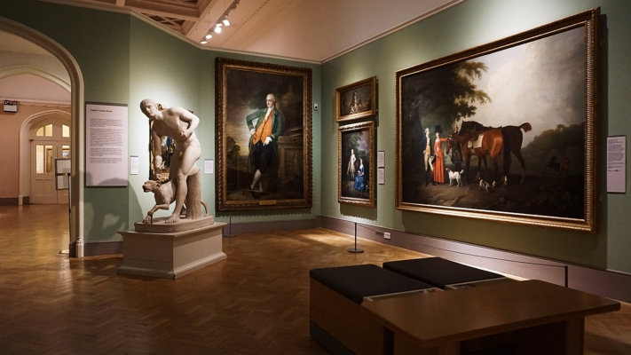
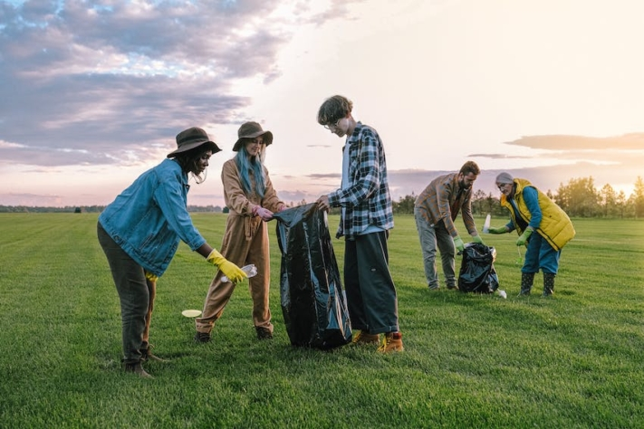

¿Siempre ha querido saltar en paracaídas desde un avión? ¿Sueña desde niño con bucear en la Gran Barrera de Coral de Australia? ¿O le gustaría pasar una noche en un iglú en Noruega? Anote estos destinos en su **lista de deseos**.

Nuestros **sueños y aspiraciones** son lo que nos impulsa e inspira a embarcarnos en aventuras inolvidables. Pero con demasiada frecuencia los posponemos o los descuidamos al vernos atrapados en la rutina diaria. Una lista de cosas que hacer antes de morir puede ayudarle a plasmar sus sueños y recordarle que debe hacerlos realidad. Al fin y al cabo, son las **experiencias las que enriquecen nuestras vidas** y nos llenan de recuerdos para toda la vida.

Emociones de aventura o naturaleza sobrecogedora: nuestros sueños son diferentes.

## De dónde viene la lista de cosas que hacer antes de morir

El término **bucket list** procede originalmente de la expresión inglesa "kick the bucket", que significa "estirar la pata". La bucket list -también conocida como lista de la cuchara- es, por tanto, **una lista de cosas que una persona quiere hacer antes de morir**.

Se hizo especialmente popular con la película de 2007 [The Bucket List](https://es.wikipedia.org/wiki/The_Bucket_List). La película cuenta la historia de dos hombres que crean juntos una lista de cosas que quieren experimentar antes de morir. Esta inspiradora historia ayudó a popularizar el concepto de lista de cosas que hacer antes de morir en todo el mundo y animó a muchas personas a registrar y perseguir sus propios sueños vitales.

## Ventajas de una lista de cosas que hacer antes de morir

Si aún no ha pensado en lo que quiere de la vida, una lista de cosas que hacer antes de morir puede ser un buen comienzo para **aclarar sus objetivos vitales**. Reflexionando sobre sí mismo y escribiendo sus objetivos, llegará a conocerse mejor e incluso es posible que encuentre su **propósito personal en la vida**.

No sólo se sentirá **más satisfecho** cuanto más marque en su lista, sino que con cada objetivo cumplido recibirá un **impulso de motivación** que le facilitará la consecución del siguiente. Leer periódicamente su lista y rememorarla también le hará **sentir bien**.

Lleve un registro de sus experiencias para poder recordarlas una y otra vez.

## Lo que no es importante en una lista de cosas que hacer antes de morir

Una lista de cosas que hacer antes de morir es algo más que una lista de objetivos: **representa los sueños personales de cada persona**. Cada lista es única y se adapta a los deseos y aspiraciones individuales. Se aplica lo siguiente: cada objetivo de la lista surge de un profundo deseo del corazón.

Si hace el esfuerzo de crear una lista de objetivos, también debería echarle un vistazo de vez en cuando. Si la revisa **con regularidad**, no sólo podrá ver qué objetivos ha alcanzado ya, sino también cómo han cambiado sus prioridades con el tiempo. Además, puede ser motivador ver los **progresos** que ya ha hecho.

Para algunos, pensar en cosas pendientes puede causar estrés y presión, pero ese no es el objetivo de la lista. Una lista de cosas que hacer antes de morir debe ser **divertida** y **motivadora**, no agobiante. Es importante recordar que una lista de cosas que hacer antes de morir no es una carrera que hay que ganar. La vida es un largo viaje y la lista debe acompañarle durante muchos años. Aunque al final le queden algunas cosas por completar, se trata de celebrar todas las experiencias maravillosas que ha vivido a lo largo del camino.

Lo más importante en la vida es saborear al máximo los bellos momentos.

## Cómo encontrar inspiración para su lista de cosas que hacer antes de morir

A menudo resulta difícil imaginar qué experiencias inolvidables nos gustaría vivir. Pero con las preguntas y los enfoques adecuados, la inspiración puede fluir. ¿Qué [destinos de viaje]() tiene en su lista de deseos? ¿Hay algún **sueño largamente acariciado de su** infancia que le gustaría hacer realidad? ¿Qué haría si supiera que hoy es su **último** día?

Además, **hablar** con personas importantes, navegar por **las redes sociales** o leer **libros** inspiradores puede aportar más ideas. Sin embargo, es importante que no se deje influir demasiado por los sueños de los demás. Céntrese en sus propios sueños y objetivos para crear una auténtica lista de cosas que hacer antes de morir.

## Ideas para su lista de cosas que hacer antes de morir

Si le faltan ideas, aquí también puede encontrar inspiración: desde **lugares** a los que le gustaría viajar, **aventuras** y **experiencias culturales** hasta **destinos de salud** y **compromiso social**. Las posibilidades son infinitas.

### Lugares

- Vea las pirámides de Guiza con sus propios ojos
- Caminando por las ruinas de Machu Picchu en Perú
- Visitar el Taj Mahal en la India
- De pie frente al Gran Cañón en Arizona
- Escuchar las cataratas de Iguazú en Brasil y Argentina
- Caminando por la Gran Muralla China, cerca de Pekín
- Tomar el sol en la playa de Copacabana en Río
- Hágase un selfie con la Torre Inclinada de Pisa
- Admirar la aurora boreal en Islandia

Las auroras boreales son un impresionante juego de colores en el cielo.

### Aventura

- Puenting desde el puente Europabrücke de Innsbruck
- Paracaidismo desde un avión
- Bucear con tiburones
- Escalada al Mont Blanc
- Paseo en globo
- Ir de safari por África
- Sobrevivir a un descenso de aguas bravas
- Trabajar en el extranjero

Algunas personas buscan adrenalina y emociones.

### Salud

- Integrar las técnicas de meditación en la vida cotidiana
- [Pase un fin de semana sin smartphone]()
- Cambie su [dieta]()
- Participar en un retiro de yoga
- Aprender judo
- Reserve unas vacaciones relajantes
- Completar un maratón

Si busca un reto deportivo, puede elegir un maratón como objetivo.

### Educación

- Aprender un nuevo idioma
- Asistir a un curso de retórica
- Viaje lingüístico
- Completar un semestre en el extranjero
- Aprender a tocar un instrumento musical
- [Escribir un libro]()
- Participar en un curso de fotografía
- [Aprender a programar]()

Python es un lenguaje de programación.

### Cultura

- Celebre el Día de San Patricio en Irlanda
- Ver un musical en Broadway
- Hacer un curso de baile
- Asistir a un certamen científico
- Viva el Día de los Muertos en México
- Ver todas las películas de "El Señor de los Anillos" de un tirón
- Celebrar el Carnaval en Río de Janeiro

Ya sea arte, música, literatura o tradiciones, la cultura es diversa.

### Delicias culinarias

- Comer sushi en Japón
- Participar en un curso de cocina en Italia
- Comer en un restaurante con estrella Michelin
- Pruebe el chile más picante del mundo
- [Crear un huerto]()
- Comer macarons en París
- Recoger setas en el bosque
- Beber champán

La comida también puede ser una experiencia.

### Compromiso social

- Comprar un trozo de selva tropical
- Ayudar en un comedor social
- Comer con un sin techo
- Donar sangre
- Plantar árboles
- Asumir un patrocinio
- [Adopte un perro de una protectora de animales]()
- Recoger basura en la naturaleza

Hacer el bien es un objetivo que no sólo enriquece la vida de quienes le rodean.

### Relaciones

- Disfrute de una cena a la luz de las velas
- Escribir una carta de amor
- Besarse bajo el muérdago
- [Recorrer juntos el mundo]() en furgoneta
- Asistir juntos a una clase de baile
- Mudarse a un piso compartido
- [Casarse]() en la playa
- [Conseguir niños]()

Sus objetivos también pueden centrarse en las relaciones interpersonales.

## Plantilla en línea en SeaTable

Para no perder de vista los objetivos de su lista de cosas que hacer antes de morir, es aconsejable escribirlos y guardarlos en un lugar de fácil acceso. SeaTable le ofrece una [plantilla online]() gratuita que le permite tener a mano su lista de cosas que hacer antes de morir y organizar sus objetivos en distintas categorías.



Además, puede registrar qué amigos y familiares comparten determinados intereses y le acompañarían en sus aventuras. También puede guardar información adicional como fotos, enlaces o direcciones directamente en su lista de cosas que hacer antes de morir para reunir todos los detalles relevantes en un solo lugar.

Marque un objetivo tras otro de su lista de deseos, añada nuevas ideas de forma flexible o elimine deseos que ya no son importantes para usted. Puede registrarse [gratis]() en SeaTable y personalizar la plantilla online para adaptarla a sus necesidades.
