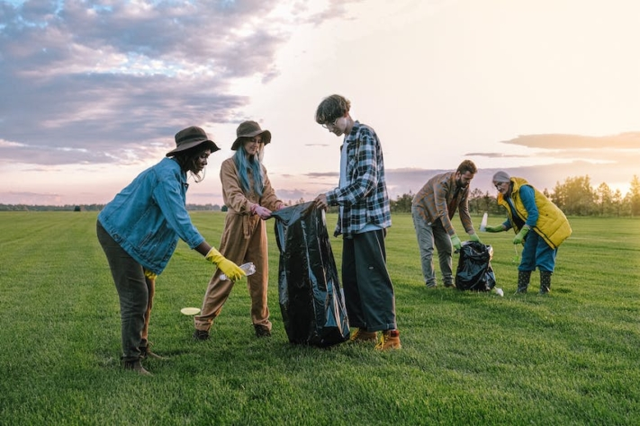

Vous avez toujours voulu faire un saut en parachute depuis un avion ? Vous rêvez depuis votre enfance de faire de la plongée sur la Grande Barrière de Corail en Australie ? Ou vous aimeriez passer une nuit dans un igloo en Norvège ? Alors inscrivez ces destinations sur votre bucket list !

Ce sont nos rêves et nos envies qui nous poussent et nous inspirent des aventures inoubliables. Mais trop souvent, ils sont remis à plus tard ou négligés alors que nous nous laissons aller au train-train quotidien. Une bucket list peut vous aider à garder une trace de vos rêves et à vous rappeler de les réaliser. Car en fin de compte, ce sont les expériences qui enrichissent notre vie et nous remplissent de souvenirs qui durent toute une vie.

Qu'il s'agisse de sensations fortes ou de nature à couper le souffle, nos rêves sont différents.

## D'où vient la bucket list

Le terme **"bucket list** " vient à l'origine de l'expression anglaise "kick the bucket", qui signifie par analogie "laisser tomber la cuillère". La bucket list - également appelée liste de cuillères - désigne donc **une liste de choses qu'une personne souhaite faire avant de mourir**.

Elle a notamment été popularisée par le film "[The Bucket List](https://de.wikipedia.org/wiki/Das_Beste_kommt_zum_Schluss)", sorti en 2007. Le film raconte l'histoire de deux hommes qui établissent ensemble une liste de choses qu'ils souhaitent vivre avant leur mort. Cette histoire inspirante a contribué à faire connaître la bucket list en tant que concept dans le monde entier et a encouragé de nombreuses personnes à consigner et à poursuivre leurs propres rêves de vie.

## Avantages d'une bucket list

Si vous n'avez pas encore réfléchi à ce que vous attendez de la vie, une bucket list pourrait être un bon début pour obtenir **des précisions sur vos objectifs de vie**. En réfléchissant sur vous-même et en écrivant vos objectifs, **vous apprendrez à mieux vous connaître** et trouverez peut-être même le **sens de votre vie personnelle**.

Non seulement vous serez plus satisfait(e) à mesure que vous cocherez les cases de votre liste, mais chaque objectif terminé vous donnera également un **coup de pouce pour vous motiver** à atteindre votre prochain objectif. En outre, le fait de relire régulièrement votre liste et de vous remémorer vos souvenirs vous procurera un **sentiment de bien-être**.

Consignez vos expériences afin de pouvoir vous en souvenir à tout moment.

## Ce qui est (ou n'est pas) important dans une bucket list

Une bucket list est plus qu'une simple liste d'objectifs - elle incarne les rêves de vie personnels de chacun. Chaque liste est **unique** et adaptée aux souhaits et aux aspirations de chacun. Le principe est le suivant : chaque objectif qui y est inscrit est issu d'un désir profond du cœur - il n'est pas souhaitable de copier ou d'imiter.

Si vous vous donnez la peine d'établir une bucket list, vous devriez aussi y jeter un coup d'œil de temps en temps. En **révisant régulièrement** votre liste, vous pouvez non seulement voir quels objectifs vous avez déjà atteints, mais aussi comment vos priorités ont évolué au fil du temps. En outre, il peut être motivant de voir les progrès que vous avez déjà réalisés.

Pour certains, la pensée de points inachevés peut être source de stress et de pression - mais ce n'est pas le but de la liste. Une bucket list doit être **amusante** et vous **motiver**, pas vous peser. Il est important de se rappeler qu'une bucket list n'est pas une course à gagner. La vie est un long chemin et la liste doit vous accompagner pendant de nombreuses années. Même s'il reste quelques points en suspens à la fin, il s'agit de célébrer toutes les merveilleuses expériences que vous avez vécues en cours de route.

Le plus important dans la vie, c'est de profiter pleinement des bons moments.

## Comment trouver l'inspiration pour votre bucket list

C'est souvent un défi d'imaginer les expériences inoubliables que l'on souhaite encore vivre. Mais avec les bonnes questions et les bonnes approches, l'inspiration peut couler à flot. Quelles sont donc les **destinations** qui figurent sur votre liste de souhaits ? Y a-t-il un **rêve d'enfance** que vous avez longtemps **caressé** et que vous aimeriez encore réaliser ? Ou que feriez-vous si vous saviez qu'aujourd'hui est votre **dernier jour**?

En outre, **parler** avec des personnes importantes, parcourir les **médias sociaux** ou lire des **livres** inspirants peuvent fournir des idées supplémentaires. Il est toutefois important de ne pas trop vous laisser influencer par les rêves des autres. Concentrez-vous sur vos propres rêves et objectifs afin de créer une bucket list authentique.

## Des idées pour votre bucket list

Si vous n'avez guère d'idées, vous pouvez également vous inspirer ici : des **lieux** à visiter aux destinations **santé** et à l'**engagement social**, en passant par l'**aventure** et les **expériences culturelles**. Les possibilités sont infinies.

### Lieux

- Voir les pyramides de Gizeh de ses propres yeux
- Marcher dans les ruines du Machu Picchu au Pérou
- Visiter le Taj Mahal en Inde
- Se tenir devant le Grand Canyon en Arizona
- Écouter les chutes d'Iguazú au Brésil et en Argentine
- Marcher sur la Grande Muraille de Chine près de Pékin
- Se faire bronzer sur la plage de Copacabana à Rio
- Prendre un selfie avec la tour penchée de Pise
- Admirer les aurores boréales en Islande

Les aurores boréales sont un jeu de couleurs impressionnant dans le ciel.

### Aventure

- Saut à l'élastique depuis le pont de l'Europe à Innsbruck
- Sauter en parachute depuis un avion
- Plongée avec les requins
- Escalader le Mont Blanc
- Faire un tour en montgolfière
- Faire un safari en Afrique
- Survivre à une descente de rafting en eaux vives
- Travailler à l'étranger

Certaines personnes sont à la recherche d'adrénaline et de sensations fortes.

### Santé

- Intégrer les techniques de méditation dans la vie quotidienne
- Passer un week-end sans smartphone
- Modifier son alimentation
- Participer à une retraite de yoga
- Apprendre le judo
- Réserver un séjour de détente
- Faire un marathon

Ceux qui recherchent un défi sportif peuvent choisir un marathon comme objectif.

### Éducation

- Apprendre une nouvelle langue
- Suivre un cours de rhétorique
- Faire un séjour linguistique
- Effectuer un semestre à l'étranger
- Apprendre à jouer d'un instrument de musique
- Écrire un livre
- Participer à un cours de photographie
- Apprendre à programmer

Python est un langage de programmation.

### Culture

- Fêter la Saint-Patrick en Irlande
- Voir une comédie musicale à Broadway
- Prendre un cours de danse
- Assister à un slam scientifique
- Vivre le jour des morts au Mexique
- Voir tous les films "Le Seigneur des Anneaux" en une seule fois
- Fêter le carnaval à Rio de Janeiro

Qu'il s'agisse d'art, de musique, de littérature ou de traditions, la culture est multiple.

### Culinaire

- Manger des sushis au Japon
- Participer à un cours de cuisine en Italie
- Manger dans un restaurant étoilé
- Goûter le piment le plus fort du monde
- Créer un potager
- Manger des macarons à Paris
- Cueillir des champignons dans la forêt
- Boire du champagne

Manger peut aussi être une expérience.

### Engagement social

- Acheter un morceau de forêt tropicale
- Donner un coup de main dans une soupe populaire
- Dîner avec un sans-abri
- Donner son sang
- Planter des arbres
- Parrainer un enfant
- Adopter un chien dans un refuge
- Ramasser les déchets dans la nature

Faire le bien est un objectif qui n'enrichit pas seulement la vie de votre entourage.

### Relations

- Profiter d'un dîner aux chandelles
- Écrire une lettre d'amour
- S'embrasser sous le gui
- Faire le tour du monde ensemble dans un van
- Prendre un cours de danse ensemble
- S'installer dans un logement commun
- Se marier sur la plage
- Avoir des enfants

Vos objectifs peuvent également se concentrer sur les relations interpersonnelles.

## Modèle en ligne dans SeaTable

Pour être sûr de ne pas perdre de vue les objectifs de votre bucket list, il est conseillé de les mettre par écrit et de les conserver dans un endroit facilement accessible. SeaTable vous propose un [modèle](https://seatable.io/fr/modele/jbn_a4wysewcfd9eegkgha/) gratuit [en ligne](https://seatable.io/fr/modele/jbn_a4wysewcfd9eegkgha/) qui vous permet d'avoir toujours votre bucket list à portée de main et de classer vos objectifs de manière structurée en différentes catégories.

En outre, vous pouvez noter quels amis et membres de la famille partagent certains intérêts et seraient prêts à vous accompagner dans vos aventures. Vous pouvez également enregistrer des informations supplémentaires telles que des images, des liens ou des adresses directement dans votre bucket list afin de rassembler tous les détails pertinents en un seul endroit.

Cochez objectif par objectif de votre bucket list, ajoutez de nouvelles idées en toute flexibilité ou supprimez les souhaits qui ne sont plus importants pour vous. Sur SeaTable, vous pouvez [vous inscrire gratuitement](https://seatable.io/fr/enregistrement/) et adapter le [modèle en ligne](https://seatable.io/fr/modele/jbn_a4wysewcfd9eegkgha/) à vos besoins.
