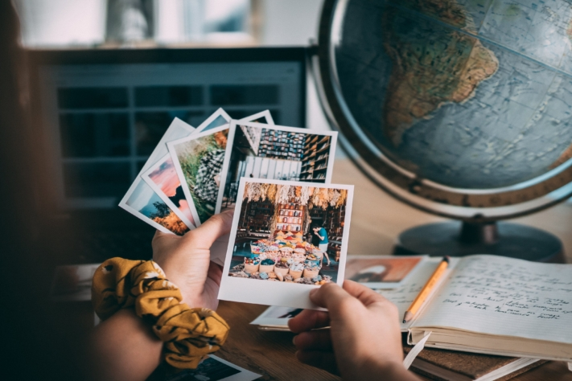
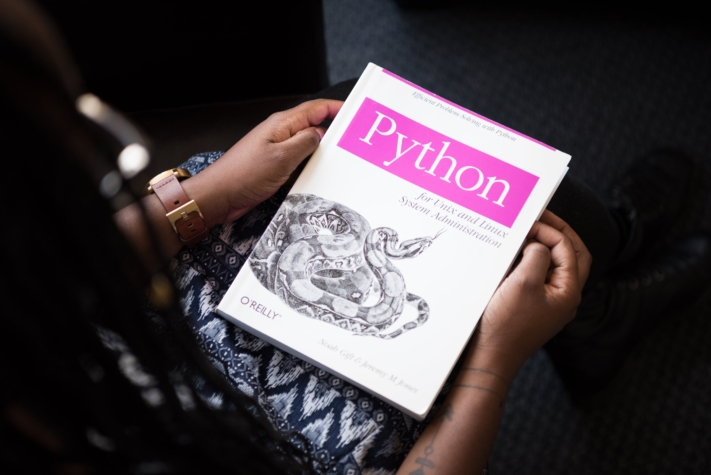

Вы всегда хотели попробовать прыгнуть с парашютом с самолета? Вы с детства мечтали заняться дайвингом на Большом Барьерном рифе в Австралии? Или вы хотели бы провести ночь в иглу в Норвегии? Тогда внесите эти направления в свой список желаний!

Наши мечты и стремления - это то, что движет нами и вдохновляет нас на незабываемые приключения. Но слишком часто они откладываются или игнорируются, когда мы погружаемся в повседневную рутину. Список желаний поможет вам запечатлеть свои мечты и напомнить о необходимости их осуществления. В конце концов, именно опыт обогащает нашу жизнь и наполняет ее воспоминаниями, которые остаются на всю жизнь.

Приключения или захватывающая дух природа - наши мечты разные.

## Откуда взялся список ведер

Термин **bucket list** первоначально произошел от английского выражения "kick the bucket", что означает "пнуть ведро". Таким образом, bucket list - также известный как "список ложек" - это **список вещей, которые человек хочет сделать до своей смерти**.

Особую популярность ему принес фильм 2007 года["Список ведер](https://de.wikipedia.org/wiki/Das_Beste_kommt_zum_Schluss)". В фильме рассказывается история двух мужчин, которые вместе составляют список вещей, которые они хотят испытать перед смертью. Эта вдохновляющая история помогла популяризировать "список ведер" как концепцию во всем мире и побудила многих людей записывать и реализовывать свои собственные жизненные мечты.

## Преимущества "списка ведра

Если вы еще не задумывались о том, чего хотите от жизни, список желаний может стать хорошим началом для того, чтобы **прояснить свои жизненные цели**. Размышляя о себе и записывая свои цели, вы **лучше узнаете себя** и, возможно, даже найдете свою **личную цель в жизни**.

Вы не только будете испытывать большее удовлетворение, чем больше галочек в вашем списке - с каждой выполненной целью вы также получите заряд **мотивации**, который облегчит вам достижение следующей цели. Регулярное перечитывание своего списка и воспоминания о нем также подарят вам **хорошее настроение**.

Записывайте свои впечатления, чтобы потом вспоминать их снова и снова.

## Что является (не является) важным для списка ведра

Список желаний - это не просто перечень целей, а воплощение личных жизненных мечтаний каждого человека. Каждый список **уникален** и составлен с учетом индивидуальных желаний и стремлений. Главное, чтобы каждая цель в нем исходила из глубокого желания сердца - копирование или подражание здесь нежелательны.

Если вы приложили усилия к составлению списка, вам также следует время от времени заглядывать в него. **Регулярно** просматривая свой список, вы сможете не только увидеть, какие цели вы уже достигли, но и то, как изменились ваши приоритеты с течением времени. Кроме того, это может быть мотивирующим фактором - видеть, какого прогресса вы уже добились.

Для некоторых мысль о незавершенных делах может стать причиной стресса и давления - но это не цель списка. Список должен приносить **удовольствие** и **мотивировать** вас, а не тяготить. Важно помнить, что список - это не гонка, в которой нужно победить. Жизнь - это долгое путешествие, и список должен сопровождать вас на протяжении многих лет. Даже если в итоге вам останется выполнить несколько пунктов, главное - отпраздновать все чудесные события, которые вы пережили на этом пути.

Самое главное в жизни - это наслаждаться прекрасными моментами в полной мере.

## Как найти вдохновение для своего списка желаний

Часто бывает трудно представить, какие незабываемые впечатления вы хотели бы получить. Но при правильных вопросах и подходах вдохновение не заставит себя ждать. Какие **направления путешествий** входят в список ваших желаний? Есть ли у вас **давняя мечта из детства**, которую вы хотели бы осуществить? Или что бы вы сделали, если бы знали, что сегодня ваш **последний день**?

Кроме того, **разговоры** с важными людьми, посещение **социальных сетей** или чтение вдохновляющих **книг** могут дать дополнительные идеи. Однако важно не позволять себе слишком сильно зависеть от чужих мечтаний. Сосредоточьтесь на своих собственных мечтах и целях, чтобы создать подлинный список желаний.

## Идеи для вашего списка ведра

Если вам не хватает идей, вы также можете найти здесь вдохновение: от **мест, куда** вы хотели бы отправиться, **приключений** и **культурных впечатлений** до **направлений для здоровья** и **социальных обязательств**. Возможности безграничны.

### Места

- Увидеть пирамиды Гизы своими глазами
- Прогулка по руинам Мачу-Пикчу в Перу
- Посетите Тадж-Махал в Индии
- Стоя перед Большим каньоном в Аризоне
- Послушайте водопады Игуасу в Бразилии и Аргентине
- Прогулка по Великой китайской стене в окрестностях Пекина
- Загорайте на пляже Копакабана в Рио
- Сделайте селфи с Пизанской башней
- Полюбуйтесь северным сиянием в Исландии

Северное сияние - это впечатляющая игра красок в небе.

### Приключения

- Прыжок с тарзанки с моста Европабрюкке в Инсбруке
- Прыжок с парашютом с самолета
- Дайвинг с акулами
- Восхождение на Монблан
- Полет на воздушном шаре
- Отправляйтесь на сафари в Африку
- Выжить во время рафтинга
- Работа за границей

Некоторые люди ищут адреналина и острых ощущений.

### Здоровье

- Интеграция техник медитации в повседневную жизнь
- Проведите выходные без смартфона
- Измените свой рацион
- Примите участие в йога-ретрите
- Учитесь дзюдо
- Забронируйте расслабляющий отдых
- Завершить марафон

Если вам нужен спортивный вызов, вы можете выбрать марафон в качестве своей цели.

### Образование

- Выучите новый язык
- Посещайте курсы риторики
- Отправляйтесь в языковое путешествие
- Пройти семестр за границей
- Научитесь играть на музыкальном инструменте
- Написание книги
- Пройдите курс обучения фотографии
- Научитесь программировать

Python - это язык программирования.

### Культура

- Отпразднуйте День святого Патрика в Ирландии
- Посмотрите мюзикл на Бродвее
- Занимайтесь танцами
- Посетите научный слэм
- Празднование Дня мертвых в Мексике
- Смотрите все фильмы "Властелина колец" одним махом
- Отпразднуйте карнавал в Рио-де-Жанейро

Будь то искусство, музыка, литература или традиции - культура многообразна.

### Кулинарные изыски

- Едим суши в Японии
- Пройдите кулинарный курс в Италии
- Поешьте в ресторане, отмеченном звездой Мишлен
- Попробуйте самый острый чили в мире
- Создайте огород
- Ешьте macarons в Париже
- Сбор грибов в лесу
- Пейте шампанское

Еда также может быть опытом.

### Социальные обязательства

- Покупка кусочка тропического леса
- Помощь в столовой
- Поесть с бездомным
- Сдайте кровь
- Посадите деревья
- Возьмите на себя спонсорство
- Усыновите собаку из приюта для животных
- Сбор мусора на природе

Творить добро - это цель, которая не только обогащает жизнь окружающих.

### Отношения

- Насладитесь ужином при свечах
- Написание любовного письма
- Поцелуи под омелой
- Путешествуем по миру вместе в фургоне
- Занимайтесь танцами вместе
- Переезд в общую квартиру
- Поженитесь на пляже
- Получить детей

Ваши цели также могут быть направлены на межличностные отношения.

## Онлайн-шаблон в SeaTable

Чтобы не потерять из виду цели из вашего списка, рекомендуется записать их и хранить в легкодоступном месте. SeaTable предлагает вам бесплатный [онлайн-шаблон](), который позволит вам держать список под рукой и распределять цели по различным категориям.

Кроме того, вы можете записать, какие друзья и члены семьи разделяют определенные интересы и могли бы сопровождать вас в ваших приключениях. Вы также можете сохранять дополнительную информацию, например фотографии, ссылки или адреса, прямо в списке, чтобы собрать все необходимые сведения в одном месте.

Отмечайте одну цель за другой в своем списке, гибко добавляйте новые идеи или удаляйте желания, которые больше не имеют для вас значения. Вы можете [бесплатно]() зарегистрироваться в SeaTable и настроить [онлайн-шаблон]() под свои нужды.
