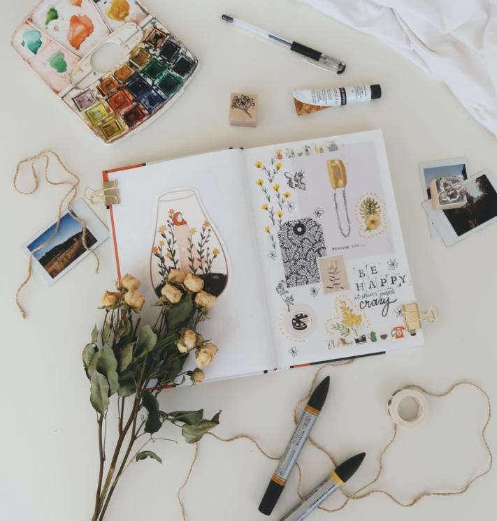

In often stressful everyday life, it is difficult to reconcile tasks, appointments and your own interests. To make sure you don't lose sight of the things that are really important to you in life in the daily pile of monotonous routines, it helps to write them down. A **bullet journal** is ideal for this, in which you can record everything important and give free rein to your creativity.

Find out how a bullet journal works and what you need to know to design a bullet journal according to your wishes in this article.

## What is a bullet journal?

A bullet journal helps you to organize your **Organize everyday life** and keep track of all your tasks, appointments and needs. The journal functions as a combination of diary, project planner and notebook. It also offers enough space to accommodate your individual topic preferences. The bullet journal sets your **Creativity** no limits. Because unlike conventional calendars, there are no ready-made pages. You design them yourself and fill them according to your own ideas.

Design your bullet journal according to your wishes.

Your bullet journal grows with every new entry. As soon as all the pages are filled, start a new book.

## The story behind the concept

This calendar method was invented by New York graphic designer Ryder Carroll. Born in Austria, he developed a system for himself to plan tasks better and carry out projects in a targeted manner.

**His idea:** a journal without guidelines and space problems. Carroll published his bullet journal in 2013. Many enthusiastic bullet journalers built on his practical foundation and developed their own creative content. Today, there is a large community that shares its ideas on social media and blogs.

## The right starter pack

Getting started with bullet journaling is very easy. All you need is a **Notebook** and a **Pen**. It is a good idea to start with what you have at home. You can try out whether you like journaling. If you like it and want to get creative, you can buy more tools.

Everything around you can be used for design.

Notebooks with **a dot grid** serve as a basis, as this offers a certain freedom when writing and drawing compared to conventional lines or boxes. If you want to design your pages in an original way, there are some extra materials that you might like. These include highlighters, fineliners, brush pens or even washi tape and stickers. If you're not sure which supplies to buy, there are also ready-made [sets](https://www.faber-castell.de/produkte/BulletJournalingStarterSet9teilig/267125) available.

## The structure of your bullet journal

As mentioned above, the focus is on the realization of your own ideas. However, there is a **basic system** that you can use as a guide for the structure of your journal.

This consists primarily of **time overviews**in which you can enter your tasks and appointments. There are also **Collections**. These are pages that serve your free and individual development. Below you will find a collection of ideas that you can adopt or be inspired by.

Design your journal according to this template.

### The basic system

The basic structure of your bullet journal consists of three parts. The **index** serves as a table of contents so that you can find your entries more quickly. To ensure that you are always up to date, you should update the index regularly.

This is followed by the **key**. This is a kind of legend. The symbols and their meaning are recorded there. This technique is called **rapid logging**.



- Hyphen = Notes
- Point = task
- Paint over the dot with a cross = task is completed
- Point with arrow pointing to the right = task shifted
- Cross out point = task is omitted
- Circle = date
- Color in circle = appointment over
- Special characters = emphasize important things additionally



The **calendar views** follow in the third part. Start with the **Future Log**, the annual plan in which you record major and important events.

Based on this, you then create a **monthly log**. This contains all important appointments in the corresponding month at a glance. There is space here to enter your appointments and tasks that are not part of your daily routine.

The **Daily Log** goes into even more detail. This is created on a weekly basis and offers the option of flexibly entering daily events.



### The Collections

This is where it gets creative! There are hundreds of templates on the Internet for filling your bullet journal with content. Let our **ideas** inspire you and adapt them to your own ideas or get inventive yourself.

Many ideas can be implemented in **lists**. The important thing is that you list things that you like and that you don't want to forget. Classic examples are the bucket list, the to-do list or the wish list. You can also record your interests in this way. Make a list of your favorite films or create an overview of books you still want to read.

**Trackers** are probably the best-known addition to the bullet journal. They help to document regular tasks. There are different types of trackers:

- **Habit Tracker**: Establish new habits and get rid of bad habits. You can find a detailed article on this [here](https://seatable.io/en/habit-tracker-gewohnheiten-aendern/).
- **Mood Tracker**: Record how your mood changes over a longer period of time.
- **Sleep Tracker**: Monitor your sleep times and how well you slept.
- **Water Tracker**: Make sure you drink enough water every day to stay healthy.

Another way to put your plans into action is to set **goals**. In conjunction with trackers, you can make your goals measurable and view your progress at any time. Possible goals include, for example, New Year's resolutions such as a savings target or improving your grades.

A habit tracker is a popular addition to the bullet journal.

## Why a bullet journal is worthwhile

There are many good reasons to try out bullet journaling for yourself. You can find some of them here:

### Clever organization

For most people, the main reason to start journaling is the **organizational help**. Because the combination of calendar and planner means that important appointments are no longer lost. In addition, a bullet journal helps you to write down topics that you want to tackle and thus **manifest** them. The key and index make it easier to find and work on your tasks.

### Versatile in use

Your ideas - your bullet journal. It adapts to your **needs** and doesn't have to follow a set pattern. You can use it to organize your daily appointments and tasks. The integrated tools, such as the calendar or the to-do list, are suitable for this. At the same time, you can also get creative and let your imagination run wild in the collections.

Combine functionality with creativity.

### Documenting changes

By writing things down in a bullet journal, you can check at any time what you have done and when, and whether you are **getting closer to** your **goals**. Draw conclusions from your **behavior** and try to make your everyday life even more effective and stress-free. The bullet journal is a **living system** and changes with you. Try out new things in the collections and sort them out if you no longer like certain topics.

"If the journey is the destination, then we need to learn to travel better."

### Improve quality of life

For the inventor, Ryder Carroll, it is important that the bullet journal improves your life. There is no right or wrong when it comes to enjoying life in the here and now. Part of this is that journaling offers you a **break from everyday stress** and allows you to reflect on your life. Creative writing can have a **meditative effect** for some. In addition, a lot of work goes into your bullet journal. It's something self-made, which increases its emotional value and makes it easier to stay on the ball.

## Template for your digital bullet journal

An alternative to the analog notebook is a **digital bullet journal**. SeaTable offers you a simple and effective solution for designing your calendars, lists and trackers digitally and restructuring them flexibly with just a few clicks. Customize the [free template](https://seatable.io/en/vorlage/petkiwi1stmm_1lh2xlejq/) to your needs and add your own ideas. A habit tracker is integrated into the bullet journal, which is a practical addition to your journal. Work with colors, symbols and images to customize your journal.

If you would like to use SeaTable for your bullet journal, simply [register]() for free. You can find the corresponding template with lots of inspiration and sample entries [here](https://seatable.io/en/vorlage/petkiwi1stmm_1lh2xlejq/).
