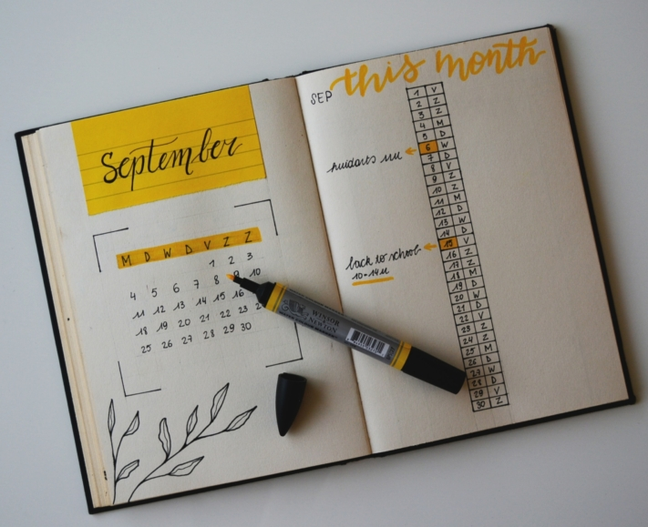
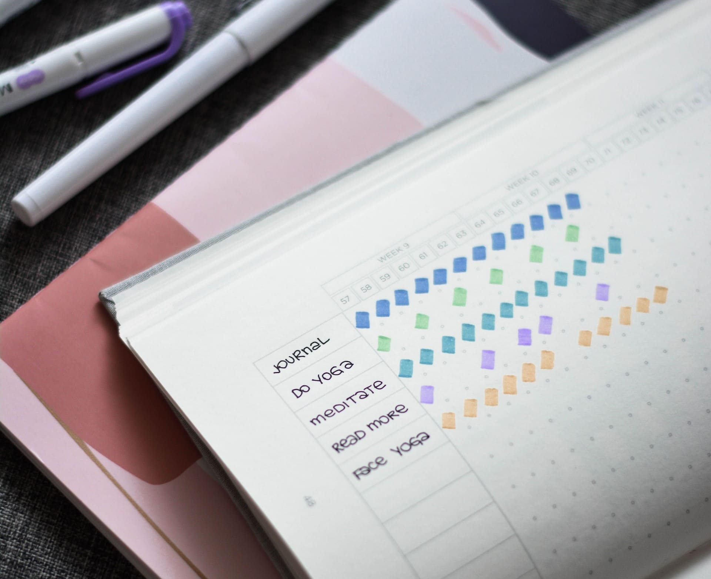

Dans un quotidien souvent stressant, il est difficile de concilier les tâches, les rendez-vous et ses propres intérêts. Pour ne pas perdre de vue les choses qui sont vraiment importantes pour vous dans la vie, il est utile de les noter dans le tas de processus monotones quotidiens. Pour cela, un **Bullet Journal** est idéal, dans lequel vous pouvez noter tout ce qui est important et laisser libre cours à votre créativité.

Découvrez dans cet article comment fonctionne un Bullet Journal et ce que vous devez savoir pour créer un Bullet Journal selon vos souhaits.

## Qu'est-ce qu'un Bullet Journal ?

Un Bullet Journal vous aide à **Organiser le quotidien** et de garder un œil sur toutes vos tâches, vos rendez-vous et vos besoins. Le journal fonctionne comme une combinaison d'agenda, de planificateur de projets et de carnet de notes. Il offre en outre suffisamment d'espace libre pour que vos souhaits individuels en matière de thèmes y trouvent leur place. Le Bullet Journal met en valeur votre **Créativité** n'a pas de limites. En effet, contrairement aux calendriers traditionnels, il n'y a pas de pages prédéfinies. Celles-ci doivent être conçues par vos soins et remplies selon vos idées.

Créez votre Bullet Journal comme vous le souhaitez.

Votre Bullet Journal s'agrandit à chaque nouvelle entrée. Dès que toutes les pages sont remplies, vous commencez un nouveau livre.

## L'histoire derrière le concept

Cette méthode de calendrier a été inventée par le graphiste new-yorkais Ryder Carroll. Cet Autrichien d'origine a développé pour lui-même un système permettant de mieux planifier les tâches et de réaliser des projets de manière ciblée.

**Son idée :** un journal sans directives ni problèmes de place. En 2013, Carroll a publié son Bullet Journal. De nombreux Bullet Journalers enthousiastes se sont basés sur sa base pratique et ont développé leurs propres contenus créatifs. Aujourd'hui, il existe une grande communauté qui partage ses idées sur les médias sociaux et les blogs.

## Le bon kit de démarrage

Commencer à faire du Bullet Journaling est très simple. Il suffit d'avoir un **Carnet de notes** et un **Stylo**. Il est intéressant de commencer avec ce que vous avez chez vous. Vous pouvez essayer de voir si le journaling vous convient. Si cela vous plaît et que vous souhaitez développer votre créativité, vous pouvez acheter d'autres ustensiles.

Tout ce qui vous entoure peut être utilisé pour créer.

Les carnets de notes avec une **grille de points** servent de base, car elle offre une certaine liberté d'écriture et de dessin par rapport aux lignes ou aux cases traditionnelles. Si vous souhaitez décorer vos pages de manière originale, il existe quelques matériaux supplémentaires qui pourraient vous plaire. Il s'agit par exemple des surligneurs, des fineliners, des brushpens ou encore du washi tape et des autocollants. Si vous n'êtes pas sûr des ustensiles à acheter, il existe également des [kits](https://www.faber-castell.de/produkte/BulletJournalingStarterSet9teilig/267125) préétablis.

## La structure de votre Bullet Journal

Comme mentionné plus haut, la réalisation de vos propres idées est au premier plan. Il existe toutefois un **système de base** dont vous pouvez vous inspirer pour la structure de votre journal.

Celui-ci se compose en premier lieu **des aperçus temporels**Vous pouvez y inscrire vos tâches et vos rendez-vous. En outre, il existe **Collections**. Ce sont des pages qui servent à votre épanouissement libre et individuel. Pour cela, vous trouverez ci-dessous une collection d'idées que vous pouvez reprendre ou dont vous pouvez vous inspirer.

Créez votre journal en suivant ce modèle.

### Le système de base

La structure de base de votre Bullet Journal se compose de trois parties. L'**index** sert de table des matières pour que vous puissiez trouver vos entrées plus rapidement. Pour être toujours à jour, vous devez entretenir régulièrement l'index.

Vient ensuite la **clé**. Celle-ci est une sorte de légende. Les symboles et leur signification y sont consignés. Cette technique s'appelle le **Rapid Logging**.



- Trait d'union = notes
- point = tâche
- Colorier le point avec une petite croix = tâche accomplie
- Point avec flèche dont la pointe est dirigée vers la droite = tâche déplacée
- Biffer le point = la tâche est supprimée
- cercle = date
- Colorier le cercle = rendez-vous terminé
- Caractères spéciaux = mettre en évidence les choses importantes



La troisième partie est consacrée aux **vues du calendrier**. Commencez par le **Future Log**, la planification annuelle, dans laquelle vous notez les grands événements et les événements importants.

Sur cette base, vous créez ensuite un **Monthly Log**. Celui-ci contient tous les rendez-vous importants du mois en question. Il y a de la place pour y inscrire vos rendez-vous et tâches qui ne font pas partie de votre routine quotidienne.

Le **Daily Log** va encore plus loin dans le détail. Celui-ci est établi par semaine et offre la possibilité d'inscrire de manière flexible les événements du jour.



### Les collections

C'est là que la créativité entre en jeu ! Sur Internet, il existe des centaines de modèles pour remplir votre Bullet Journal avec du contenu. Laissez-vous inspirer par nos **idées** et adaptez-les à vos idées ou soyez vous-même inventif.

De nombreuses idées peuvent être mises en œuvre sous forme de **listes**. Il s'agit de lister les choses que vous aimez et que vous ne voulez pas oublier. Les exemples classiques sont la bucket list, la to-do list ou la liste de souhaits. Vous pouvez également noter vos intérêts sous cette forme. Créez une liste de vos films préférés ou un aperçu des livres que vous souhaitez encore lire.

Les **trackers** sont probablement le complément le plus connu du Bullet Journal. Ils aident à documenter les tâches régulières. Il existe différents types de trackers :

- **Habit Tracker**: établissez de nouvelles habitudes et débarrassez-vous des mauvaises. Vous trouverez un article détaillé à ce sujet [ici]().
- **Mood Tracker**: notez l'évolution de votre humeur sur une longue période.
- **Sleep Tracker**: surveillez vos heures de sommeil et la qualité de votre sommeil.
- **Water Tracker**: assurez-vous de consommer suffisamment d'eau chaque jour pour rester en bonne santé.

Une autre façon de mettre vos projets en pratique est de **fixer des objectifs**. En combinaison avec des trackers, vous pouvez rendre vos objectifs mesurables et voir vos progrès à tout moment. Les objectifs possibles sont par exemple des résolutions pour la nouvelle année, comme atteindre un objectif d'épargne ou améliorer le niveau des notes.

Un Habit Tracker est un complément très apprécié du Bullet Journal.

## Pourquoi un Bullet Journal vaut-il la peine ?

Il y a de nombreuses bonnes raisons d'essayer le Bullet Journaling pour soi-même. Vous en trouverez quelques-unes ici :

### Une organisation habile

Pour la plupart des gens, la principale raison de commencer à utiliser le journal est l'**aide organisationnelle qu'il apporte**. En effet, l'interaction entre le calendrier et le planificateur permet de ne plus perdre de rendez-vous importants. De plus, un Bullet Journal vous aide à noter les thèmes que vous souhaitez aborder et à les **manifester** ainsi. La clé et l'index vous permettent de trouver et de traiter vos tâches plus facilement.

### Polyvalent

Vos idées - votre Bullet Journal. Il s'adapte à vos **besoins** et ne doit pas suivre un modèle prédéfini. Vous pouvez l'utiliser pour organiser vos rendez-vous et tâches quotidiens. Les outils intégrés, comme le calendrier ou la liste des choses à faire, sont adaptés à cet effet. Mais vous pouvez également faire preuve de créativité et laisser libre cours à votre imagination dans les collections.

Combinez fonctionnalité et créativité.

### Documenter les changements

En écrivant dans le Bullet Journal, vous pouvez vérifier à tout moment ce que vous avez fait, quand et si vous **vous rapprochez** de vos **objectifs**. Tirez des conclusions de votre **comportement** et essayez de rendre votre quotidien encore plus efficace et moins stressant. Le Bullet Journal est un **système vivant** qui évolue avec vous. Essayez de nouvelles choses dans les collections et faites le tri si certains thèmes ne vous conviennent plus.

"Si le chemin est le but, alors nous devons apprendre à mieux voyager".

### Améliorer la qualité de vie

Pour son inventeur, Ryder Carroll, il est important que le Bullet Journal améliore votre vie. Il n'y a pas de bonne ou de mauvaise façon de profiter de la vie ici et maintenant. Cela implique également que le Bullet Journal vous offre une **pause dans le stress quotidien** et vous permet de réfléchir à votre vie. L'écriture créative peut avoir un **effet méditatif** pour certains. De plus, votre Bullet Journal représente beaucoup de travail. C'est quelque chose que l'on fait soi-même, ce qui augmente la valeur émotionnelle et permet de rester plus facilement dans le coup.

## Modèle pour votre Bullet Journal numérique

Une alternative au carnet de notes analogique est le **bullet journal numérique**. SeaTable vous offre une solution simple et efficace pour concevoir vos calendriers, listes et trackers sous forme numérique et les réorganiser de manière flexible en quelques clics. Adaptez le [modèle gratuit]() à vos besoins et ajoutez vos propres idées. Un Habit Tracker est intégré dans le Bullet Journal, ce qui constitue un complément pratique à votre journal. Travaillez avec des couleurs, des symboles et des images pour personnaliser votre journal.

Si vous souhaitez utiliser SeaTable pour votre Bullet Journal, il vous suffit de [vous inscrire]() gratuitement. Vous trouverez [ici]() le modèle correspondant avec de nombreuses inspirations et des exemples d'entrées.
