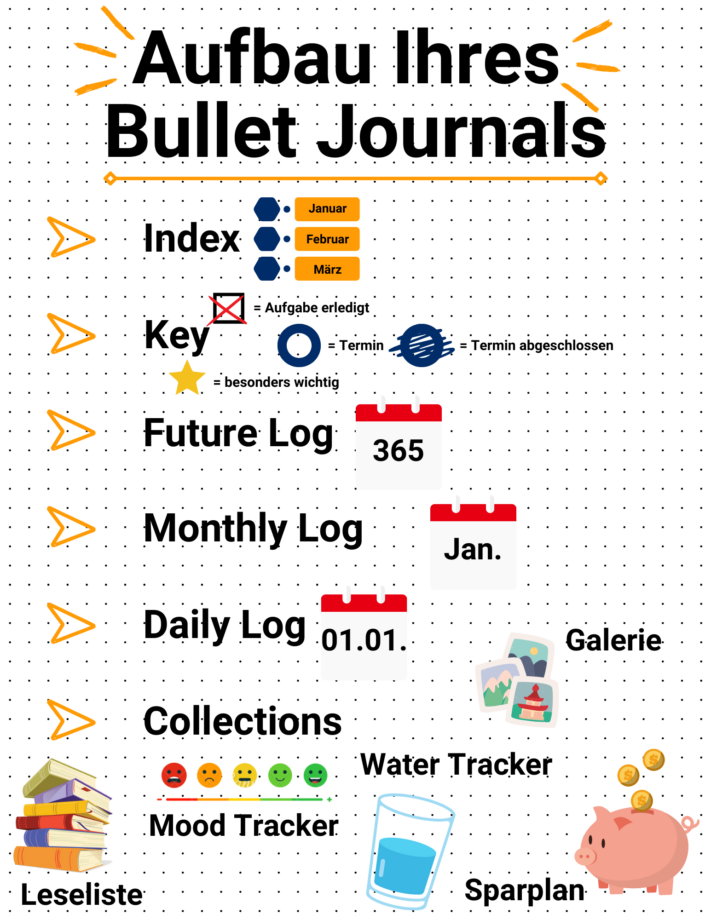
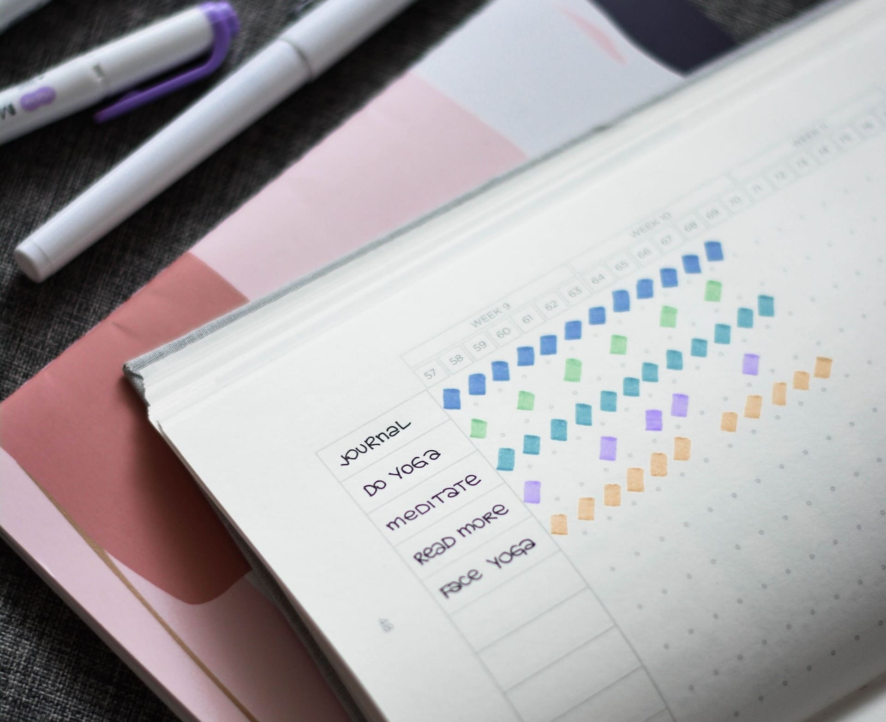
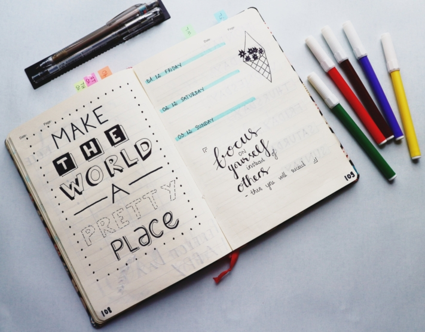

Na vida quotidiana, muitas vezes stressante, é difícil conciliar tarefas, compromissos e os seus próprios interesses. Para garantir que não perde de vista as coisas que são realmente importantes para si na vida, na pilha diária de rotinas monótonas, ajuda escrevê-las. Um **bullet journal** é ideal para isso, no qual pode registar tudo o que é importante e dar asas à sua criatividade.

Neste artigo, pode descobrir como funciona um bullet journal e o que precisa de saber para conceber um bullet journal de acordo com os seus desejos.

## O que é um bullet journal?

Um bullet journal ajuda-o a organizar as suas **Organizar a vida quotidiana** e manter um registo de todas as suas tarefas, compromissos e necessidades. O diário funciona como uma combinação de agenda, planificador de projectos e bloco de notas. Também oferece espaço suficiente para acomodar os seus desejos individuais. O bullet journal define o seu **Criatividade** sem limites. Porque, ao contrário dos calendários convencionais, não existem páginas prontas a usar. É o próprio utilizador que as desenha e preenche de acordo com as suas próprias ideias.

Personalize o seu bullet journal de acordo com os seus desejos.

O seu bullet journal cresce com cada nova entrada. Assim que todas as páginas estiverem preenchidas, comece um novo livro.

## A história por detrás do conceito

Este método de calendário foi inventado pelo designer gráfico nova-iorquino Ryder Carroll. Nascido na Áustria, desenvolveu um sistema para planear melhor as tarefas e realizar projectos de forma orientada.

A **sua ideia:** um diário sem directrizes e sem problemas de espaço. Carroll publicou o seu bullet journal em 2013. Muitos entusiastas dos bullet journallers aproveitaram a sua base prática e desenvolveram o seu próprio conteúdo criativo. Atualmente, existe uma grande comunidade que partilha as suas ideias nas redes sociais e em blogues.

## O pacote inicial certo

Começar a utilizar o bullet journaling é muito fácil. Tudo o que precisa é de um **Caderno de notas** e um **Caneta**. É uma boa ideia começar com o que tem em casa. Pode experimentar se o journaling lhe agrada. Se gostar e quiser ser mais criativo, pode comprar ferramentas adicionais.

Tudo o que está à sua volta pode ser utilizado para o design.

Os cadernos com **uma grelha de pontos** servem de base, uma vez que oferecem uma certa liberdade para escrever e colorir, em comparação com as linhas ou caixas convencionais. Se quiser desenhar as suas páginas de uma forma original, existem alguns materiais extra de que pode gostar. Estes incluem, por exemplo, marcadores, canetas fineliners, canetas de pincel ou mesmo fita washi e autocolantes. Se não tiver a certeza de quais os materiais que deve comprar, existem também [conjuntos](https://www.faber-castell.de/produkte/BulletJournalingStarterSet9teilig/267125) prontos a usar.

## A estrutura do seu bullet journal

Como já foi referido, a concretização das suas próprias ideias é fundamental. No entanto, existe um **sistema básico** que pode ser utilizado como guia para a estrutura do seu diário.

Trata-se essencialmente de **sínteses temporais**no qual pode introduzir as suas tarefas e compromissos. Além disso, existem **Colecções**. São páginas que servem para o seu desenvolvimento livre e individual. Abaixo encontra uma coleção de ideias que pode utilizar ou nas quais se pode inspirar.

Conceba o seu diário de acordo com este modelo.

### O sistema de base

A estrutura básica do seu bullet journal é composta por três partes. O **índice** serve como um índice para que possa encontrar as suas entradas mais rapidamente. Deve atualizar o índice regularmente para estar sempre atualizado.

Segue-se a **chave**. Esta é uma espécie de lenda. Os símbolos e o seu significado são aí registados. Esta técnica é designada por **registo rápido**.



- Hífen = notas
- Ponto = tarefa
- Pintar o ponto com uma cruz = a tarefa está concluída
- Ponto com seta a apontar para a direita = tarefa deslocada
- Ponto riscado = a tarefa é cancelada
- Círculo = data
- Cor no círculo = nomeação
- Caracteres especiais = realçam adicionalmente coisas importantes



As **visualizações do calendário** são apresentadas na terceira parte. Comece com o **Diário do Futuro**, o plano anual no qual regista os eventos principais e importantes.

Com base nisto, cria-se um **registo mensal**. Este contém todos os compromissos importantes do mês correspondente, num relance. Há aqui espaço para registar os seus compromissos e tarefas que não fazem parte da sua rotina diária.

O **registo diário** é ainda mais pormenorizado. Este é criado numa base semanal e oferece a possibilidade de introduzir eventos diários de forma flexível.



### As colecções

É aqui que tudo se torna criativo! Existem centenas de modelos na Internet para preencher o seu bullet journal com conteúdo. Deixe que as nossas **ideias** o inspirem e adapte-as às suas próprias ideias ou seja criativo.

Muitas ideias podem ser concretizadas em **listas**. O importante é fazer uma lista de coisas de que se gosta e que não se quer esquecer. Exemplos clássicos são a lista de desejos, a lista de afazeres ou a lista de desejos. Também pode registar os seus interesses desta forma. Faça uma lista dos seus filmes preferidos ou crie um resumo dos livros que ainda quer ler.

**Os marcadores** são provavelmente o complemento mais conhecido do bullet journal. Ajudam a documentar tarefas regulares. Existem diferentes tipos de marcadores:

- **Localizador de hábitos**: Estabeleça novos hábitos e livre-se dos maus hábitos. Pode encontrar um artigo pormenorizado sobre este assunto [aqui]().
- **Monitor de humor**: Registe as alterações de humor durante um longo período de tempo.
- **Monitorizador do sono**: Monitorize as suas horas de sono e a qualidade do seu sono.
- **Monitorização da água**: Certifique-se de que bebe água suficiente todos os dias para se manter saudável.

Outra forma de pôr em prática os seus planos é definir **objectivos**. Em conjunto com os rastreadores, pode tornar os seus objectivos mensuráveis e ver o seu progresso em qualquer altura. Os objectivos possíveis incluem, por exemplo, resoluções de Ano Novo, como um objetivo de poupança ou a melhoria das suas notas.

Um registo de hábitos é uma adição popular ao bullet journal.

## Porque é que um bullet journal vale a pena

Há muitas boas razões para experimentar o bullet journaling. Pode encontrar algumas delas aqui:

### Organização competente

A principal razão para a maioria das pessoas começar a escrever um diário é a **ajuda na organização**. Isto porque a combinação de calendário e agenda significa que os compromissos importantes já não se perdem. Além disso, um bullet journal ajuda-o a escrever tópicos que quer abordar e, assim, a **manifestá-los**. A chave e o índice facilitam a localização e o trabalho nas suas tarefas.

### Utilização versátil

As suas ideias - o seu bullet journal. Adapta-se às suas **necessidades** e não tem de seguir um padrão definido. Pode utilizá-lo para organizar os seus compromissos e tarefas diárias. As ferramentas integradas, como o calendário ou a lista de tarefas, são adequadas para o efeito. Ao mesmo tempo, também pode ser criativo e dar largas à sua imaginação nas colecções.

Combine funcionalidade com criatividade.

### Documentação das alterações

Ao escrever as coisas num bullet journal, pode verificar a qualquer momento o que fez e quando, e se está a **aproximar-se dos** seus **objectivos**. Tire conclusões do seu **comportamento** e tente tornar a sua vida quotidiana ainda mais eficaz e livre de stress. O bullet journal é um **sistema vivo** e muda consigo. Experimente coisas novas nas colecções e separe-as se determinados tópicos já não lhe agradarem.

"Se a viagem é o destino, então temos de aprender a viajar melhor."

### Melhorar a qualidade de vida

Para o inventor, Ryder Carroll, é importante que o bullet journal melhore a sua vida. Não há certo ou errado quando se trata de aproveitar a vida no aqui e agora. Isto inclui escrever num diário para fazer uma **pausa do stress diário** e refletir sobre a sua vida. A escrita criativa pode ter um **efeito meditativo** para alguns. Além disso, o seu bullet journal dá muito trabalho. É algo feito por si, o que aumenta o seu valor emocional e torna mais fácil manter-se no caminho certo.

## Modelo para o seu bullet journal digital

Um **bullet journal digital** é uma alternativa ao bloco de notas analógico. O SeaTable oferece-lhe uma solução simples e eficaz para desenhar digitalmente os seus calendários, listas e marcadores e reorganizá-los de forma flexível com apenas alguns cliques. Personalize o [modelo gratuito de]() acordo com as suas necessidades e adicione as suas próprias ideias. O bullet journal integra um registo de hábitos, que é um complemento prático para o seu diário. Trabalhe com cores, símbolos e imagens para personalizar o seu diário.

Se quiser utilizar o SeaTable para o seu bullet journal, basta [registar-se]() gratuitamente. Pode encontrar o modelo correspondente com muita inspiração e exemplos de registos [aqui]().
