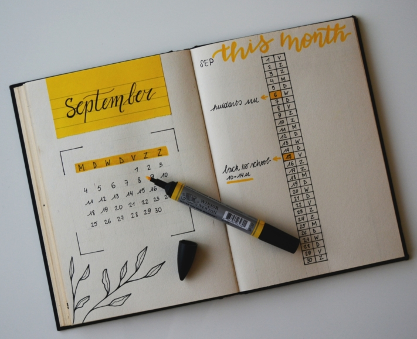
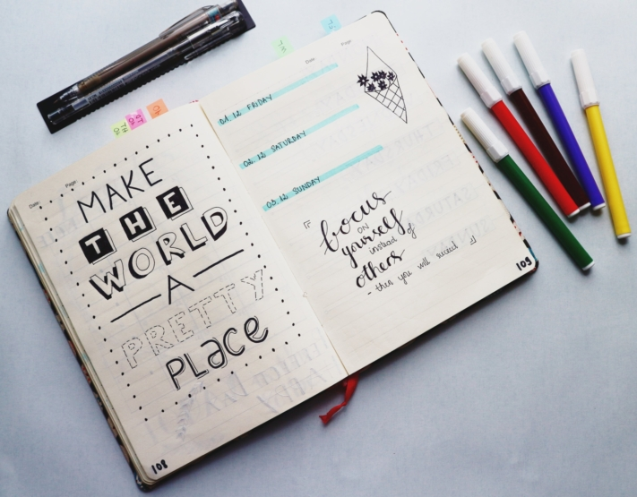

В часто напряженной повседневной жизни трудно жонглировать задачами, встречами и собственными интересами. Чтобы не упустить из виду то, что действительно важно для вас в жизни, в ежедневной череде однообразных рутинных дел, полезно записывать их. Для этого идеально подходит **пулевой журнал**, в который вы можете записывать все важное и давать волю своему творчеству.

В этой статье вы узнаете, как работает журнал-пулемет и что нужно знать, чтобы оформить журнал-пулемет в соответствии с вашими пожеланиями.

## Что такое пулевой журнал?

Пулевой журнал поможет вам упорядочить ваши **Организация повседневной жизни** и отслеживайте все свои задачи, встречи и потребности. Журнал работает как комбинация ежедневника, планировщика проектов и записной книжки. В нем также достаточно места, чтобы учесть ваши индивидуальные потребности в предметах. Журнал-пуля устанавливает ваши **Творчество** никаких ограничений. Ведь в отличие от обычных календарей, здесь нет готовых страниц. Вы сами разрабатываете их дизайн и заполняете в соответствии со своими представлениями.

Настройте свой ежедневник в соответствии с вашими пожеланиями.

Ваш дневник растет с каждой новой записью. Как только все страницы будут заполнены, заведите новую книгу.

## История, лежащая в основе концепции

Этот календарный метод был изобретен нью-йоркским графическим дизайнером Райдером Кэрроллом. Он родился в Австрии и разработал для себя систему, позволяющую лучше планировать задачи и целенаправленно выполнять проекты.

**Его идея:** журнал без рекомендаций и проблем с пространством. Кэрролл опубликовал свой журнал в 2013 году. Многие энтузиасты-пулевизаторы, опираясь на его практическую основу, разработали свой собственный творческий контент. Сегодня существует большое сообщество, которое делится своими идеями в социальных сетях и блогах.

## Правильный стартовый набор

Начать заниматься пулевым журналингом очень просто. Все, что вам нужно, это **Блокнот** и **Ручка**. Начать стоит с того, что есть у вас дома. Вы можете попробовать, подходит ли вам ведение дневника. Если вам понравится и вы захотите проявить творческий подход, вы сможете купить дополнительные инструменты.

Все, что вас окружает, можно использовать для дизайна.

В качестве основы можно использовать блокноты с **точечной сеткой**, так как она дает определенную свободу при письме и раскрашивании по сравнению с обычными линиями или рамками. Если вы хотите оригинально оформить свои страницы, вам пригодятся некоторые дополнительные материалы. К ним относятся, например, маркеры, фломастеры, ручки с кисточками или даже лента васи и стикеры. Если вы не знаете, какие материалы купить, можно приобрести готовые [наборы](https://www.faber-castell.de/produkte/BulletJournalingStarterSet9teilig/267125).

## Структура вашего дневника

Как уже говорилось выше, первостепенное значение имеет реализация ваших собственных идей. Однако существует **базовая система**, которую вы можете использовать в качестве руководства по структуре вашего дневника.

В основном это **обзоры времени**в котором можно вводить задачи и встречи. Кроме того, здесь есть **Коллекции**. Это страницы, которые служат вашему свободному и индивидуальному развитию. Ниже вы найдете коллекцию идей, которые вы можете использовать или вдохновиться ими.

Оформите свой журнал в соответствии с этим шаблоном.

### Базовая система

Основная структура вашего дневника состоит из трех частей. **Оглавление** служит оглавлением, чтобы вы могли быстрее находить свои записи. Чтобы всегда быть в курсе событий, регулярно обновляйте оглавление.

Затем следует **ключ**. Это своего рода легенда. В ней записаны символы и их значение. Эта техника называется **быстрым протоколированием**.



- Дефис = заметки
- Точка = задача
- Закрасьте точку крестиком = задание выполнено
- Точка со стрелкой, направленной вправо, = задание сдвинуто
- Перечеркнутая точка = задание отменено
- Кружок = дата
- Цвет в круге = назначение свыше
- Специальные символы = дополнительно подчеркнуть важные вещи



**Календарные виды** следуют в третьей части. Начните с **Журнала будущего**\- годового плана, в котором вы записываете основные и важные события.

На основе этого вы создаете **ежемесячный журнал**. В нем вы сразу найдете все важные встречи на соответствующий месяц. Здесь есть место для записи встреч и задач, которые не являются частью вашей повседневной рутины.

**Ежедневный журнал** содержит еще больше подробностей. Он создается на еженедельной основе и предлагает возможность гибкого ввода ежедневных событий.



### Коллекции

Вот тут-то и начинается творчество! В Интернете есть сотни шаблонов для наполнения вашего дневника. Позвольте нашим **идеям** вдохновить вас и адаптировать их к вашим собственным идеям или проявите изобретательность сами.

Многие идеи можно воплотить в **списках**. Главное, чтобы вы перечисляли то, что вам нравится и что вы не хотите забыть. Классические примеры - список "ведер", список дел или список желаний. Таким же образом можно фиксировать свои интересы. Составьте список любимых фильмов или сделайте обзор книг, которые вы еще хотите прочитать.

**Трекеры** - это, пожалуй, самое известное дополнение к бортовому журналу. Они помогают документировать регулярные задачи. Существуют различные типы трекеров:

- **Habit Tracker**: создавайте новые привычки и избавляйтесь от вредных. Подробную статью об этом вы можете найти [здесь]().
- **Трекер настроения**: записывайте, как меняется ваше настроение в течение длительного периода времени.
- **Трекер сна**: отслеживайте время сна и то, насколько хорошо вы выспались.
- **Водный трекер**: убедитесь, что вы пьете достаточно воды каждый день, чтобы оставаться здоровым.

Еще один способ воплотить свои планы в жизнь - поставить **цели**. В сочетании с трекерами вы можете сделать свои цели измеримыми и в любой момент увидеть свой прогресс. К числу возможных целей относятся, например, новогодние резолюции, такие как цель сэкономить или улучшить свои оценки.

Трекер привычек - популярное дополнение к бортовому журналу.

## Почему стоит вести ежедневник

Есть много веских причин попробовать себя в ведении журнала. Некоторые из них вы можете найти здесь:

### Умелая организация

Основная причина, по которой большинство людей начинают вести дневник, - это **организационная помощь**. Ведь благодаря сочетанию календаря и планировщика важные встречи больше не теряются. Кроме того, дневник помогает записывать темы, которыми вы хотите заняться, и таким образом **воплощать** их в жизнь. Ключ и указатель облегчают поиск и работу над задачами.

### Универсальность в использовании

Ваши идеи - ваш дневник. Он адаптируется к вашим **потребностям** и не обязательно должен следовать установленному шаблону. Вы можете использовать его для организации ежедневных встреч и задач. Для этого подойдут встроенные инструменты, такие как календарь или список дел. В то же время вы можете проявить творческий подход и дать волю воображению в коллекциях.

Сочетайте функциональность с креативностью.

### Документирование изменений

Записывая все в дневник, вы можете в любой момент проверить, что и когда вы сделали и **приближаетесь** ли к своим **целям**. Делайте выводы из своего **поведения** и старайтесь сделать свою повседневную жизнь еще более эффективной и свободной от стресса. Пулевой журнал - это **живая система**, которая меняется вместе с вами. Пробуйте новое в подборках и сортируйте их, если какие-то темы перестали вас привлекать.

"Если путешествие - это цель, то нам нужно научиться путешествовать лучше".

### Улучшение качества жизни

Для изобретателя Райдера Кэрролла важно, чтобы ежедневник улучшал вашу жизнь. Нет ничего правильного или неправильного, когда речь идет о том, чтобы наслаждаться жизнью здесь и сейчас. Это включает в себя ведение дневника, чтобы **отдохнуть от повседневного стресса** и поразмышлять о своей жизни. Творческое письмо может оказать на некоторых **медитативное воздействие**. Кроме того, в ваш дневник вложено много труда. Это то, что вы создаете сами, что повышает его эмоциональную ценность и помогает не сбиться с пути.

## Шаблон для вашего цифрового дневника

**Цифровой дневник**\- это альтернатива аналоговому блокноту. SeaTable предлагает вам простое и эффективное решение для оформления календарей, списков и трекеров в цифровом виде и их гибкой реорганизации с помощью всего нескольких щелчков мыши. Настройте [бесплатный шаблон]() под свои нужды и добавьте свои собственные идеи. В пулевой журнал встроен трекер привычек, который станет практичным дополнением к вашему дневнику. Работайте с цветами, символами и изображениями, чтобы персонализировать свой журнал.

Если вы хотите использовать SeaTable для ведения своего дневника, просто [зарегистрируйтесь]() бесплатно. Соответствующий шаблон с вдохновением и примерами записей вы найдете [здесь]().
