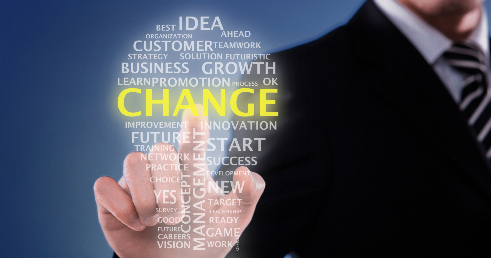

## Warum ist ein aktives Change Management wichtig?

Unternehmen sind dynamischen Umweltbedingungen ausgesetzt und müssen Prozesse und Strukturen ständig anpassen, um ihre **Wettbewerbsfähigkeit und Innovationsfähigkeit** zu erhalten. Egal, ob Sie z. B. neue Technologien wie KI und No-Code Lösungen einführen möchten, neue Prozesse zur Umsetzung gesetzlicher Auflagen entwickeln oder die Expansion in neue Märkte vorbereiten möchten, eines steht immer im Mittelpunkt: die Menschen – Ihre Mitarbeiter und Kunden. Aktives Change Management ist wichtig, um Einwände und Bedenken zu berücksichtigen, **alle Stakeholder mitzunehmen** und Maßnahmen so zu planen und umzusetzen, dass sie transparent sind und niemanden überfordern. So sorgen Sie dafür, **dass Veränderungen gelebt werden**. Andernfalls laufen Sie Gefahr, Ihre Mitarbeiter zu demotivieren und womöglich sogar Kunden an [Wettbewerber]() zu verlieren.  

## Was bedeutet Change Management?

Bevor wir tiefer in das Thema einsteigen, lassen Sie uns noch mal Klarheit über den Begriff schaffen. Denn er ist heutzutage zwar in (fast) aller Munde. Wie bei vielen anderen inflationär gebrauchten Buzzwörtern fehlt oftmals jedoch ein Verständnis, was genau damit gemeint ist. Eine Change Management Definition ist daher angeraten.

Change Management meint die Umsetzung aller Strategien, Prozesse und Maßnahmen, die darauf abzielen, **tiefgreifende Veränderungen** in Abteilungen oder ganzen Organisationen gezielt und systematisch zu gestalten. Dabei kann es sich um organisatorische, technologische oder kulturelle Veränderungen handeln – wobei letztere der anspruchsvollste Fall sind. Entscheidend ist, dass es sich um einen komplexen, eben für die betroffene Organisation tiefgreifenden Change Prozess handelt. Werden nur einzelne Abläufe optimiert, spricht man nicht von Change Management.

### Sind Change Management und Transformation dasselbe?

Kurz gesagt: Nein, beide Begriffe sind zwar eng miteinander verbunden, aber nicht synonym. Der Ausdruck „Transformation“ beschreibt zwar auch meist groß angelegte, grundlegende Änderungen – etwa die komplette Neuausrichtung eines Geschäftsmodells oder die digitale Umwandlung eines Unternehmens. Das Change Management dagegen bezieht sich darauf, diesen **Wandel strukturiert zu planen und zu begleiten** und so die Weichen für einen nachhaltigen Erfolg zu stellen. Um beim Beispiel der Digitalisierung zu bleiben: Der Ausdruck "digitale Transformation" gibt eher das strategische Ziel vor, wohingegen die konkrete Steuerung und Umsetzung unter Change Management fällt.

## Welche Rolle spielen die Mitarbeiter im Change Management?

Wie bereits angedeutet, steht und fällt ein erfolgreicher Change Management Prozess mit der aktiven Einbindung Ihrer Mitarbeiter. Denn diese sind am Ende diejenigen, die neue Prozesse anwenden, ihre Arbeitsweisen ändern und Veränderungen im Alltag leben müssen. Emotionen spielen beim Change Management eine wichtige Rolle. Werden Ängste, Bedenken und Unsicherheiten nicht frühzeitig ernst genommen, entstehen schnell Widerstände und Frust, die Sie unbedingt vermeiden möchten. Transparenz, regelmäßige Kommunikation und gegebenenfalls Weiterbildungsmöglichkeiten sind die absoluten Basics, um Mitarbeiter als Partner und Mitgestalter einzubinden. Teamsitzungen, [Workshops]() und Einzelgespräche helfen dabei, Sorgen abzubauen und Blockaden aufzulösen.

### Das 7 Phasen-Modell nach Streich

In diesem Zusammenhang sollten verantwortliche Change Manager sich regelmäßig das 7 Phasen-Modell nach Streich vergegenwärtigen. Richard Streich und Sonja Sackmann entwickelten dieses Modell, um zu beschreiben, wie Menschen tiefgreifende Veränderungen emotional erleben und darauf reagieren:

*   1\. Phase: Schock
    
*   2\. Phase: Verneinung
    
*   3\. Phase: Einsicht
    
*   4\. Phase: Akzeptanz
    
*   5\. Phase: Ausprobieren
    
*   6\. Phase: Erkenntnis
    
*   7\. Phase: Integration
    

Mitarbeiter durch die ersten beiden Phasen zu begleiten und diese möglichst kurz zu halten, ist eine zentrale Aufgabe von Führungskräften und Change Managern in Veränderungsprozessen.

## Welche Change Management Modelle stehen zur Verfügung?

Wie in anderen Bereichen stehen Ihnen auch im Veränderungsmanagement verschiedene Modelle zur Verfügung. Diese bieten vermeintlich einfache Antworten und versprechen durch eine klare Struktur, Ihre Change Management Planung konkret und steuerbar zu gestalten. Keines dieser Modelle wird indes den **komplexen Dynamiken von Change Management Prozessen vollkommen gerecht**. Lassen Sie uns gemeinsam die vier am häufigsten in Change Management Ratgebern genannten Modelle kritisch betrachten:

*   das 3-Phasen-Modell nach Lewin
    
*   das 8-Stufen-Modell nach Kotter

*   das 5 Phasen-Modell nach Krüger
    
*   das ADKAR-Modell

### Das 3-Phasen-Modell nach Lewin

Dieses Modell des deutschen Sozialpsychologen Kurt Lewin ist **eines der ältesten Modelle** im Change Management. Es wurde erstmals 1947 publiziert und beschäftigte sich ursprünglich alleine mit kulturellen Veränderungsprozessen. Lewin, der im US-amerikanischen Exil lebte, formulierte drei Phasen im Change Management:

*   Unfreeze: Der bestehende Status quo wird ***aufgetaut***, um überhaupt Veränderungsbereitschaft zu erzeugen.
    
*   Change: Die Veränderungsprozesse werden umgesetzt.
    
*   Refreeze: Die neuen Prozesse werden verinnerlicht und stabilisiert.
    

**Nachteile des 3-Phasen-Modells**

Im Mittelpunkt von Lewins Modell steht die Notwendigkeit, durch eine durchdachte Change Management Planung Veränderungen bewusst vorzubereiten und nachhaltig zu verankern und zu stabilisieren. Was erst mal logisch klingt, erweist sich bei näherer Betrachtung als ein veralteter Ansatz:

*   Einen organisatorischen oder prozessualen Stand ***einzufrieren*** ist in modernen, agilen Unternehmen kaum denkbar.
    
*   Lewins mechanistisches Verständnis von Strukturen und Organisationen entspricht nicht mehr der Realität.

### Das 8-Stufen-Modell nach Kotter

Ein weiterer Klassiker unter den Change Management Methoden ist John Kotters 8-Stufen-Modell. Kotters Modell kann am ehesten als Change Management Konzept verstanden werden, da er einen **klaren Ablauf statt abstraktere Change Management Phasen** formuliert:

*   Dringlichkeit erzeugen
*   Führungsteam aufbauen
*   Vision entwickeln
*   Vision kommunizieren
*   Hindernisse beseitigen
*   Kurzfristige Erfolge erzielen
*   Veränderungen weiter vorantreiben
*   Veränderungen verankern

**Nachteile des 8-Stufen-Modells**

Auch Kotters Modell verdeutlicht, dass eine Transformation nur möglich ist, wenn die Dringlichkeit verstanden wird und von Anfang an eine klare Vision besteht. Insgesamt geht Kotter zwar viel praxisorientierter und granularer an das Thema heran als Lewin oder Krüger. Jedoch gibt es auch Kritik:

*   Change Management Maßnahmen laufen in der Regel nicht linear ab, sondern häufig parallel.
    
*   Kotters Schritte sieben und acht, die eigentliche Umsetzung, sind ungleich komplexer und aufwendiger, als sein Modell nahelegt.
    
*   Kotter sieht Veränderungsmanagement als vom Management vorgegeben und durchgeführt und vernachlässigt die aktive Rolle der Mitarbeiter.
    
*   Es bleibt offen, wie mit Rückschritten umgegangen wird.

### 5-Phasen-Modell nach Krüger

Dieses Modell des Wirtschaftswissenschaftlers Wilfried Krüger identifiziert fünf aufeinander aufbauende Phasen im Change Management:

*   Initialisierung: Veränderungsbedarf erkennen und erste Ziele formulieren.
*   Konzeption: Lösungen entwerfen, Maßnahmen und Projektteams definieren.
*   Mobilisierung: Mitarbeitende einbinden, Akzeptanz schaffen und Motivation fördern.
*   Umsetzung: Geplante Maßnahmen operativ durchführen.
*   Verstetigung: Erfolge sichern, neue Standards festlegen und kontrollieren.

Die dritte und vierte Phase sind besonders kritische Meilensteine im Change Management, da hier potentielle Widerstände abgebaut und eine positive Veränderungsbereitschaft geschaffen werden.

**Nachteile des 5-Phasen-Modells**

Krügers Modell nennt zwar die wichtigen Phasen im Change Management, geht jedoch ebenso wie Kotter von einem linearen, starren Change Management Konzept aus. Wie genau die Umsetzung funktionieren soll, bleibt eher vage. Zudem setzt Krüger darauf, Mitarbeitern spezielle Anreize zu bieten, sich auf den Wandel einzulassen, anstatt sie einzubinden und vom Sinn zu überzeugen.

### ADKAR-Modell

Das ADKAR-Modell wurde durch den Change Manager Jeff Hiatt entwickelt und basiert auf der Analyse der Veränderungsprozesse von etwa 700 Organisationen. Es gilt als **besonders praxisorientiert** und fokussiert die individuellen Veränderungsprozesse der Mitarbeiter. ADKAR ist ein Akronym für Awareness (Bewusstsein), Desire (Wunsch), Knowledge (Wissen), Ability (Fähigkeit) und Reinforcement (Verstärkung). Ähnlich wie das 5-Phasen-Modell zielt auch Hiatts Ansatz darauf ab, ein Bewusstsein für die Notwendigkeit von Veränderungen zu schaffen und die nachhaltige Umsetzung zu unterstützen.

**Nachteile des ADKAR-Modells**

Hiatts Modell rückt radikal die einzelnen Mitarbeiter in den Fokus und unterscheidet sich dadurch deutlich von den drei anderen vorgestellten Phasen-Modellen. Darin begründet sich jedoch auch die zentrale Kritik:

*   Das ADKAR-Modell vernachlässigt die Bedeutung von Gruppen-Dynamiken.
    
*   Es vernachlässigt die technischen und prozessualen Aspekte von Change Management Prozessen.
    
*   Es liefert den starren Rahmen für ein Change Management Konzept, jedoch kein Umsetzungsmodell.

## Change Management Maßnahmen: Wie gehen Sie am besten vor?

Jedes der genannten Modelle geht von einem linearen Verlauf verschiedener Change Management Maßnahmen aus – darin ähneln sie stark dem bereits genannten 7 Phasen-Modell nach Streich. Wie gezeigt vermittelt diese lineare Struktur jedoch ein schiefes Bild. Zwar zeigen die Modelle klar, welche Schritte einzeln wichtig sind und mögen dadurch als Rahmen für Change Management Strategien hilfreich sein. Echte Handlungsempfehlungen und Maßnahmen sucht man indes vergeblich.

**Wie gehen Sie also konkret vor?**

*   Beginnen Sie mit einer **Analyse**: Was soll verändert werden und wie sieht das Ziel aus?
    
*   Identifizieren Sie vor dem Beginn einzelner Maßnahmen die **relevanten Stakeholder**.
    
*   Schaffen Sie **Vertrauen** durch eine offene Kommunikation.
    
*   Definieren Sie **Rollen und Verantwortlichkeiten** klar.
    
*   Leben Sie gemeinsam mit dem Management **Veränderungsbereitschaft** vor.
    
*   Messen Sie **Fortschritte** kontinuierlich, um bei Problemen rechtzeitig reagieren zu können.
    

### Change Management und Projektmanagement

Wenn Sie Parallelen zum Projektmanagement sehen, ist das kein Zufall. Denn **Change Management und Projektmanagement sind eng miteinander verzahnt**. Während z. B. bei einem IT-Projekt der Projektmanager die technische Einführung einer neuen Software vorantreibt, geht es beim Change-Management in der IT dann darum, die Mitarbeiter mit ins Boot zu holen und dafür zu sorgen, dass die neue Software angenommen und genutzt wird. Dadurch sind [Projektmanagement-Methoden]() meistens auch hilfreiche Methoden im Change Management.

### Stakeholder-Analyse

Mit einer Stakeholder-Analyse lernen Sie die Stakeholder und deren Interesse an Ihrem Projekt kennen.

**Wie führen Sie eine Stakeholder-Analyse durch?**

*   Identifikation: Wer könnte von Ihrem Projekt betroffen sein? Berücksichtigen Sie auch Personen außerhalb Ihres Unternehmens.
    
*   Priorisierung: Nicht alle Stakeholder sind gleichermaßen von Änderungen betroffen. Ordnen Sie Ihre Stakeholder nach Interesse und Engagement – dadurch wird auch das spätere Stakeholder-Management erleichtert. 
    
*   Stakeholder-Map: Kategorisieren Sie nun Ihre Stakeholder nach verschiedenen Faktoren, z. B. nach Kunden, Mitarbeitern, Externen und Management.
    

### Culture Mapping

Die Unternehmenskultur wird u. a. durch das alltägliche Verhalten der Mitarbeiter untereinander sowie Werte und Normen, die das Management lebt und vorgibt, geprägt. Sie hat mal mehr, mal weniger Einfluss auf den Erfolg der Change Management Maßnahmen. Mit einer Culture Map gewinnen Sie wichtige Informationen, um etwaige Stolpersteine im Vorfeld zu erkennen.

**Wie funtioniert Culture Mapping?**

Erfassen Sie zunächst verschiedene **Subkulturen innerhalb Ihres Unternehmens**, z. B. einzelne Abteilungen oder Unternehmensbereiche. Identifizieren Sie anschließend jeweils Gruppen von fünf bis sechs Personen, die diese verschiedenen Kulturen am besten repräsentieren und sprechen Sie mit ihnen. Aus den daraus gewonnenen Informationen zu potentiellen Blockern und Möglichkeiten erstellen Sie Ihre Culture Map. Am besten arbeiten Sie dazu **mit einem Whiteboard-Tool oder mit Diagrammen**, z. B. einem Streudiagramm oder einer Tree Map, und lassen die so gewonnenen Informationen in Ihre Change Management Planung einfließen.  

### Prozesslandkarte

Mit der Prozesslandkarte visualisieren Sie verschiedene Abläufe, häufig in Form eines **Flussdiagramms**. Damit gewinnen auch Personen, die nicht unmittelbar am Change-Management-Prozess beteiligt sind, eine gute Übersicht und wichtige Informationen. Insbesondere bei Ihrer Change Management Planung helfen solche Diagramme dabei, den aktuellen Stand darzustellen.

### Kraftfeldanalyse

Mit Kurt Lewins Kraftfeldanalyse untersuchen Sie, welche Kräfte oder Faktoren für oder gegen eine Veränderung oder einen Vorschlag sprechen. Sie wird auch Hindernis- und Hilfsmittelanalyse genannt und ähnelt einer [SWOT-Analyse]().

**Wie funktioniert die Kraftfeldanalyse?**

*   Plandefinition: Welches Ziel haben Sie?
    
*   Hilfsmittel bestimmen: Welche (internen und externen) Kräfte können Ihnen helfen?
    
*   Hindernisse erkennen: Welche (auch potentiellen) Kräfte sprechen gegen eine Veränderung?
    
*   Gewichten: Quantifizieren Sie den zu erwartenden Einfluss jeder Kraft mit einer Punktzahl.
    

## Risiken im Change Management

Change-Projekte scheitern häufig an **mangelnder Akzeptanz, unklarer Kommunikation oder mangelnden Ressourcen**. Doch auch fehlende oder unrealistische Change Management Ziele sind häufig vorkommende Ursachen. In den seltensten Fällen scheitern diese Projekte jedoch an den Mitarbeitern, auch wenn diesen dann unterstellt wird, unfähig oder nicht willens zu sein, sich auf Neues einzulassen. In der Regel erkennen Mitarbeiter einfach nur sehr schnell, ob Veränderungen in Ihrem Interesse liegen oder nicht. Sie sollten daher die Interessen Ihrer Mitarbeiter frühzeitig berücksichtigen. Erstellen Sie eine sorgfältige, transparente Change Management Planung, um gut auf mögliche Risiken vorbereitet zu sein, und planen Sie dabei ausreichend Zeit für die nachhaltige Implementierung ein – dieser Schritt kann mehrere Monate oder sogar länger dauern.

## Wie hängen Change-Management und Digitalisierung zusammen?

Eine gute Planung, Analysen, regelmäßige und transparente Kommunikation, Stakeholder-Management: Ohne das passende Tool können Sie diese Aufgaben kaum effizient abdecken. Und so, wie erfolgreiche Digitalisierung ein gut durchdachtes Change Management Konzept voraussetzt, ist die Digitalisierung wiederum Voraussetzung für erfolgreiche Veränderungsprozesse. Neue Technologien wie **Cloud-Lösungen, No-Code-Plattformen, KI und Automatisierungstools** können dabei den entscheidenden Unterschied machen und über Erfolg oder Misserfolg Ihres Projekts entscheiden. Das wichtigste Kriterium sind dabei Ihre spezifischen Anforderungen: Wählen Sie ein Tool, das bestmöglich zu Ihren Vorstellungen passt und **skalierbar** ist. Sonst wechseln Sie womöglich von einer Software zur nächsten oder arbeiten mit verschiedenen Tools, was Ihre Change Management Maßnahmen nur unnötig erschwert.

## SeaTable als Change Management Tool

SeaTable ist ein modernes [No-Code Datenbank-Tool](), das Sie flexibel an die Anforderungen Ihres Unternehmens oder Projekts anpassen können. Speziell für Change Management Maßnahmen bietet diese Lösung eine **Vielzahl an Funktionen**, mit denen Sie leicht auch andere Prozesse abdecken. Dank der **intuitiven Benutzeroberfläche** und der zahlreichen Anpassungsmöglichkeiten finden sich neue Nutzer schnell zurecht, ohne Schulungen oder langwierige Implementierungen zu benötigen.

Transparente **Echtzeit-Kollaboration, integrierte Chat- und Benachrichtigungsfunktionen**, eine gemeinsame Datenverwaltung und **Automatisierungen** unterstützen Sie dabei, Ihre Meilensteine im Change Management zu erreichen. Nutzen Sie z. B. unsere **kostenlose Vorlage zur SWOT-Analyse** für Ihre Kraftfeldanalyse oder unseren **Projektstrukturplan** für Ihre Change Management Planung. 



**Individualisierbare Dashboards und Statistiken** ermöglichen Ihnen, Projektfortschritte in regelmäßigen Abständen zu überprüfen. Mit dem **Universal App Builder** gestalten Sie in wenigen Minuten ein **benutzerfreundliches Frontend** für Ihre Stakeholder, während Sie mit den Plugins **Whiteboard und Tree** den kompletten Überblick über Ihr Change Management behalten.

Als [Cloud-Lösung]() wird SeaTable ausschließlich auf Servern in Deutschland gehostet und ist **vollkommen DSGVO-konform**. Für noch größere Kontrolle über Ihre Daten können Sie mit [SeaTable Server]() die Software auf Ihren eigenen Servern hosten. In der kostenlosen Basisversion haben Sie zahlreiche Grundfunktionen zur Verfügung.

## Fazit

Aktives Change Management ist ein entscheidender Erfolgsfaktor für Unternehmen, um den Herausforderungen der Gegenwart zu begegnen. Die zielführende Umsetzung basiert auf einem klaren Konzept, der Einbindung der Mitarbeitenden, den richtigen Change Management Methoden, einem empathischen Umgang mit Emotionen – und dem Einsatz der passenden Tools.

## FAQ – Change Management Planung


Erfolgreiches Change Management hängt maßgeblich von drei Faktoren ab:

*   Klare Zieldefinition
    
*   Einbindung von Führungskräften
    
*   Klare Kommunikation und Transparenz
    


Grundsätzlich sollten Sie zunächst davon ausgehen, dass Ihre Mitarbeiter bereit zu Veränderungen sind. Denn im Changemanagement geht es nicht darum, Widerstände oder Bedenken der Mitarbeiter zu brechen. Wenn Sie in Ihrem Business einen Change Management Prozess als Machtspiel aufziehen, haben Sie bereits verloren. Denken Sie an das 7 Phasen-Modell nach Streich. Wenn Sie mit Ihren Mitarbeitern auf Augenhöhe kommunizieren und sie einbinden, werden sie Veränderungen positiver begegnen und schneller akzeptieren.



Zu den größten Risiken, denen Sie durch zielgerichtete Change Management Methoden begegnen können, gehören:

*   Unklare Zieldefinition oder fehlende strategische Einbindung
    
*   Widerstand durch fehlendes Verständnis oder Sorge vor Kontrollverlust
    
*   Mangelnde Ressourcen
    
*   Überlastung durch zu viele gleichzeitige Maßnahmen
    
Sie können durch eine frühzeitige Risikoanalyse, transparente Kommunikation und klare Definition der Change Management Ziele Risiken schon im Rahmen der Change Management Planung vermeiden.
