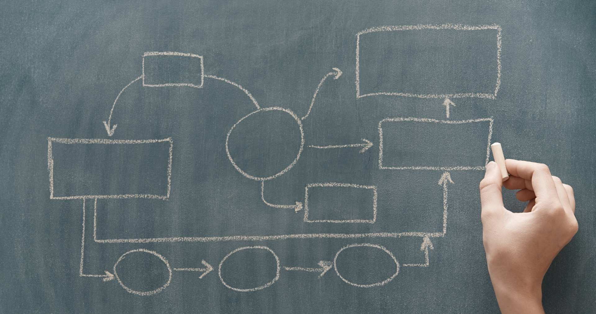

## ¿Por qué es importante la gestión activa del cambio?

Las empresas están expuestas a condiciones ambientales dinámicas y deben adaptar constantemente sus procesos y estructuras para mantener su **competitividad y capacidad de innovación**. Tanto si desea introducir nuevas tecnologías como la IA y las soluciones sin código, desarrollar nuevos procesos para aplicar los requisitos legales o prepararse para la expansión a nuevos mercados, hay algo que siempre ocupa un lugar central: las personas, sus empleados y clientes. La gestión activa del cambio es importante para tener en cuenta las objeciones y preocupaciones, **implicar a todas las partes interesadas** y planificar y aplicar las medidas de forma que sean transparentes y no sobrecarguen a nadie. De este modo, se asegura **de que los cambios se vivan**. De lo contrario, corre el riesgo de desmotivar a sus empleados e incluso de perder clientes a manos de la [competencia]().  

## ¿Qué significa gestión del cambio?

Antes de profundizar en el tema, aclaremos el término. Al fin y al cabo, hoy en día está en boca de (casi) todo el mundo. Sin embargo, como ocurre con muchas otras palabras de moda inflacionistas, a menudo no se entiende exactamente lo que significa. Por lo tanto, es aconsejable una definición de la gestión del cambio.

La gestión del cambio se refiere a la aplicación de todas las estrategias, procesos y medidas que tienen como objetivo provocar **cambios profundos** en departamentos u organizaciones enteras de forma selectiva y sistemática. Puede tratarse de cambios organizativos, tecnológicos o culturales, siendo este último el caso más difícil. El factor decisivo es que el proceso de cambio sea complejo y de gran alcance para la organización en cuestión. Si sólo se optimizan procesos individuales, no se habla de gestión del cambio.

### ¿Son lo mismo la gestión del cambio y la transformación?

En pocas palabras: No, los dos términos están estrechamente relacionados pero no son sinónimos. El término "transformación" suele referirse a cambios fundamentales a gran escala, como la reorganización completa de un modelo de negocio o la transformación digital de una empresa. La gestión del cambio, por su parte, se refiere a la planificación y el apoyo de este **cambio de forma estructurada** y, de este modo, establecer el rumbo para un éxito sostenible. Siguiendo con el ejemplo de la digitalización: El término "transformación digital" tiende a especificar el objetivo estratégico, mientras que la gestión y la aplicación concretas corresponden a la gestión del cambio.

## ¿Qué papel desempeñan los empleados en la gestión del cambio?

Como ya se ha mencionado, el éxito de un proceso de gestión del cambio depende de la participación activa de sus empleados. Al fin y al cabo, en última instancia son ellos los que tienen que aplicar los nuevos procesos, cambiar sus métodos de trabajo y vivir los cambios en su vida cotidiana. Las emociones desempeñan un papel importante en la gestión del cambio. Si los temores, las preocupaciones y las incertidumbres no se toman en serio en una fase temprana, surgirán rápidamente la resistencia y la frustración, que usted quiere evitar a toda costa. La transparencia, la comunicación regular y, si es necesario, las oportunidades de formación continua son los elementos básicos para implicar a los empleados como socios y cocreadores. Las reuniones de equipo, los [talleres]() y las discusiones individuales ayudan a reducir las preocupaciones y a disolver los bloqueos.

### El modelo de 7 fases según Streich

En este contexto, los gestores del cambio responsables deberían visualizar regularmente el modelo de 7 fases de Streich. Richard Streich y Sonja Sackmann desarrollaron este modelo para describir el modo en que las personas experimentan emocionalmente los cambios de gran alcance y reaccionan ante ellos:

* 1\. Fase: Shock
    
* 2\. Fase: Negación
    
* 3\. Fase: Perspicacia
    
* 4\. Fase: Aceptación
    
* 5\. Fase: Ensayo y error
    
* 6\. Fase: Realización
    
* 7\. Fase: Integración
    

Acompañar a los empleados a lo largo de las dos primeras fases y mantenerlas lo más cortas posible es una tarea central de los directivos y gestores del cambio en los procesos de cambio.

## ¿Qué modelos de gestión del cambio existen?

Como en otros ámbitos, en la gestión del cambio existen varios modelos a su disposición. Éstos ofrecen respuestas supuestamente sencillas y prometen una estructura clara para que su planificación de la gestión del cambio sea concreta y manejable. Sin embargo, ninguno de estos modelos hace plena justicia a la **compleja dinámica de los procesos de gestión del cambio**. Echemos un vistazo crítico a los cuatro modelos mencionados con más frecuencia en las guías de gestión del cambio:

* el modelo de 3 fases según Lewin
    
* el modelo de 8 fases según Kotter

* el modelo de 5 fases según Krüger
    
* el modelo ADKAR

### El modelo de 3 fases según Lewin

Este modelo del psicólogo social alemán Kurt Lewin es **uno de los modelos más antiguos** en la gestión del cambio. Se publicó por primera vez en 1947 y originalmente se centraba únicamente en los procesos de cambio cultural. Lewin, que vivió exiliado en EE.UU., formuló tres fases en la gestión del cambio:

* Descongelar: El statu quo existente es ***descongelado*** para crear una voluntad de cambio en primer lugar.
    
* Cambiar: Se ponen en marcha los procesos de cambio.
    
* Recongelar: Los nuevos procesos se interiorizan y estabilizan.
    

**Desventajas del modelo de 3 fases**

En el núcleo del modelo de Lewin se encuentra la necesidad de prepararse conscientemente para el cambio mediante una planificación bien pensada de la gestión del cambio y de anclarlo y estabilizarlo a largo plazo. Lo que a primera vista parece lógico, resulta ser un planteamiento obsoleto si se examina más detenidamente:

* ***Congelar*** un estado organizativo o procedimental es difícilmente concebible en las empresas modernas y ágiles.
    
* La concepción mecanicista de Lewin de las estructuras y las organizaciones ya no se corresponde con la realidad.

### El modelo de 8 pasos según Kotter

Otro clásico entre los métodos de gestión del cambio es el modelo de 8 pasos de John Kotter. El modelo de Kotter puede entenderse mejor como un concepto de gestión del cambio, ya que formula un **proceso claro en lugar de fases de gestión del cambio más abstractas**:

* Crear urgencia
* Crear un equipo de liderazgo
* Desarrollar la visión
* Comunicar la visión
* Eliminar obstáculos
* Lograr el éxito a corto plazo
* Impulsar el cambio
* Anclar el cambio

**Desventajas del modelo de 8 pasos**

El modelo de Kotter también deja claro que la transformación sólo es posible si se comprende la urgencia y existe una visión clara desde el principio. En general, Kotter adopta un enfoque del tema mucho más orientado a la práctica y granular que Lewin o Krüger. Sin embargo, también hay críticas:

* Las medidas de gestión del cambio no suelen discurrir de forma lineal, sino a menudo en paralelo.
    
* Los pasos siete y ocho de Kotter, la aplicación propiamente dicha, son mucho más complejos y requieren más tiempo de lo que sugiere su modelo.
    
* Kotter considera que la gestión del cambio debe ser prescrita y aplicada por la dirección y descuida el papel activo de los empleados.
    
* Queda abierto cómo hacer frente a los contratiempos.

### Modelo de 5 fases según Krüger

Este modelo del economista Wilfried Krüger identifica cinco fases sucesivas en la gestión del cambio:

* Inicialización: reconocer la necesidad del cambio y formular los objetivos iniciales.
* Concepción: Diseñar soluciones, definir medidas y equipos de proyecto.
* Movilización: Implicar a los empleados, crear aceptación y promover la motivación.
* Puesta en práctica: Aplicar operativamente las medidas previstas.
* Estabilización: Garantizar el éxito, definir y supervisar las nuevas normas.

Las fases tercera y cuarta son hitos especialmente críticos en la gestión del cambio, ya que es aquí donde se reduce la resistencia potencial y se crea una voluntad positiva de cambio.

**Desventajas del modelo de 5 fases**

Aunque el modelo de Krüger nombra las fases importantes de la gestión del cambio, al igual que Kotter parte de un concepto lineal y rígido de la gestión del cambio. El funcionamiento exacto de la aplicación sigue siendo bastante vago. Además, Krüger se basa en ofrecer a los empleados incentivos especiales para que acepten el cambio en lugar de implicarlos y convencerlos de que tiene sentido.

### Modelo ADKAR

El modelo ADKAR fue desarrollado por el gestor del cambio Jeff Hiatt y se basa en el análisis de los procesos de cambio de unas 700 organizaciones. Se considera **particularmente orientado a la práctica** y se centra en los procesos de cambio individuales de los empleados. ADKAR es el acrónimo de Conciencia, Deseo, Conocimiento, Capacidad y Refuerzo. Similar al modelo de las 5 fases, el enfoque de Hiatt también pretende crear conciencia de la necesidad del cambio y apoyar una aplicación sostenible.

**Desventajas del modelo ADKAR**

El modelo de Hiatt se centra radicalmente en el empleado individual y, por tanto, difiere significativamente de los otros tres modelos de fases presentados. Sin embargo, ésta es también la razón de la crítica central:

* El modelo ADKAR descuida la importancia de la dinámica de grupo.
    
* Descuida los aspectos técnicos y de procedimiento de los procesos de gestión del cambio.
    
* Proporciona un marco rígido para un concepto de gestión del cambio, pero no un modelo de aplicación.

## Medidas de gestión del cambio: ¿Cuál es la mejor manera de proceder?

Cada uno de los modelos mencionados asume una progresión lineal de varias medidas de gestión del cambio - en este sentido son muy similares al modelo de 7 fases según Streich antes mencionado. Sin embargo, como se ha demostrado, esta estructura lineal transmite una imagen sesgada. Los modelos muestran claramente qué pasos individuales son importantes y, por lo tanto, pueden ser útiles como marco para las estrategias de gestión del cambio. Sin embargo, buscará en vano verdaderas recomendaciones de acción y medidas.

**Entonces, ¿cómo proceder realmente?**

* Empiece con un **análisis**: ¿Qué hay que cambiar y cuál es el objetivo?
    
* Identifique a los **interlocutores relevantes** antes de iniciar las medidas individuales.
    
* Crear **confianza** mediante una comunicación abierta.
    
* Definir claramente las funciones y las responsabilidades.
    
* Junto con la dirección, demuestre **voluntad de cambio**.
    
* Mida el **progreso** continuamente para poder reaccionar a tiempo ante los problemas.
    

### Gestión del cambio y gestión de proyectos

Si ve paralelismos con la gestión de proyectos, no es ninguna coincidencia. Esto se debe a que **la gestión del cambio y la gestión de proyectos están estrechamente interrelacionadas**. Mientras que en un proyecto de TI, por ejemplo, el gestor del proyecto dirige la introducción técnica del nuevo software, la gestión del cambio en TI consiste en conseguir que los empleados se incorporen y garantizar que el nuevo software sea aceptado y utilizado. Esto significa que [los métodos de gestión de proyectos]() suelen ser también métodos útiles en la gestión del cambio.

### Análisis de las partes interesadas

Con un análisis de las partes interesadas, conocerá a los interesados y su interés en su proyecto.

**¿Cómo se realiza un análisis de las partes interesadas?**

* Identificación: ¿A quién puede afectar su proyecto? Tenga en cuenta también a las personas ajenas a su empresa.
    
* Priorización: No todas las partes interesadas se ven igualmente afectadas por los cambios. Priorice a sus partes interesadas en función de su interés y compromiso: esto también facilitará la gestión posterior de las partes interesadas.
    
* Mapa de las partes interesadas: Clasifique ahora a sus partes interesadas según diversos factores, por ejemplo, clientes, empleados, partes externas y dirección.
    

### Mapa de la cultura

La cultura corporativa está conformada, entre otras cosas, por el comportamiento cotidiano de los empleados entre sí, así como por los valores y normas que la dirección vive y establece. A veces influye más, a veces menos, en el éxito de las medidas de gestión del cambio. Con un mapa cultural, obtendrá información importante para reconocer de antemano cualquier escollo.

**¿Cómo funciona el mapa cultural?**

Comience por trazar un mapa de las diferentes **subculturas de su organización**, por ejemplo, departamentos o divisiones individuales. A continuación, identifique a los grupos de cinco o seis personas que mejor representen esas diferentes culturas y hable con ellos. Utilice la información resultante sobre posibles bloqueos y oportunidades para crear su mapa cultural. Lo mejor es trabajar **con una herramienta de pizarra o con diagramas**, por ejemplo, un diagrama de dispersión o un mapa de árbol, e incorporar la información obtenida a su planificación de la gestión del cambio.  

### Mapa de procesos

Puede utilizar el mapa de procesos para visualizar varios procesos, a menudo en forma de **diagrama de flujo**. Esto también ofrece a las personas que no participan directamente en el proceso de gestión del cambio una buena visión de conjunto e información importante. Estos diagramas ayudan a visualizar el estado actual de su planificación de la gestión del cambio en particular.

.

### Análisis del campo de fuerzas

Con el análisis del campo de fuerzas de Kurt Lewin, se examina qué fuerzas o factores hablan a favor o en contra de un cambio o una propuesta. También se denomina análisis de obstáculos y recursos y es similar a un [análisis DAFO]().

**¿Cómo funciona el análisis del campo de fuerzas?**

* Definición del plan: ¿Cuál es su objetivo?
    
* Determine las herramientas: ¿Qué fuerzas (internas y externas) pueden ayudarle?
    
* Reconozca los obstáculos: ¿Qué fuerzas (incluidas las potenciales) están trabajando en contra del cambio?
    
* Ponderación: Cuantifique el impacto previsto de cada fuerza con una puntuación.
    

## Riesgos en la gestión del cambio

Los proyectos de cambio suelen fracasar debido a **la falta de aceptación, una comunicación poco clara o la falta de recursos**. Sin embargo, la falta de objetivos o unos objetivos poco realistas en la gestión del cambio también son causas comunes. Sin embargo, en los casos más raros, estos proyectos fracasan por culpa de los empleados, aunque luego se les acuse de ser incapaces o de no querer aceptar algo nuevo. Por regla general, los empleados reconocen muy rápidamente si los cambios le interesan o no. Por lo tanto, debe tener en cuenta los intereses de sus empleados en una fase temprana. Elabore una planificación cuidadosa y transparente de la gestión del cambio para estar bien preparado ante posibles riesgos y deje tiempo suficiente para una aplicación sostenible: este paso puede llevar varios meses o incluso más.

## ¿Cómo están conectadas la gestión del cambio y la digitalización?

Una buena planificación, análisis, comunicación regular y transparente, gestión de las partes interesadas: sin la herramienta adecuada, difícilmente podrá cubrir estas tareas con eficacia. Y del mismo modo que el éxito de la digitalización requiere un concepto de gestión del cambio bien pensado, la digitalización es a su vez un requisito previo para el éxito de los procesos de cambio. Las nuevas tecnologías como **las soluciones en la nube, las plataformas sin código, la IA y las herramientas de automatización** pueden marcar la diferencia y determinar el éxito o el fracaso de su proyecto. El criterio más importante aquí son sus requisitos específicos: Elija la herramienta que mejor se adapte a sus ideas y que sea **escalable**. De lo contrario, puede acabar cambiando de un software a otro o trabajando con distintas herramientas, lo que no hará sino complicar innecesariamente sus medidas de gestión del cambio.

## SeaTable como herramienta de gestión del cambio

SeaTable es una moderna [Herramienta de base de datos sin código KI]() que puede adaptar con flexibilidad a los requisitos de su empresa o proyecto. Especialmente para las medidas de gestión de cambios, esta solución ofrece una **variedad de funciones** con las que podrá cubrir fácilmente también otros procesos. Gracias a la **intuitiva interfaz de usuario** y a las numerosas opciones de personalización, los nuevos usuarios se orientarán rápidamente sin necesidad de formación ni de largas implementaciones.

La **colaboración transparente en tiempo real, las funciones integradas de chat y notificaciones**, la gestión conjunta de datos, las **automatizaciones** y las acciones de IA en los flujos de trabajo le ayudarán a alcanzar sus objetivos en la gestión del cambio. Por ejemplo, utilice nuestra **plantilla gratuita de análisis DAFO** para su análisis del campo de fuerzas o nuestro **plan de estructura del proyecto** para su planificación de la gestión del cambio.



**Los paneles de control y las estadísticas personalizables** con evaluación basada en IA le permiten comprobar el progreso del proyecto a intervalos regulares. Con el **Constructor de aplicaciones universales**, puede diseñar un **Front End** fácil de usar para sus interesados en sólo unos minutos, mientras que los plugins **Pizarra y Árbol** le permiten mantener una visión completa de su gestión de cambios.

Como [solución en la nube](), SeaTable se aloja exclusivamente en servidores de Alemania y **cumple íntegramente la GDPR**. Para un control aún mayor de sus datos, puede alojar el software en sus propios servidores con [SeaTable Server]() – Incluye recursos de IA dedicados y configuración de modelos individualizada. La versión básica gratuita le proporciona numerosas funciones básicas.

## Conclusión

La gestión activa del cambio es un factor de éxito decisivo para las empresas a la hora de afrontar los retos del presente. Una aplicación eficaz se basa en un concepto claro, la implicación de los empleados, los métodos adecuados de gestión del cambio, un enfoque empático de las emociones... y el uso de las herramientas adecuadas.

## FAQ - Planificación de la gestión del cambio


El éxito de la gestión del cambio depende en gran medida de tres factores:

* Una definición clara de los objetivos
    
* Implicación de los directivos
    
* Comunicación clara y transparencia



Siempre debe partir de la base de que sus empleados están preparados para el cambio. Al fin y al cabo, la gestión del cambio no consiste en vencer la resistencia o las preocupaciones de los empleados. Si establece un proceso de gestión del cambio en su empresa como un juego de poder, ya ha perdido. Piense en el modelo de 7 fases según Streich. Si se comunica con sus empleados de igual a igual y les hace partícipes, se mostrarán más positivos ante el cambio y lo aceptarán más rápidamente.



Los mayores riesgos que puede contrarrestar con métodos específicos de gestión del cambio incluyen

* Definición poco clara de los objetivos o falta de implicación estratégica
    
* Resistencia por falta de comprensión o preocupación por la pérdida de control
    
* Falta de recursos
    
* Sobrecarga por demasiadas medidas simultáneas
    
Puede evitar los riesgos ya en la fase de planificación de la gestión del cambio analizando los riesgos en una fase temprana, comunicándose con transparencia y definiendo claramente los objetivos de la gestión del cambio.
