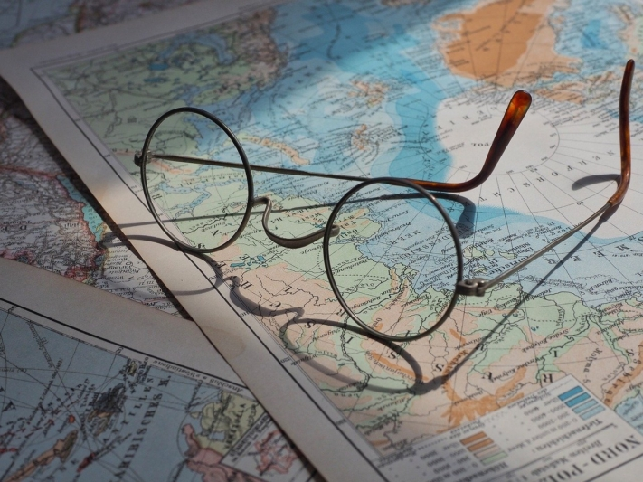

Die Sommerferien stehen vor der Tür und für viele Urlauber heißt das: Zeit zum **Koffer packen**! Doch wann genau ist eigentlich der richtige Zeitpunkt, um den Koffer zu packen? Gehören Sie zu denen, die in der Nacht vor der Abreise schnell alles zusammensuchen und in die nächstbeste Reisetasche werfen? Oder planen Sie lieber bereits Wochen im Voraus, was es auf Ihre **Checkliste für den Urlaub** schafft?

Dieser Artikel bietet Ihnen einen umfassenden Einblick, was Sie für Ihre nächste Urlaubsreise benötigen und wie Sie diese am besten organisieren, ohne essenzielle Dinge zu vergessen. Egal, ob Sie ein Last-Minute-Bucher oder ein vorausschauender Planer sind, hier finden Sie eine ausführliche Checkliste für Ihren Urlaub und wertvolle Tipps, um Ihre Reise effizient und stressfrei vorzubereiten.

Informieren Sie sich über das Klima Ihres Reiseziels, um sich entsprechend vorzubereiten.

## Der richtige Zeitpunkt zum Koffer packen

Wer kennt es nicht? Kurz vor der Abreise herrscht hektisches Treiben, weil das Packen wieder einmal auf die letzte Minute verschoben wurde. In solchen Momenten wünscht man sich doch, man hätte früher angefangen. Um dieses Chaos zu vermeiden, sollten Sie bereits **zwei Wochen** im Voraus mit einer detaillierten Checkliste für den Urlaub starten.

Eine solche Checkliste für Reisen ermöglicht es Ihnen, alles Nötige in Ruhe zu planen und zu ergänzen. Dinge, die einem nicht sofort einfallen, können Sie rechtzeitig erledigen, und es bleibt genügend Zeit, fehlende Artikel zu besorgen. Diese strukturierte Herangehensweise reduziert den Stress und sorgt dafür, dass Sie nichts Wichtiges vergessen.

Das eigentliche Kofferpacken sollte idealerweise erst **zwei bis drei Tage** vor der Abreise erfolgen. Auf diese Weise können Sie die aktuelle Wettervorhersage berücksichtigen und Ihre Kleidung entsprechend anpassen. Am **Abreisetag** bleibt dann nur noch das Einpacken der Dinge, die Sie bis zuletzt benötigen, wie Ihr Handy-Ladekabel oder Ihre Zahnbürste.

Eine Packliste sorgt für eine strukturierte Vorgehensweise beim Packen.

## Die Vorteile einer gut durchdachten Checkliste für Ihren Urlaub

Wenn Sie sich vor Ihrer Reise die Zeit nehmen, eine detaillierte Urlaub-Checkliste zu erstellen, können Sie von zahlreichen Vorteilen profitieren. Besonders wenn Sie zu denjenigen gehören, die das Kofferpacken gerne auf den letzten Drücker erledigen, ist der größte Vorteil einer solchen Checkliste für Ihre Reise ein **stressfreier** Start in den Urlaub.

Eine gut organisierte Checkliste für den Urlaub hilft Ihnen nicht nur, unnötige Hektik zu vermeiden, sondern sorgt auch dafür, dass Sie **weniger essentielle Dinge vergessen**. Durch frühzeitiges und gezieltes Packen können Sie zudem wertvolle **Zeit sparen** und Ihre Reisevorbereitungen **effizienter** gestalten.

Auch für diejenigen, die gerne im Voraus planen und bereits eine Checkliste für Reisen nutzen, gibt es immer noch Raum für Verbesserungen. Eine sorgfältige Reisevorbereitung ist das A und O für einen stressfreien und erholsamen Urlaub. Indem Sie Ihre Reise Checkliste regelmäßig aktualisieren und **optimieren**, können Sie sicherstellen, dass Sie an alles denken und Ihre Reise unbeschwert genießen können.

Urlaub sollte eine entspannende und angenehme Erfahrung sein, und eine gute Vorbereitung hilft, den Stress zu minimieren.

## Was Sie bei der Checkliste für Ihren Urlaub nicht vergessen dürfen

Eine gründliche Vorbereitung auf Ihren Urlaub umfasst mehr als nur die Urlaub-Checkliste. Hier sind einige wichtige Schritte, die Sie im Vorfeld erledigen sollten, um Ihre Reise reibungslos und entspannt zu gestalten:

- **Reisedokumente und Visum:** Für Reisen in ferne Länder benötigen Sie einen gültigen Reisepass und möglicherweise ein Visum. Überprüfen Sie rechtzeitig die Gültigkeit Ihres Reisepasses und informieren Sie sich über die Visabestimmungen Ihres Reiseziels.
- **Impfungen und Gesundheit:** Wenn Sie Abenteuerurlaub in exotischen Gegenden planen, sollten Sie frühzeitig Ihren Impfpass überprüfen und notwendige Impfungen gegen in Europa seltene Krankheiten auffrischen lassen. Informieren Sie sich über empfohlene oder verpflichtende Impfungen für Ihr Reiseziel.
- **Auslandsversicherung:** Eine Reiseversicherung ist unerlässlich, um im Krankheitsfall oder bei anderen Notfällen abgesichert zu sein. Vergleichen Sie verschiedene Angebote und wählen Sie eine Versicherung, die Ihren Bedürfnissen entspricht.

Eine Reiseversicherung, die medizinische Versorgung im Ausland und Reiseabbrüche aus gesundheitlichen Gründen abdeckt, ist wichtig.

### Klären Sie dies auf der Checkliste, wenn Ihr Urlaub näher rückt

- **Finanzen und Währung:** Bei Reisen in Länder mit fremder Währung sollten Sie im Voraus klären, ob Sie vor Ort mit Kreditkarte bezahlen können oder Bargeld benötigen. Recherchieren Sie die Wechselkurse, damit Sie die Preise vor Ort einschätzen können, und bestellen Sie gegebenenfalls Bargeld bei Ihrer Bank, um gut vorbereitet zu sein.
- **Einreisebestimmungen und Sicherheit:** Informieren Sie sich beim [Auswärtigen Amt](https://www.auswaertiges-amt.de/de) über die Einreisebestimmungen und eventuelle Sicherheitsrisiken in Ihrem Zielland. Es ist wichtig, alle notwendigen Informationen zu kennen, um schlechte Erfahrungen zu vermeiden.
- **Lokale Gesetze und Führerschein:** Prüfen Sie, ob Sie in Ihrem Zielland einen internationalen Führerschein benötigen, und machen Sie sich mit den lokalen Gesetzen vertraut. In einigen Ländern gelten strengere Vorschriften (z. B. Verhaltensregeln im öffentlichen Raum), die Sie beachten müssen.
- **Reisevorbereitungen vor Ort:** Kleinigkeiten wie die Buchung eines Parkplatzes am Flughafen oder die Sicherstellung der mobilen Erreichbarkeit im Ausland können Ihre Urlaubsstimmung erheblich beeinflussen. Sorgen Sie dafür, dass alles gut organisiert ist.

Entscheiden Sie, wie Sie sich fortbewegen werden (Mietwagen, öffentliche Verkehrsmittel etc.), und buchen Sie gegebenenfalls im Voraus.

### Letzte Vorbereitungen am Abreisetag

Der Abreisetag ist endlich da und Sie stehen urlaubsreif mit gepackten Koffern bereit. Jetzt gibt es noch einige Dinge, die Sie erledigen sollten, damit Sie nach dem Urlaub keine unangenehmen Überraschungen vorfinden.

- Leeren Sie den Kühlschrank, die Spülmaschine und den Müll, um Schimmelbildung und unangenehme Gerüche zu vermeiden.
- Überprüfen Sie, ob alle Fenster und Türen sicher verschlossen sind.
- Schalten Sie Wasser, Heizung, Lampen und elektrische Geräte aus.
- Stellen Sie sicher, dass wichtige Dokumente und Wertgegenstände verstaut sind.
- Informieren Sie eine Vertrauensperson (z. B. Nachbarn, Freunde) über Ihre Abwesenheit und geben Sie dieser einen Schlüssel, damit sie im Notfall vor Ort nachsehen kann. Falls zuvor vereinbart, kann diese Person auch Ihre Pflanzen gießen oder Kleintiere füttern.

## Must-haves, die auf Ihre Checkliste für den Urlaub gehören

Stellen Sie sich vor, der langersehnte Urlaub steht bevor und Sie haben eine perfekt vorbereitete Checkliste für Ihre Reise zur Hand. Keine Panik, keine vergessenen Dinge – nur Vorfreude auf ein entspanntes Reiseabenteuer. Hier sind die wesentlichen Punkte, die auf dieser Urlaubspackliste nicht fehlen dürfen:

### Dokumente

Abstandshalter

- Reisepass
- Personalausweis
- Führerschein
- Impfpass
- Visum

Abstandshalter

- Krankenversichertenkarte
- Auslandskrankenversicherung
- Kredit-/EC-Karte und Bargeld
- Flugtickets
- Hotel-/Mietwagenunterlagen

Wichtige Dokumente können Sie vor Ihrem Urlaub kopieren, damit Sie abgesichert sind, falls etwas verloren geht.

### Kleidung

Abstandshalter

- Pullover
- Jacke
- Hosen
- T-Shirts
- Je nach Urlaub Badesachen, Skikleidung etc.

Abstandshalter

- Mützen/Caps
- Pyjama
- Socken und Unterwäsche
- Schuhe
- Kleider/Röcke

Checken Sie vor Ihrer Reise, wie das Wetter an Ihrem Reiseort sein wird.

### Hygiene

Abstandshalter

- Haarbürste oder Kamm
- Deo
- Shampoo und Duschgel
- Rasierer
- Zahnbürste und Zahnpasta

Abstandshalter

- Schminkutensilien
- Damenhygieneartikel
- Verhütungsmittel
- Desinfektionsmittel
- Handtücher

Informieren Sie sich im Vorfeld, ob Handtücher und andere Hygieneartikel inklusive sind, um Platz zu sparen.

### Arznei

Abstandshalter

- Schmerzmittel
- Durchfallmedikamente
- Fiebersenker
- Reisetabletten
- Sonnencreme

Abstandshalter

- (Blasen-)Pflaster
- Mückenschutz
- Zeckenkarte
- Persönliche Medikamente

Um im Urlaub gegen alles gewappnet zu sein, sollten Sie an eine kleine Reiseapotheke denken.

### Elektronik

Abstandshalter

- Handy
- Kopfhörer
- Laptop

Abstandshalter

- Ladekabel
- Kamera

Achten Sie darauf, elektronische Geräte sicher zu verstauen, sodass nichts kaputtgehen kann.

### Sonstiges

Abstandshalter

- Schlüssel
- Schlafmaske
- Ohrenstöpsel

Abstandshalter

- (Sonnen-)Brille oder Kontaktlinsen
- Reiseproviant
- Buch

Lange Flugreisen können Sie mit Schlafmasken und Ohrstöpseln angenehmer gestalten.

## Checkliste an Ihren Urlaub anpassen

Da jede Reise unterschiedliche Anforderungen stellt, ist es wichtig, dass Ihre Checkliste an den Urlaub flexibel anpassbar ist. Im **Sommerurlaub** benötigen Sie leichte Kleidung, Sonnenschutz und Badebekleidung, während im **Winterurlaub** warme Kleidung und Schneeausrüstung wichtig sind. Die Art der Unterkunft beeinflusst ebenfalls die Packliste: In **Hotels** sind weniger Basics nötig, während in **Ferienwohnungen** Grundnahrungsmittel und Küchenutensilien sinnvoll sind.

Auch die Art des Urlaubs spielt eine entscheidende Rolle. Bei einer **Städtereise** sind bequeme Schuhe und ein praktischer Rucksack für **Tagesausflüge** unerlässlich, während ein **Wellnessurlaub** entspannte Kleidung sowie Badebekleidung für den Spa-Bereich erfordert. Abenteuerurlauber sollten zusätzlich Outdoor-Ausrüstung auf Ihrer Urlaub-Checkliste berücksichtigen.

Eine flexible Checkliste für Ihren Urlaub ermöglicht es Ihnen auch, auf kurzfristige Änderungen zu reagieren. Unvorhersehbare Wetterumschwünge oder spontane Planänderungen lassen sich besser bewältigen, wenn Sie schon im Vorfeld bestens organisiert sind und nicht in unnötigen Stress verfallen.

Ob Strandutensilien oder Wintersport-Equipment – je nach Urlaub benötigen Sie andere Dinge.

## Die besten Tipps fürs Kofferpacken

Wenn Ihre Checkliste für den Urlaub umfangreich ist, kann es eine Herausforderung sein, alles unterzubringen – vor allem, wenn Sie fliegen und die Größe der Koffer begrenzt ist oder zusätzliche Gepäckstücke teuer sind. Doch keine Sorge: Mit den richtigen Tipps und Tricks lässt sich Ihr Koffer effizient und platzsparend packen. Hier sind einige bewährte Strategien, die Ihnen helfen, das Packen zu optimieren:

- **Packen Sie strategisch:** Legen Sie schwere Gegenstände wie Schuhe und Kulturbeutel unten in den Koffer und leichtere, knitteranfällige Kleidung obenauf. Nutzen Sie den Platz in den Schuhen für kleinere Gegenstände wie Socken oder Ladegeräte.
- **Nutzen Sie Packwürfel:** Diese kleinen, leichten Taschen helfen dabei, Ihre Kleidung und Accessoires zu organisieren und den Platz im Koffer optimal auszunutzen.
- **Rollen statt falten:** Das Rollen der Kleidung spart nicht nur Platz, sondern reduziert auch Falten, sodass Ihre Kleidung glatt bleibt.
- **Vorbereitung auf den Rückweg:** Denken Sie auch an den Rückweg und lassen Sie etwas Platz für Souvenirs und andere Dinge, die Sie während Ihres Urlaubs kaufen.
- **Essentials griffbereit halten:** Bewahren Sie wichtige Dokumente, Ladekabel und eine kleine Erste-Hilfe-Ausrüstung in einem leicht zugänglichen Fach auf. So haben Sie alles Wichtige sofort zur Hand.

Verwenden Sie Reisegrößen für Hygieneartikel, um Platz zu sparen und den Flüssigkeitsbeschränkungen bei Flügen zu entsprechen.

## Fazit: Entspannt mit Ihrer Checkliste in den Urlaub

Egal, ob Sie in der Vergangenheit ein Last-Minute-Packer oder ein vorausschauender Planer waren – in Zukunft können Sie ohne unnötige Hektik und mit allen essentiellen Dingen im Gepäck in den Urlaub starten. Mit dem [kostenlosen Template](https://seatable.io/vorlage/axq_85kkrjsriagmqpxehw/) von SeaTable sparen Sie künftig wertvolle Zeit und gestalten Ihre Reisevorbereitungen für den anstehenden Urlaub effizient und stressfrei.

In der Vorlage finden Sie nicht nur eine flexibel anpassbare Urlaubs-Checkliste mit allen To-dos, sondern auch andere nützliche Funktionen: Sammeln Sie alle Ideen und Orte, die Sie besuchen möchten, erstellen Sie einen übersichtlichen Zeitplan und visualisieren Sie alle Standorte Ihrer geplanten Aktivitäten auf einer Karte. Sie können auch all die wunderbaren Erinnerungen während Ihrer Reise festhalten, Fotos hinzufügen und notieren, wo und wann diese besonderen Momente stattfanden.

Zur Vereinfachung der Reiseplanung steht Ihnen zudem eine App zur Verfügung. Mit dieser können Sie Ideen, Kosten und To-dos über Formularseiten eingeben, deren Informationen dann automatisch in den entsprechenden Tabellen gespeichert werden. Ihre gesamte Urlaubsplanung ist in übersichtlichen Tabellen abrufbar, die Sie nach Belieben gruppieren und sortieren können. Anschauliche Statistiken, wie zum Beispiel im Budget Dashboard, erleichtern Ihnen zusätzlich die Übersicht:

[Registrieren]() Sie sich noch heute kostenlos, um von diesen praktischen Funktionen zu profitieren und Ihre nächste Reise stressfrei zu organisieren. Daraufhin können Sie die [Vorlage](https://seatable.io/vorlage/axq_85kkrjsriagmqpxehw/) in Ihrem persönlichen SeaTable Arbeitsbereich nutzen, mit ihren eigenen Daten füllen und via App mit Ihren Mitreisenden teilen.
